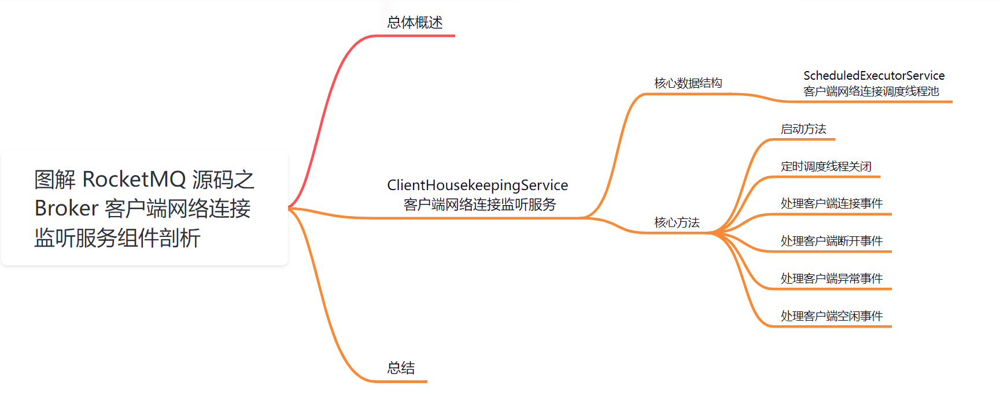
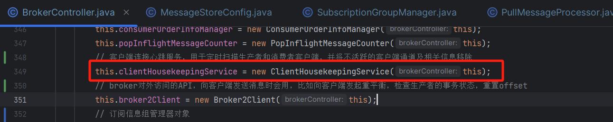
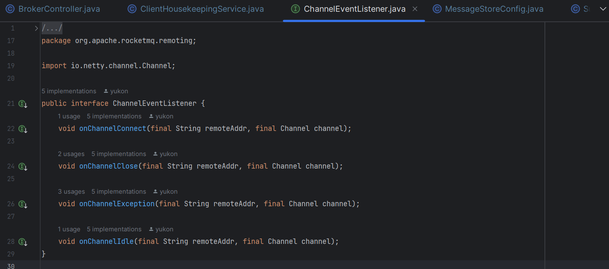
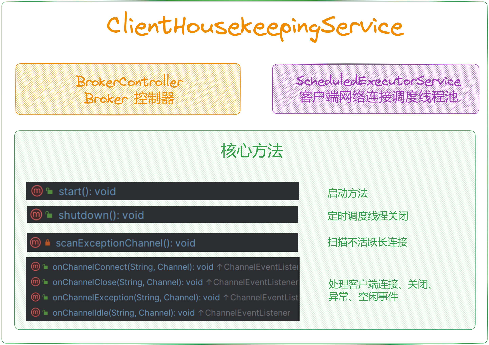
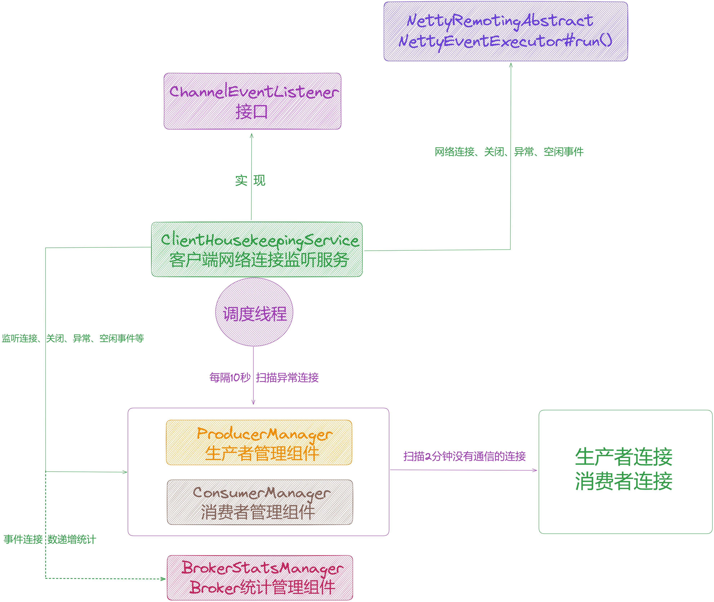

## 【Broker端源码分析系列第十二篇】图解 RocketMQ 源码之 Broker 客户端网络连接监听服务组件剖析

大家好，我是**华仔**, 又跟大家见面了。

从今天开始我将继续为大家奉上 RocketMQ 消费者源码剖析系列文章，正式开启「**RocketMQ 的服务端 Broker 源码之旅**」，这是第十二篇，本篇我们将以「**RocketMQ 5.1.2**」版本为主，来剖析下 RocketMQ 源码之 Broker

客户端网络连接监听服务组件剖析。

这里我将以「**RocketMQ 5.1.2**」版本为主，通过「**场景驱动**」的方式带大家一点点的对 RocketMQ 源码进行深度剖析，正式开启「**RocketMQ 的源码之旅**」，跟我一起来掌握 RocketMQ 源码核心架构设计思想吧。

## **01 总体概述**

在 [BrokerController 构造方法](https://articles.zsxq.com/id_chxqzhg8psk4.html) 里面创建了很多「**管理器**」、「**处理器**」、「**线程队列**」等，跟本文有关系的就是下面这个组件，该组件继承了 [ChannelEventListener](http://channeleventlistener%20/) 监听器接口，主要负责对「**Netty 长连接**」产生的「**网络事件**」进行监听，比如：「**网络连接**」、「**网络关闭**」、「**网络异常**」、「**网络空闲**」等事件，然后调度「**生产者管理组件**」、「**消费组管理组件**」来维护，断开它们内存中维护的「**网络长连接**」。

## **02 ClientHousekeepingService**

源码位置：[https://github.com/apache/rocketmq/blob/release-5.1.2/broker/src/main/java/org/apache/rocketmq/broker/](https://github.com/apache/rocketmq/blob/release-5.1.2/broker/src/main/java/org/apache/rocketmq/broker/client/ClientHousekeepingService.java)[client](https://github.com/apache/rocketmq/blob/release-5.1.2/broker/src/main/java/org/apache/rocketmq/broker/client/ClientHousekeepingService.java)[/](https://github.com/apache/rocketmq/blob/release-5.1.2/broker/src/main/java/org/apache/rocketmq/broker/client/ClientHousekeepingService.java)[ClientHousekeepingService](https://github.com/apache/rocketmq/blob/release-5.1.2/broker/src/main/java/org/apache/rocketmq/broker/client/ClientHousekeepingService.java)[.java](https://github.com/apache/rocketmq/blob/release-5.1.2/broker/src/main/java/org/apache/rocketmq/broker/client/ClientHousekeepingService.java)

## **2.1 核心数据结构**

/\*\*

\* 客户端网络连接监听服务

\*/

public class ClientHousekeepingService implements ChannelEventListener {

private static final Logger log \= LoggerFactory.getLogger(LoggerName.BROKER\_LOGGER\_NAME);

// broker 控制器

private final BrokerController brokerController;

// 客户端网络连接调度线程池

private ScheduledExecutorService scheduledExecutorService;

public ClientHousekeepingService(final BrokerController brokerController) {

this.brokerController = brokerController;

// 客户端网络连接调度线程池

scheduledExecutorService = new ScheduledThreadPoolExecutor(1,

new ThreadFactoryImpl("ClientHousekeepingScheduledThread", brokerController.getBrokerIdentity()));

}

....

}

## **2.2 核心方法**

该类比较短，只有 96 行，逻辑比较简单，我们来看下。

### **2.2.1 启动方法**

public void start() {

// 这里维护了一个定时调度线程，每隔 10 秒扫描一次生产者管理组件、消费者管理组件、过滤服务器组件不活跃的长连接，进行清理。

this.scheduledExecutorService.scheduleAtFixedRate(new Runnable() {

@Override

public void run() {

try {

// 扫描不活跃的客户端长连接，进行清理

ClientHousekeepingService.this.scanExceptionChannel();

} catch (Throwable e) {

log.error("Error occurred when scan not active client channels.", e);

}

}

}, 1000 \* 10, 1000 \* 10, TimeUnit.MILLISECONDS);

}

private void scanExceptionChannel() {

// 扫描生产者管理组件中的不活跃连接

this.brokerController.getProducerManager().scanNotActiveChannel();

// 扫描消费者管理组件中的不活跃连接

this.brokerController.getConsumerManager().scanNotActiveChannel();

}

### **2.2.2 关闭方法**

public void shutdown() {

// 定时调度线程关闭

this.scheduledExecutorService.shutdown();

}

### **2.2.3 处理客户端连接、关闭、异常、空闲事件**

/\*\*

\* 处理客户端连接事件

\* @param remoteAddr

\* @param channel

\*/

@Override

public void onChannelConnect(String remoteAddr, Channel channel) {

// 这里就是递增一下活跃连接数

this.brokerController.getBrokerStatsManager().incChannelConnectNum();

}

/\*\*

\* 处理客户端断开事件，关闭生产者管理组件、消费者管理组件对应的 channel，以及递增关闭连接数

\* @param remoteAddr

\* @param channel

\*/

@Override

public void onChannelClose(String remoteAddr, Channel channel) {

// 关闭生产者管理组件对应的 channel

this.brokerController.getProducerManager().doChannelCloseEvent(remoteAddr, channel);

// 关闭消费者管理组件对应的 channel

this.brokerController.getConsumerManager().doChannelCloseEvent(remoteAddr, channel);

// 递增关闭连接数

this.brokerController.getBrokerStatsManager().incChannelCloseNum();

}

/\*\*

\* 处理客户端异常事件，关闭生产者管理组件、消费者管理组件、过滤器管理组件中的对应的channel

\* @param remoteAddr

\* @param channel

\*/

@Override

public void onChannelException(String remoteAddr, Channel channel) {

// 关闭生产者管理组件对应的 channel

this.brokerController.getProducerManager().doChannelCloseEvent(remoteAddr, channel);

// 关闭消费者管理组件对应的 channel

this.brokerController.getConsumerManager().doChannelCloseEvent(remoteAddr, channel);

// 递增异常连接数

this.brokerController.getBrokerStatsManager().incChannelExceptionNum();

}

/\*\*

\* 处理客户端空闲事件，关闭生产者管理组件、消费者管理组件对应的 channel，以及递增空闲连接数

\* @param remoteAddr

\* @param channel

\*/

@Override

public void onChannelIdle(String remoteAddr, Channel channel) {

// 关闭生产者管理组件对应的 channel

this.brokerController.getProducerManager().doChannelCloseEvent(remoteAddr, channel);

// 关闭消费者管理组件对应的 channel

this.brokerController.getConsumerManager().doChannelCloseEvent(remoteAddr, channel);

// 递增异常连接数

this.brokerController.getBrokerStatsManager().incChannelIdleNum();

}

关于生产者管理组件和消费者管理组件的这几个事件可以查看：[【Broker端源码分析系列第六篇】图解 RocketMQ 源码之 Broker 生产者管理组件剖析](https://articles.zsxq.com/id_ldrw3itu74gh.html) 、[【Broker端源码分析系列第七篇】图解 RocketMQ 源码之 Broker 消费者管理组件剖析](https://articles.zsxq.com/id_vr5ha35i76ab.html) 。

## **03 总结**

本篇主要剖析了 [BrokerController](http://brokercontroller%20/) 初始化时中用到的 「**ClientHousekeepingService**」，该组件继承了 [ChannelEventListener](http://channeleventlistener/) 监听器接口，主要负责对「**Netty 长连接**」产生的「**网络事件**」进行监听，比如：「**网络连接**」、「**网络关闭**」、「**网络异常**」、「**网络空闲**」等事件，然后调度「**生产者管理组件**」、「**消费组管理组件**」来维护，断开它们内存中维护的「**网络长连接**」。

示意图如下：

![](data:image/png;base64,iVBORw0KGgoAAAANSUhEUgAAAQAAAAEACAYAAABccqhmAAAQAElEQVR4AeydjZLkNg6D97v3f+dctH2+sUi4zZHtbv8gFcUmDYIUlELVqGaT//zjv6yAFXisAv/547+sgBV4rAI2gMcevTduBf78sQH43wIr8FAF2rZtAE0FLyvwUAVsAA89eG/bCjQFbABNBS8r8FAFbAAPPXhv+9kKTLu3AUxK+GkFHqiADeCBh+4tW4FJgbIBAH/g+2safI8n5P0oXuhxFQz0NfCKt9TCiwNeT8V1dA5eveH9c885IPfak7/KBf0cqg56DHwnVrOpXNkAVLFzVsAKXE+B+cQ2gLkafrcCD1PABvCwA/d2rcBcARvAXA2/W4GHKbDJAP75558/R66jz0LNfnTPPfkhXzApfqjhVG3MVTWD3BPWc7Ffi1VPGOOC9TrQmDbLyFLz75n7zUwRu8kAIpljK2AFrqWADeBa5+VprcCuCtgAdpXTZFbgWgrYAK51Xp7WCgwroAp3NwDQFyjwPq+GG83B+17w+l7ljxc28KqHn6fiinUthp8aeL2r2tEcvDjh59n6xgU/36H+ruaK3CpWdSoHtVlUj5iDzKV6xroWK9yeOcizwXpuzxka1+4G0Ei9rIAVuIYCNoBrnJOntAKHKGADOERWk1qBcymwNM0tDaD9DFdZsP4zF2RMhbthlOgtv9eq8itczFVngqxH5Gox9DjF33BxKZzKQc8PRKrd4zjH7g2+QHhLA/iCjm5pBS6pgA3gksfmoa3APgrYAPbR0SxW4LQKvBvMBvBOHX+zAjdX4BYGAAz958qqZxsvf2CsH9TrqrNFHNR6jNZFLVocuVrc8vPVcqML8p7m3NM79LgpP39WZ5jXTO/V2ivhbmEAVxLcs1qBMylgAzjTaXgWK7CzAmt0NoA1hfzdCtxYARvAjQ/XW7MCawrsbgDThclvn2uDvvv+214TXnFO3+ZPWL9cmuPfvaueKgd9T8ix6qO4FK6SU1wqB3m2iIN1TKz5bRz3BLWeUMP9dp53+DhrNX7HOfJtdwMYGcI1VsAK7K9AhdEGUFHJGCtwUwVsADc9WG/LClQUsAFUVDLGCtxUgU0GAPnyBPbLVTWHvqeqgx4DyP+nAazjIGO29FS18VJIYbbkoN/DFq7R2rjHFkM/F9TPqTJH6xFXpa5hoJ+t5SoL+jrYN1YzVHObDKDaxDgrYAXOqYAN4Jzn4qmswEcUsAF8RGY3sQLnVMAGcM5z8VRWYFiB3xSWDSBenHwrrmwO8iVLpa5h1L5afmQpLqjNBj1O9YceAyiYzMXZJEgkgfRHrwWslIIaF4zh4h5bXBpsA6j1OMOqbqFsAFVC46yAFbiOAjaA65yVJ7UCuytgA9hdUhNage8p8NvONoDfKma8FbiRArsbAOQLG+hzVf2grwMdV/kiDjQf9PlYtyVWF0SKT+FiTtWpHPT7gVqsuI7OxT1uidWskPeucCoXZ4HMBTmnuKCGU7V75nY3gD2HM5cVsALHKmADOFZfs1uBjykw0sgGMKKaa6zATRT4igFA/vkHci7+zLUUj56F4hvlgjy/4oIaLtZCrqvOX8XFnt+IIe9zdA6ocZ1ZH+j3MKrFUt1XDGBpGOetgBX4rAI2gM/q7W5W4BAFRkltAKPKuc4K3EABG8ANDtFbsAKjCpQNAPrLCGC0p/xPcSkyIP3JM8g5VRtz6qIH9uNS/HGGb8Wwvs/q/FVcZa9buGBsT9WekPmhzykulYO+DvR/5kxpFvkUZkuubABbmrjWCliB4xTYwmwD2KKea63AxRWwAVz8AD2+FdiigA1gi3qutQIXV2CTAUDtcqNykRExS3FFb1ULtVkVP+RaGMup2VQOen6FUbOqXKUW+n5Qv6hSPaHnq2AABZMXwWpPgMTC+7xsKpKxp4CUU5BnUsXQ4yKmxdBjgJYurU0GUOpgkBWwAqdVwAZw2qPxYFbgeAVsAMdr7A5W4LQK2ABOezQezAq8V2CPr5sMIF6KtBjoLmLUkNBjoB63HnGpHpUc5L6Ru8UVroarLMUF63NU66q40VkVv8qN8lfqGqbSs4JZ4lK10J+TwlRzrW9c1dqIizwtjpileJMBLJE6bwWswDUUsAFc45w8pRU4RAEbwCGymtQKHKvAXuw2gL2UNI8VuKACZQNoFwtxQX8pAgxLELmXYqC7ZIT8G2uwjmn8o8O22rgg94RaTs0Bfa3CqFycq8UKB+v80GMARSX/eDfQnZMs3DkJfc+297igx4COY52Kdx5f0sW+CgR5DwqncmUDUMXOWQErcG0FbADXPj9P/0AF9tyyDWBPNc1lBS6mQNkAIP+cEX8+UfEWPaDWM/ZQc8AYV+OOfFDjinVLcesxshTfCE+rgdqeGjYuWK+NNS2uzg+Zv9WPLNVT5Ua4Ww3kWRU/ZFyrX1uQ6xT/Gs/0vWwAU4GfVsAK3EcBG8B9ztI7eYACe2/RBrC3ouazAhdSwAZwocPyqFZgbwXKBqAuGiBfSFQGVFyqTuEg94Q+V+VSOOi5IMeq7iw5yPMqHSvzQuaCnFNckHGwnlNcan7IXBGnuKo5yPywnqvyKxxkfoWLORirazxlA2hgLytgBb6nwBGdbQBHqGpOK3ARBWwAFzkoj2kFjlDABnCEqua0AhdRoGwAULtogIyDPqe0gR4DOo4XPS1WfEfmWs+4QM8L63k1a+RXGMjcsa7FUMM17HypnvPv795j7Tvs/BvkWSPXUgx9rcJBjwEdq9pKbr6X6R1yjwpXw8CrFl7PiXPt2Worq2wAFTJjrIAVuJYCNoBrnZentQK7KmAD2FVOk1mBaylgA7jWeXnaBypw5JbLBrB26TB9j8NO+fkTXhca8POMdS2e10zv8FMDr/fp2/RstXHBCwvvn7GuGk+9509VO//+7l3Vxpyqh7y/WFeNFb+qhWN7QuZXs8WcmlXlYt1SHGsVLmJavAUXayFrATnX+lZW2QAqZMZYAStwLQVsANc6L09rBXZVwAawq5wmswL7KnA0mw3gaIXNbwVOrMAmA4D1ywdYxyzpA2O1kOviZcpSvDTLPA+Zf/59elc9pm/zJ2Q+6HNz/PQOPQby/yOhzTDh50/ItTCWaz3imvdq75C5W/7IBbWeUMPFPUKtTu0xcrUYxvlUj0pukwFUGhhjBazAeRWwAZz3bDzZwxX4xPZtAJ9Q2T2swEkVsAGc9GA8lhX4hAKbDKBdXKwttQlVswUXa6v88PlLF6j1jHuAXBcxLYYaLmqm4sZXWbDeU/FDroOcG61VdSqn9gi1ORRfzMF+XJG7xWr+lq+sTQZQaWCMFbACv1fgUxU2gE8p7T5W4IQK2ABOeCgeyQp8SoGyAcB+P8dAjQvGcZBroc99SuR5H/XzmsrNa5beod8PIKHAH+iXBIYk9DWg41C2KVRaVHOxcbUO8r4il4oV/xacqo051RPG5m/cZQNoYC8rYAWOV+CTHWwAn1TbvazAyRSwAZzsQDyOFfikAjaAT6rtXlbgZArsbgDQX0ioS4uqBqpW5Sp8o3WKu8oFvRaAoksXdKBxsjgkq7OFMhkqrmpOEhaSQNKjUPYXEmf7myz8I9YtxZEK8qyQc7HuXTzyTc1b5dndAKqNjbMCVuD7CtgAvn8GnsAKfE0BG8DXpHdjK/B9BWwA3z8DT2AF/irwjX8cbgAwfikCuRZyLgq35VIkclVjWJ+rccEYTu1J5aDG32ZZW7Afl5q1moM8B6zn1vb37jvsxw/rXMC7cQ77drgBHDa5ia2AFdisgA1gs4QmsALXVcAGcN2z8+Q3UuBbW7EBfEt597UCJ1BgdwOoXOyofVfqljCRDxj+bbLIpWLI/Go2VTuKU1zVnOpZySl+yHtXuKNzlfmhNitknOKPe1KYai5ytVjVQj9bw+25djeAPYczlxWwAscqYAM4Vl+zW4FVBb4JsAF8U333tgJfVsAG8OUDcHsr8E0FygZQuaCA/sICdFzdMOT6am3EQeZSe1K5yKViyPx746DvofirOTiOC3puoDqWxKkzAdJFL/Q5RQY9Bur/Q1XFF3OQ+SNmKYaxWhira3OUDaCBvayAFdhXgW+z2QC+fQLubwW+qIAN4Iviu7UV+LYCZQOAsZ8z1M9v1U2P1qo6lYO8J8i5WHv0/FX+Lbgz7Amy1lDLxfmrsdIMck+Fq+TUHJW6JUzkW8KN5ssGMNrAdVbACmgFzpC1AZzhFDyDFfiSAjaALwnvtlbgDArYAM5wCp7BCnxJgbIBxMuIalzdF+SLGKjlKj0gc6k6tS+FizlVB7mnwqncKH+sazHkOWA912rjglyn5o85yHWRu8WxrsUtX1nQ91A1jS8uhYOeC0gwYPWXkUBjEtmGRNxPi6t0ZQOoEhpnBazAdRSwAVznrDypFdhdARvA7pKa0ApcRwEbwHXOypPeRIEzbWOTAYC+4ICf/JbNtsuMuBRfBaPqqjn42Q8gy4B0IRTnajFknCJs2PmqYBpe4VSuYeergml4hYO8J+hzqk7loK+D7/xpvbbXuNS8MRdrWhwxLW75ymrYI9cmAzhyMHNbAStwvAI2gOM1dgcrcFoFbACnPRoPdkcFzrYnG8DZTsTzWIEPKlA2ANjvckZdfqg9Q+6pcDEHtbrqHAoXc3GG38SwPi9kDORcnGsphr5W4aDHAHJbqjbmVGHEtFjhgHTBqnCtfr4qmDl+/q5qY26On96hNmvkajHkWljPtdrRVTaA0QauswJW4LwK2ADOezae7GYKnHE7NoAznopnsgIfUsAG8CGh3cYKnFGBTQYA+YJiugyZnls2PXHMn1v4Yi3k+SNGxZDr5jNO76pW5Sb8/Al9D1WnctDXgY5VbSU3n3F6V3XQ952w86eqm3+f3hUOen6oxYpL5SDzTfNMT8gYxbUlN/V694TxOTYZwJaNudYKPEmBs+7VBnDWk/FcVuADCtgAPiCyW1iBsypQNoB3P4PMv0H+eQT6nBJjzjG9Q18H+k+GQY+r8k995k9VG3Nz/PQO/Qyg4wk/f0LGzr8vvce5WqywLR9XxEFthsjTYlivhYxptZUVZ21xpa6KgfHZqj0quLavuCDPBn2uwr2EKRvAEoHzVsAKvFfgzF9tAGc+Hc9mBQ5WwAZwsMCmtwJnVsAGcObT8WxW4GAFDjeAeKnRYugvMQC5zYaNSwErGFWnckD6k2ewnosztFjxV3Mw1hNyXZslLuhx8XuLoceAjhs2Luix8XuLlRbQ1wEKJnONc74UCEjnO6+Z3iu1ChNzSzHkOSDnpnl++1zqG/OHG0Bs6NgKWIHzKGADOM9ZeBIr8HEFbAAfl9wNrcB5FLABnOcsPMnNFLjCdjYZAORLi7hpWMe0Gsg4qOVa/dqCGtdvL1smPGR+NRPUcBPvuyfUuCDjIq+atZqDzF+tPRIX97gUQ55/CbuWV/tRNaM4yLNCzil+ldtkAIrQOStgBa6jgA3gOmflSa3A7grYAHaX1IRW4M+fq2hgA7jKSXlOK3CAAmUDgHzRoC43Ym7LzJFrKYZ+NtVTOUL5WgAACDBJREFU1SqcykHPDzlW/Ftyao5KTvVUddDvQWGqXBUc9P0A1bKcUz2B9Ft+sJ5TXGoQ6LkURnFBXwf6j7UrPuhrFb/KKS6VKxuAKnbOCliBaytgA7j2+Xn6EypwpZFsAFc6Lc9qBXZWwAaws6CmswJXUmCTAUB/QQE5roqhLjIg80HOxdq9e0a+2K/FEdNiyLPCWK7xVRZk/kpdFdP2GhfknhGjYqjVQcZBzsU9qJ4RsxRD5o98S7Wjecg9R7mqdZsMoNrEOCvwFAWutk8bwNVOzPNagR0VsAHsKKaprMDVFLABXO3EPK8V2FGB3Q1gz4uSyLUUj+oB+dJF9Rjlr3JVcUfPEfkh6wM5p+aHHhe5W1ypAxq0tCIfkH4zMGJaDBmnGkKPi5gWQ4+B+m/9tfq1BZkfcm6NZ/q+uwFMxH5aAStwfgVsAOc/I09oBQ5TwAZwmLQmtgLnV2CTAbSfn+KKW47fWxwxSzHkn21gPdd6xAW5LmJaDOu4pXljHjJXxHwihvU5IGOaHnFV592rLvK8i6Hfg5oVegygYKUc8P87Bni9q/kUGbzw8PNUuEqu2lNxbTIAReicFbAC11HABnCds/KkVmB3BWwAu0tqQitwHQVsANc5K096UgWuPNYmA4CfCwx4vUcx4JWHn2f10kLhKjn46QWvd1UXZ22xwsGLA17PhosLXt/g5xkxLa7wQ/7lkVa751JzxBz87AVe72oGeH2D5edoHaBKZS7Or2JZKJKVWoUB0sUg5JxoKVOxhwLBOP8mA1DDOGcFrMB1FLABXOesPKkV2F0BG8DukprwSQpcfa82gKufoOe3AhsUKBtAvIxocaVvw8Wl6iBfZMBYTvGrHGR+havMHzEtVlzVHPSzqbrWY3RFPuj7Qb6IbL1iXTWGzK9qW4+4oFYb+WCsrvFArq3MFTG/iVvfuKCfI35vserR8pVVNoAKmTFWwApcSwEbwLXOy9OeSIE7jGIDuMMpeg9WYFABG8CgcC6zAndQYHcDgP7SAnKshFMXGdVc5FN1EdPiKg76PbTauKDHABGyGKs5Yg4o/YYZjOHUcJC54lwtVrUx13CVBbln5FqKoa+t9PsNJvZVtRGzFEM/KyChsYcCAenfDYVTud0NQDVxzgrcTYG77McGcJeT9D6swIACNoAB0VxiBe6igA3gLifpfViBAQXKBgBjFw3xEqPF1Tkh94Sci3ywjmk1kHGQcw07X5AxbV9xzWumd8i107f5E3rc/NsV3vfUorrfSs8ql8LB60xg+1Pxqxz0vRRmS65sAFuauNYKWIFzKmADOOe5eCor8BEFbAAfkdlNrMA5FSgbQPz5qhpv2fZoD1VXnaNSW8G0flVcw8YVa+P3FkdMi1s+rpYfWZHnNzGM/exanRN6fsixmhe24eac1VkVbs7zzfeyAXxzSPe2AlbgGAVsAMfoalYrcAkFbACXOCYPaQWOUcAGcIyuZr2hAnfcUtkAIF+ewOdzlUOAPFelroqBzA+13FkuhKCfd8veVW3cp8JsyUX+Fkc+6PcIRMjfGEh/mq7xxfUXvPIPyFwrJW8/j8zwljB8LBtAqHNoBazADRSwAdzgEL0FKzCqgA1gVDnXPUqBu27WBnDXk/W+rEBBgU0GEC8o9o4L8/+FxL5/k+EfkC9nYl2LYR0XqBfDxhcXZH7IuUgaeVocMb+JW/18/aY2Yuc80zvkPUGfm7DzZ+ReiqHngvz/MViqjfl5/+k9YqrxVD9/VmsruDnv9F6pW8JsMoAlUuetgBW4hgI2gGuck6f8ogJ3bm0DuPPpem9WYEUBG8CKQP5sBe6swO4GAPlyBtZze4o8XY6sPVVPVQP9/AqjuKCvg3xR1bgqtQpTzUGeA9ZzW/jbvtYW5BmqPRU39HwKo3LQ1wGlMYD0G4RQy5UaFEFqT8XSP7sbQLWxcVbgCgrcfUYbwN1P2PuzAm8UsAG8EcefrMDdFbAB3P2EvT8r8EaBWxgA9Bcvb/bbfYK+DnQcL1kg4yJmKYax2m7wN4Hq+wb+60+KX+Wg36dqpOoUbs8c9HPB8sXsSF+1J5VT3AoHeV5Yzyl+lbuFAaiNOWcFrMC6AjaAdY2MsAK3VcAGcNuj9caswLoCNoB1jYx4oAJP2bIN4MCThnxZo9rBOg4yBnJO8avLpUpOcakc5DkiP2RMlQtyLeRc7Kn4t+Qiv4ohz7WlZ6xVPVUu1i3FNoAlZZy3Ag9QwAbwgEP2Fq3AkgI2gCVlnH+sAk/a+O4GoH4eqeS2iB75YfznsMjVYuj5Wi4u6DGA3FKsW4qB7k+aSTKRhL4OdBxLIePUbLFuKYaeT3FBjwGW6IbyQKch1H/pB3ItrOfUPqvDQ+av1o7idjeA0UFcZwWswOcVsAF8XnN3tAKnUcAGcJqj8CBnUOBpM9gAnnbi3q8VmCmwyQAgX1rAfrnZnL96rV7EKBzk+SPuV8MEMGR+yLlQVg7jrC1WxdD3VBiVg74O9MVa6ztfkOsU/7xmelc4lYO+RwUDfQ28YlU7zTM9Faaamzjmz0otvOaD988KV8NsMoBG4GUFrMB1FbABXPfsPPnOCjyRzgbwxFP3nq3A/xSwAfxPCD+swBMVKBvA/LLim+9HH5LaW6WnqvtGTs06OkeVS+FirjpDrGtxtfZoXJtlvlS/+fffviu+0Vy1d9kAqoTGWYErKvDUmW0ATz1579sK/KuADeBfEfy3FXiqAjaAp568920F/lXABvCvCP772Qo8efc2gCefvvf+eAVsAI//V8ACPFkBG8CTT997f7wCNoDH/yvwbAGevvv/AgAA//8/4GJgAAAABklEQVQDANVxrTtYeQsiAAAAAElFTkSuQmCC)

扫码加入星球

查看更多优质内容

https://wx.zsxq.com/mweb/views/joingroup/join\_group.html?group\_id=51122554151214