大家好，我是**华仔**, 又跟大家见面了。

从今天开始我将继续为大家奉上 RocketMQ 消费者源码剖析系列文章，正式开启「**RocketMQ 的服务端 Broker 源码之旅**」，这是第十五篇，本篇我们将以「**RocketMQ 5.1.2**」版本为主，来剖析下 RocketMQ 源码之 Broker 心跳机制和接收数据流程剖析。

这里我将以「**RocketMQ 5.1.2**」版本为主，通过「**场景驱动**」的方式带大家一点点的对 RocketMQ 源码进行深度剖析，正式开启「**RocketMQ 的源码之旅**」，跟我一起来掌握 RocketMQ 源码核心架构设计思想吧。

  
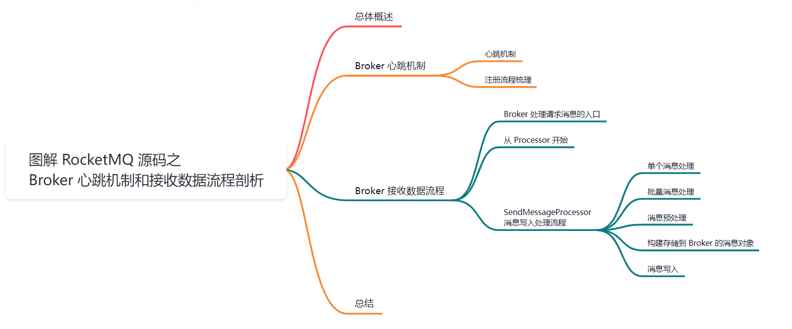

##   
**01 总体概述**

在前面十几篇文章，我们深度剖析了 [BrokerController 构造方法](https://articles.zsxq.com/id_chxqzhg8psk4.html) 中的关键技术组件的核心数据结构以及源码实现，当然还有一些技术组件没有剖析，后面有时间的话再进行梳理。

[【Broker 端源码分析系列第三篇】图解 RocketMQ 源码之 Broker Topic 元数据管理组件剖析](https://articles.zsxq.com/id_sh0f2rz7jqor.html)

[【Broker 端源码分析系列第四篇】图解 RocketMQ 源码之 Broker 主从元数据拉取与同步流程剖析](https://articles.zsxq.com/id_wnu9c1dgdbuq.html)

[【Broker端源码分析系列第五篇】图解 RocketMQ 源码之Broker2Client客户端发送请求组件设计剖析](https://articles.zsxq.com/id_o0elirh0nfu6.html)

[【Broker端源码分析系列第六篇】图解 RocketMQ 源码之 Broker 生产者管理组件剖析](https://articles.zsxq.com/id_ldrw3itu74gh.html)

[【Broker端源码分析系列第七篇】图解 RocketMQ 源码之 Broker 消费者管理组件剖析](https://articles.zsxq.com/id_vr5ha35i76ab.html)

[【Broker端源码分析系列第八篇】图解 RocketMQ 源码之 Broker 消费偏移量管理组件剖析](https://articles.zsxq.com/id_d0vw2pqcu2np.html)

[【Broker端源码分析系列第九篇】图解 RocketMQ 源码之 Broker 消费者数据过滤管理组件剖析](https://articles.zsxq.com/id_84qpb71zoutw.html)

[【Broker端源码分析系列第十篇】图解 RocketMQ 源码之 Broker 消费者 ids 变更监听器组件剖析](https://articles.zsxq.com/id_4ps272e8oktw.html)

[【Broker端源码分析系列第十一篇】图解 RocketMQ 源码之 Broker 消费者订阅组管理组件剖析](https://articles.zsxq.com/id_21qjfp7qw34v.html)

[【Broker端源码分析系列第十二篇】图解 RocketMQ 源码之 Broker 客户端网络连接监听服务组件剖析](https://articles.zsxq.com/id_6s6kno2i6sqs.html)

[【Broker端源码分析系列第十三篇】图解 RocketMQ 源码之 Broker 指标统计管理组件剖析](https://articles.zsxq.com/id_ejg04al7399d.html)

从今天开始我们即将开启「**Broker 存储模块**」的探索，在正式剖析了「**Broker 存储模块**」之前，我们先来看下 「**Broker 心跳机制**」和 「**Broker 接收数据**」的流程是怎样的？

##   
**02 Broker 心跳机制**

关于「**Broker 心跳机制**」我们在前面也或多或少都剖析过，这里再来重新梳理和总结下。

我们都知道「**Broker**」能正常的运行是离不开「**NameServer**」的，它号称 RocketMQ 集群的大脑。「**Broker**」会定期和「**NameServer**」进行交互，这个交互的方式就是通过「**心跳机制**」来完成的。

## **2.1 心跳机制**

大家是不是很好奇，我们在前面剖析过「**Broker 注册**」的触发时机和处理流程，那么「**心跳**」和「**Broker 注册**」是如何关联的呢？

其实它们就是一回事，在向「**NameServer**」注册的同时，「**Broker**」会在请求中携带上当前节点的相关数据，然后以「**注册**」的形式发送到「**NameServer**」，这样在完成了「**心跳**」的同时还更新了数据。

那么启动心跳的入口在哪里呢？

其实就是在 [BrokerController#start](http://%20brokercontroller/#start) 方法中。

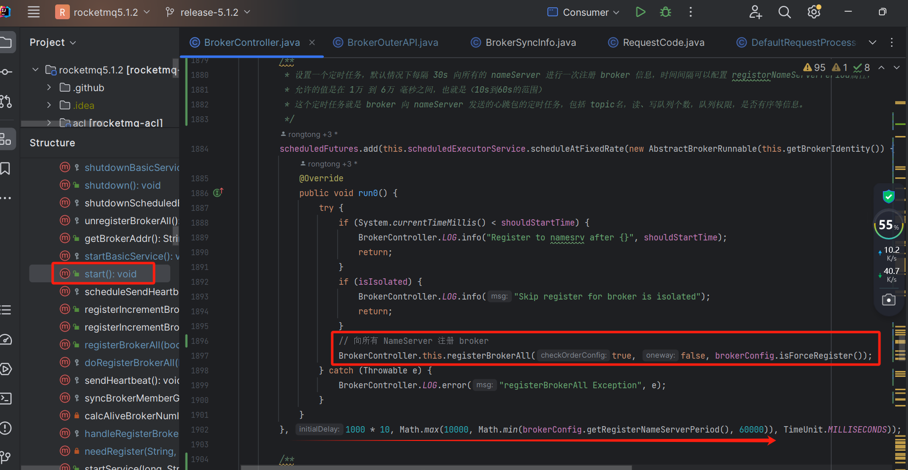

可以看到，这里是通过一个「**定时任务**」来定期触发的，这里的几个参数我们来总结下：

1.  [1000 \* 10](http://1000%20%2A%2010/) 代表着首次执行时，延迟 [10 秒](http://xn--10%20-ne6m/)再执行。
2.  执行的间隔就由后面的这个公式计算逻辑来决定的。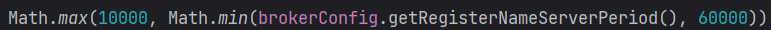

那么如何计算这个间隔呢？乍看到这个心跳间隔时间的表达是不是比较懵，我们来拆解下。

首先 [brokerConfig.getRegisterNameServerPeriod()](http://brokerconfig.getregisternameserverperiod\(\)/) 的默认是 30 秒，如下：

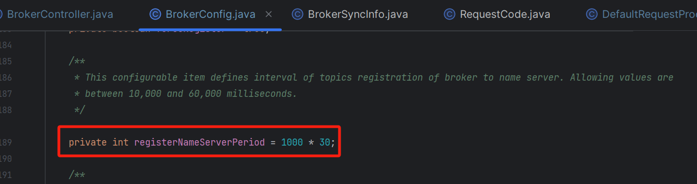

那么第一次通过 [Math.min](http://math.min/) 得到的结果就是 30 秒，然后再对比 [Math.max](http://math.max/) 得到的结果还是 30 秒。最终通过上面的剖析我们得到的心跳的间隔就是 30 秒。

## **2.2 注册流程梳理**

这里我们再来串联一下这个「**Broker 注册**」流程。

现在我们知道了「**心跳启动**」的地方、以及「**心跳执行的时间间隔**」，接下来就是心跳具体都执行了什么逻辑了。

关于注册的代码比较多，这里就不列了，可以查看 [【Broker 端源码分析系列第二篇】图解 RocketMQ 源码之 Broker 启动流程核心控制器组件剖析](https://articles.zsxq.com/id_chxqzhg8psk4.html) 这篇中的 **2.4 节**。

通过源码剖析分为两种注册：「**首次启动进行强制 Broker注册**」、「**定时任务定期进行 Broker 注册**」。

这里总结下 Broker 注册、心跳机制的流程图如下所示，其核心逻辑主要在于 [RouteInfoManager](http://routeinfomanager%20/) 对各个内存结构的更新。

  

## **03 Broker 接收数据流程**

「**Broker**」端接收到「**Producer**」发送过来的消息，会做一些处理，然后将其存储起来，等待「**Consumer**」来消费。

## **3.1 Broker 处理请求消息的入口**

源码位置：[https://github.com/apache/rocketmq/blob/release-5.1.2/](https://github.com/apache/rocketmq/blob/release-5.1.2/remoting/src/main/java/org/apache/rocketmq/remoting/netty/NettyRemotingAbstract.java)[remoting](https://github.com/apache/rocketmq/blob/release-5.1.2/remoting/src/main/java/org/apache/rocketmq/remoting/netty/NettyRemotingAbstract.java)[/src/main/java/org/apache/rocketmq/](https://github.com/apache/rocketmq/blob/release-5.1.2/remoting/src/main/java/org/apache/rocketmq/remoting/netty/NettyRemotingAbstract.java)[remoting](https://github.com/apache/rocketmq/blob/release-5.1.2/remoting/src/main/java/org/apache/rocketmq/remoting/netty/NettyRemotingAbstract.java)[/](https://github.com/apache/rocketmq/blob/release-5.1.2/remoting/src/main/java/org/apache/rocketmq/remoting/netty/NettyRemotingAbstract.java)[netty/NettyRemotingAbstract](https://github.com/apache/rocketmq/blob/release-5.1.2/remoting/src/main/java/org/apache/rocketmq/remoting/netty/NettyRemotingAbstract.java)[.java](https://github.com/apache/rocketmq/blob/release-5.1.2/remoting/src/main/java/org/apache/rocketmq/remoting/netty/NettyRemotingAbstract.java)

上图是启动 [BrokerControler](http://brokercontroler/) 流程中需要启动的各种组件，我们看到第 4 个是启动 [Netty Remoting Server](http://netty%20remoting%20server/) 节点。

在正式剖析「**接收消息**」与「**消息投递**」流程前，我们来了解下 [remotingServer](http://remotingserver/) 的启动。

> remotingServer 是一个 Netty 服务，它开启了一个端口用来处理 producer 与 consumer 的网络请求。

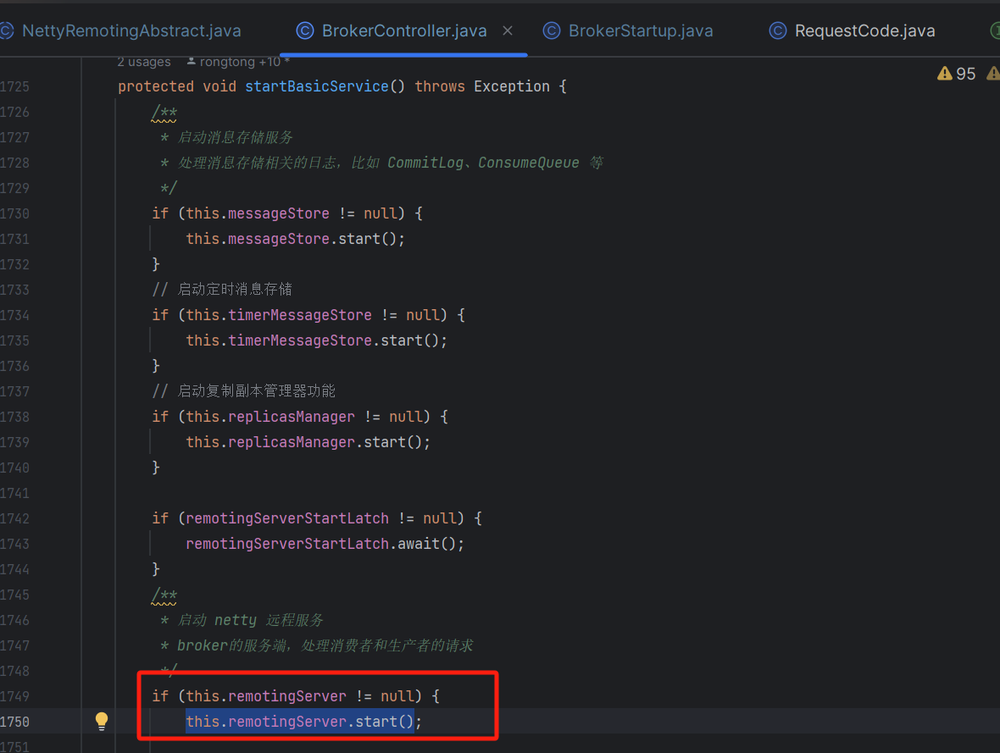

继续查看 [remotingServer](http://remotingserver/) 的启动流程，进入 [NettyRemotingServer#start](http://nettyremotingserver/#start) 方法：

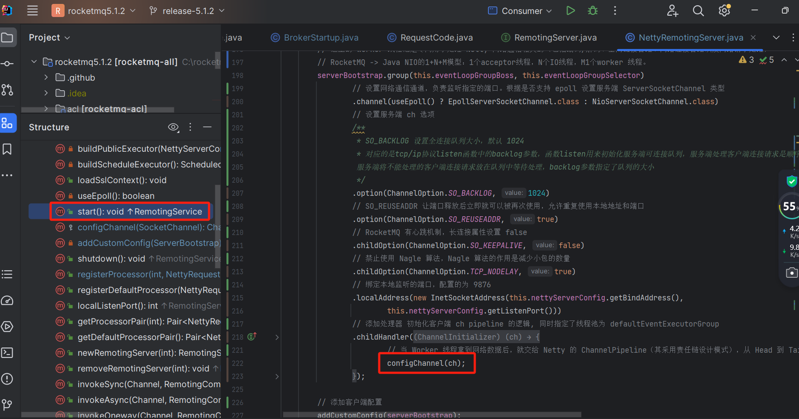

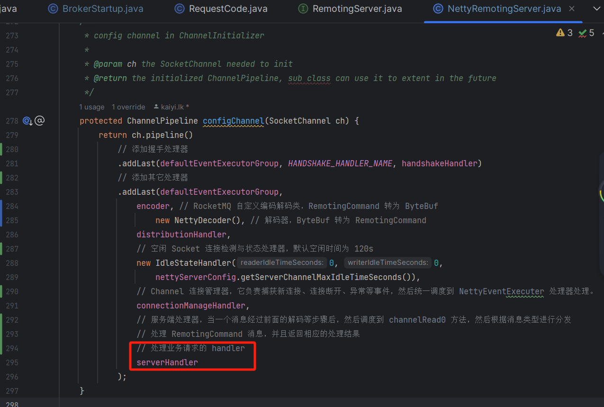

这就是一个标准的 Netty 服务启动流程了，与 「**NameServer**」启动是类似的。这里我们仅关注 [pipeline](http://pipeline%20/) 上的[channelHandler](http://channelhandler/)，在 Netty 中，处理读写请求的操作为一个个 [ChannelHandler](http://channelhandler/)，[remotingServer](http://remotingserver%20/) 中处理读写请求的 [ChanelHandler](http://chanelhandler/) 为 [NettyServerHandler](http://nettyserverhandler/)，然后向 [Netty](http://netty/) 注册请求消息处理器[NettyServerHandler](http://nettyserverhandler/)，[NettyServerHandler](http://nettyserverhandler%20/) 为 [NettyRemotingServer](http://nettyremotingserver/) 的内部类，[NettyServerHandler](http://nettyserverhandler/) 详情如下：

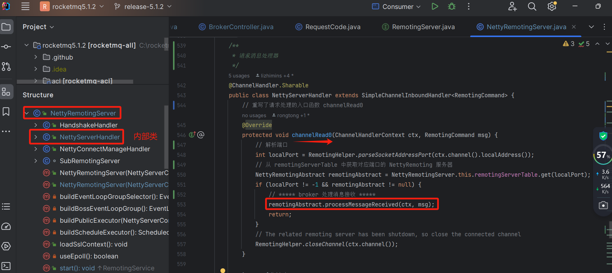

[Broker](http://broker/) 接收消息后会根据「**请求类型**」判断是「**执行请求**」执行请求还是「**执行响应**」，核心代码如下：

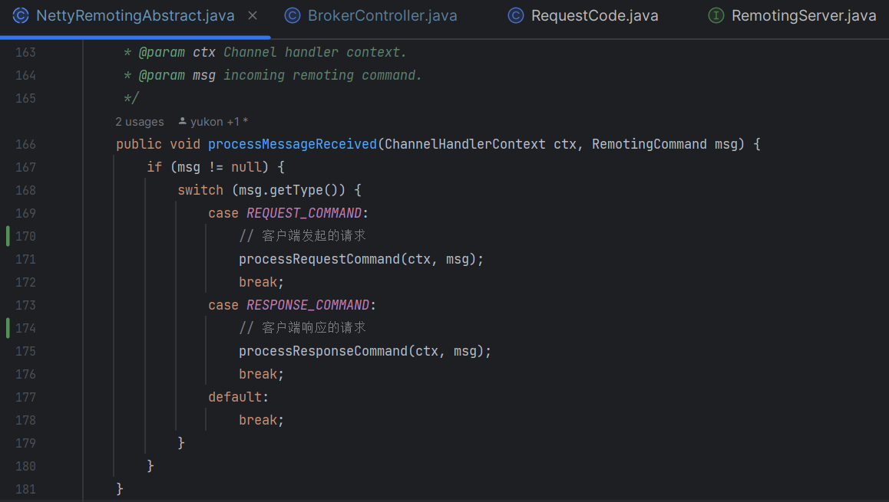

先来看下请求：

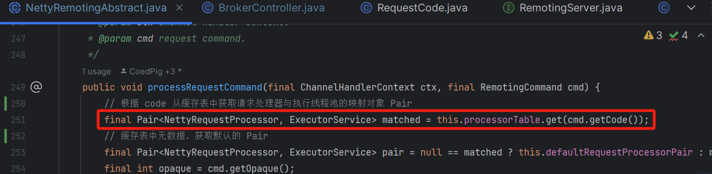

通过请求中的 [RequestCode](http://requestcode/) 获取缓存表中请求处理器 [NettyRequestProcessor](http://nettyrequestprocessor/)，执行请求处理器中的[processRequest()](http://processrequest\(\)/) 方法。

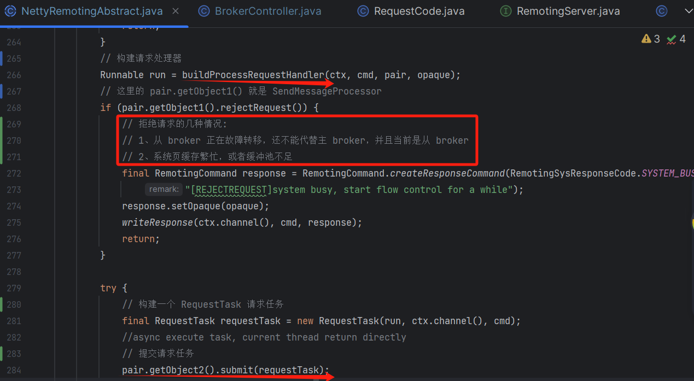

1.  首先会构建一个请求处理器，然后执行 [pair.getObject1().processRequest](http://pair.getobject1\(\).processrequest/)， 这里的 [pair.getObject1()](http://pair.getobject1\(\)/) 就是 [SendMessageProcessor](http://sendmessageprocessor/)。

private Runnable buildProcessRequestHandler(ChannelHandlerContext ctx, RemotingCommand cmd,

Pair<NettyRequestProcessor, ExecutorService> pair, int opaque) {

return () -> {

Exception exception \= null;

RemotingCommand response;

try {

// 获取远程地址

String remoteAddr \= RemotingHelper.parseChannelRemoteAddr(ctx.channel());

try {

// 处理前置钩子

doBeforeRpcHooks(remoteAddr, cmd);

} catch (AbortProcessException e) {

throw e;

} catch (Exception e) {

exception = e;

}

if (exception == null) {

// pair.getObject1() 就是 SendMessageProcessor

response = pair.getObject1().processRequest(ctx, cmd);

} else {

// 构建系统异常

response = RemotingCommand.createResponseCommand(RemotingSysResponseCode.SYSTEM\_ERROR, null);

}

try {

// 处理后置钩子

doAfterRpcHooks(remoteAddr, cmd, response);

} catch (AbortProcessException e) {

throw e;

} catch (Exception e) {

exception = e;

}

if (exception != null) {

throw exception;

}

// 写回响应

writeResponse(ctx.channel(), cmd, response);

} catch (AbortProcessException e) {

response = RemotingCommand.createResponseCommand(e.getResponseCode(), e.getErrorMessage());

response.setOpaque(opaque);

writeResponse(ctx.channel(), cmd, response);

} catch (Throwable e) {

log.error("process request exception", e);

log.error(cmd.toString());

if (!cmd.isOnewayRPC()) {

response = RemotingCommand.createResponseCommand(RemotingSysResponseCode.SYSTEM\_ERROR,

UtilAll.exceptionSimpleDesc(e));

response.setOpaque(opaque);

writeResponse(ctx.channel(), cmd, response);

}

}

};

}

1.  构建一个 [RequestTask](http://requesttask%20/) 请求任务然后进行提交。

这里总结下：

1.  根据 code 从 [processorTable](http://processortable/) 拿到对应的 Pair。
2.  从 Pair 里获取 [Processor](http://processor/)，然后进行处理。

  
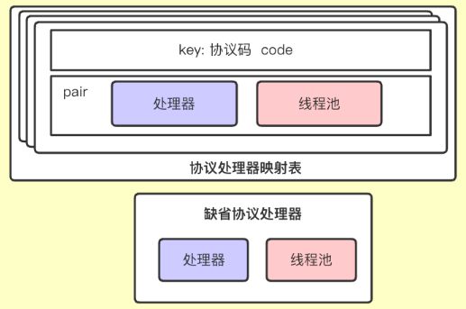

### **3.1.1 拒绝请求**

在调用执行器处理请求之前，会调用处理器的 [rejectRequest](http://rejectrequest/) 方法，判断该处理器能否处理该请求。

不同的处理器对于 [rejectRequest](http://rejectrequest/) 方法有不同的实现，如果是 [SendMessageProcessor](http://sendmessageprocessor/)，那么它的实现为：

检查操作系统页缓存 [PageCache](http://pagecache/) 繁忙或者检查临时存储池 [transientStorePool](http://transientstorepool/) 是否不足，如果其中有一个不满足要求，则拒绝处理该请求。

/\*\*

\* 是否需要拒绝处理该请求

\* @return

\*/

@Override

public boolean rejectRequest() {

// 检查enableSlaveActingMaster 不支持slave代理master && 检查 broker 角色为 slave，则拒绝处理该请求

if (!this.brokerController.getBrokerConfig().isEnableSlaveActingMaster() && this.brokerController.getMessageStoreConfig().getBrokerRole() == BrokerRole.SLAVE) {

return true;

}

// 检查操作系统页缓存 PageCache 是否繁忙或者检查临时存储池 transientStorePool 是否不足，如果其中有一个不满足要求，则拒绝处理该请求

if (this.brokerController.getMessageStore().isOSPageCacheBusy() || this.brokerController.getMessageStore().isTransientStorePoolDeficient()) {

return true;

}

return false;

}

### **3.1.1.1 操作系统 PageCache 是否繁忙**

[osPageCacheBusyTimeOutMills](http://ospagecachebusytimeoutmills/) 可以配置，默认为 1000ms，即1s。

/\*\*

\* DefaultMessageStore 类方法

\* 操作系统页缓存是否繁忙

\* @return

\*/

@Override

public boolean isOSPageCacheBusy() {

// 一个 broker 将所有的消息都追加到同一个逻辑 CommitLog 日志文件中，因此需要通过获取 putMessageLock 锁来控制并发。

// 这里 begin 表示获取 CommitLog 锁的开始时间

long begin \= this.getCommitLog().getBeginTimeInLock();

// 计算锁的持有时间，当前时间减去获取锁开始时间，这个时间可以看作是处理上一个消息目前所花费的时间

long diff \= this.systemClock.now() - begin;

// 如果 broker 持有锁的时间超过 osPageCacheBusyTimeOutMills（1000），则算作操作系统页缓存繁忙，那么会拒绝处理当前请求

// 直观现象就是客户端抛出 \[REJECTREQUEST\]system busy, start flow control for a while 异常

return diff < 10000000

&& diff > this.messageStoreConfig.getOsPageCacheBusyTimeOutMills();

}

### **3.1.1.2 检查临时存储池是否不足**

如果启用 [commitLog](http://commitlog/) 临时存储池，那么检查当前可用的 [buffers](http://buffers/) 堆外内存的数量是否不足。

在 [RocketMQ](http://rocketmq%20/) 中引入的 [transientStorePoolEnable](http://transientstorepoolenable%20/) 能缓解 [pagecache](http://pagecache%20/) 的压力，其原理是基于 [DirectByteBuffer](http://directbytebuffer/)和 [MappedByteBuffer](http://mappedbytebuffer/) 的读写分离，消息先写入DirectByteBuffer（堆外内存），随后从MappedByteBuffer（pageCache）读取。

/\*\*

\* DefaultMessageStore 类方法

\* 检查可用 buffers

\* @return

\*/

public int remainTransientStoreBufferNumbs() {

// 检查可用 buffers

return this.transientStorePool.availableBufferNums();

}

/\*\*

\* 检查临时存储池是否不足

\* @return

\*/

@Override

public boolean isTransientStorePoolDeficient() {

// 如果堆外内存池个数为 0，则表示临时存储池是否不足

return remainTransientStoreBufferNumbs() == 0;

}

仅当 [transientStorePoolEnable](http://transientstorepoolenable/) 为 true（默认false）&& 支持 Controller 模式 && 当前 broker不是 [SLAVE](http://slave%20/) 角色时，才启用 [commitLog](http://commitlog/) 临时存储池。如果没开启 [commitLog](http://commitlog/) 临时存储池，那么返回最大 int 值。

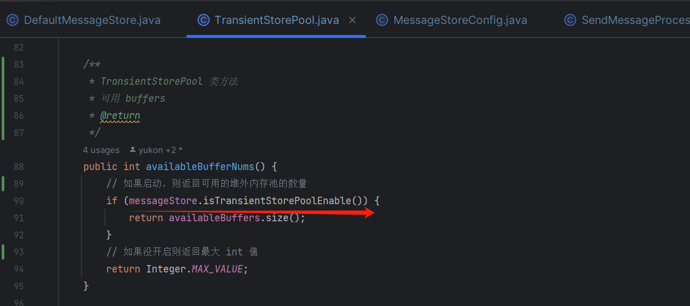

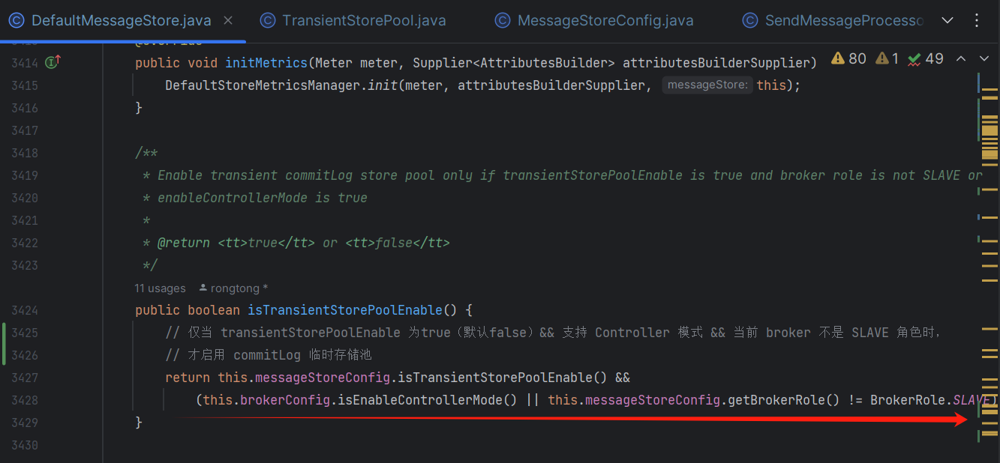

## **3.2 从 Processor 开始**

那么怎么处理消息呢？

从上图 [BrokerController](http://brokercontroller/) 初始化的过程中，此时我们会想到在前面的时候经常提到的「**Processor**」，它是处理消息的关键，然后从 [processorTable](http://processortable/) 中获取的。

在「**Broker**」启动的过程中会调用 [registerProcessor()](http://registerprocessor\(\)/) 方法来注册各种各样的「**Handler**」，而处理「**Producer**」 投递过来的消息的 Processor 类就在这里。

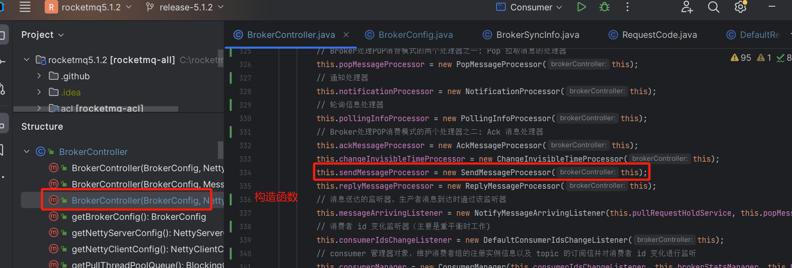

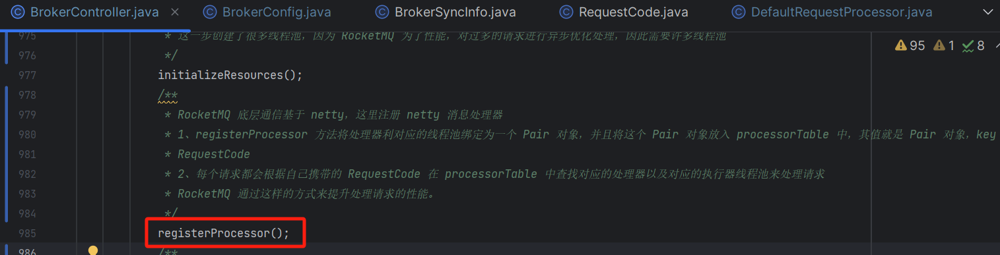

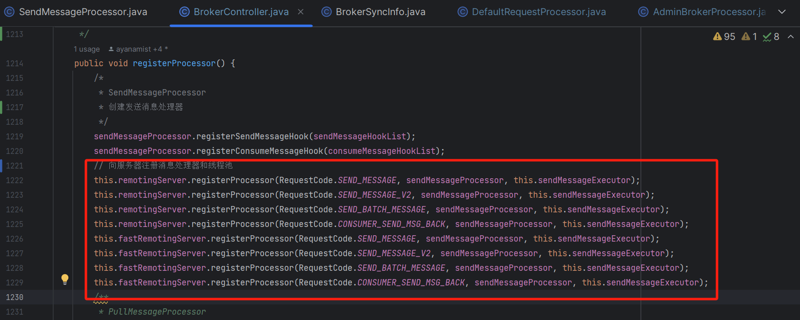

这里需要说明下，[sendMessageProcessor](http://sendmessageprocessor/) 用来处理 Producer 请求过来的消息，而 [pullMessageProcessor](http://pullmessageprocessor/) 用来处理consumer 拉取消息的请求。

本篇我们只关注 [sendMessageProcessor](http://sendmessageprocessor/)，来看看它的处理消息流程。

## **3.3 SendMessageProcessor 消息写入处理流程**

源码位置：[https://github.com/apache/rocketmq/blob/release-5.1.2/](https://github.com/apache/rocketmq/blob/release-5.1.2/broker/src/main/java/org/apache/rocketmq/broker/processor/SendMessageProcessor.java)[broker](https://github.com/apache/rocketmq/blob/release-5.1.2/broker/src/main/java/org/apache/rocketmq/broker/processor/SendMessageProcessor.java)[/src/main/java/org/apache/rocketmq/](https://github.com/apache/rocketmq/blob/release-5.1.2/broker/src/main/java/org/apache/rocketmq/broker/processor/SendMessageProcessor.java)[broker](https://github.com/apache/rocketmq/blob/release-5.1.2/broker/src/main/java/org/apache/rocketmq/broker/processor/SendMessageProcessor.java)[/](https://github.com/apache/rocketmq/blob/release-5.1.2/broker/src/main/java/org/apache/rocketmq/broker/processor/SendMessageProcessor.java)[processor/SendMessageProcessor](https://github.com/apache/rocketmq/blob/release-5.1.2/broker/src/main/java/org/apache/rocketmq/broker/processor/SendMessageProcessor.java)[.java](https://github.com/apache/rocketmq/blob/release-5.1.2/broker/src/main/java/org/apache/rocketmq/broker/processor/SendMessageProcessor.java)

通过上面知道， 当「**Producer**」发送消息到「**Broker**」时，发送的请求 code 为 [SEND\_MESSAGE](http://send_message/)，然后交给[NettyServerHandler](http://nettyserverhandler/) 来处理，接着会调用到 [NettyRemotingAbstract#processRequestCommand](http://nettyremotingabstract/#processRequestCommand) 方法，在其内部会根据消息的 code 获取对应的 [Processor](http://processor/) 来处理，从 [Processor](http://processor/) 的注册流程来看，处理该 [SEND\_MESSAGE](http://send_message/)的 [Processor](http://processor/) 为 [SendMessageProcessor](http://sendmessageprocessor/)。我们来看看 [SendMessageProcessor#processRequest](http://sendmessageprocessor/#processRequest) 的流程，如下：

@Override

public RemotingCommand processRequest(ChannelHandlerContext ctx,RemotingCommand request) throws RemotingCommandException {

// 创建消息发送上下文

SendMessageContext sendMessageContext;

// 根据请求的不同类型进行不同的处理

switch (request.getCode()) {

// 如果请求类型为CONSUMER\_SEND\_MSG\_BACK，则调用consumerSendMsgBack方法实现消息重试处理并返回结果

case RequestCode.CONSUMER\_SEND\_MSG\_BACK:

return this.consumerSendMsgBack(ctx,request);

default: // 其他情况，都是属于生产者发送消息的请求，统一处理

// 解析请求头部

SendMessageRequestHeader requestHeader \= parseRequestHeader(request);

// 如果请求头部为空，则返回空结果

if (requestHeader == null) {

return null;

}

// 构建主题队列映射上下文

TopicQueueMappingContext mappingContext \= this.brokerController.getTopicQueueMappingManager().buildTopicQueueMappingContext(requestHeader,true);

// 重写用于静态主题的请求

RemotingCommand rewriteResult \= this.brokerController.getTopicQueueMappingManager().rewriteRequestForStaticTopic(requestHeader,mappingContext);

// 如果重写结果不为空，则返回重写结果

if (rewriteResult != null) {

return rewriteResult;

}

// 构建消息轨迹

sendMessageContext = buildMsgContext(ctx,requestHeader,request);

try {

// 执行发送消息前的钩子函数

this.executeSendMessageHookBefore(sendMessageContext);

} catch (AbortProcessException e) {

// 处理异常情况，返回带有错误码和消息的响应命令

final RemotingCommand errorResponse \= RemotingCommand.createResponseCommand(e.getResponseCode(),e.getErrorMessage());

errorResponse.setOpaque(request.getOpaque());

return errorResponse;

}

RemotingCommand response;

// 如果请求为批量消息，则调用sendBatchMessage方法处理消息发送

if (requestHeader.isBatch()) {

response = this.sendBatchMessage(ctx,request,sendMessageContext,requestHeader,mappingContext,(ctx1,response1) -> executeSendMessageHookAfter(response1,ctx1));

} else {

// 否则调用sendMessage方法处理消息发送

response = this.sendMessage(ctx,request,sendMessageContext,requestHeader,mappingContext,(ctx12,response12) -> executeSendMessageHookAfter(response12,ctx12));

}

return response;

}

}

### **解决新消息头**

该方法会解析请求头为 [SendMessageRequestHeader](http://sendmessagerequestheader/) 对象，在该方法中会通过不同的 [RequestCode](http://requestcode/) 选择不同的解析方法，如果是批量消息或者轻量（压缩）消息，那么先解析为 [SendMessageRequestHeaderV2](http://sendmessagerequestheaderv2/)，然后转换为[SendMessageRequestHeader](http://sendmessagerequestheader/)，否则直接解析为 [SendMessageRequestHeader](http://sendmessagerequestheader/)。

在 [Producer](http://producer/) 发送消息的时候可能会使用轻量级消息头 [SendMessageRequestHeaderV2](http://sendmessagerequestheaderv2/)，[SendMessageRequestHeaderV2](http://sendmessagerequestheaderv2/) 相比于 [SendMessageRequestHeader](http://sendmessagerequestheader/)，其 field 全为 a,b,c,d 等短变量名，可以加快 [FastJson](http://fastjson/) 反序列化过程，提升传输效率。

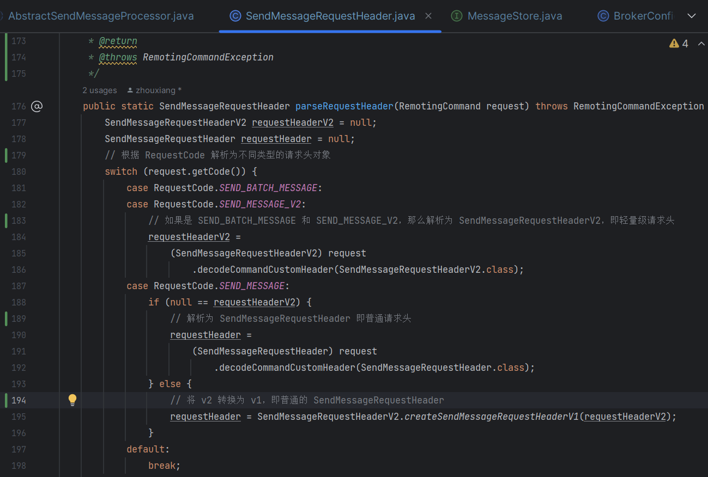

关于轻量级消息头具体的源码位置：[https://github.com/apache/rocketmq/blob/release-5.1.2/](https://github.com/apache/rocketmq/blob/release-5.1.2/remoting/src/main/java/org/apache/rocketmq/remoting/protocol/header/SendMessageRequestHeaderV2.java)[remoting](https://github.com/apache/rocketmq/blob/release-5.1.2/remoting/src/main/java/org/apache/rocketmq/remoting/protocol/header/SendMessageRequestHeaderV2.java)[/src/main/java/org/apache/rocketmq/](https://github.com/apache/rocketmq/blob/release-5.1.2/remoting/src/main/java/org/apache/rocketmq/remoting/protocol/header/SendMessageRequestHeaderV2.java)[remoting](https://github.com/apache/rocketmq/blob/release-5.1.2/remoting/src/main/java/org/apache/rocketmq/remoting/protocol/header/SendMessageRequestHeaderV2.java)[/](https://github.com/apache/rocketmq/blob/release-5.1.2/remoting/src/main/java/org/apache/rocketmq/remoting/protocol/header/SendMessageRequestHeaderV2.java)[protocol/header/SendMessageRequestHeaderV2](https://github.com/apache/rocketmq/blob/release-5.1.2/remoting/src/main/java/org/apache/rocketmq/remoting/protocol/header/SendMessageRequestHeaderV2.java)[.java](https://github.com/apache/rocketmq/blob/release-5.1.2/remoting/src/main/java/org/apache/rocketmq/remoting/protocol/header/SendMessageRequestHeaderV2.java)

我们分别来看下。

### **3.3.1 单个消息处理**

public RemotingCommand sendMessage(final ChannelHandlerContext ctx,

final RemotingCommand request,

final SendMessageContext sendMessageContext,

final SendMessageRequestHeader requestHeader,

final TopicQueueMappingContext mappingContext,

final SendMessageCallback sendMessageCallback) throws RemotingCommandException {

// 调用preSend方法进行消息发送前的预处理，并获取预处理结果

final RemotingCommand response \= preSend(ctx,request,requestHeader);

// 如果预处理结果包含错误码，则返回该结果

if (response.getCode() != -1) {

return response;

}

// 从响应中读取自定义头部

final SendMessageResponseHeader responseHeader \= (SendMessageResponseHeader) response.readCustomHeader();

// 从请求头部获取消息体

final byte\[\] body = request.getBody();

// 获取请求消息对应的队列ID

int queueIdInt \= requestHeader.getQueueId();

// 根据消息所属主题获取主题配置信息

TopicConfig topicConfig \= this.brokerController.getTopicConfigManager().selectTopicConfig(requestHeader.getTopic());

// 如果队列ID小于0，随机选择一个队列ID

if (queueIdInt < 0) {

queueIdInt = randomQueueId(topicConfig.getWriteQueueNums());

}

// 创建内部消息对象

MessageExtBrokerInner msgInner \= new MessageExtBrokerInner();

msgInner.setTopic(requestHeader.getTopic());

msgInner.setQueueId(queueIdInt);

// 将原始属性解析为消息属性

Map<String,String> oriProps = MessageDecoder.string2messageProperties(requestHeader.getProperties());

// 处理消息的重试和死信队列逻辑

if (!handleRetryAndDLQ(requestHeader,response,request,msgInner,topicConfig,oriProps)) {

return response;

}

msgInner.setBody(body);

msgInner.setFlag(requestHeader.getFlag());

// 生成消息的唯一键（Message Key）

String uniqKey \= oriProps.get(MessageConst.PROPERTY\_UNIQ\_CLIENT\_MESSAGE\_ID\_KEYIDX);

if (uniqKey == null || uniqKey.length() <= 0) {

uniqKey = MessageClientIDSetter.createUniqID();

oriProps.put(MessageConst.PROPERTY\_UNIQ\_CLIENT\_MESSAGE\_ID\_KEYIDX,uniqKey);

}

// 设置消息属性

MessageAccessor.setProperties(msgInner,oriProps);

// 获取消息清理策略

CleanupPolicy cleanupPolicy \= CleanupPolicyUtils.getDeletePolicy(Optional.of(topicConfig));

if (Objects.equals(cleanupPolicy,CleanupPolicy.COMPACTION)) {

// 对于COMPACT主题，如果消息的keys属性为空，则返回错误响应

if (StringUtils.isBlank(msgInner.getKeys())) {

response.setCode(ResponseCode.MESSAGE\_ILLEGAL);

response.setRemark("Required message key is missing");

return response;

}

}

// 设置消息的tagsCode、bornTimestamp、bornHost等属性

msgInner.setTagsCode(MessageExtBrokerInner.tagsString2tagsCode(topicConfig.getTopicFilterType(),msgInner.getTags()));

msgInner.setBornTimestamp(requestHeader.getBornTimestamp());

msgInner.setBornHost(ctx.channel().remoteAddress());

msgInner.setStoreHost(this.getStoreHost());

msgInner.setReconsumeTimes(requestHeader.getReconsumeTimes() == null ?0 :requestHeader.getReconsumeTimes());

String clusterName \= this.brokerController.getBrokerConfig().getBrokerClusterName();

MessageAccessor.putProperty(msgInner,MessageConst.PROPERTY\_CLUSTER,clusterName);

msgInner.setPropertiesString(MessageDecoder.messageProperties2String(msgInner.getProperties()));

// 获取消息的事务标识

String traFlag \= oriProps.get(MessageConst.PROPERTY\_TRANSACTION\_PREPARED);

boolean sendTransactionPrepareMessage \= false;

// 判断是否需要发送事务预备消息

if (Boolean.parseBoolean(traFlag) && !(msgInner.getReconsumeTimes() > 0 && msgInner.getDelayTimeLevel() > 0)) {

if (this.brokerController.getBrokerConfig().isRejectTransactionMessage()) {

response.setCode(ResponseCode.NO\_PERMISSION);

response.setRemark(

"the broker\[" + this.brokerController.getBrokerConfig().getBrokerIP1()

\+ "\] sending transaction message is forbidden");

return response;

}

sendTransactionPrepareMessage = true;

}

// 获取当前时间

long beginTimeMillis \= this.brokerController.getMessageStore().now();

// 如果异步发送可用

if (brokerController.getBrokerConfig().isAsyncSendEnable()) {

// 创建CompletableFuture对象，发送事务准备消息或普通消息

CompletableFuture<PutMessageResult> asyncPutMessageFuture;

if (sendTransactionPrepareMessage) {

asyncPutMessageFuture = this.brokerController.getTransactionalMessageService().asyncPrepareMessage(msgInner);

} else {

asyncPutMessageFuture = this.brokerController.getMessageStore().asyncPutMessage(msgInner);

}

final int finalQueueIdInt \= queueIdInt;

final MessageExtBrokerInner finalMsgInner \= msgInner;

// 处理异步发送结果

asyncPutMessageFuture.thenAcceptAsync(putMessageResult -> {

RemotingCommand responseFuture \=

handlePutMessageResult(putMessageResult,response,request,finalMsgInner,responseHeader,sendMessageContext,

ctx,finalQueueIdInt,beginTimeMillis,mappingContext,BrokerMetricsManager.getMessageType(requestHeader));

if (responseFuture != null) {

doResponse(ctx,request,responseFuture);

}

sendMessageCallback.onComplete(sendMessageContext,response);

},this.brokerController.getPutMessageFutureExecutor());

// 返回null释放消息发送线程

return null;

} else {

// 如果异步发送不可用，直接发送事务准备消息或普通消息

PutMessageResult putMessageResult \= null;

if (sendTransactionPrepareMessage) {

putMessageResult = this.brokerController.getTransactionalMessageService().prepareMessage(msgInner);

} else {

putMessageResult = this.brokerController.getMessageStore().putMessage(msgInner);

}

handlePutMessageResult(putMessageResult,response,request,msgInner,responseHeader,sendMessageContext,ctx,queueIdInt,beginTimeMillis,mappingContext,BrokerMetricsManager.getMessageType(requestHeader));

// 调用回调函数处理发送完成的事件

sendMessageCallback.onComplete(sendMessageContext,response);

return response;

}

}

### **3.3.2 批量消息处理**

private RemotingCommand sendBatchMessage(final ChannelHandlerContext ctx,

final RemotingCommand request,

final SendMessageContext sendMessageContext,

final SendMessageRequestHeader requestHeader,

TopicQueueMappingContext mappingContext,

final SendMessageCallback sendMessageCallback) {

// 调用preSend方法进行消息发送前的预处理，并获取预处理结果

final RemotingCommand response \= preSend(ctx,request,requestHeader);

// 从响应中读取自定义头部

final SendMessageResponseHeader responseHeader \= (SendMessageResponseHeader) response.readCustomHeader();

// 如果预处理结果包含错误码，则返回该结果

if (response.getCode() != -1) {

return response;

}

// 从请求头部获取消息队列ID

int queueIdInt \= requestHeader.getQueueId();

// 根据消息所属主题获取主题配置信息

TopicConfig topicConfig \= this.brokerController.getTopicConfigManager().selectTopicConfig(requestHeader.getTopic());

// 如果队列ID小于0，随机选择一个队列ID

if (queueIdInt < 0) {

queueIdInt = randomQueueId(topicConfig.getWriteQueueNums());

}

// 检查消息主题长度是否超出范围，如果超出则返回错误响应

if (requestHeader.getTopic().length() > Byte.MAX\_VALUE) {

response.setCode(ResponseCode.MESSAGE\_ILLEGAL);

response.setRemark("message topic length too long " + requestHeader.getTopic().length());

return response;

}

// 检查消息主题是否为重试主题，如果是则返回错误响应

if (requestHeader.getTopic() != null && requestHeader.getTopic().startsWith(MixAll.RETRY\_GROUP\_TOPIC\_PREFIX)) {

response.setCode(ResponseCode.MESSAGE\_ILLEGAL);

response.setRemark("batch request does not support retry group " + requestHeader.getTopic());

return response;

}

// 创建批量消息对象

MessageExtBatch messageExtBatch \= new MessageExtBatch();

messageExtBatch.setTopic(requestHeader.getTopic());

messageExtBatch.setQueueId(queueIdInt);

// 设置消息系统标识和消息属性

int sysFlag \= requestHeader.getSysFlag();

if (TopicFilterType.MULTI\_TAG == topicConfig.getTopicFilterType()) {

sysFlag |= MessageSysFlag.MULTI\_TAGS\_FLAG;

}

messageExtBatch.setSysFlag(sysFlag);

messageExtBatch.setFlag(requestHeader.getFlag());

MessageAccessor.setProperties(messageExtBatch,MessageDecoder.string2messageProperties(requestHeader.getProperties()));

messageExtBatch.setBody(request.getBody());

messageExtBatch.setBornTimestamp(requestHeader.getBornTimestamp());

messageExtBatch.setBornHost(ctx.channel().remoteAddress());

messageExtBatch.setStoreHost(this.getStoreHost());

messageExtBatch.setReconsumeTimes(requestHeader.getReconsumeTimes() == null ?0 :requestHeader.getReconsumeTimes());

String clusterName \= this.brokerController.getBrokerConfig().getBrokerClusterName();

MessageAccessor.putProperty(messageExtBatch,MessageConst.PROPERTY\_CLUSTER,clusterName);

boolean isInnerBatch \= false;

// 判断是否为内部批量消息

if (QueueTypeUtils.isBatchCq(Optional.of(topicConfig)) && MessageClientIDSetter.getUniqID(messageExtBatch) != null) {

// 新增引入的内部批量消息

messageExtBatch.setSysFlag(messageExtBatch.getSysFlag() | MessageSysFlag.NEED\_UNWRAP\_FLAG);

messageExtBatch.setSysFlag(messageExtBatch.getSysFlag() | MessageSysFlag.INNER\_BATCH\_FLAG);

messageExtBatch.setInnerBatch(true);

// 计算内部消息数目

int innerNum \= MessageDecoder.countInnerMsgNum(ByteBuffer.wrap(messageExtBatch.getBody()));

MessageAccessor.putProperty(messageExtBatch,MessageConst.PROPERTY\_INNER\_NUM,String.valueOf(innerNum));

messageExtBatch.setPropertiesString(MessageDecoder.messageProperties2String(messageExtBatch.getProperties()));

// 告知生产者这是内部批量消息响应

responseHeader.setBatchUniqId(MessageClientIDSetter.getUniqID(messageExtBatch));

isInnerBatch = true;

}

// 获取当前时间

long beginTimeMillis \= this.brokerController.getMessageStore().now();

// 如果异步发送可用

if (this.brokerController.getBrokerConfig().isAsyncSendEnable()) {

// 创建CompletableFuture对象，发送批量消息或内部批量消息

CompletableFuture<PutMessageResult> asyncPutMessageFuture;

if (isInnerBatch) {

asyncPutMessageFuture = this.brokerController.getMessageStore().asyncPutMessage(messageExtBatch);

} else {

asyncPutMessageFuture = this.brokerController.getMessageStore().asyncPutMessages(messageExtBatch);

}

final int finalQueueIdInt \= queueIdInt;

// 处理异步发送结果

asyncPutMessageFuture.thenAcceptAsync(putMessageResult -> {

RemotingCommand responseFuture \=

handlePutMessageResult(putMessageResult,response,request,messageExtBatch,responseHeader,

sendMessageContext,ctx,finalQueueIdInt,beginTimeMillis,mappingContext,BrokerMetricsManager.getMessageType(requestHeader));

if (responseFuture != null) {

doResponse(ctx,request,responseFuture);

}

sendMessageCallback.onComplete(sendMessageContext,response);

},this.brokerController.getSendMessageExecutor());

// 返回null释放消息发送线程

return null;

} else {

// 如果异步发送不可用，直接发送批量消息或内部批量消息

PutMessageResult putMessageResult;

if (isInnerBatch) {

putMessageResult = this.brokerController.getMessageStore().putMessage(messageExtBatch);

} else {

putMessageResult = this.brokerController.getMessageStore().putMessages(messageExtBatch);

}

// 处理发送结果

handlePutMessageResult(putMessageResult,response,request,messageExtBatch,responseHeader,

sendMessageContext,ctx,queueIdInt,beginTimeMillis,mappingContext,BrokerMetricsManager.getMessageType(requestHeader));

// 调用回调函数处理发送完成的事件

sendMessageCallback.onComplete(sendMessageContext,response);

return response;

}

}

代码比较多，我们来拆解下：

### **3.3.3 消息预处理**

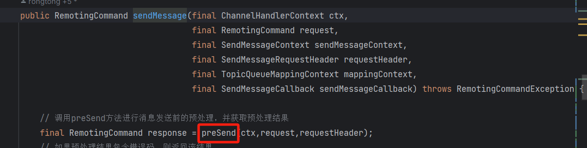

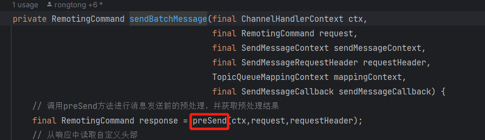

/\*\*

\* 消息发送前的预处理，并获取预处理结果

\* @param ctx

\* @param request

\* @param requestHeader

\* @return

\*/

private RemotingCommand preSend(ChannelHandlerContext ctx, RemotingCommand request,

SendMessageRequestHeader requestHeader) {

// 1、构建 response 响应

final RemotingCommand response \= RemotingCommand.createResponseCommand(SendMessageResponseHeader.class);

response.setOpaque(request.getOpaque());

response.addExtField(MessageConst.PROPERTY\_MSG\_REGION, this.brokerController.getBrokerConfig().getRegionId());

response.addExtField(MessageConst.PROPERTY\_TRACE\_SWITCH, String.valueOf(this.brokerController.getBrokerConfig().isTraceOn()));

LOGGER.debug("Receive SendMessage request command {}", request);

final long startTimestamp \= this.brokerController.getBrokerConfig().getStartAcceptSendRequestTimeStamp();

// 校验服务器时间

if (this.brokerController.getMessageStore().now() < startTimestamp) {

response.setCode(ResponseCode.SYSTEM\_ERROR);

response.setRemark(String.format("broker unable to service, until %s", UtilAll.timeMillisToHumanString2(startTimestamp)));

return response;

}

response.setCode(-1);

// 2、

super.msgCheck(ctx, requestHeader, request, response);

return response;

}

/\*\*

\* 消息检查

\* @param ctx

\* @param requestHeader

\* @param request

\* @param response

\* @return

\*/

protected RemotingCommand msgCheck(final ChannelHandlerContext ctx,

final SendMessageRequestHeader requestHeader, final RemotingCommand request,

final RemotingCommand response) {

// 检查 Broker 是否有写权限

if (!PermName.isWriteable(this.brokerController.getBrokerConfig().getBrokerPermission())

&& this.brokerController.getTopicConfigManager().isOrderTopic(requestHeader.getTopic())) {

// 无操作权限

response.setCode(ResponseCode.NO\_PERMISSION);

response.setRemark("the broker\[" + this.brokerController.getBrokerConfig().getBrokerIP1()

\+ "\] sending message is forbidden");

return response;

}

TopicValidator.ValidateTopicResult result \= TopicValidator.validateTopic(requestHeader.getTopic());

if (!result.isValid()) {

response.setCode(ResponseCode.SYSTEM\_ERROR);

response.setRemark(result.getRemark());

return response;

}

// 检查 Topic 是否能发送消息默认 Topic 不能发送消息，仅供路由查找

if (TopicValidator.isNotAllowedSendTopic(requestHeader.getTopic())) {

// 无操作权限

response.setCode(ResponseCode.NO\_PERMISSION);

response.setRemark("Sending message to topic\[" + requestHeader.getTopic() + "\] is forbidden.");

return response;

}

// 获取 TopicConfig，为空进行自动创建 Topic，在 NameServer 端存储 Topic 的配置信息，默认路径为 ${ROCKET\_HOME}/store/config/topic.json。

TopicConfig topicConfig \=

this.brokerController.getTopicConfigManager().selectTopicConfig(requestHeader.getTopic());

if (null == topicConfig) {

int topicSysFlag \= 0;

if (requestHeader.isUnitMode()) {

if (requestHeader.getTopic().startsWith(MixAll.RETRY\_GROUP\_TOPIC\_PREFIX)) {

topicSysFlag = TopicSysFlag.buildSysFlag(false, true);

} else {

topicSysFlag = TopicSysFlag.buildSysFlag(true, false);

}

}

LOGGER.warn("the topic {} not exist, producer: {}", requestHeader.getTopic(), ctx.channel().remoteAddress());

// 在发送消息时，自动创建 topic

topicConfig = this.brokerController.getTopicConfigManager().createTopicInSendMessageMethod(

requestHeader.getTopic(),

requestHeader.getDefaultTopic(),

RemotingHelper.parseChannelRemoteAddr(ctx.channel()),

requestHeader.getDefaultTopicQueueNums(), topicSysFlag);

if (null == topicConfig) {

// 创建重试 topic

if (requestHeader.getTopic().startsWith(MixAll.RETRY\_GROUP\_TOPIC\_PREFIX)) {

topicConfig =

this.brokerController.getTopicConfigManager().

createTopicInSendMessageBackMethod(

requestHeader.getTopic(), 1, PermName.PERM\_WRITE | PermName.PERM\_READ,

topicSysFlag);

}

}

// 最后还是为空，则返回 topic 不存在

if (null == topicConfig) {

response.setCode(ResponseCode.TOPIC\_NOT\_EXIST);

response.setRemark("topic\[" + requestHeader.getTopic() + "\] not exist, apply first please!" + FAQUrl.suggestTodo(FAQUrl.APPLY\_TOPIC\_URL));

return response;

}

}

int queueIdInt \= requestHeader.getQueueId();

int idValid \= Math.max(topicConfig.getWriteQueueNums(), topicConfig.getReadQueueNums());

// 检查队列id 与 Broker 进行匹配

if (queueIdInt >= idValid) {

String errorInfo \= String.format("request queueId\[%d\] is illegal, %s Producer: %s",

queueIdInt,

topicConfig,

RemotingHelper.parseChannelRemoteAddr(ctx.channel()));

LOGGER.warn(errorInfo);

response.setCode(ResponseCode.SYSTEM\_ERROR);

response.setRemark(errorInfo);

return response;

}

return response;

}

1.  创建 [response](http://response%20/) 对象。
2.  校验服务器时间是否合法。
3.  检查 [Broker](http://broker%20/) 是否有写权限。
4.  检查 [Topic](http://topic/) 是否可以进行消息发送，主要针对默认主题，默认主题不能发送消息，仅供路由查找。
5.  如果 [Topic](http://topic%20/) 不存在，则创建 [Topic](http://topic/)。在 [NameServer](http://nameserver%20/) 端存储 Topic 的配置信息，默认路径为[${ROCKET\_HOME}/store/config/topic.json](http://${rocket_home}/store/config/topic.json)。

###   
**3.3.4 构建存储到 Broker 的消息对象**

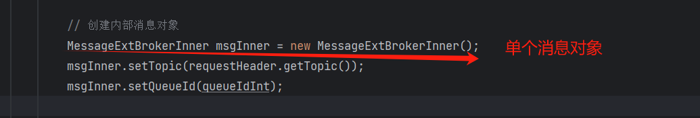

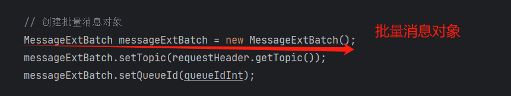

### **3.3.5 消息写入**

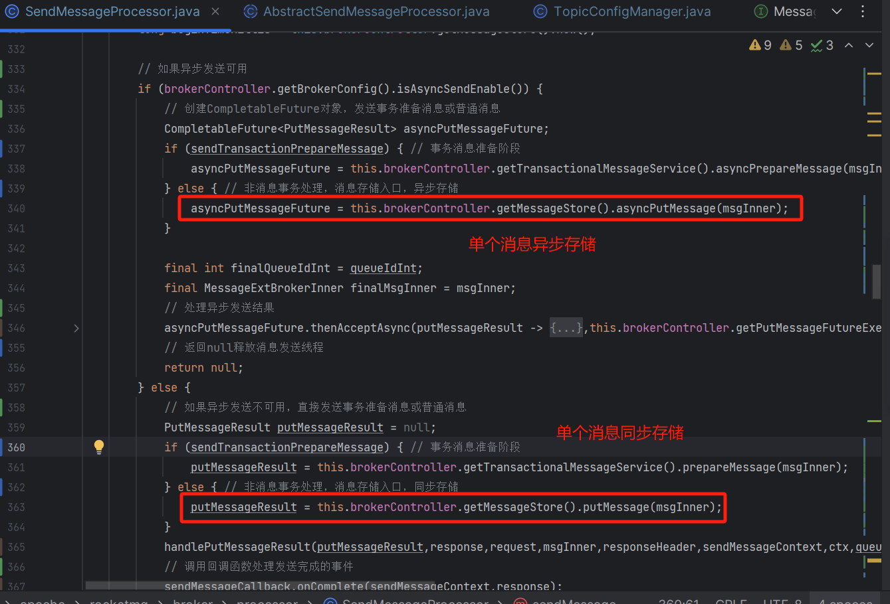

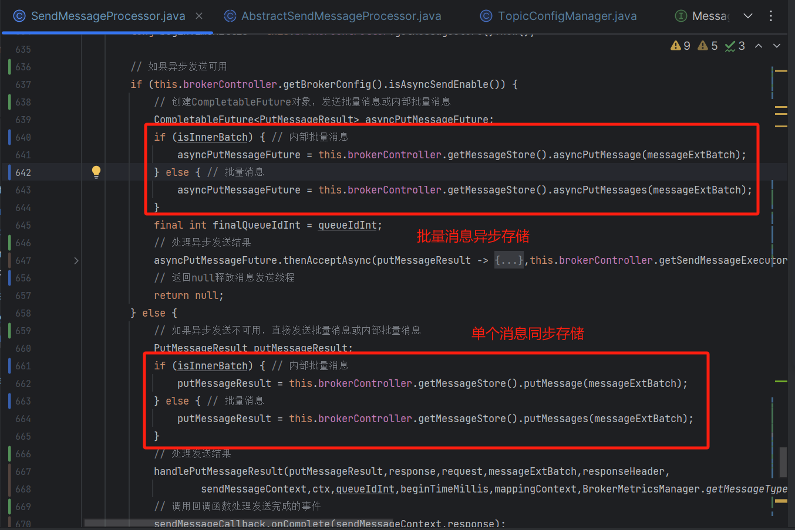

整个处理流程图如下：

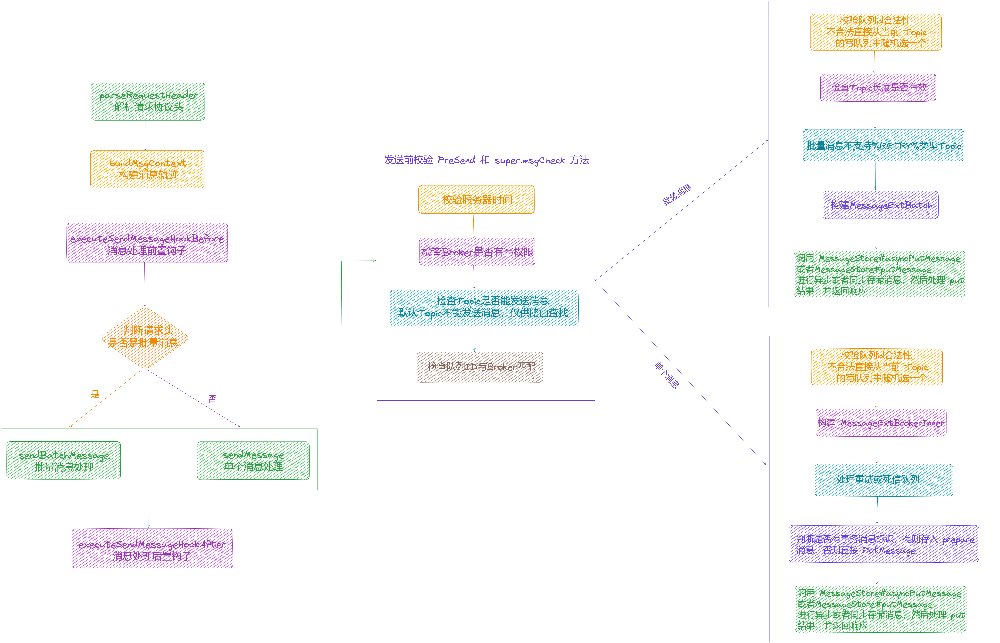

单条消息和批量消息都是调用 [AbstractSendMessageProcessor#msgCheck](http://abstractsendmessageprocessor/#msgCheck) 进行主要参数检查。批量消息不支持死信队列，因为只有消费失败时 Consumer 才会发送单条消息到死信队列，并不会发送批量消息进去死信队列，所以不存在重试 Topic。

另外这里都会判断 Producer 选择的 [MessageQueue](http://messagequeue/) 是否出现了非法的情况，比如 [queueIdInt](http://queueidint%20/) 小于 0，而这显然是不合法的。

如果遇到不合法的情况，就会从当前的 Topic 的 [WriteQueue](http://writequeue%20/) 中随机选择一个作为兜底，核心代码在这里：

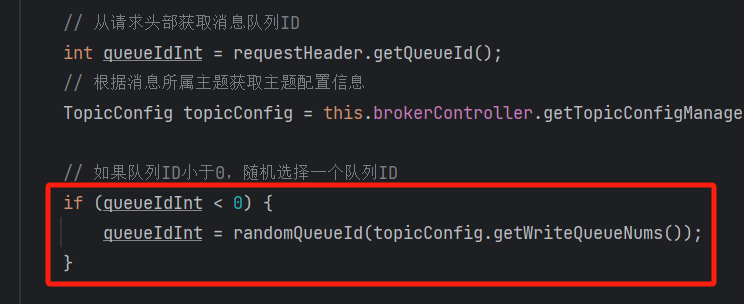

> 这部分代码像极了咱们在业务代码中的“防御性编程”的代码，假设所有来自客户端的参数都有可能是非法的，一切都要以服务端的数据、状态为准。如果是我写的话，我还会校验传入的 queueIdInt 是否大于该 Topic 的WriteQueue 的值。
> 
> 举个例子，假如前面自己创建的 Topic 有 WriteQueue 4个、ReadQueue 4 个，如果此时 RequestHeader 中传入的 QueueId 是7，就明显是不符合预期的。

## **04 总结**

最后我们来总结下。

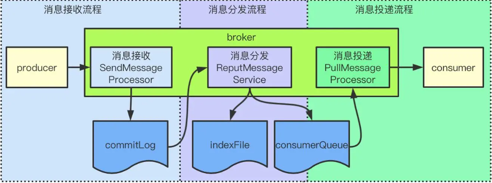

(图片来自网络)

  
RocketMQ 消息处理整个流程如下：

1.  **消息接收阶段**：接收 producer 的消息处理类是 [SendMessageProcessor](http://sendmessageprocessor/)，最后将消息写入到 [commigLog](http://commiglog/) 文件后，接收流程处理完毕。
2.  **消息分发阶段**：broker 处理消息分发的类是 [ReputMessageService](http://reputmessageservice/)，它会启动一个线程，不断地将 [commitLog](http://commitlog/) 分到到对应的 [consumerQueue](http://consumerqueue/)，这一步操作会写两个文件：[consumerQueue](http://consumerqueue/) 与 [indexFile](http://indexfile/)，写入后，消息分发流程处理完毕。
3.  **消息投递阶段**：将消息发往 consumer 的流程，consumer 会发起获取消息的请求，broker 收到请求后调用[PullMessageProcessor](http://pullmessageprocessor/) 类处理，从 [consumerQueue](http://consumerqueue/) 文件获取消息返回给 consumer 后，投递流程处理完毕。

今天我们深度剖析了第一阶段，接下来我们会剖析第二阶段和第三阶段。