大家好，我是**华仔**, 又跟大家见面了。

从今天开始我将继续为大家奉上 RocketMQ 消费者源码剖析系列文章，正式开启「**RocketMQ 的服务端 Broker 源码之旅**」，这是第十八篇，本篇我们将以「**RocketMQ 5.1.2**」版本为主，来剖析下 RocketMQ 源码之 Broker 端三大底层存储文件剖析。

这里我将以「**RocketMQ 5.1.2**」版本为主，通过「**场景驱动**」的方式带大家一点点的对 RocketMQ 源码进行深度剖析，正式开启「**RocketMQ 的源码之旅**」，跟我一起来掌握 RocketMQ 源码核心架构设计思想吧。

  
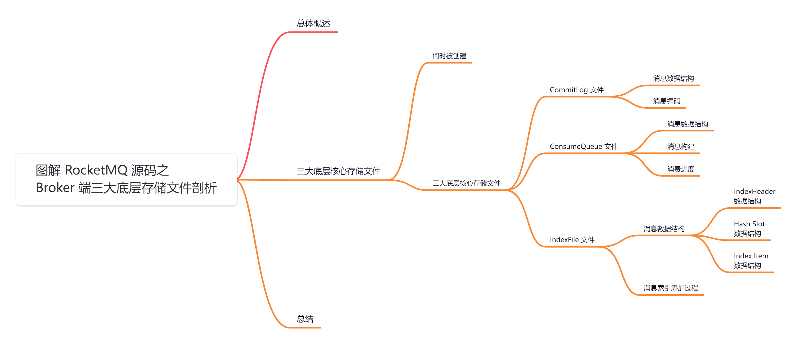

## **01 总体概述**

在 [【Broker端源码分析系列第十五篇】图解 RocketMQ 源码之 Broker 心跳机制和接收数据流程剖析](https://articles.zsxq.com/id_f6x7p8pral0c.html) 这篇中，最终会调用 [DefaultMessageStore](http://defaultmessagestore%20/) 存储组件来进行消息存储。

今天我们就先来梳理下底层的这三大底层核心存储文件是什么？是在什么时候被创建的？其内部构造又是怎样的？

## **02 三大底层核心存储文件**

## **2.1 何时被创建**

通过前面的剖析，我们了解到会在 [DefaultMessageStore](http://defaultmessagestore%20/) 构造函数中创建相关文件，存储目录如下：

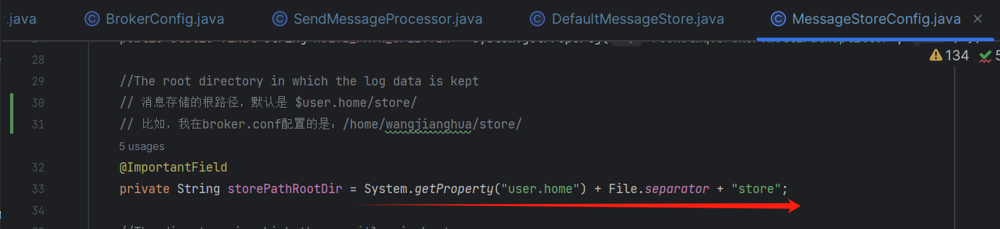

这里会先锁定文件，然后进行挨个创建。

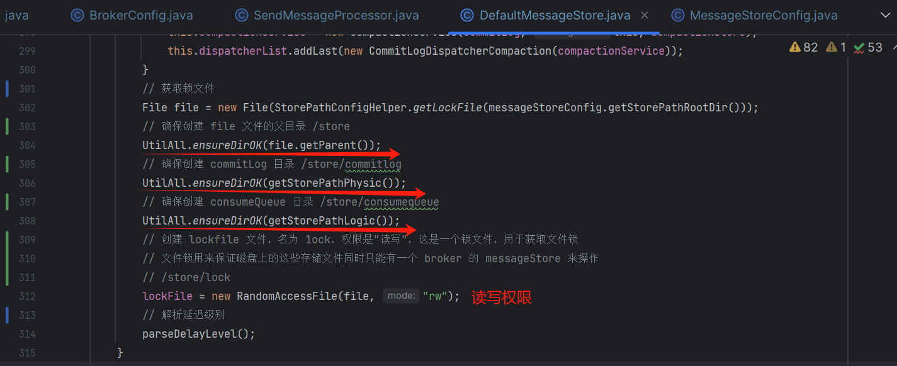

## **2.2 三大底层核心存储文件**

RocketMQ 的消息文件路径如图所示：

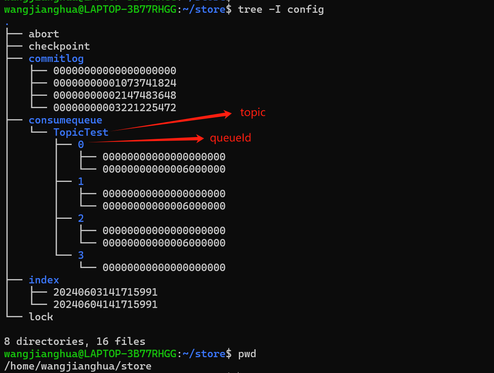

消息在 Broker 上的存储结构如上图，所有相关文件放在 [ROCKETMQ\_HOME](http://rocketmq_home%20/) 下，都有哪些重要存储文件呢？

1.  存放消息本身的 [CommitLog](http://commitlog/)。
2.  存放消息的索引文件 [ConsumeQueue](http://consumequeue%20/) 和 [IndexFile](http://indexfile/)。

###   
**2.2.1 CommitLog 文件**

从物理结构上来看，生产者向 Broker 发送的消息，会以「**顺序写**」的方式将所有的消息都存储在「**CommitLog 文件**」里面，这样可以极大提高写入效率。

「**CommitLog 文件**」的根目录由配置参数 [storePathRootDir](http://storepathrootdir/) 来决定的，默认单个「**CommitLog 文件**」大小默认 1G ，文件名长度为 20 位，左边补零，剩余为起始偏移量。

比如 [00000000000000000000](http://00000000000000000000%20/) 代表了第一个文件，起始偏移量为 0，文件大小为 1G=[1073741824](http://64.0.0.0/)；当第一个文件写满了会新建一个「**CommitLog 文件**」，第二个文件为 [00000000001073741824](http://00000000001073741824)，起始偏移量为 1073741824，以此类推。

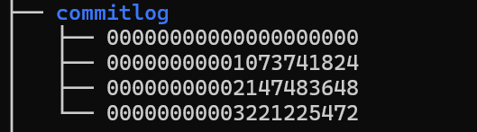

「**CommitLog 文件**」是消息本身、元数据的存储主体，总结如下：

1.  其存储 Producer 端写入的消息主体内容，包括：消息体、属性、UID 等。
2.  由于每条消息长度不一致，所以每个 [CommitLog](http://commitlog%20/) 的记录也不是定长的。
3.  单个 [CommitLog](http://commitlog/) 文件大小默认最大1G, 文件名长度 20 位，左边补零，剩余为 [CommitLog](http://commitlog/) 中消息的起始偏移量。

### **2.2.1.1 消息数据结构**

当生产者向 Broker 发送消息时，[SendMessageProcessor](http://sendmessageprocessor%20/) 这个处理器会调用 [DefaultMessageStore](http://defaultmessagestore%20/) 进行单条或者批量消息的写入。而 [DefaultMessageStore](http://defaultmessagestore%20/) 会调用 [CommitLog#asyncPutMessage](http://commitlog/#asyncPutMessage) 来写入消息。

这里以「**单条消息**」为例，首先 [asyncPutMessage](http://asyncputmessage%20/) 的入参是 [MessageExtBrokerInner](http://messageextbrokerinner/)，它继承自 [MessageExt](http://messageext/)，[MessageExt](http://messageext%20/) 又继承自 [Message](http://message/)。

消息主要有如下的一些属性字段，最基础的是消息投递到那个 Broker [brokerName](http://brokername/) 、哪个主题 [topic](http://topic/)、主题下的哪个队列 [queueId](http://queueid/)，以及消息内容 [body](http://body/) 等。

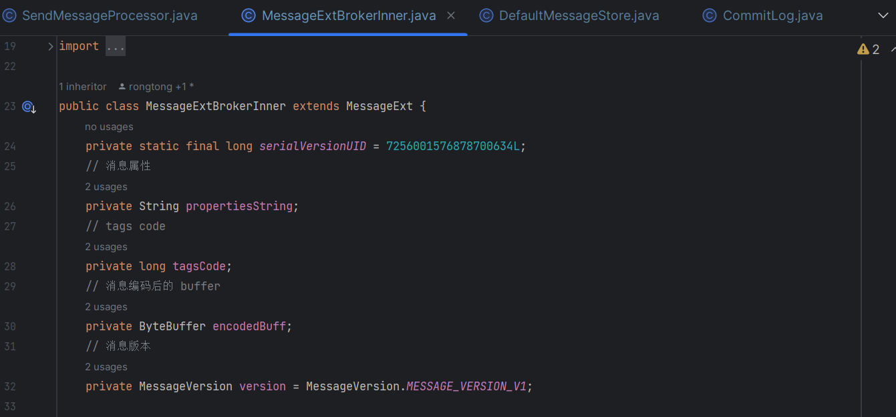

public class MessageExt extends Message {

private static final long serialVersionUID \= 5720810158625748049L;

// broker 组名称

private String brokerName;

// broker Topic 中的 queueId

private int queueId;

// 消息存储大小

private int storeSize;

// 消息队列偏移量

private long queueOffset;

// 系统标识

private int sysFlag;

// 消息诞生时间戳

private long bornTimestamp;

// 消息诞生的客户端网络地址

private SocketAddress bornHost;

// 消息存储的时间戳

private long storeTimestamp;

// 消息存储的机器网络地址

private SocketAddress storeHost;

// 消息id

private String msgId;

// 消息在 commitLog 的偏移量

private long commitLogOffset;

// 消息 crc 校验和

private int bodyCRC;

// 消息重新消费次数

private int reconsumeTimes;

// 预准备事务消息偏移量

private long preparedTransactionOffset;

....

}

## 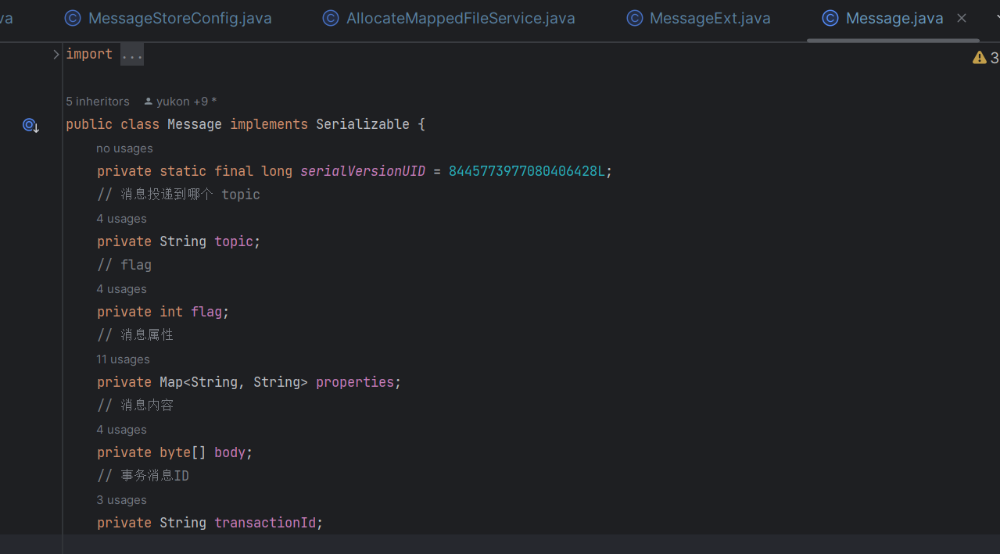

### **2.2.1.2 消息编码**

可以看到在 [CommitLog#asyncPutMessage](http://commitlog/#asyncPutMessage) 会对消息进行编码，这里还是以「**单条消息**」为例。

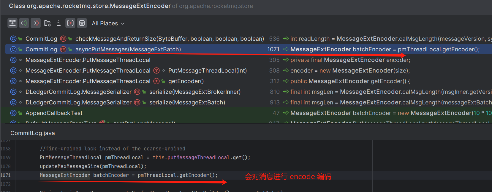

源码位置：[https://github.com/apache/rocketmq/blob/release-5.1.2/store/src/main/java/org/apache/rocketmq/store/](https://github.com/apache/rocketmq/blob/release-5.1.2/store/src/main/java/org/apache/rocketmq/store/MessageExtEncoder.java)[MessageExtEncoder](https://github.com/apache/rocketmq/blob/release-5.1.2/store/src/main/java/org/apache/rocketmq/store/MessageExtEncoder.java)[.java](https://github.com/apache/rocketmq/blob/release-5.1.2/store/src/main/java/org/apache/rocketmq/store/MessageExtEncoder.java)

[MessageExtEncoder](http://messageextencoder%20/) 是消息的编码器，它被另外一个线程类[PutMessageThreadLocal](http://putmessagethreadlocal/)所引用，[ThreadLocal](http://threadlocal%20/) 一般用于多线程环境下，为每个线程创建自己的副本变量，从而互不影响，[PutMessageThreadLocal](http://putmessagethreadlocal/) 在构造函数中对[MessageExtEncoder](http://messageextencoder/) 进行了实例化，并指定了创建缓冲区的大小：

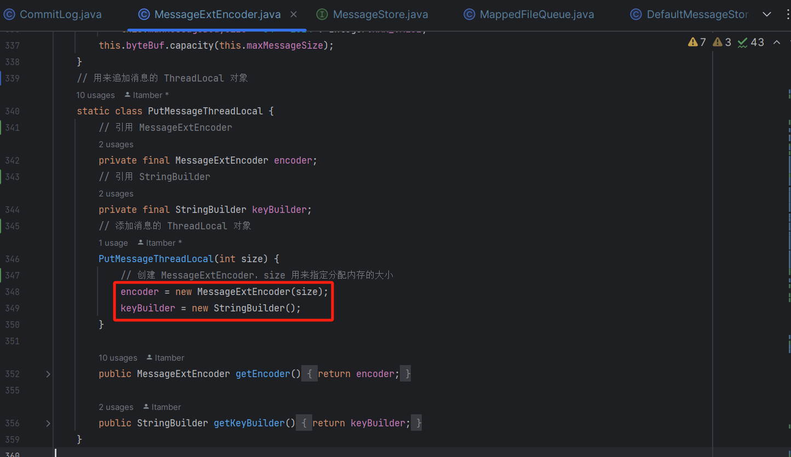

[MessageExtEncoder](http://messageextencoder/) 中使用了 [ByteBuf](http://bytebuf/) 作为消息内容存放的缓冲区，上面可知缓冲区的大小是在[PutMessageThreadLocal](http://putmessagethreadlocal/) 的构造函数中指定的，[MessageExtEncoder](http://messageextencoder/) 的 [encode](http://encode/) 方法中对消息进了编码并将数据写入分配的缓冲区。

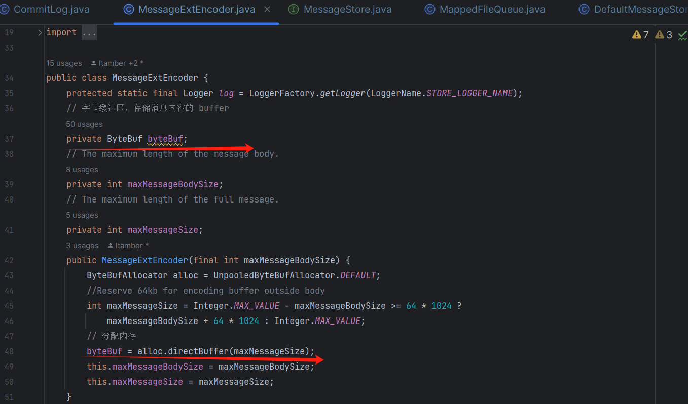

// 对消息进行编码并写入buffer

public PutMessageResult encode(MessageExtBrokerInner msgInner) {

this.byteBuf.clear();// 清空 byteBuf 对象

/\*\*

\* Serialize message

\*/

// 获取消息属性的字节数组

final byte\[\] propertiesData = msgInner.getPropertiesString() == null ?null :msgInner.getPropertiesString().getBytes(MessageDecoder.CHARSET\_UTF8);

// 计算消息属性的长度

final int propertiesLength \= propertiesData == null ?0 :propertiesData.length;

// 校验长度是否超过最大值，如果消息属性的长度超过了 Short.MAX\_VALUE，则记录警告并返回相应的 PutMessageResult

if (propertiesLength > Short.MAX\_VALUE) {

log.warn("putMessage message properties length too long.length={}",propertiesData.length);

return new PutMessageResult(PutMessageStatus.PROPERTIES\_SIZE\_EXCEEDED,null);

}

// 获取消息主题的字节数组和长度

final byte\[\] topicData = msgInner.getTopic().getBytes(MessageDecoder.CHARSET\_UTF8);

final int topicLength \= topicData.length;

// 获取消息体的长度

final int bodyLength \= msgInner.getBody() == null ?0 :msgInner.getBody().length;

// 根据消息的版本、系统标志、消息体长度、主题长度和属性长度计算消息的总长度

final int msgLen \= calMsgLength(

msgInner.getVersion(),msgInner.getSysFlag(),bodyLength,topicLength,propertiesLength);

// 是否超过最大长度限制，如果消息体的长度超过了 maxMessageBodySize，则记录警告并返回相应的 PutMessageResult

if (bodyLength > this.maxMessageBodySize) {

CommitLog.log.warn("message body size exceeded,msg total size:" + msgLen + ",msg body size:" + bodyLength + ",maxMessageSize:" + this.maxMessageBodySize);

return new PutMessageResult(PutMessageStatus.MESSAGE\_ILLEGAL,null);

}

// 获取消息在队列中的偏移量

final long queueOffset \= msgInner.getQueueOffset();

// 如果消息的总长度超过了 maxMessageSize，则记录警告并返回相应的 PutMessageResult

if (msgLen > this.maxMessageSize) {

CommitLog.log.warn("message size exceeded,msg total size:" + msgLen + ",msg body size:" + bodyLength + ",maxMessageSize:" + this.maxMessageSize);

return new PutMessageResult(PutMessageStatus.MESSAGE\_ILLEGAL,null);

}

// 1 TOTALSIZE

this.byteBuf.writeInt(msgLen);// 写入消息总长度

// 2 MAGICCODE

this.byteBuf.writeInt(msgInner.getVersion().getMagicCode());// 写入魔数

// 3 BODYCRC

this.byteBuf.writeInt(msgInner.getBodyCRC());// 写入消息体校验码

// 4 QUEUEID

this.byteBuf.writeInt(msgInner.getQueueId());// 写入队列 ID

// 5 FLAG

this.byteBuf.writeInt(msgInner.getFlag());// 写入消息的标志

// 6 QUEUEOFFSET

this.byteBuf.writeLong(queueOffset);// 写入消息在队列中的偏移量

// 7 PHYSICALOFFSET,need update later

this.byteBuf.writeLong(0);// 写入物理偏移量，稍后更新

// 8 SYSFLAG

this.byteBuf.writeInt(msgInner.getSysFlag());// 写入系统标志

// 9 BORNTIMESTAMP

this.byteBuf.writeLong(msgInner.getBornTimestamp());// 写入消息的产生时间戳

// 10 BORNHOST

ByteBuffer bornHostBytes \= msgInner.getBornHostBytes();

this.byteBuf.writeBytes(bornHostBytes.array());// 写入消息的产生主机

// 11 STORETIMESTAMP

this.byteBuf.writeLong(msgInner.getStoreTimestamp());// 写入消息的存储时间戳

// 12 STOREHOSTADDRESS

ByteBuffer storeHostBytes \= msgInner.getStoreHostBytes();

this.byteBuf.writeBytes(storeHostBytes.array());// 写入消息的存储主机地址

// 13 RECONSUMETIMES

this.byteBuf.writeInt(msgInner.getReconsumeTimes());// 写入消息的重试消费次数

// 14 Prepared Transaction Offset

this.byteBuf.writeLong(msgInner.getPreparedTransactionOffset());// 写入事务准备偏移量

// 15 BODY

this.byteBuf.writeInt(bodyLength);// 写入消息体长度

if (bodyLength > 0)

this.byteBuf.writeBytes(msgInner.getBody());// 如果消息体非空，则写入消息体内容

// 16 TOPIC

if (MessageVersion.MESSAGE\_VERSION\_V2.equals(msgInner.getVersion())) {

this.byteBuf.writeShort((short) topicLength);// 如果是消息版本 V2，则写入主题长度的短整型

} else {

this.byteBuf.writeByte((byte) topicLength);// 如果是其他消息版本，则写入主题长度的字节

}

this.byteBuf.writeBytes(topicData);// 写入消息主题内容

// 17 PROPERTIES

this.byteBuf.writeShort((short) propertiesLength);// 写入消息属性长度的短整型

if (propertiesLength > 0)

this.byteBuf.writeBytes(propertiesData);// 如果消息属性非空，则写入消息属性内容

return null;// 返回 null，不返回实际的 PutMessageResult

}

public static int calMsgLength(MessageVersion messageVersion,

int sysFlag, int bodyLength, int topicLength, int propertiesLength) {

// 计算 BORNHOST 和 STOREHOSTADDRESS 的长度

int bornhostLength \= (sysFlag & MessageSysFlag.BORNHOST\_V6\_FLAG) == 0 ? 8 : 20;

int storehostAddressLength \= (sysFlag & MessageSysFlag.STOREHOSTADDRESS\_V6\_FLAG) == 0 ? 8 : 20;

// 计算并返回消息总长度

return 4 //TOTALSIZE

\+ 4 //MAGICCODE

\+ 4 //BODYCRC

\+ 4 //QUEUEID

\+ 4 //FLAG

\+ 8 //QUEUEOFFSET

\+ 8 //PHYSICALOFFSET

\+ 4 //SYSFLAG

\+ 8 //BORNTIMESTAMP

\+ bornhostLength //BORNHOST

\+ 8 //STORETIMESTAMP

\+ storehostAddressLength //STOREHOSTADDRESS

\+ 4 //RECONSUMETIMES

\+ 8 //Prepared Transaction Offset

\+ 4 + (Math.max(bodyLength, 0)) //BODY

\+ messageVersion.getTopicLengthSize() + topicLength //TOPIC

\+ 2 + (Math.max(propertiesLength, 0)); //propertiesLength

}

1.  对消息属性数据的长度进行校验判断是否超过限定值
2.  对总消息内容长度进行校验，判断是否超过最大的长度限制
3.  根据总消息内容长度对buffer进行初始化，也就是根据消息需要的大小申请一块内存区域
4.  将消息相关信息写入buffer：
5.  写入消息长度
6.  写入 magicCode
7.  写入消息体CRC校验和
8.  写入队列ID
9.  写入标识
10.  队列的偏移量, 需要注意这里还没达到偏移量的值，先占位稍后写入
11.  文件的物理偏移量, 先占位稍后写入
12.  写入系统标识
13.  写入发送消息的时间戳
14.  写入发送消息的主机地址
15.  写入存储时间戳
16.  写入存储消息的主机地址
17.  RECONSUMETIMES
18.  Prepared Transaction Offset
19.  写入消息体长度和消息内容
20.  写入主题长度
21.  写入主题
22.  写入属性长度和属性内容

[MessageExtEncoder](http://messageextencoder%20/) 方法在消息编码时，就是将消息的一个个属性写入到一个 [ByteBuffer](http://bytebuffer%20/) 里。正常情况下 [PutMessageResult](http://putmessageresult%20/) 返回为 null，如果编码失败，比如消息默认不能超过 4 MB，超长就会认为消息非法然后返回一个 [PutMessageResult](http://putmessageresult/)，这个时候就会直接返回。

消息体结构如下图所示：

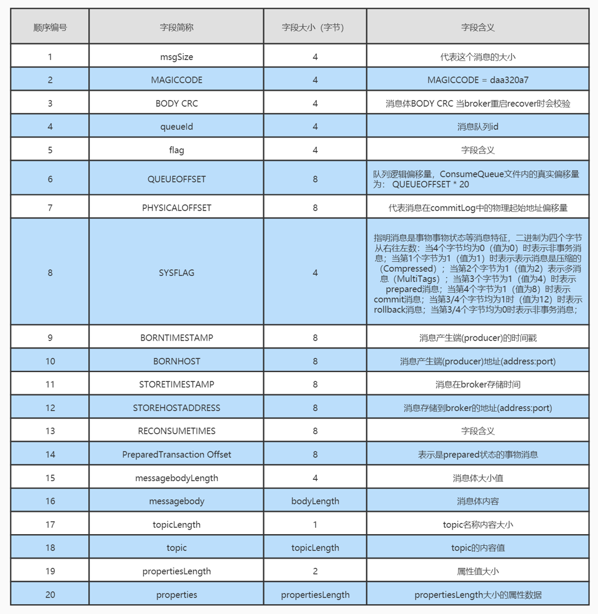

通过上图得知「**CommitLog 文件**」文件存储「**消息内存**」及「**消息总长度**」，其中消息总长度固定 「**4 字节**」。

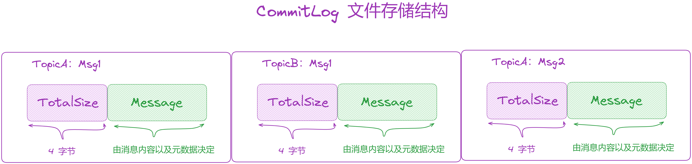

因此 RocketMQ 会保存一个物理偏移量 offSet，从「**CommitLog 文件**」中获取相关消息内容，示意图如下：

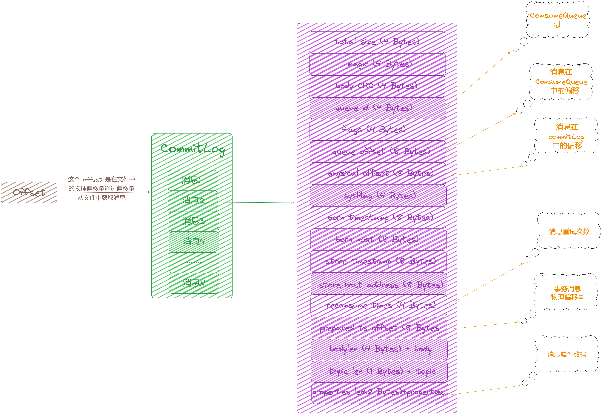

看到这里是否会有这样的疑问，消息发送的时候我们指定了 [Topic](http://topic/)，现在所有 [Topic](http://topic/) 都「**顺序写入**」到「**CommitLog 文件**」，存入的时候是「**顺序写**」，获取消息是不是比较麻烦了。

如果我要获取某个 [Topic](http://topic%20/) 的消息，需要遍历「**CommitLog 文件**」，然后根据 [Topic](http://topic/) 过滤消息。

「**CommitLog 文件**」你这个家伙，只管自己爽，其他就不管了 。那么有什么办法可以提高消息查询效率呢？

这就是下面这个文件正式亮相的时候了。

## **2.2.2 ConsumeQueue 文件**

RocketMQ 在消息存储的时候将消息「**顺序写入**」到「**CommitLog 文件**」中，如果想根据 [Topic](http://topic/) 对消息进行查找则需要扫描所有的「**CommitLog 文件**」。这种方式性能低下，因此 RocketMQ 又设计了「**ConsumeQueue 文件**」来存储消息的「**逻辑偏移量**」，offset 逻辑偏移量从 0 开始编号进行递增，消息写入「**CommitLog 文件**」以后，会构建对应的「**ConsumeQueue 文件**」。

在 RocketMQ 的存储文件目录下，有一个「**ConsumeQueue 文件夹**」，里面按 [Topic](http://topic/) 进行分组，每个 [Topic](http://topic/) 一个文件夹，[Topic](http://topic/) 文件夹内是该 [Topic](http://topic/) 的所有消息队列，以 [queueId](http://queueid%20/) 命名文件夹，每个消息队列都有自己对应的「**ConsumeQueue 文件**」。

  
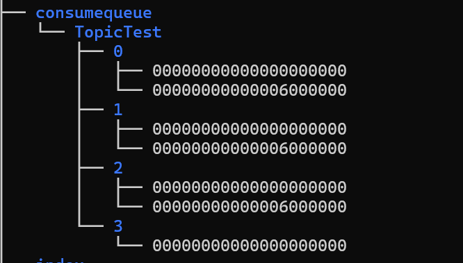

我们来看一下，消息写入的时候指定了 [Topic](http://topic/)，同时每个 [Topic](http://topic%20/) 会对应多个「**ConsumeQueue**」，通过 [queueId](http://queueid%20/) 来标识。

关键就在「**ConsumeQueue**」上，「**ConsumeQueue**」是指定 [Topic](http://topic%20/) 消息的索引文件，怎么理解呢？

「**ConsumeQueue**」文件可以看成是基于 [Topic](http://topic%20/) 的「**CommitLog**」索引文件，因此 Consumer 可以根据 「**ConsumeQueue**」来查找「**待消费**」的消息。

「**ConsumeQueue**」文件夹的组织方式如下：[topic/queue/file](http://topic/queue/file) 三层组织结构，即每个 [Topic](http://topic%20/) 下的每个 [queueId](http://queueid/)对应一个 [Consumequeue](http://consumequeue/)，其中存储了单条消息对应在「**CommitLog**」文件中的「**物理偏移量 offset**」、「**消息大小 size**」、「**消息 Tag 的 hash 值**」。具体存储路径为：[$HOME/store/consumequeue/{topic}/{queueId}/{fileName}](http://$home/store/consumequeue/%7Btopic%7D/%7BqueueId%7D/%7BfileName%7D)。

「**ConsumeQueue**」作为逻辑消息消费队列，主要作用是提高消息消费的性能，总结如下：

1.  RocketMQ 是基于 [Topic](http://topic%20/) 的订阅模式，且消息消费也是针对 [Topic](http://topic/) 进行的，所以要遍历 [Commitlog](http://commitlog%20/) 文件，再根据 [Topic](http://topic/) 检索消息是非常低效的。
2.  由于 [ConsumeQueue](http://consumequeue%20/) 文件的存在，Consumer 可以根据 [ConsumeQueue](http://consumequeue/) 来查找待消费的消息。
3.  ConsumeQueue 里只存偏移量信息，在实际情况中，大部分的 [ConsumeQueue](http://consumequeue%20/) 能够被全部读入内存，所以它的操作速度是内存读取的速度。此外为了保证 [CommitLog](http://commitlog%20/) 和 [ConsumeQueue](http://consumequeue%20/) 的一致性，在 [CommitLog](http://commitlog%20/) 里存储了消息的所有消息，包括消息内容、元数据 [ConsumeQueueId](http://consumequeueid/)、[Message Key](http://message%20key/)、[Tag](http://tag%20/) 等所有信息，即使 [ConsumeQueue](http://consumequeue%20/) 丢失，也可以通过 [CommitLog](http://commitlog%20/) 完全恢复出来。

### **2.2.2.1 消息数据结构**

如图所示，每个存储单元一共 20 个字节，分别为「**8 字节的 CommitLog 物理偏移量**」、「**4 字节的消息长度**」、「**8 字节的 Tag HashCode**」，单个文件由「**30W**」个条目组成，可以像数组一样随机访问每一个存储单元，每个「**ConsumeQueue**」文件大小约 5.72M。

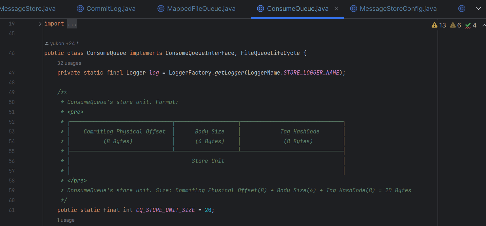

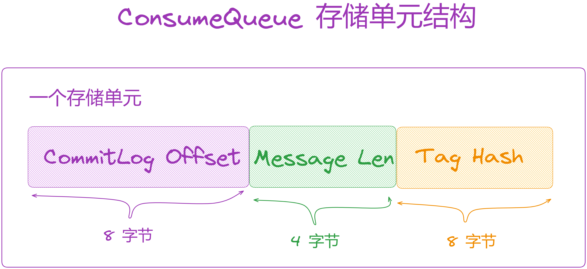

1.  消息在 [CommitLog](http://commitlog%20/) 文件的偏移量，占用8个字节。
2.  消息大小，占用 4 个字节。
3.  消息 Tag 的 hashcode 值，用于 tag 过滤，占用 8 个字节。

> 为什么 Message Tag HashCode 的值是 8 个字节，在 Java 中 hashCode 方法不是返回 int 类型 4 个字节的值吗？
> 
> 因为在延时消息中，消息第一次投递时是投递到一个系统 Topic SCHEDULE\_TOPIC\_XXXX 下的队列，等待 ScheduleMessageService 服务进行二次投递，所以 Message Tag HashCode 记录了投递时间的时间戳，Java 时间戳的数据超出 int 数据类型的数据范围 (-2^32 ~ 2^32 -1)，所以这个值需要设计成 8 个字节。

### **2.2.2.2 消息构建**

一个 [MessageQueue](http://messagequeue%20/) 对应一个 [ConsumeQueue](http://consumequeue%20/) 文件，主要的作用是记录当前 [MessageQueue](http://messagequeue%20/) 被哪些消费者组消费到了 [CommitLog](http://commitlog%20/) 中哪一条消息。

引入 [ConsumeQueue](http://consumequeue%20/) 的目的主要是「**提高消息消费的性能**」，因为消费消息是围绕 [Topic](http://topic%20/) 来进行的，如果要遍历 [CommitLog](http://commitlog%20/) 文件并根据 [Topic](http://topic%20/) 检索消息的效率是非常低的。

因此 [ConsumeQueue](http://consumequeue%20/) 文件的构建时机是当消息到达 Broker 上的 [CommitLog](http://commitlog%20/) 文件后，由「**专门的线程**」产生消息转发任务，从而构建 [ConsumeQueue](http://consumequeue%20/) 文件数据以及下小节会提到的 [IndexFile](http://indexfile%20/) 文件数据。

这里来简单看下转发任务的调用过程，会在「**消息写入**」篇章深度剖析。

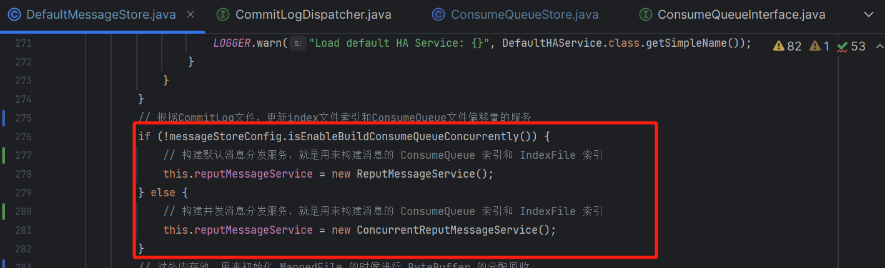

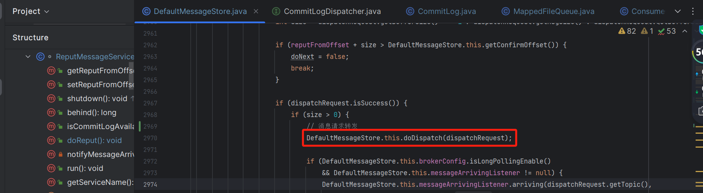

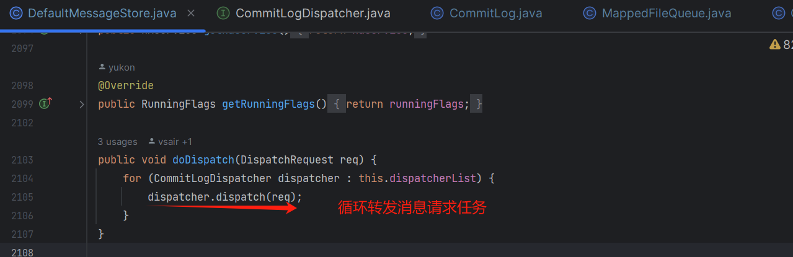

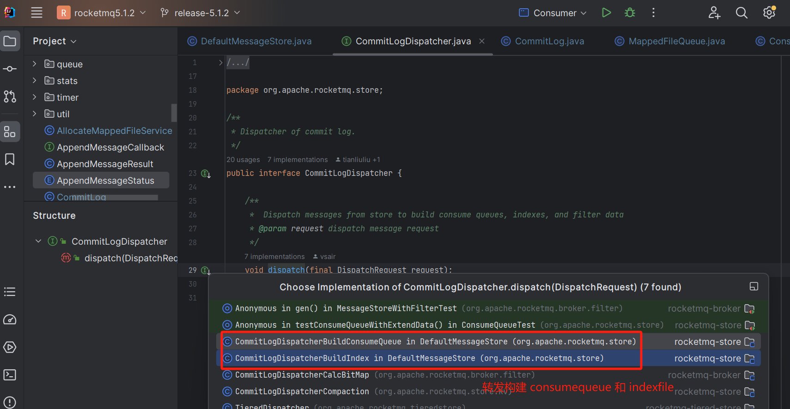

### **2.2.2.3 消费进度**

下图展示了 [ConsumeQueue](http://consumequeue/) 在 [CommitLog](http://commitlog/) 中的位置：

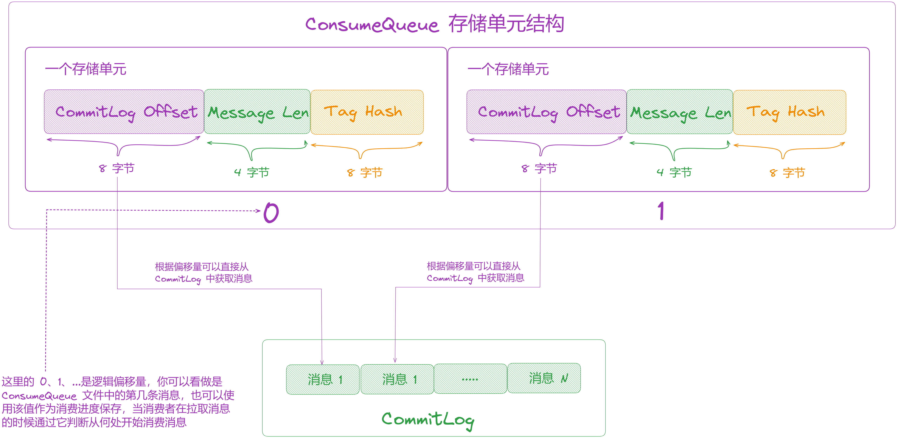

消费者在「**拉取消息**」进行消费的时候，就是通过 [ConsumeQueue](http://consumequeue/) 实现的，消费者在向 Broker 发送「**消息拉取**」请求之前，需要知道应该从「**哪条消息**」开始消费，对于「**广播模式**」，消息的消费进度保存在「**消费者本地**」，对于「**集群模式**」，消息的消费进度保存在「**Broker 端**」中，所以拉取某个消息队列的消息之前，会向Broker 发送请求，获取该消息队列的消费进度，消费进度在 RocketMQ 的存储目录中有一个对应的文件，叫[consumerOffset.json](http://consumeroffset.json/)，里面的 [offsetTable](http://offsettable/) 中保存了每个消息队列的消费进度，这个消费进度值对应的就是[ConsumeQueue](http://consumequeue%20/) 中的逻辑偏移量，它由定时任务定时进行持久化：

{

"offsetTable":{

"TopicTest@TopicTestGroup":{ // 主题名称@消费者组名称

0:0, // 每个消息队列对应的消费进度，Key 中的 0 表示队列 0，value 中的 0 表示消息在ConsumeQueue 中的逻辑偏移量

1:1,

2:1,

3:0

}

}

}

当消息写入 [CommitLog](http://commitlog/) 之后会构建对应的 [ConsumeQueue](http://consumequeue/) 文件，每个消息队列 [MessageQueue](http://messagequeue/) 都会有一个对应的 [ConsumeQueue](http://consumequeue/) 文件，[ConsumeQueue](http://consumequeue/) 文件中的 [offset](http://offset/) 记录的是「**消息的逻辑索引**」，从 0 开始编号进行递增，比如此时存入了 10 条消息，那么对应的 [offset](http://offset/) 分别为 0、1、2、3、4、5、6、7、8、9。

消费者消费完毕之后，会保存这个「**消费进度**」，对于「**集群模式**」，消费进度会保存在「**Broker 端**」，Broker会定时将「**消费进度**」进行持久化，如果消费者刚启动的时候，会向 Broker 发起请求获取之前记录的「**消费进度**」。

当拿到「**消费队列**」对应的「**消费进度**」即 [offset](http://offset/) 时，就可以根据 [offset](http://offset/) 从 Broker 拉取消息，Broker 收到请求后会根据这个值从 [ConsumeQueue](http://consumequeue/) 文件获取数据，里面记录了消息在 [CommitLog](http://commitlog/) 文件中的物理偏移量，根据物理偏移量再从 [CommitLog](http://commitlog/) 中获取消息内容返回给消费者。

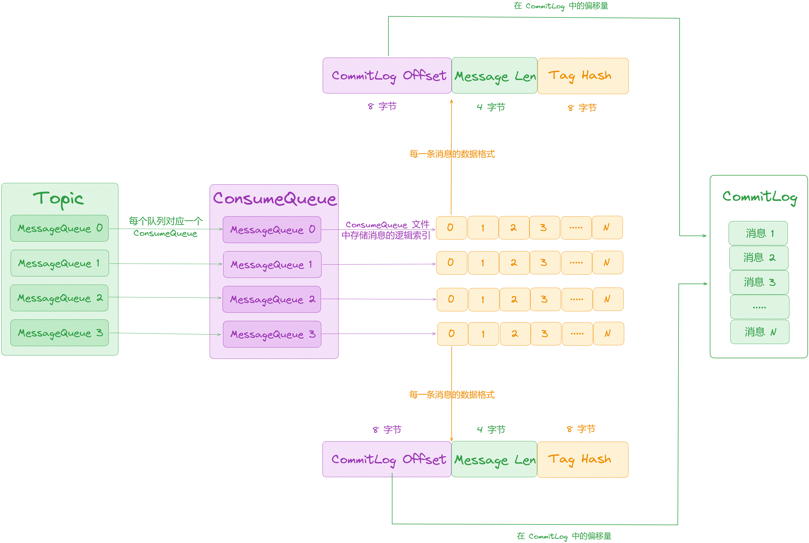

## **2.2.3 IndexFile 文件**

除了上面两大重要核心文件外，RocketMQ 还设计了「**IndexFile**」文件，「**IndexFile**」文件和消息的流转过程关系不大，主要是提供一种可以通过 key 或时间区间来的高效查询消息方法，提高检索消息的速度。

在发送消息的时候可以设置一个唯一 Key 值，用于标识这条消息，之后就可以根据这个 Key 值对消息进行查找。

它的存在主要是针对在客户端（生产者和消费者）和控制台接口提供了根据 key 查询消息的实现，为了方便用户查询具体某条消息。

「**IndexFile**」索引文件其底层实现为 hash 索引，类似于 Java 中的 [HashMap](http://hashmap/)，计算 Key 的 [hashcode](http://hashcode/)，然后对 [hashcode](http://hashcode%20/) 取余得到 [hash 槽](http://xn--hash%20-1m0p/)。所以它的结构是 [Hash 槽](http://xn--hash%20-1m0p/)与 [Hash 冲突](http://xn--hash%20-k09k5641a/)的链表结构，但是具体落地时会把每个 slot 槽挂载的 index 索引单元都存放到 [indexes](http://indexes%20/) 区中。

总结：

1.  Index文件的存储位置是：[$HOME\\store\\index\\${fileName}](http://%24HOME%5Cstore%5Cindex%5C%24%7BfileName%7D)，文件名 fileName 是以创建时的时间戳命名的。
2.  固定的单个 [IndexFile](http://indexfile/) 文件最大约为 400M，一个 [IndexFile](http://indexfile/) 可以保存 2000W个索引。
3.  [IndexFile](http://indexfile%20/) 的底层存储设计为在文件系统中实现 [HashMap](http://hashmap%20/) 结构，所以 RocketMQ 的索引文件其底层实现为hash 索引。

####   
通过 key 查找消息过程如下：

1.  通过传入的查询时间来确定查询哪一个 [IndexFile](http://indexfile/)，因为 [IndexFile](http://indexfile%20/) 使用时间戳来命名，存储够 2000W 个索引单元就自动创建新的索引文件。
2.  计算 key 的 hash 值位于 50W 个 [hash slot](http://hash%20slot%20/) 中哪一个位置，key 的 hash % 50W。
3.  每一个 [hash slot](http://hash%20slot/) 都有一个 [indexNo](http://indexno/)，指向链表中最新的一个索引单元。
4.  遍历索引项链表返回查询时间范围内的结果集。
5.  取其中的 [PhyOffset](http://phyoffset%20/) 去 [CommitLog](http://commitlog%20/) 查询具体的消息。

###   
**2.2.3.1 消息数据结构**

如图所示，每个「**IndexFile**」文件的大小是固定的，一个「**IndexFile**」文件大约可以保存「**2000w**」个消息的索引，「**IndexFile**」的索引文件结构如下：

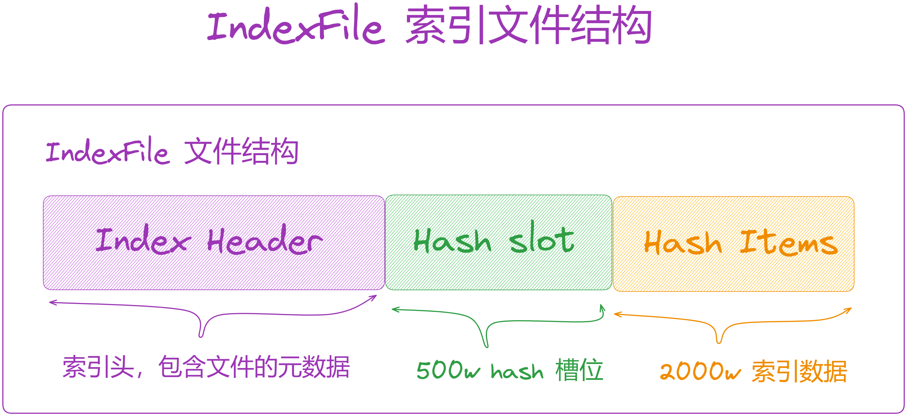

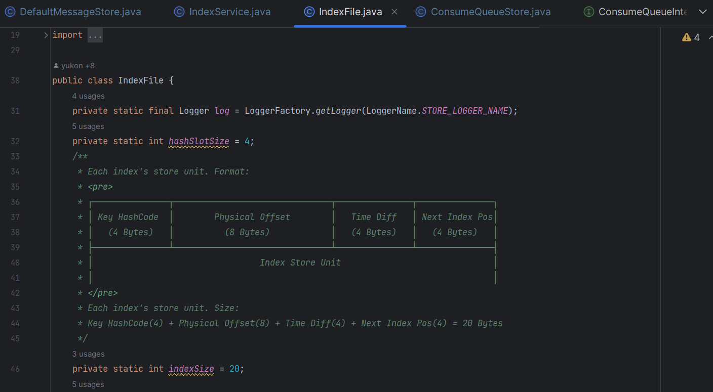

### **IndexHeader 数据结构**

「**IndexHeader**」记录「**IndexFile**」文件的整体信息，总共占 40 个字节，有以下信息：

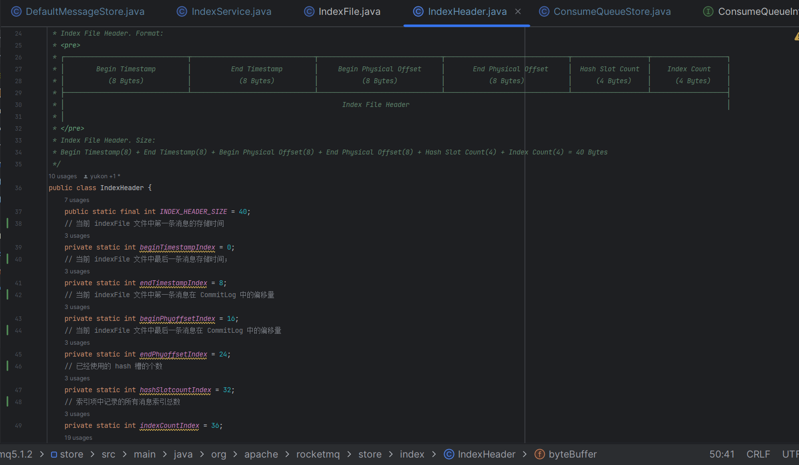

1.  [beginTimestampIndex](http://begintimestampindex/)：当前 [indexFile](http://indexfile%20/) 文件中第一条消息的存储时间。
2.  [endTimestampIndex](http://endtimestampindex/)：当前 [indexFile](http://indexfile/) 文件中最后一条消息存储时间。
3.  [beginPhyoffsetIndex](http://beginphyoffsetindex/)：当前 [indexFile](http://indexfile/) 文件中第一条消息在 [CommitLog](http://commitlog%20/) 中的偏移量。
4.  [endPhyoffsetIndex](http://endphyoffsetindex/)：当前 [indexFile](http://indexfile/) 文件中最后一条消息在 [CommitLog](http://commitlog/) 中的偏移量。
5.  [hashSlotCountIndex](http://hashslotcountindex/)：已经使用的 hash 槽的个数。
6.  [indexCountIndex](http://indexcountindex/)：索引项中记录的所有消息索引总数。

  

### **Hash Slot 数据结构**

RocketMQ 在每个「**IndexFile**」文件中划分了「**500w**」个 hash 槽，在向文件中添加「**消息索引**」的时候，会取出消息的 Key 计算 hash 值，然后对 hash 槽总数取余，来判断应该放到哪个 hash 槽。

> 实际会使用 Topic + "#" + key 进行拼装做为 IndexFile 文件的 Key。

###   
**Index Item 数据结构**

索引项中记录每个 Key 的索引信息，其索引单元结构如下：

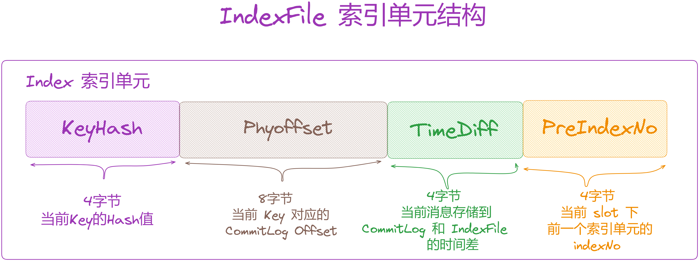

1.  [keyHash](http://keyhash/)：消息的 key 计算出来的的 [hashcode](http://hashcode/) 值。
2.  [phyOffset](http://phyoffset/)：消息在 [CommitLog](http://commitlog/) 中的物理偏移量。
3.  [timeDiff](http://timediff/)：消息的存储时间减去 [IndexHeader](http://indexheader/) 中的 [beginTimestamp](http://begintimestamp/)，当前 [indexFile](http://indexfile/) 文件中第一条消息的存储时间。
4.  [preIndexNo](http://preindexno/)：当哈希冲突的时候，用于指向上一个索引，可以看做当哈希冲突的时候，使用一个链表将该哈希槽下的所有元素串起来，使用头插法增加新的元素。

### **2.2.3.2 消息索引添加过程**

这里举个例子，比如现在有一条消息 Key 值 1，假设哈希槽的个数为 10，这里对哈希计算简化，直接用 1 对哈希槽个数取余，得到值为 0，那么这条消息将落入哈希槽 0 的位置，然后会在索引项区域建立该消息的索引信息：

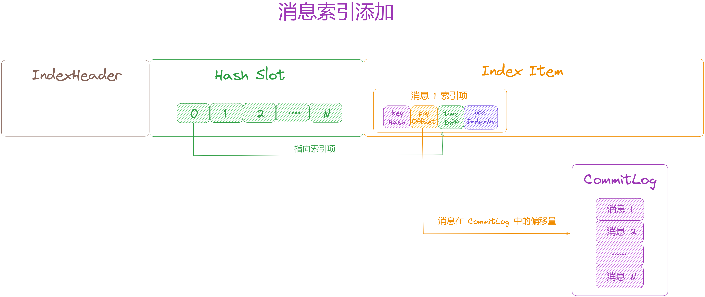

如果新增一条消息 2，它的 Key 值为 2，用 2 对哈希槽个数取余，依旧得到哈希槽 0，此时产生「**哈希冲突**」，将哈希槽 0 处存储的值改为消息 2 的索引项，并将消息 2 索引项中的 [preIndexNo](http://preindexno/) 指向消息 1 的索引项，形成一个链表：

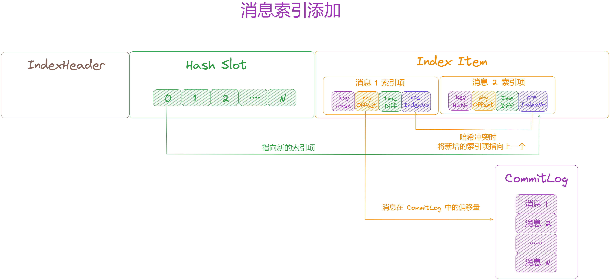

## **03 总结**

通过本文，我们了解到 RocketMQ 采用的是「**混合型存储结构**」。

在 Broker 单个实例下所有的队列共用一个日志数据文件「**CommitLog**」来存储，即多个 [Topic](http://topic/) 的消息实体内容都存储于一个「**CommitLog**」文件中。

针对 [Producer](http://producer%20/) 和 [Consumer](http://consumer/) 采用了「**数据**」和「**索引**」部分相分离的存储结构：

当 [Producer](http://producer%20/) 发送消息至 [Broker](http://broker/) 端后，[Broker](http://broker/) 端使用「**同步**」或者「**异步**」的方式对消息「**刷盘持久化**」，保存至「**CommitLog**」文件中。

在 [Broker](http://broker/) 端启动一个后台服务线程 [ReputMessageService](http://reputmessageservice/) 不停地分发请求并异步构建「**ConsumeQueue 逻辑消费队列文件**」和「**IndexFile 索引文件**」数据。

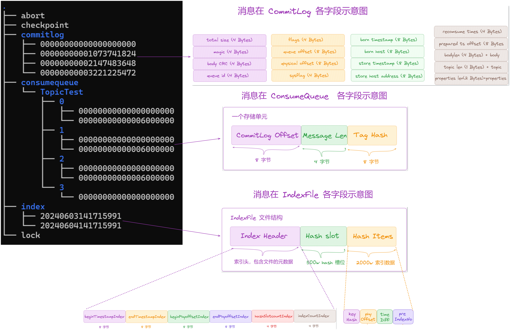

消息存储过程如下：

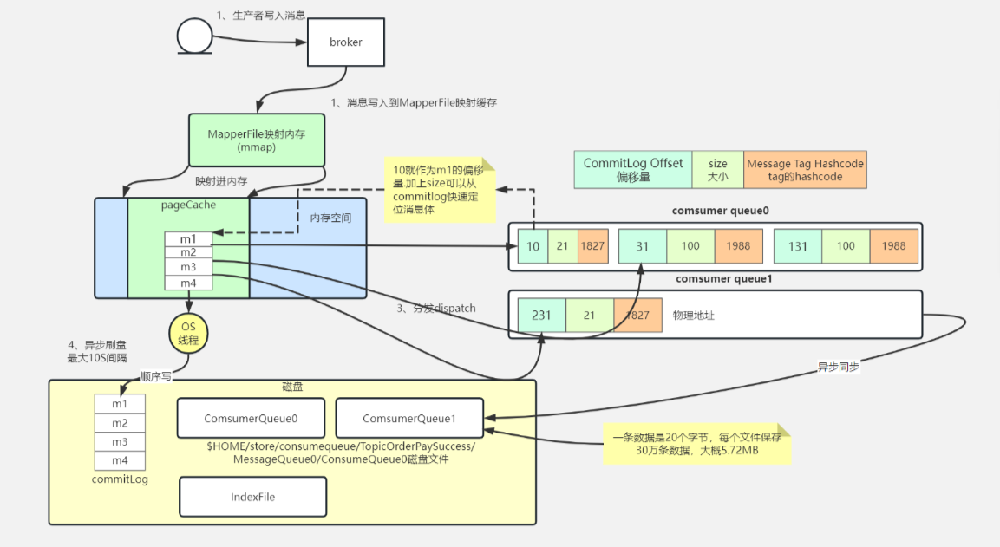