大家好，我是**华仔**, 又跟大家见面了。

从今天开始我将继续为大家奉上 RocketMQ 消费者源码剖析系列文章，正式开启「**RocketMQ 的服务端 Broker 源码之旅**」，这是第十六篇，本篇我们将以「**RocketMQ 5.1.2**」版本为主，来剖析下 RocketMQ 源码之 Broker 端 MessageStore 存储架构设计剖析。

这里我将以「**RocketMQ 5.1.2**」版本为主，通过「**场景驱动**」的方式带大家一点点的对 RocketMQ 源码进行深度剖析，正式开启「**RocketMQ 的源码之旅**」，跟我一起来掌握 RocketMQ 源码核心架构设计思想吧。

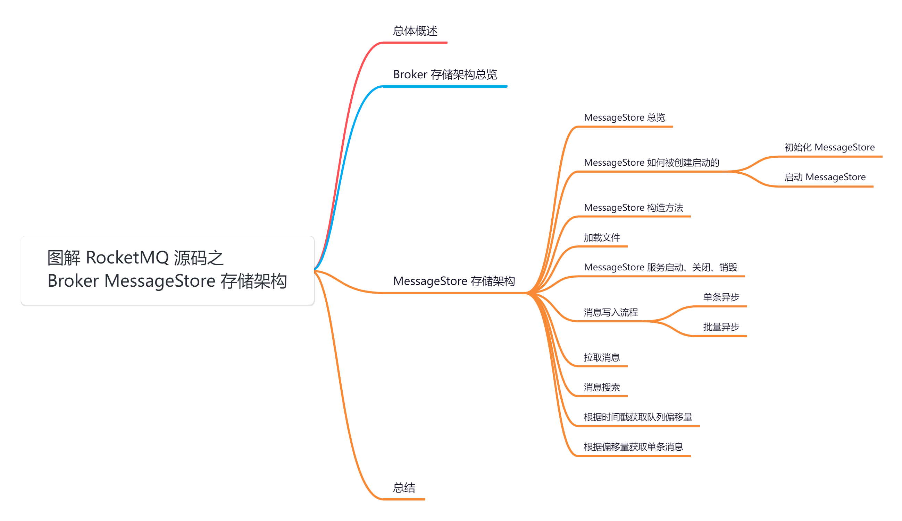

##   
**01 总体概述**

在 [【Broker端源码分析系列第十五篇】图解 RocketMQ 源码之 Broker 心跳机制和接收数据流程剖析](https://articles.zsxq.com/id_f6x7p8pral0c.html) 上篇中，我们深度剖析了 Broker 端接收消息的处理流程。

通过 [sendMessageProcessor](http://sendmessageprocessor/) 处理器来进行消息的处理，最后会调用 [MessageStore](http://messagestore%20/) 存储组件进行消息的存储，那么今天我们就来深度剖析下这个组件。

## **02 Broker 存储架构总览**

这里先给一张 Broker 模块从收到消息到返回响应业务流转过程的架构图。

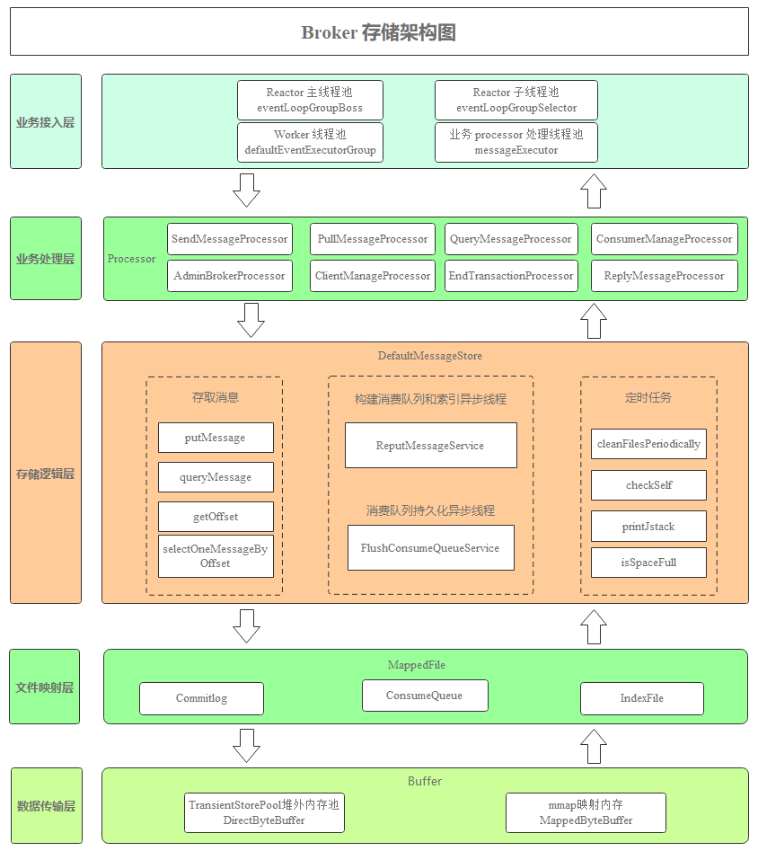

（图片来自网络，这张图对于当前版本来说会有些变化，不过大体还是一致的）

流程如下：

1.  **业务接入层**：RocketMQ 基于 Netty 的 Reactor 多线程模型实现了底层通信。Reactor 主线程池 [eventLoopGroupBoss](http://eventloopgroupboss%20/) 负责创建 TCP 连接，默认只有一个线程。连接建立后，再丢给 Reactor 子线程池 [eventLoopGroupSelector](http://eventloopgroupselector%20/) 进行读写事件的处理。
2.  [defaultEventExecutorGroup](http://defaulteventexecutorgroup%20/) 负责 SSL 验证、编解码、空闲检查、网络连接管理。然后根据 [RomotingCommand](http://romotingcommand%20/) 的业务请求码 code 去 [processorTable](http://processortable%20/) 这个本地缓存变量中找到对应的 processor，封装成 task 任务后，提交给对应的业务 processor 处理线程池来执行。Broker 模块通过这四级线程池提升系统吞吐量。
3.  **业务处理层**：处理各种通过 RPC 调用过来的业务请求，其中：
4.  [SendMessageProcessor](http://sendmessageprocessor%20/) 负责处理 Producer 发送消息的请求。
5.  [PullMessageProcessor](http://pullmessageprocessor%20/) 负责处理 Consumer 消费消息的请求。
6.  [QueryMessageProcessor](http://querymessageprocessor%20/) 负责处理按照消息 Key 等查询消息的请求。
7.  **存储逻辑层**：[DefaultMessageStore](http://defaultmessagestore%20/) 是 RocketMQ 的存储逻辑核心类，提供消息存储、读取、删除等能力。
8.  **文件映射层**：把 [Commitlog](http://commitlog/)、[ConsumeQueue](http://consumequeue/)、[IndexFile](http://indexfile%20/) 文件映射为存储对象 [MappedFile](http://mappedfile/)。
9.  **数据传输层**：支持基于 [mmap](http://mmap%20/) 内存映射进行读写消息，同时也支持基于 [mmap](http://mmap%20/) 进行读取消息、堆外内存写入消息的方式进行读写消息。

## **03 MessageStore 存储架构**

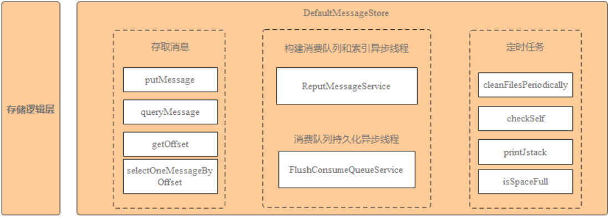

接下来会按照这个图来分别介绍和剖析。

## **3.1 MessageStore 总览**

源码位置：[https://github.com/apache/rocketmq/blob/release-5.1.2/](https://github.com/apache/rocketmq/blob/release-5.1.2/store/src/main/java/org/apache/rocketmq/store/DefaultMessageStore.java)[store](https://github.com/apache/rocketmq/blob/release-5.1.2/store/src/main/java/org/apache/rocketmq/store/DefaultMessageStore.java)[/src/main/java/org/apache/rocketmq/](https://github.com/apache/rocketmq/blob/release-5.1.2/store/src/main/java/org/apache/rocketmq/store/DefaultMessageStore.java)[store](https://github.com/apache/rocketmq/blob/release-5.1.2/store/src/main/java/org/apache/rocketmq/store/DefaultMessageStore.java)[/](https://github.com/apache/rocketmq/blob/release-5.1.2/store/src/main/java/org/apache/rocketmq/store/DefaultMessageStore.java)[DefaultMessageStore](https://github.com/apache/rocketmq/blob/release-5.1.2/store/src/main/java/org/apache/rocketmq/store/DefaultMessageStore.java)[.java](https://github.com/apache/rocketmq/blob/release-5.1.2/store/src/main/java/org/apache/rocketmq/store/DefaultMessageStore.java)

Broker 端是通过 [MessageStore](http://messagestore/) 来存储、读取消息的， [MessageStore](http://messagestore%20/) 主要提供了「**写入消息**」、「**读取消息**」、「**读取消息偏移量**」等相关的接口。

public interface MessageStore {

/\*\*

\* Load previously stored messages.

\* 加载已存储的数据

\* @return true if success; false otherwise.

\*/

boolean load();

/\*\*

\* Launch this message store.

\* 启动存储服务

\* @throws Exception if there is any error.

\*/

void start() throws Exception;

/\*\*

\* Shutdown this message store.

\* 关闭存储服务

\*/

void shutdown();

/\*\*

\* Destroy this message store. Generally, all persistent files should be removed after invocation.

\* 销毁存储服务

\*/

void destroy();

/\*\*

\* Store a message into store in async manner, the processor can process the next request rather than wait for

\* result when result is completed, notify the client in async manner

\* 异步将消息写入存储

\* @param msg MessageInstance to store

\* @return a CompletableFuture for the result of store operation

\*/

default CompletableFuture<PutMessageResult> asyncPutMessage(final MessageExtBrokerInner msg) {

return CompletableFuture.completedFuture(putMessage(msg));

}

/\*\*

\* Store a batch of messages in async manner

\* 异步批量写入消息

\* @param messageExtBatch the message batch

\* @return a CompletableFuture for the result of store operation

\*/

default CompletableFuture<PutMessageResult> asyncPutMessages(final MessageExtBatch messageExtBatch) {

return CompletableFuture.completedFuture(putMessages(messageExtBatch));

}

/\*\*

\* Store a message into store.

\* 同步写入消息

\* @param msg Message instance to store

\* @return result of store operation.

\*/

PutMessageResult putMessage(final MessageExtBrokerInner msg);

/\*\*

\* Store a batch of messages.

\* 同步批量写入消息

\* @param messageExtBatch Message batch.

\* @return result of storing batch messages.

\*/

PutMessageResult putMessages(final MessageExtBatch messageExtBatch);

/\*\*

\* Query at most <code>maxMsgNums</code> messages belonging to <code>topic</code> at <code>queueId</code> starting

\* from given <code>offset</code>. Resulting messages will further be screened using provided message filter.

\* 查询消息

\* @param group Consumer group that launches this query.

\* @param topic Topic to query.

\* @param queueId Queue ID to query.

\* @param offset Logical offset to start from.

\* @param maxMsgNums Maximum count of messages to query.

\* @param messageFilter Message filter used to screen desired messages.

\* @return Matched messages.

\*/

GetMessageResult getMessage(final String group, final String topic, final int queueId,

final long offset, final int maxMsgNums, final MessageFilter messageFilter);

/\*\*

\* Asynchronous get message

\* @see #getMessage(String, String, int, long, int, MessageFilter) getMessage

\* 获取消息队列最大偏移量

\* @param group Consumer group that launches this query.

\* @param topic Topic to query.

\* @param queueId Queue ID to query.

\* @param offset Logical offset to start from.

\* @param maxMsgNums Maximum count of messages to query.

\* @param messageFilter Message filter used to screen desired messages.

\* @return Matched messages.

\*/

CompletableFuture<GetMessageResult> getMessageAsync(final String group, final String topic, final int queueId,

final long offset, final int maxMsgNums, final MessageFilter messageFilter);

....

/\*\*

\* Look up the message by given commit log offset.

\* 通过偏移量读取一条消息

\* @param commitLogOffset physical offset.

\* @return Message whose physical offset is as specified.

\*/

MessageExt lookMessageByOffset(final long commitLogOffset);

....

}

[MessageStore](http://messagestore%20/) 接口的实现类是 [DefaultMessageStore](http://defaultmessagestore/)，它是消息存储的具体实现类，处理逻辑非常复杂，有以下几个组件：

1.  消息存储 [CommitLog](http://commitlog/)。
2.  磁盘文件映射 [MappedFile](http://mappedfile/)。
3.  消费队列 [ConsumeQueue](http://consumequeue/)。
4.  消息检索 [IndexService](http://indexservice/)。

该类源码特别长，3000多行的构成 RocketMQ 最核心最底层的存储实现类。

[DefaultMessageStore](http://defaultmessagestore/) 是 RocketMQ 底层存储对外层提供服务的窗口，它通过组织 [CommitLog](http://commitlog/)、[ConsumeQueue](http://consumequeue/)、[IndexFile](http://indexfile/) 来完成 RocketMQ 存储的核心功能。

核心方法如下：

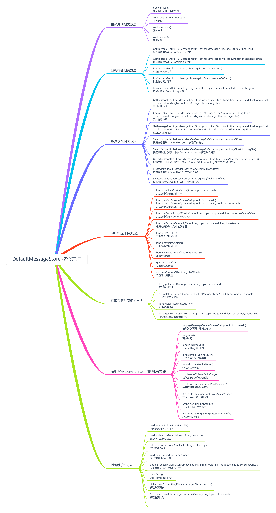

/\*\*

\* DefaultMessageStore 消息存储组件

\*/

public class DefaultMessageStore implements MessageStore {

private static final Logger LOGGER \= LoggerFactory.getLogger(LoggerName.STORE\_LOGGER\_NAME);

public final PerfCounter.Ticks perfs \= new PerfCounter.Ticks(LOGGER);

// 消息存储组件配置

private final MessageStoreConfig messageStoreConfig;

// CommitLog 磁盘数据存储结构，是存储实现类

private final CommitLog commitLog;

// ConsumeQueue 存储组件

private final ConsumeQueueStore consumeQueueStore;

// 消费队列 ConsumeQueue 刷磁盘线程

private final FlushConsumeQueueService flushConsumeQueueService;

// 清理 CommitLog 组件

private final CleanCommitLogService cleanCommitLogService;

// 清除 ConsumeQueue 文件组件

private final CleanConsumeQueueService cleanConsumeQueueService;

private final CorrectLogicOffsetService correctLogicOffsetService;

// 索引服务

private final IndexService indexService;

// 分配 MappedFile 映射文件服务组件（把磁盘文件里的数据映射到内存中来，高性能高并发实现的核心技术）

private final AllocateMappedFileService allocateMappedFileService;

// 消息重新投递线程

private ReputMessageService reputMessageService;

// HA 高可用组件

private HAService haService;

// CompactionLog

private CompactionStore compactionStore;

private CompactionService compactionService;

// 存储统计组件

private final StoreStatsService storeStatsService;

// 临时存储池化组件 消息堆内缓存

private final TransientStorePool transientStorePool;

// 运行状态标识组件

private final RunningFlags runningFlags \= new RunningFlags();

// 系统时钟组件

private final SystemClock systemClock \= new SystemClock();

// 消息调度组件

private final ScheduledExecutorService scheduledExecutorService;

// Broker 统计器

private final BrokerStatsManager brokerStatsManager;

// 消息到达监听器

private final MessageArrivingListener messageArrivingListener;

// Broker 配置

private final BrokerConfig brokerConfig;

// 是否关闭标识

private volatile boolean shutdown \= true;

// 消息存储刷盘检查点组件

private StoreCheckpoint storeCheckpoint;

// 定时消息/延时消息存储

private TimerMessageStore timerMessageStore;

// CommitLog 文件转发器组件

private final LinkedList<CommitLogDispatcher> dispatcherList;

// 随机访问锁文件

private RandomAccessFile lockFile;

// 文件锁

private FileLock lock;

// 是否正常正常关闭标识

boolean shutDownNormal \= false;

// Max pull msg size

private final static int MAX\_PULL\_MSG\_SIZE \= 128 \* 1024 \* 1024;

// 可用复制节点数

private volatile int aliveReplicasNum \= 1;

// Refer the MessageStore of MasterBroker in the same process.

// If current broker is master, this reference point to null or itself.

// If current broker is slave, this reference point to the store of master broker, and the two stores belong to

// different broker groups.

private MessageStore masterStoreInProcess \= null;

// master 节点已刷新偏移量

private volatile long masterFlushedOffset \= -1L;

// broker 节点初始化最大偏移量

private volatile long brokerInitMaxOffset \= -1L;

// 写入消息 hook 列表

protected List<PutMessageHook> putMessageHookList = new ArrayList<>();

// 发送消息返回 hook

private SendMessageBackHook sendMessageBackHook;

// 延迟消息等级缓存表，最大容量 32

private final ConcurrentMap<Integer /\* level \*/, Long/\* delay timeMillis \*/\> delayLevelTable =

new ConcurrentHashMap<>(32);

// 最大延迟等级标识

private int maxDelayLevel;

// 计算映射页的保持数量

private final AtomicInteger mappedPageHoldCount \= new AtomicInteger(0);

// 并发安全的队列，用于批量调度请求

private final ConcurrentLinkedQueue<BatchDispatchRequest> batchDispatchRequestQueue = new ConcurrentLinkedQueue<>();

// 调度请求有序队列的大小

private int dispatchRequestOrderlyQueueSize \= 16;

// 调度请求有序队列

private final DispatchRequestOrderlyQueue dispatchRequestOrderlyQueue \= new DispatchRequestOrderlyQueue(dispatchRequestOrderlyQueueSize);

// 状态机版本号

private long stateMachineVersion \= 0L;

// this is a unmodifiableMap

// 不可修改的并发缓存表，用于存储主题配置

private ConcurrentMap<String, TopicConfig> topicConfigTable;

// 调度清理队列的定时执行器服务

private final ScheduledExecutorService scheduledCleanQueueExecutorService =

Executors.newSingleThreadScheduledExecutor(new ThreadFactoryImpl("StoreCleanQueueScheduledThread"));

....

}

[DefaultMessageStore](http://defaultmessagestore%20/) 存储依赖三类文件：[CommitLog](http://commitlog/)、[ConsumeQueue](http://consumequeue/)、[IndexFile](http://indexfile/) 三大底层文件。

其中一个 [DefaultMessageStore](http://defaultmessagestore/) 持有一个 [CommitLog](http://commitlog/) 对象。

[ConsumeQueue](http://consumequeue/) 是以一个 Map 嵌套 Map 组织的，每个 topic 下的每个 queue 都对应一个 [ConsumeQueue](http://consumequeue/)，用来索引该 Queue 下消息在 [CommitLog](http://commitlog%20/) 中的位置。

[IndexFile](http://indexfile%20/) 是由 [IndexService](http://indexservice%20/) 提供服务的，[IndexService](http://indexservice/) 持有一个 [IndexFile](http://indexfile/) 的 [List](http://list/)。

关于这三大底层文件可以查看：[【Broker端源码分析系列第十八篇】图解 RocketMQ 源码之 Broker 端三大底层存储文件剖析](https://articles.zsxq.com/id_nwm33ku2srs5.html)

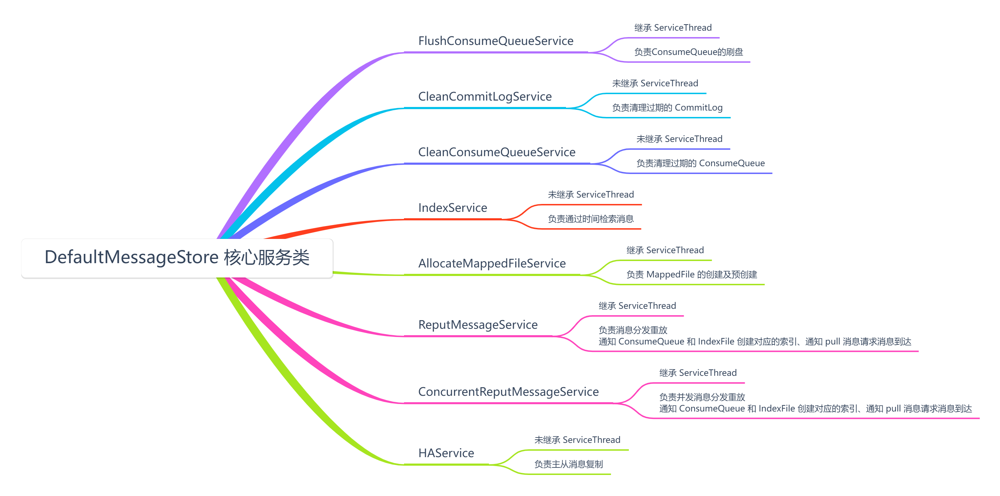

[DefaultMessageStore](http://defaultmessagestore/) 进入正常工作之前，需要经过「**创建对象**」、「**load**」、「**start**」这三个步骤。

## **3.2 MessageStore 如何被创建启动的**

通过前面文章的剖析，我们得知在 [BrokerStartup](http://brokerstartup/) 中创建了 [BrokerController](http://brokercontroller/)，[BrokerController](http://brokercontroller/) 在其初始化方法中创建了 [DefaultMessageStore](http://defaultmessagestore/)，然后调用其 [load()](http://load\(\)/) 方法加载磁盘文件数据。之后 [BrokerStartup](http://brokerstartup/) 启动 [BrokerController](http://brokercontroller/)，在 [BrokerController](http://brokercontroller/) 的启动方法中，又启动了 [DefaultMessageStore](http://defaultmessagestore/)，调用 [start()](http://start\(\)/) 方法启动了消息存储相关的组件。

### **3.2.1 初始化 MessageStore**

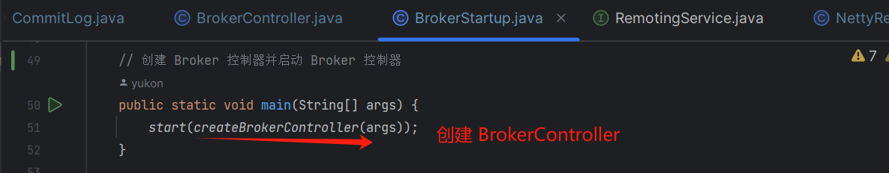

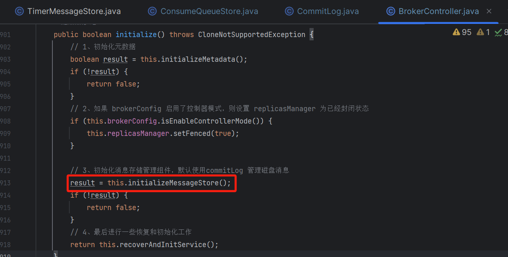

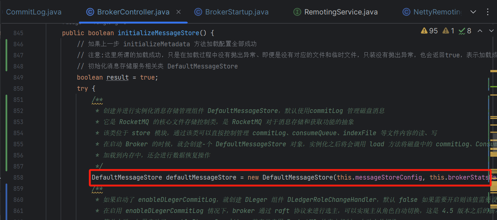

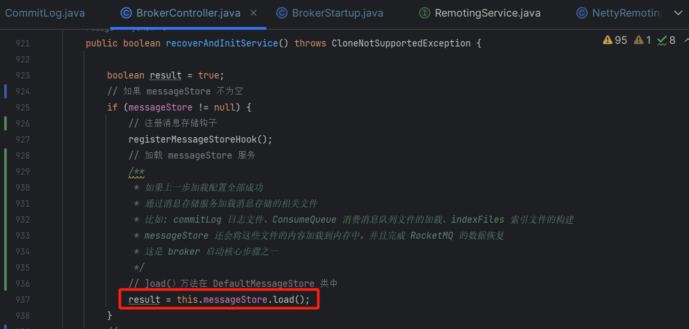

### **3.2.2 启动 MessageStore**

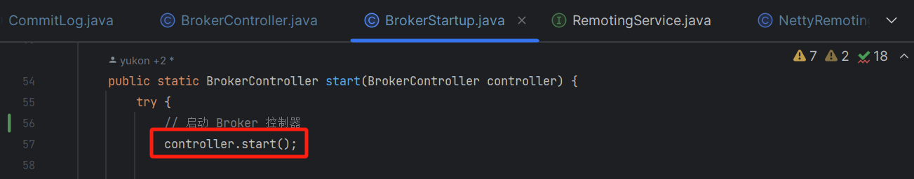

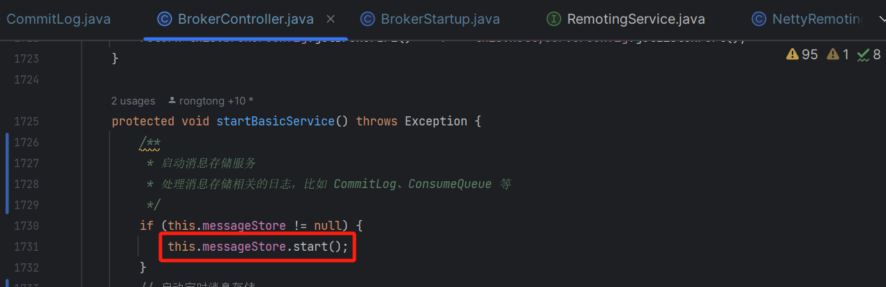

关于启动 [MessageStore](http://messagestore/) 各类组件我们会在下面小节进行剖析。

## **3.3 MessageStore 构造方法**

public DefaultMessageStore(final MessageStoreConfig messageStoreConfig, final BrokerStatsManager brokerStatsManager,

final MessageArrivingListener messageArrivingListener, final BrokerConfig brokerConfig, final ConcurrentMap<String, TopicConfig> topicConfigTable) throws IOException {

// 通过构造器传递一些配置对象

// 消息送达的监听器，生产者消息到达时通过该监听器触发 pullRequestHoldservice，通知 pullRequestHoldservice

this.messageArrivingListener = messageArrivingListener;

// broker 的配置类，包含 broker 的各种配置，例如 ROCKTEMQ\_HOME 等

this.brokerConfig = brokerConfig;

// broker的消息存储配置，例如各种文件的大小等

this.messageStoreConfig = messageStoreConfig;

// 获取活动副本数

this.aliveReplicasNum = messageStoreConfig.getTotalReplicas();

// broker 的统计管理器，保存 broker 运行时状态，统计工作

this.brokerStatsManager = brokerStatsManager;

this.topicConfigTable = topicConfigTable;

// 创建分配 MappedFile 文件的服务对象，用于初始化MappedFile和预热MappedFile

this.allocateMappedFileService = new AllocateMappedFileService(this);

// 是否支持使用 DLedger 技术来管理 CommitLog

// 实例化 CommitLog,DLedgerCommitLog表示支持主从自动切换功能，默认是 false

// 默认类型是 CommitLog 类型

if (messageStoreConfig.isEnableDLegerCommitLog()) {

// 创建 DLedgerCommitLog 对象

this.commitLog = new DLedgerCommitLog(this);

} else {

// 创建 CommitLog 对象

this.commitLog = new CommitLog(this);

}

// ConsumeQueue 存储队列服务

this.consumeQueueStore = new ConsumeQueueStore(this, this.messageStoreConfig);

// ConsumeQueue 文件的刷盘线程服务

this.flushConsumeQueueService = new FlushConsumeQueueService();

// 清理过期的 CommitLog 服务

this.cleanCommitLogService = new CleanCommitLogService();

// 清理 ConsumeQueue 文件服务

this.cleanConsumeQueueService = new CleanConsumeQueueService();

// 校正逻辑偏移服务

this.correctLogicOffsetService = new CorrectLogicOffsetService();

// 存储一些统计指标信息的服务

this.storeStatsService = new StoreStatsService(getBrokerIdentity());

// 创建 IndexFile 索引文件服务，根据消息 key 来构建索引

this.indexService = new IndexService(this);

// DLedgerCommitLog 表示支持主从自动切换功能，默认是false，isDuplicationEnable 表示是否重复复制功能，默认是 false

if (!messageStoreConfig.isEnableDLegerCommitLog() && !this.messageStoreConfig.isDuplicationEnable()) {

// 是否启动控制器模式，支持自动切换代理的角色。默认是false

if (brokerConfig.isEnableControllerMode()) {

// 创建 HA 自动切换高可用服务，用来做数据同步

this.haService = new AutoSwitchHAService();

LOGGER.warn("Load AutoSwitch HA Service: {}", AutoSwitchHAService.class.getSimpleName());

} else {

// 创建 HA 服务

this.haService = ServiceProvider.loadClass(HAService.class);

if (null == this.haService) {

// 创建高可用服务，用来做数据同步

this.haService = new DefaultHAService();

LOGGER.warn("Load default HA Service: {}", DefaultHAService.class.getSimpleName());

}

}

}

// 根据CommitLog文件，更新index文件索引和ConsumeQueue文件偏移量的服务

if (!messageStoreConfig.isEnableBuildConsumeQueueConcurrently()) {

// 构建默认消息分发服务，就是用来构建消息的 ConsumeQueue 索引和 IndexFile 索引

this.reputMessageService = new ReputMessageService();

} else {

// 构建并发消息分发服务，就是用来构建消息的 ConsumeQueue 索引和 IndexFile 索引

this.reputMessageService = new ConcurrentReputMessageService();

}

// 对外内存池，用来初始化 MappedFile 的时候进行 ByteBuffer 的分配回收

this.transientStorePool = new TransientStorePool(this);

// 消息调度组件

this.scheduledExecutorService =

Executors.newSingleThreadScheduledExecutor(new ThreadFactoryImpl("StoreScheduledThread", getBrokerIdentity()));

// 设置消息分发服务列表组件，分别是构建 ConsumeQueue 索引和 IndexFile 索引，监听CommitLog文件中的新消息存储，然后会调用列表中的CommitLogDispatcher#dispatch方法

this.dispatcherList = new LinkedList<>();

// 通知 ConsumeQueue 的 Dispatcher,可用于更新 ConsumeQueue 的偏移量等信息

this.dispatcherList.addLast(new CommitLogDispatcherBuildConsumeQueue());

// 通知 IndexFie 的 Dispatcher,可用于更新 IndexFile 的时间戳信息

this.dispatcherList.addLast(new CommitLogDispatcherBuildIndex());

// 是否启用压缩，默认为true 启用

if (messageStoreConfig.isEnableCompaction()) {

this.compactionStore = new CompactionStore(this);

this.compactionService = new CompactionService(commitLog, this, compactionStore);

this.dispatcherList.addLast(new CommitLogDispatcherCompaction(compactionService));

}

// 获取锁文件

File file \= new File(StorePathConfigHelper.getLockFile(messageStoreConfig.getStorePathRootDir()));

// 确保创建 file 文件的父目录

UtilAll.ensureDirOK(file.getParent());

// 确保创建 commitLog 目录

UtilAll.ensureDirOK(getStorePathPhysic());

//确保创建 consumeQueue 日录

UtilAll.ensureDirOK(getStorePathLogic());

// 创建 lockfile 文件，名为 1ock，权限是"读写"，这是一个锁文件，用于获取文件锁

// 文件锁用来保证磁盘上的这些存储文件同时只能有一个 broker 的 messageStore 来操作

lockFile = new RandomAccessFile(file, "rw");

// 解析延迟级别

parseDelayLevel();

}

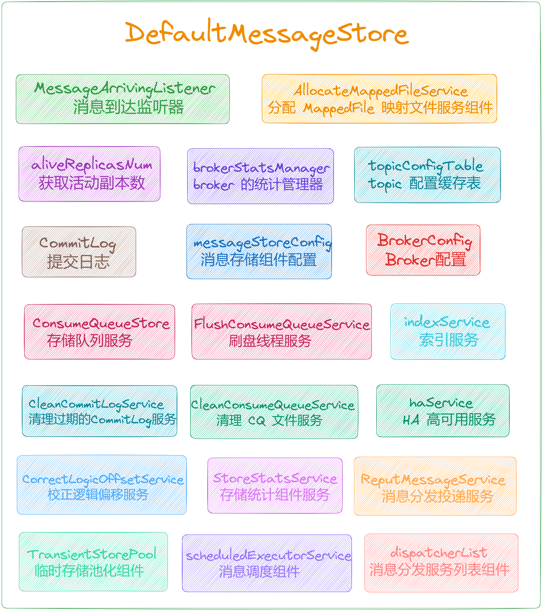

## **3.4 加载文件**

当我们把 Broker 重启后，RocketMQ 是如何重新将磁盘的 [commitlog](http://commitlog%20/) 文件重新加载到磁盘中的呢？

带着这个疑问，我们来看一下 [commitlog](http://commitlog%20/) 的加载流程。

本篇所剖析的这个 [DefaultMessageStore](http://defaultmessagestore%20/) 类就是协助 Broker 加载磁盘文件的，你可以理解为「**文件存储控制类**」，该类聚合了 [CommitLog](http://commitlog/)、 [ConsumeQueue](http://consumequeue/)、[IndexFile](http://indexfile%20/) 等重要文件的存储类。

  
[commitLog](http://commitlog%20/) 的加载流程大致如下：

  
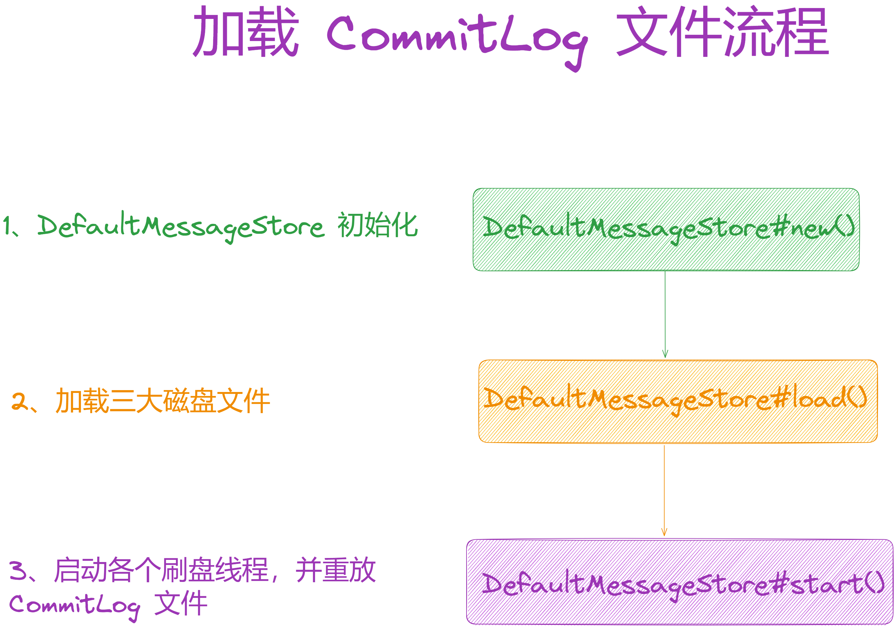

/\*\*

\* 加载 CommitLog、ConsumeQueue、indexFile 等文件，将数据将到内存中并且完成数据的恢复

\* @throws IOException

\*/

@Override

public boolean load() {

boolean result \= true;

try {

/\*\*

\* 1、判断上次 broker 是否是正常退出，如果是正常退出不会保留 abort 文件，异常退出则会保留 abort 文件

\* broker 在启动时会创建 abort 文件，并且注册钩子函数: 在 \]VM 退出时删除 abort 文件

\* 如果下一次启动时存在 abort 文件，说明 broker 是异常退出的，文件数据可能不一致需要进行数据修复

\*/

boolean lastExitOK \= !this.isTempFileExist();

LOGGER.info("last shutdown {}, store path root dir: {}",

lastExitOK ? "normally" : "abnormally", messageStoreConfig.getStorePathRootDir());

// load Commit Log

/\*\*

\* 2、加载 CommitLog 日志文件，日录路径取自 broker.conf 文件中的 storePathCommitLog 属性

\* CommitLog文件是真正存结消息内容的地方，单个文件大小默认1G

\*/

result = this.commitLog.load();

// load Consume Queue

/\*\*

\* 3、加载 ConsumeQueue 文件，日录路径取自 broker.conf 文件中的 storePathConsumeQueue 属性，文件组织方式为topic/queueId/fileName\*ConsumeQueue文件可以看作是CommitLog是索引文件，其存储了它所属topic的信息在CommitLog中的偏移量\*消费者村取消息的时候，可以从CosumeQueue中快速的根据偏移量定位消息在CommitLog中的位置

\*/

result = result && this.consumeQueueStore.load();

// 判断是否启用压缩功能，默认启用

if (messageStoreConfig.isEnableCompaction()) {

// 进行压缩服务的加载

result = result && this.compactionService.load(lastExitOK);

}

if (result) {

/\*\*

\* 4、加载 checkpoint 检查点文件，日录路径取自 broker.conf 文件中的 storeCheckpoint 属性，

\* StoreCheckpoint 记录这 commitLog、ConsumeQueue、IndexFile 文件的最后更新时间点

\* 当上一次 broker 是异常结束时，会根据 StoreCheckpoint 的数据进行恢复、这决定着文件从那里开始恢复，甚至是删除文件

\*/

this.storeCheckpoint =

new StoreCheckpoint(

StorePathConfigHelper.getStoreCheckpoint(

this.messageStoreConfig.getStorePathRootDir()));

this.masterFlushedOffset = this.storeCheckpoint.getMasterFlushedOffset();

setConfirmOffset(this.storeCheckpoint.getConfirmPhyOffset());

/\*\*

\* 5、加载 index 索引文件，日录路径取自 broker.conf 文件中的 storePathIndex 属性，

\* index 索引文件用以通过时间区间来快速查询消息，底层为 HashMap 结构，实现为 hash 索引

\* 如果不是正常退出、并且最大更新时问截比 checkpoint 文件中的时间戳大，则删除该 index 文件

\*/

result = this.indexService.load(lastExitOK);

/\*\*

\* 6、恢复 ConsumeQueue 文件相 CommitLog 文件，将正确的数据恢复至内存，删除错误数据和文件

\*/

this.recover(lastExitOK);

LOGGER.info("message store recover end, and the max phy offset = {}", this.getMaxPhyOffset());

}

long maxOffset \= this.getMaxPhyOffset();

this.setBrokerInitMaxOffset(maxOffset);

LOGGER.info("load over, and the max phy offset = {}", maxOffset);

} catch (Exception e) {

LOGGER.error("load exception", e);

result = false;

}

if (!result) {

// 如果上面的操作抛出异常，则文件服务停止

this.allocateMappedFileService.shutdown();

}

return result;

}

从上可以得知主要是将磁盘上相关文件, 如 [commitLog](http://commitlog/)、[consumeQueue](http://consumequeue/)、[indexFile](http://indexfile%20/) 加载到内存中。

可以看到调用了 [CommitLog#load()](http://commitlog/#load\(\)) 方法将存储目录下的 [commitLog](http://commitlog%20/) 文件加载到内存，其他两个文件也类似。

整个步骤如下：

1.  加载 [CommitLog](http://commitlog/) 文件。
2.  加载 [ConsumeQueue](http://consumequeue/) 文件。
3.  加载 [IndexFile](http://indexfile/) 文件。
4.  根据 [ConsumeQueue](http://consumequeue%20/) 中存储的 [commitLog](http://commitlog/) 最大偏移量，对内存中 [CommitLog](http://commitlog%20/) 重新设置写偏移量。

我们注意到当有 [abort](http://abort%20/) 文件存在时，[Broker](http://broker%20/) 会被判定为非正常退出。 并且通过调用 [CommitLog#load()](http://commitlog/#load\(\)) 方法将存储目录下的 [commitLog](http://commitlog/) 文件加载到内存，之后还会执行一个 [recover()](http://recover\(\)/) 对 [commitLog](http://commitlog%20/) 信息进行复原。

看到这里是不是会有疑问：**为什么还需要对 CommitLog 文件进行恢复呢？**

> 主要原因是在 commitLog 文件中，存储的消息不一定正确。当 Broker 非正常退出时，某条消息可能只存了一半进去。这时调用 recover() 方法，就是用来将不合法的消息剔除掉。

/\*\*

\* 恢复 ConsumeQueue 文件、CommitLog 文件，将正确的数据恢复至内存，删除错误数据和文什

\* @param lastExitOK

\*/

private void recover(final boolean lastExitOK) {

// 是否并发恢复，默认为false

boolean recoverConcurrently \= this.brokerConfig.isRecoverConcurrently();

// 判断 recover 恢复模式的并发还是正常(默认是正常)

LOGGER.info("message store recover mode: {}", recoverConcurrently ? "concurrent" : "normal");

// recover consume queue

long recoverConsumeQueueStart \= System.currentTimeMillis();

/\*\*

\* 恢复所有的 ConsumeQueue 文件

\* 1、恢复规则：

\* RocketMQ不会也没有必要对所有的 ConsumeQueue 文件进行恢复校验，如果 ConsumeQueue 文件数量大于等于3个，那么就取最新的3个

\* ConsumeQueue 文件执行恢复，否则对全部 ConsumeQueue 文件进行恢复

\* 2、所谓的恢复:就是找出当前 queueId 的 ConsumeQueue 下的浙有 ConsumeQueue 文件中最大的有效的 CommitLog 消息日志文件的物理仙移，

\* 以及该索引文件自身的最大有效数据偏移量，随后对文件自身的最大有效数据信移量 processOffset 之后的所有文件和数据进行更新或者删除

\* 3、如何判斯 ConsumeQueue 索引文件中的一个索引条目是否有效或者说是有效数据？

\* 只要该条目保存的对应消息在 commitLog 文件中的物理偏移量和该条目保存的对应消息在 commitLog 文件中的总长度大于 0 则表示该条目有效，否则

\* 表示该条目无效，并且不会对后续的条目和文件进行恢复

\* 4、最大的有效 commitLog 消息物理偏移量就是指最后一个有效条目中保存的 commitLog 文件的物理偏移量而不是文件自身的最大有效数据偏移量

\*

\*/

this.recoverConsumeQueue();

// 获得 ConsumeQueue 存储的最大有效 commitLog 偏移量

long maxPhyOffsetOfConsumeQueue \= this.getMaxOffsetInConsumeQueue();

long recoverConsumeQueueEnd \= System.currentTimeMillis();

// recover commitlog

if (lastExitOK) {

// 正常恢复 commitLog

this.commitLog.recoverNormally(maxPhyOffsetOfConsumeQueue);

} else {

// 正常恢复 commitLog

/\*\*

\* 异常恢复 CommitLog：该方法用于 broker 上次异常关闭的时候恢复 CommitLog， 其逻辑与 CommitLog 文件的正常恢复方法 recoverNormally 有些

\* 区別、但是核心逻辑都是一样的，对于异常恢复的 CommitLog 不再是最多取后三个文件进行恢复，而是倒序遍历所有的 CommitLog 文件进行校验和恢复的操作，

\* 直到找到第一个消息正常存储的 CommitLog 文件。

\* 为什么要这么做呢?

\* 因为异常恢复不能确定最后的刷盘点在哪个文件里，只能遍历查找

\* 1、首先倒序遍历井通过调用 isMappedFileMatchedRecover 方法判断当前文件是否是一个正常的 CommitLog 文件。

\* 包括:文件魔术的校验|文件消息存盘时间校验、StoreCheckpoint 较验等。如果找到一个正确的 CommitLog 文件，则停止遍历

\* 2、然后从第一个正确的 CommitLog 文件开始向后遍历恢复 CommitLog，如果某个消息是正常的，那么通过 defaultMessageStore#doDispatch

\* 方法调用 commitLogDispatch 重新构建当前消息的 IndexFile 索引和 ConsumeQueue 索引。

\* 3、恢复完毕之后的处理逻辑和 CommitLog 文件正常恢复的流程是一样的。

\* 例如:删除文件最大有效数据编移量 processOffset 之后的所有 CommitLog 数据，清除 ConsumeQueue 文件中的脏数据等等。

\*/

this.commitLog.recoverAbnormally(maxPhyOffsetOfConsumeQueue);

}

// recover consume offset table

long recoverCommitLogEnd \= System.currentTimeMillis();

// 最后恢复 topicQueueTable

this.recoverTopicQueueTable();

long recoverConsumeOffsetEnd \= System.currentTimeMillis();

// 打印上面恢复过程所用的时间信息

LOGGER.info("message store recover total cost: {} ms, " +

"recoverConsumeQueue: {} ms, recoverCommitLog: {} ms, recoverOffsetTable: {} ms",

recoverConsumeOffsetEnd - recoverConsumeQueueStart, recoverConsumeQueueEnd - recoverConsumeQueueStart,

recoverCommitLogEnd - recoverConsumeQueueEnd, recoverConsumeOffsetEnd - recoverCommitLogEnd);

}

## **3.5 MessageStore 服务启动、关闭、销毁**

### **3.5.1 MessageStore 服务启动**

/\*\*

\* 启动 MessageStore

\* @throws Exception

\*/

@Override

public void start() throws Exception {

// 如果既不支持 DLedger 模式也不启用重复消息检测，则初始化 HA 高可用服务

if (!messageStoreConfig.isEnableDLegerCommitLog() && !this.messageStoreConfig.isDuplicationEnable()) {

this.haService.init(this);

}

// 如果启用了临时存储池，则初始化临时存储池

if (this.isTransientStorePoolEnable()) {

this.transientStorePool.init();

}

// 启动分配 MappedFileService 文件服务组件

this.allocateMappedFileService.start();

// 启动 IndexService 索引文件服务

this.indexService.start();

// 尝试获取文件锁

lock = lockFile.getChannel().tryLock(0,1,false);

// 如果获取失败 || 锁为共享锁 || 锁无效，则抛出异常

if (lock == null || lock.isShared() || !lock.isValid()) {

throw new RuntimeException("Lock failed,MQ already started");

}

// 写入锁文件

lockFile.getChannel().write(ByteBuffer.wrap("lock".getBytes(StandardCharsets.UTF\_8)));

lockFile.getChannel().force(true);

// 设置 ReputMessageService 的重放起始偏移量，启动消息分发投递服务

this.reputMessageService.setReputFromOffset(this.commitLog.getConfirmOffset());

this.reputMessageService.start();

// 进行 ReputOffsetFromCq 的再次检查

this.doRecheckReputOffsetFromCq();

// 启动消息队列刷盘服务

this.flushConsumeQueueService.start();

// 启动 commitLog 消息存储服务

this.commitLog.start();

// 启动存储状态统计服务

this.storeStatsService.start();

// 如果 HA 服务不为null，启动 HA 高可用服务

if (this.haService != null) {

this.haService.start();

}

// 创建临时文件，添加调度任务，性能统计服务开始工作

this.createTempFile();

this.addScheduleTask();

this.perfs.start();

this.shutdown = false;

}

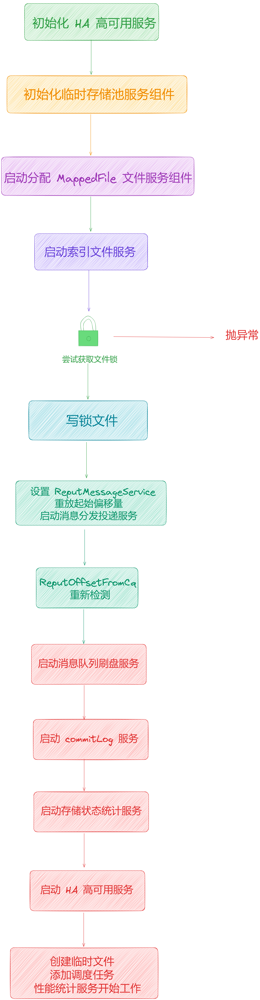

可以看到启动方法主要做的工作就是启动各种线程：

1.  启动 [ReputMessageService](http://reputmessageservice%20/) 线程, 将 [CommitLog](http://commitlog%20/) 中未转发至 [ConsumeQueue](http://consumequeue%20/) 的消息转发至 [ConsumeQueue](http://consumequeue/)。
2.  启动 [ConsumeQueue](http://consumequeue%20/) 刷盘线程、[CommitLog](http://commitlog%20/) 刷盘线程 等。

看到这里你是否会有疑问：**为什么要对内存的 CommitLog 进行重置起始偏移量呢？**

> 主要因为 ConsumeQueue 的刷盘频率其实不高，当进程退出后消息写入了 CommitLog 文件，可能还未写入 ConsumeQueue 文件。此时需要通过 ConsumeQueue 中 CommitLog 的最大偏移量来知道有哪些消息是还未转发到 ConsumeQueue 文件中，不然消费端就无法消费到消息了。

### **3.5.2 MessageStore 关闭**

@Override

public void shutdown() {

// 如果已经执行过关闭操作，则直接返回

if (!this.shutdown) {

this.shutdown = true;// 标记已经执行了关闭操作

// 关闭定时任务执行服务

this.scheduledExecutorService.shutdown();

// 关闭清理队列的定时任务执行服务

this.scheduledCleanQueueExecutorService.shutdown();

try {

// 等待定时任务执行服务终止，最多等待3秒

this.scheduledExecutorService.awaitTermination(3,TimeUnit.SECONDS);

// 等待清理队列的定时任务执行服务终止，最多等待3秒

this.scheduledCleanQueueExecutorService.awaitTermination(3,TimeUnit.SECONDS);

// 等待3秒

Thread.sleep(1000 \* 3);

} catch (InterruptedException e) {

LOGGER.error("shutdown Exception,",e);// 记录关闭异常日志

}

// 如果高可用服务不为空，则关闭高可用服务

if (this.haService != null) {

this.haService.shutdown();

}

// 关闭存储统计服务

this.storeStatsService.shutdown();

// 关闭CommitLog

this.commitLog.shutdown();

// 关闭消息恢复服务

this.reputMessageService.shutdown();

// 必须在消息恢复服务关闭后再关闭分发相关服务

this.indexService.shutdown();

// 如果压缩服务不为空，则关闭压缩服务

if (this.compactionService != null) {

this.compactionService.shutdown();

}

// 关闭刷盘队列服务

this.flushConsumeQueueService.shutdown();

// 关闭内存映射文件分配服务

this.allocateMappedFileService.shutdown();

// 刷写存储检查点

this.storeCheckpoint.flush();

// 关闭存储检查点服务

this.storeCheckpoint.shutdown();

// 关闭性能统计服务

this.perfs.shutdown();

// 如果存储可写并且待分发的字节数为0，则删除异常退出文件并标记为正常关闭

if (this.runningFlags.isWriteable() && dispatchBehindBytes() == 0) {

this.deleteFile(StorePathConfigHelper.getAbortFile(this.messageStoreConfig.getStorePathRootDir()));

shutDownNormal = true;

} else {

// 如果存储可能存在错误，则异常关闭并保留异常退出文件

LOGGER.warn("the store may be wrong,so shutdown abnormally,and keep abort file.");

}

}

// 销毁临时存储池

this.transientStorePool.destroy();

// 如果锁文件和锁对象不为空，则释放锁并关闭文件

if (lockFile != null && lock != null) {

try {

lock.release();

lockFile.close();

} catch (IOException e) {

// 锁释放和文件关闭过程中的异常处理

}

}

}

首先会停止掉一些线程池和定时任务。然后对检查点进行刷盘。销毁 [transientStorePool](http://transientstorepool%20/) 堆外内存缓存池。

### **3.5.3 MessageStore 销毁**

@Override

public void destroy() {

// 销毁逻辑组件

this.destroyLogics();

// 销毁 commitLog 日志

this.commitLog.destroy();

// 销毁 index 索引服务

this.indexService.destroy();

// 删除异常退出文件

this.deleteFile(StorePathConfigHelper.getAbortFile(

this.messageStoreConfig.getStorePathRootDir()));

// 删除存储检查点文件

this.deleteFile(StorePathConfigHelper.getStoreCheckpoint(

this.messageStoreConfig.getStorePathRootDir()));

}

## **3.6 消息写入流程**

这里我们接着 [【Broker端源码分析系列第十五篇】图解 RocketMQ 源码之 Broker 心跳机制和接收数据流程剖析](https://articles.zsxq.com/id_f6x7p8pral0c.html) 上篇中没有剖析完的流程。

这里我们以「**异步写入消息**」为例来剖析整个写入流程，入口如下：

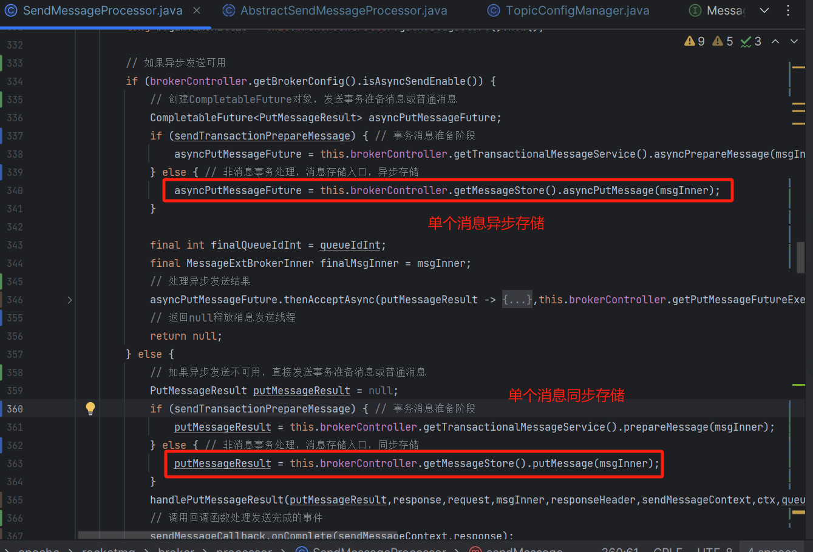

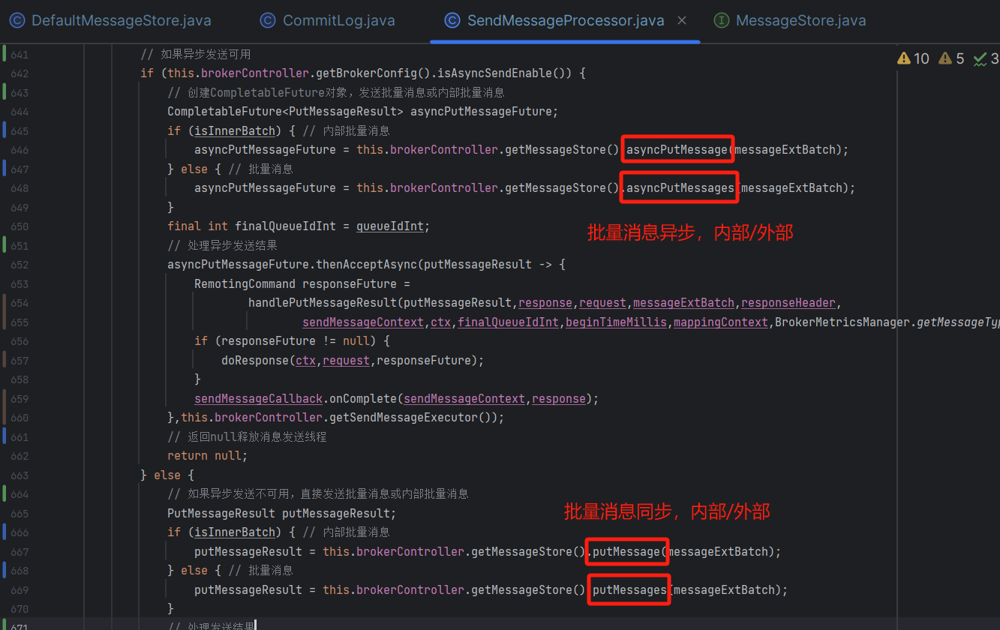

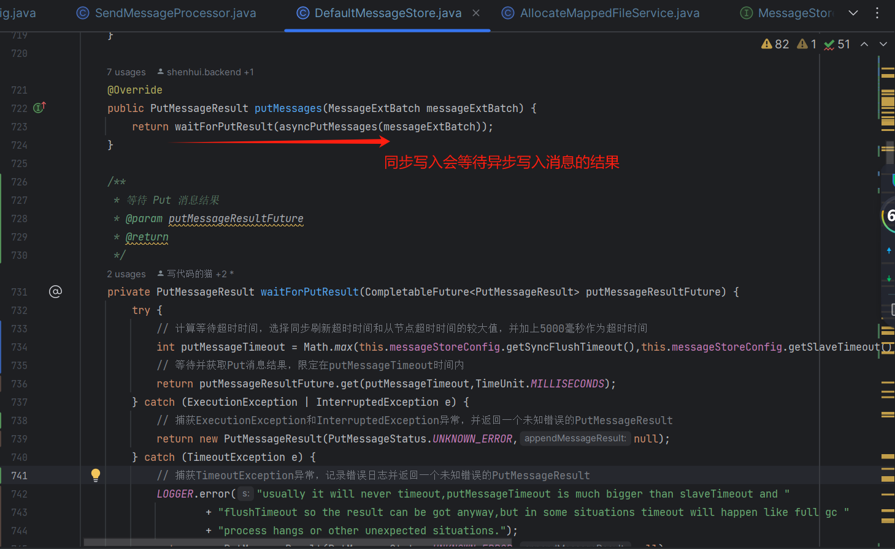

可以看到同步操作内部会调用异步操作并等待返回结果，这里我们直接来看整个异步写入消息是如何实现的，整个过程会贯穿三个底层文件：[CommitLog](http://commitlog/)、[ConsumeQueue](http://consumequeue/)、[IndexFile](http://indexfile/)。

关于这三大底层文件，可以点击 [【Broker端源码分析系列第十八篇】图解 RocketMQ 源码之 Broker 端三大底层存储文件剖析](https://articles.zsxq.com/id_nwm33ku2srs5.html)，先了解其内部构造后，再来看整个写入流程，否则会很懵逼。

[DefaultMessageStore](http://defaultmessagestore/) 数据写入的过程很简单，因为大部分逻辑都由 [CommitLog](http://commitlog/) 实现了，这里就是入口和组装。

### **3.6.1 单条消息异步写入**

@Override

public CompletableFuture<PutMessageResult> asyncPutMessage(MessageExtBrokerInner msg) {

// 循环执行消息发送前的钩子函数。例如，消息验证或特殊消息转换，并返回处理结果

for (PutMessageHook putMessageHook :putMessageHookList) {

PutMessageResult handleResult \= putMessageHook.executeBeforePutMessage(msg);

if (handleResult != null) {

return CompletableFuture.completedFuture(handleResult);

}

}

// 检查消息是否包含特定属性但不是内部批量处理

if (msg.getProperties().containsKey(MessageConst.PROPERTY\_INNER\_NUM)

&& !MessageSysFlag.check(msg.getSysFlag(),MessageSysFlag.INNER\_BATCH\_FLAG)) {

LOGGER.warn("\[BUG\]The message had property {} but is not an inner batch",MessageConst.PROPERTY\_INNER\_NUM);

return CompletableFuture.completedFuture(new PutMessageResult(PutMessageStatus.MESSAGE\_ILLEGAL,null));

}

// 检查消息是否是内部批量处理，如果是，则检查对应主题的配置

if (MessageSysFlag.check(msg.getSysFlag(),MessageSysFlag.INNER\_BATCH\_FLAG)) {

Optional<TopicConfig> topicConfig = this.getTopicConfig(msg.getTopic());

// 是cq类型但不是批处处理cq

if (!QueueTypeUtils.isBatchCq(topicConfig)) {

LOGGER.error("\[BUG\]The message is an inner batch but cq type is not batch cq");

return CompletableFuture.completedFuture(new PutMessageResult(PutMessageStatus.MESSAGE\_ILLEGAL,null));

}

}

// 记录开始时间，异步向 CommitLog 写入消息

long beginTime \= this.getSystemClock().now();

// 核心方法，调用 CommitLog#asyncPutMessage 方法存储消息

CompletableFuture<PutMessageResult> putResultFuture = this.commitLog.asyncPutMessage(msg);

// 处理异步写入消息的结果，记录日志和统计信息

putResultFuture.thenAccept(result -> {

// 存储消息消耗的时间

long elapsedTime \= this.getSystemClock().now() - beginTime;

if (elapsedTime > 500) {

LOGGER.warn("DefaultMessageStore#putMessage:CommitLog#putMessage cost {}ms,topic={},bodyLength={}", elapsedTime,msg.getTopic(),msg.getBody().length);

}

// 更新统计保存消息花费的时间和最大花费时间

this.storeStatsService.setPutMessageEntireTimeMax(elapsedTime);

if (null == result || !result.isOk()) {

// 如果存储失败，则增加保存消息失败的次数

this.storeStatsService.getPutMessageFailedTimes().add(1);

}

});

// 返回异步写入消息的 Future

return putResultFuture;

}

这里通过异步的方式进行「**单条普通消息**」的写入，重点步骤是调用 [commitLog#asyncPutMessage](http://commitlog/#asyncPutMessage) 异步方法进行写入，关于 [commitLog](http://commitlog/) 的操作我会放到下篇进行单独剖析，这里知道会委托给 [commitLog](http://commitlog%20/) 组件来处理即可。

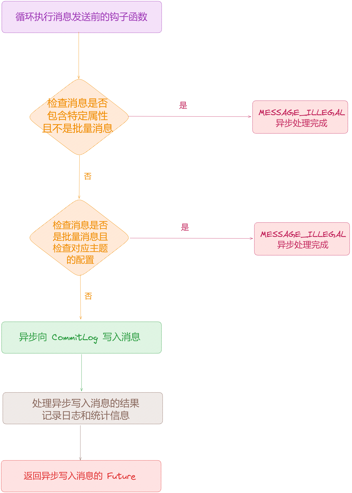

### **3.6.2 批量消息异步写入**

/\*\*

\* 批量消息写入

\* @param messageExtBatch the message batch

\* @return

\*/

@Override

public CompletableFuture<PutMessageResult> asyncPutMessages(MessageExtBatch messageExtBatch) {

// 遍历消息发送前的钩子函数列表，执行消息发送前的处理逻辑

for (PutMessageHook putMessageHook :putMessageHookList) {

PutMessageResult handleResult \= putMessageHook.executeBeforePutMessage(messageExtBatch);

if (handleResult != null) {

return CompletableFuture.completedFuture(handleResult);

}

}

// 记录开始时间，异步将批量消息写入 CommitLog

long beginTime \= this.getSystemClock().now();

// 核心方法，调用 CommitLog#asyncPutMessages 方法存储批量消息

CompletableFuture<PutMessageResult> putResultFuture = this.commitLog.asyncPutMessages(messageExtBatch);

// 处理异步写入消息的结果，记录日志和统计信息

putResultFuture.thenAccept(result -> {

// 存储消息消耗的时间

long eclipseTime \= this.getSystemClock().now() - beginTime;

if (eclipseTime > 500) {

LOGGER.warn("not in lock eclipse time(ms)={},bodyLength={}",eclipseTime,messageExtBatch.getBody().length);

}

// 更新统计保存消息花费的时间和最大花费时间

this.storeStatsService.setPutMessageEntireTimeMax(eclipseTime);

if (null == result || !result.isOk()) {

// 如果存储失败，则增加保存消息失败的次数

this.storeStatsService.getPutMessageFailedTimes().add(1);

}

});

// 返回异步写入消息的 Future

return putResultFuture;

}

这里通过异步的方式进行「**批量普通消息**」的写入，重点步骤是调用 [commitLog#asyncPutMessages](http://%20commitlog/#asyncPutMessages) 异步方法进行写入，关于 [commitLog](http://commitlog/) 的操作我会放到下篇进行单独剖析，这里知道会委托给 [commitLog](http://commitlog/) 组件来处理即可。

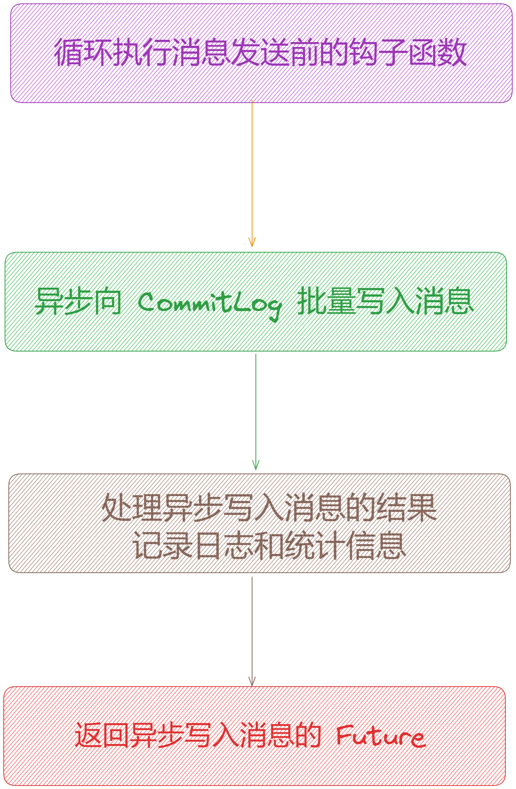

看到这两个方法都使用了 [CompletableFuture](http://completablefuture/) ，关于 [CompletableFuture](http://completablefuture/) 可以看这篇文章：

[异步编程利器：CompletableFuture详解](https://cloud.tencent.com/developer/article/1835318)

切记，数据写入并不是终点，会有定时任务 [ReputMessageService](http://reputmessageservice/) 不断检查 [CommitLog](http://commitlog/) 文件新写入的数据，对写入的消息进行构建 [ConsumeQueue](http://consumequeue/) 索引，并将消息响应消息客户端。

### **3.6.3 前置钩子函数**

关于钩子函数，如下：

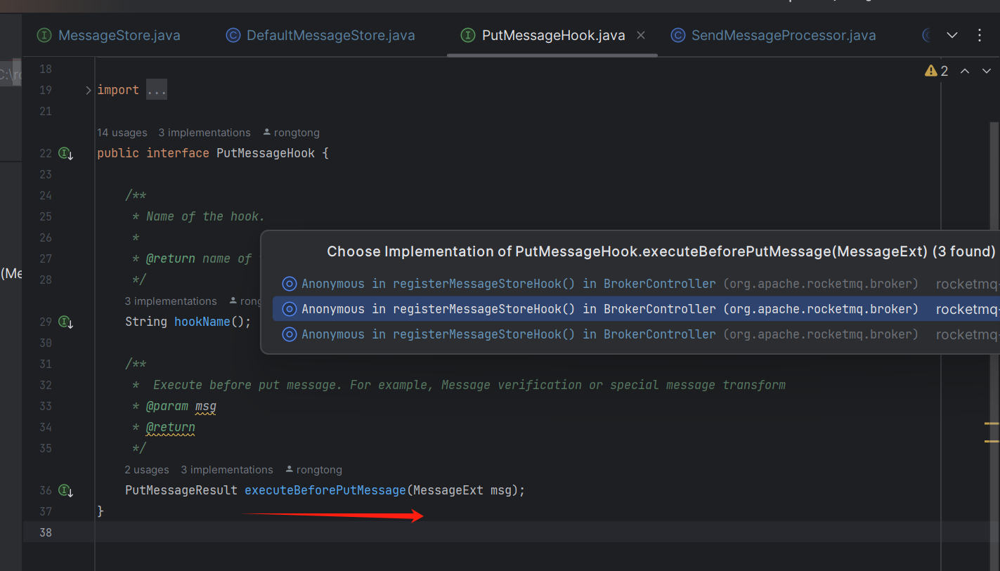

public void registerMessageStoreHook() {

// 1、messageStore 中消息存储的钩子集合

List<PutMessageHook> putMessageHookList = messageStore.getPutMessageHookList();

// 2、往钩子集合中添加新的钩子函数

putMessageHookList.add(new PutMessageHook() {

// 设置钩子函数名称为 checkBeforePutMessage

@Override

public String hookName() {

return "checkBeforePutMessage";

}

// 在放置消息之前执行。例如:消息验证或特殊消息转换

@Override

public PutMessageResult executeBeforePutMessage(MessageExt msg) {

return HookUtils.checkBeforePutMessage(BrokerController.this, msg);

}

});

// 3、往钩子集合中添加新的钩子函数

putMessageHookList.add(new PutMessageHook() {

// 设置钩子函数的名称为 innerBatchChecker 内部批处理检查器

@Override

public String hookName() {

return "innerBatchChecker";

}

@Override

public PutMessageResult executeBeforePutMessage(MessageExt msg) {

// instanceof 是 Java 的保留关键字。它的作用是测试它左边的对象是否是它右边的类的实例，返回 boolean 的数据类型,

if (msg instanceof MessageExtBrokerInner) {

return HookUtils.checkInnerBatch(BrokerController.this, msg);

}

return null;

}

});

// 3、往钩子集合中添加新的钩子函数

putMessageHookList.add(new PutMessageHook() {

// 设置钩子函数的名称为 handleScheduleMessage 处理计划消息

@Override

public String hookName() {

return "handleScheduleMessage";

}

@Override

public PutMessageResult executeBeforePutMessage(MessageExt msg) {

if (msg instanceof MessageExtBrokerInner) {

return HookUtils.handleScheduleMessage(BrokerController.this, (MessageExtBrokerInner) msg);

}

return null;

}

});

// 4、HA握手时，从设备以一定的偏移量将消息发送回主设备

SendMessageBackHook sendMessageBackHook \= new SendMessageBackHook() {

@Override

public boolean executeSendMessageBack(List<MessageExt> msgList, String brokerName, String brokerAddr) {

return HookUtils.sendMessageBack(BrokerController.this, msgList, brokerName, brokerAddr);

}

};

// 5、如果消息不为空，设置发送消息回钩

if (messageStore != null) {

messageStore.setSendMessageBackHook(sendMessageBackHook);

}

}

这里总共添加了 3 个钩子函数，我们分别来看下。

### **3.6.3.1 存储状态检测**

/\*\*

\* 存储状态检测：任意一项检查不通过，直接快速失败

\* @param brokerController

\* @param msg

\* @return

\*/

public static PutMessageResult checkBeforePutMessage(BrokerController brokerController, final MessageExt msg) {

// 当前 broker 是否准备停掉

// 可能 broker 发起了停机命令至此不再受理新的请求

if (brokerController.getMessageStore().isShutdown()) {

LOG.warn("message store has shutdown, so putMessage is forbidden");

return new PutMessageResult(PutMessageStatus.SERVICE\_NOT\_AVAILABLE, null);

}

// 当前 broker 是否是从节点 && 重复消息检测功能关闭

// 从节点只是负责同步 master 的数据，接收到写入请求时，直接返回失败

if (!brokerController.getMessageStoreConfig().isDuplicationEnable() && BrokerRole.SLAVE == brokerController.getMessageStoreConfig().getBrokerRole()) {

long value \= PRINT\_TIMES.getAndIncrement();

// 抽样写入警告日志

if ((value % 50000) == 0) {

LOG.warn("message store is in slave mode, so putMessage is forbidden ");

}

return new PutMessageResult(PutMessageStatus.SERVICE\_NOT\_AVAILABLE, null);

}

// 运行标记位是否正常

// 所谓标记位是指:

// 1、磁盘已满

// 2、写逻辑队列失败

// 3、写索引文件 index file 失败

if (!brokerController.getMessageStore().getRunningFlags().isWriteable()) {

long value \= PRINT\_TIMES.getAndIncrement();

if ((value % 50000) == 0) {

LOG.warn("message store is not writeable, so putMessage is forbidden " + brokerController.getMessageStore().getRunningFlags().getFlagBits());

}

return new PutMessageResult(PutMessageStatus.SERVICE\_NOT\_AVAILABLE, null);

} else {

PRINT\_TIMES.set(0);

}

// 消息有效性检查

final byte\[\] topicData = msg.getTopic().getBytes(MessageDecoder.CHARSET\_UTF8);

boolean retryTopic \= msg.getTopic() != null && msg.getTopic().startsWith(MixAll.RETRY\_GROUP\_TOPIC\_PREFIX);

// 非重试 Topic && Topic 名称是否超长

// Topic 名称长度不能超过 127

if (!retryTopic && topicData.length > Byte.MAX\_VALUE) {

LOG.warn("putMessage message topic\[{}\] length too long {}, but it is not supported by broker",

msg.getTopic(), topicData.length);

return new PutMessageResult(PutMessageStatus.MESSAGE\_ILLEGAL, null);

}

// 其他类型 Topic 长度不能超过 255

if (topicData.length > MAX\_TOPIC\_LENGTH) {

LOG.warn("putMessage message topic\[{}\] length too long {}, but it is not supported by broker",

msg.getTopic(), topicData.length);

return new PutMessageResult(PutMessageStatus.MESSAGE\_ILLEGAL, null);

}

// 消息体为空

if (msg.getBody() == null) {

LOG.warn("putMessage message topic\[{}\], but message body is null", msg.getTopic());

return new PutMessageResult(PutMessageStatus.MESSAGE\_ILLEGAL, null);

}

// page cache是否繁忙

// 因为 rocketmq 写入消息时都是单线程在操作，所以判断 PageCache 是否繁忙的逻辑很简单，就是看写入的时间是否超过了 1 秒

if (brokerController.getMessageStore().isOSPageCacheBusy()) {

return new PutMessageResult(PutMessageStatus.OS\_PAGE\_CACHE\_BUSY, null);

}

return null;

}

### **3.6.3.2 内部批处理检测**

/\*\*

\* 内部批处理检测

\* @param brokerController

\* @param msg

\* @return

\*/

public static PutMessageResult checkInnerBatch(BrokerController brokerController,final MessageExt msg) {

// 检查消息是否包含内部批量消息属性，但并非内部批量消息

if (msg.getProperties().containsKey(MessageConst.PROPERTY\_INNER\_NUM)

&& !MessageSysFlag.check(msg.getSysFlag(),MessageSysFlag.INNER\_BATCH\_FLAG)) {

LOG.warn("\[BUG\]The message had property {} but is not an inner batch",MessageConst.PROPERTY\_INNER\_NUM);

return new PutMessageResult(PutMessageStatus.MESSAGE\_ILLEGAL,null);

}

// 如果消息是内部批量消息

if (MessageSysFlag.check(msg.getSysFlag(),MessageSysFlag.INNER\_BATCH\_FLAG)) {

// 获取消息的主题配置

Optional<TopicConfig> topicConfig = Optional.ofNullable(brokerController.getTopicConfigManager().getTopicConfigTable().get(msg.getTopic()));

// 如果消息为内部批量消息，但主题不是批量消费队列

if (!QueueTypeUtils.isBatchCq(topicConfig)) {

LOG.error("\[BUG\]The message is an inner batch but cq type is not batch cq");

return new PutMessageResult(PutMessageStatus.MESSAGE\_ILLEGAL,null);

}

}

return null;

}

### **3.6.3.3 处理延迟消息**

/\*\*

\* 处理定时/延时消息

\* @param brokerController

\* @param msg

\* @return

\*/

public static PutMessageResult handleScheduleMessage(BrokerController brokerController,final MessageExtBrokerInner msg) {

// 根据 sysFlag 获取事务状态，普通消息的 sysFlag 为0

final int tranType \= MessageSysFlag.getTransactionValue(msg.getSysFlag());

// 如果不是事务消息或者是提交型事务消息

if (tranType == MessageSysFlag.TRANSACTION\_NOT\_TYPE

|| tranType == MessageSysFlag.TRANSACTION\_COMMIT\_TYPE) {

// 如果不是已投递的定时消息

if (!isRolledTimerMessage(msg)) {

// 检查消息是否为定时消息

if (checkIfTimerMessage(msg)) {

// 如果时间轮没有启用，拒绝消息

if (!brokerController.getMessageStoreConfig().isTimerWheelEnable()) {

return new PutMessageResult(PutMessageStatus.WHEEL\_TIMER\_NOT\_ENABLE,null);

}

// 转换定时消息的结果

PutMessageResult transformRes \= transformTimerMessage(brokerController,msg);

if (null != transformRes) {

return transformRes;

}

}

}

// 如果是延时发送的消息

if (msg.getDelayTimeLevel() > 0) {

// 转换延时消息

transformDelayLevelMessage(brokerController,msg);

}

}

return null;

}

public static boolean checkIfTimerMessage(MessageExtBrokerInner msg) {

// 获取延迟级别，检查是否是延时消息

if (msg.getDelayTimeLevel() > 0) {

// 清除不必要的定时消息属性

if (null != msg.getProperty(MessageConst.PROPERTY\_TIMER\_DELIVER\_MS)) {

MessageAccessor.clearProperty(msg,MessageConst.PROPERTY\_TIMER\_DELIVER\_MS);

}

if (null != msg.getProperty(MessageConst.PROPERTY\_TIMER\_DELAY\_SEC)) {

MessageAccessor.clearProperty(msg,MessageConst.PROPERTY\_TIMER\_DELAY\_SEC);

}

if (null != msg.getProperty(MessageConst.PROPERTY\_TIMER\_DELAY\_MS)) {

MessageAccessor.clearProperty(msg,MessageConst.PROPERTY\_TIMER\_DELAY\_MS);

}

return false;

//return this.defaultMessageStore.getMessageStoreConfig().isTimerInterceptDelayLevel();

}

// 再次检查

// double check

if (TimerMessageStore.TIMER\_TOPIC.equals(msg.getTopic()) || null != msg.getProperty(MessageConst.PROPERTY\_TIMER\_OUT\_MS)) {

return false;

}

// 判断是否有定时属性

return null != msg.getProperty(MessageConst.PROPERTY\_TIMER\_DELIVER\_MS) || null != msg.getProperty(MessageConst.PROPERTY\_TIMER\_DELAY\_MS) || null != msg.getProperty(MessageConst.PROPERTY\_TIMER\_DELAY\_SEC);

}

/\*\*

\* 处理延时消息

\* @param brokerController

\* @param msg

\* @return

\*/

private static PutMessageResult transformTimerMessage(BrokerController brokerController,

MessageExtBrokerInner msg) {

// 进行转换

int delayLevel \= msg.getDelayTimeLevel();

long deliverMs;

try {

// 解析定时消息属性，计算消息的投递时间

if (msg.getProperty(MessageConst.PROPERTY\_TIMER\_DELAY\_SEC) != null) {

deliverMs = System.currentTimeMillis() + Long.parseLong(msg.getProperty(MessageConst.PROPERTY\_TIMER\_DELAY\_SEC)) \* 1000;

} else if (msg.getProperty(MessageConst.PROPERTY\_TIMER\_DELAY\_MS) != null) {

deliverMs = System.currentTimeMillis() + Long.parseLong(msg.getProperty(MessageConst.PROPERTY\_TIMER\_DELAY\_MS));

} else {

deliverMs = Long.parseLong(msg.getProperty(MessageConst.PROPERTY\_TIMER\_DELIVER\_MS));

}

} catch (Exception e) {

return new PutMessageResult(PutMessageStatus.WHEEL\_TIMER\_MSG\_ILLEGAL,null);

}

// 如果消息的投递时间大于当前时间

if (deliverMs > System.currentTimeMillis()) {

if (delayLevel <= 0 && deliverMs - System.currentTimeMillis() > brokerController.getMessageStoreConfig().getTimerMaxDelaySec() \* 1000L) {

return new PutMessageResult(PutMessageStatus.WHEEL\_TIMER\_MSG\_ILLEGAL,null);

}

int timerPrecisionMs \= brokerController.getMessageStoreConfig().getTimerPrecisionMs();

// 对定时时间进行处理

if (deliverMs % timerPrecisionMs == 0) {

deliverMs -= timerPrecisionMs;

} else {

deliverMs = deliverMs / timerPrecisionMs \* timerPrecisionMs;

}

// 如果定时消息存储拒绝了该时间点的消息

if (brokerController.getTimerMessageStore().isReject(deliverMs)) {

return new PutMessageResult(PutMessageStatus.WHEEL\_TIMER\_FLOW\_CONTROL,null);

}

// 设置消息属性，并修改消息的主题和队列ID

MessageAccessor.putProperty(msg,MessageConst.PROPERTY\_TIMER\_OUT\_MS,deliverMs + "");

// 使用扩展属性 REAL\_TOPIC 记录真实 topic

MessageAccessor.putProperty(msg,MessageConst.PROPERTY\_REAL\_TOPIC,msg.getTopic());

// 使用扩展属性 REAL\_QID 记录真实 queueId

MessageAccessor.putProperty(msg,MessageConst.PROPERTY\_REAL\_QUEUE\_ID,String.valueOf(msg.getQueueId()));

msg.setPropertiesString(MessageDecoder.messageProperties2String(msg.getProperties()));

// 更改 topic 和 queueId 为延迟队列的 topic 和 queueId

msg.setTopic(TimerMessageStore.TIMER\_TOPIC);

msg.setQueueId(0);

} else if (null != msg.getProperty(MessageConst.PROPERTY\_TIMER\_DEL\_UNIQKEY)) {

return new PutMessageResult(PutMessageStatus.WHEEL\_TIMER\_MSG\_ILLEGAL,null);

}

return null;

}

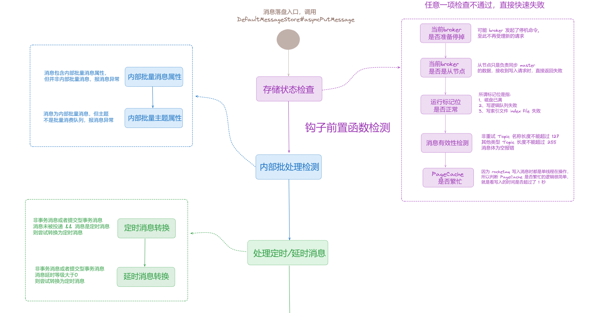

消息获取接口分两类：

1.  根据精确的信息获取消息数据。
2.  根据时间搜索消息数据。

## **3.7 拉取消息**

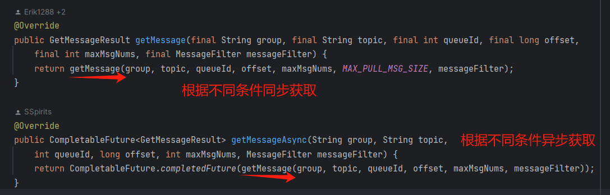

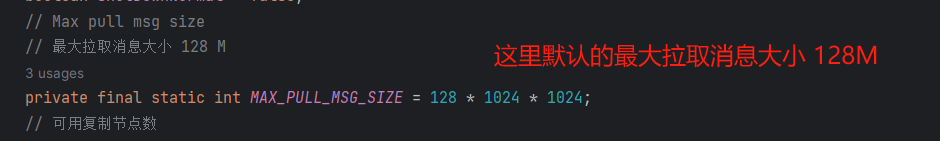

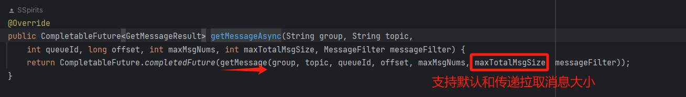

具体的消息拉取处理源码如下：

/\*\*

\* 查询消息

\* @param group Consumer group that launches this query.

\* @param topic Topic to query.

\* @param queueId Queue ID to query.

\* @param offset Logical offset to start from.

\* @param maxMsgNums Maximum count of messages to query.

\* @param maxTotalMsgSize Maximum total msg size of the messages

\* @param messageFilter Message filter used to screen desired messages.

\* @return

\*/

@Override

public GetMessageResult getMessage(final String group, final String topic, final int queueId, final long offset,

final int maxMsgNums, final int maxTotalMsgSize, final MessageFilter messageFilter) {

// 如果服务已关闭，打印日志并返回

if (this.shutdown) {

LOGGER.warn("message store has shutdown, so getMessage is forbidden");

return null;

}

// 如果不可读，打印日志并返回

if (!this.runningFlags.isReadable()) {

LOGGER.warn("message store is not readable, so getMessage is forbidden " + this.runningFlags.getFlagBits());

return null;

}

// 获取 Topic 配置

Optional<TopicConfig> topicConfig = getTopicConfig(topic);

// 根据 topic 配置获取清理策略

CleanupPolicy policy \= CleanupPolicyUtils.getDeletePolicy(topicConfig);

//check request topic flag

// 检查请求主题的清理策略

// 如果为 COMPACT，且启用了压缩功能，则使用压缩存储模块进行消息拉取

if (Objects.equals(policy, CleanupPolicy.COMPACTION) && messageStoreConfig.isEnableCompaction()) {

// 使用压缩存储模块进行消息拉取

return compactionStore.getMessage(group, topic, queueId, offset, maxMsgNums, maxTotalMsgSize);

} // else skip

// 记录起始时间

long beginTime \= this.getSystemClock().now();

GetMessageStatus status \= GetMessageStatus.NO\_MESSAGE\_IN\_QUEUE;

long nextBeginOffset \= offset;

long minOffset \= 0;

long maxOffset \= 0;

// 初始化拉取结果集

GetMessageResult getResult \= new GetMessageResult();

// 计算当前 CommitLog 的最大物理偏移量

final long maxOffsetPy \= this.commitLog.getMaxOffset();

// 查找对应的消费队列

ConsumeQueueInterface consumeQueue \= findConsumeQueue(topic, queueId);

if (consumeQueue != null) {

// 获取消费队列的最小和最大偏移量

minOffset = consumeQueue.getMinOffsetInQueue();

maxOffset = consumeQueue.getMaxOffsetInQueue();

// 根据当前偏移量和消费队列情况，确定下一步操作和返回的状态

if (maxOffset == 0) {

status = GetMessageStatus.NO\_MESSAGE\_IN\_QUEUE;

nextBeginOffset = nextOffsetCorrection(offset, 0);

} else if (offset < minOffset) {

status = GetMessageStatus.OFFSET\_TOO\_SMALL;

nextBeginOffset = nextOffsetCorrection(offset, minOffset);

} else if (offset == maxOffset) {

status = GetMessageStatus.OFFSET\_OVERFLOW\_ONE;

nextBeginOffset = nextOffsetCorrection(offset, offset);

} else if (offset > maxOffset) {

status = GetMessageStatus.OFFSET\_OVERFLOW\_BADLY;

nextBeginOffset = nextOffsetCorrection(offset, maxOffset);

} else {

// 计算最大过滤消息大小

final int maxFilterMessageSize \= Math.max(16000, maxMsgNums \* consumeQueue.getUnitSize());

final boolean diskFallRecorded \= this.messageStoreConfig.isDiskFallRecorded();

// 计算最大可拉取消息大小

long maxPullSize \= Math.max(maxTotalMsgSize, 100);

// 如果超限报错

if (maxPullSize > MAX\_PULL\_MSG\_SIZE) {

LOGGER.warn("The max pull size is too large maxPullSize={} topic={} queueId={}", maxPullSize, topic, queueId);

maxPullSize = MAX\_PULL\_MSG\_SIZE;

}

// 默认状态为 没有可匹配的消息

status = GetMessageStatus.NO\_MATCHED\_MESSAGE;

long maxPhyOffsetPulling \= 0;

int cqFileNum \= 0;

// 遍历消息拉取，直到符合某条件跳出循环

while (getResult.getBufferTotalSize() <= 0

&& nextBeginOffset < maxOffset

&& cqFileNum++ < this.messageStoreConfig.getTravelCqFileNumWhenGetMessage()) {

ReferredIterator<CqUnit> bufferConsumeQueue = consumeQueue.iterateFrom(nextBeginOffset);

if (bufferConsumeQueue == null) {

status = GetMessageStatus.OFFSET\_FOUND\_NULL;

// 校正下次拉取消息的偏移量

nextBeginOffset = nextOffsetCorrection(nextBeginOffset, this.consumeQueueStore.rollNextFile(consumeQueue, nextBeginOffset));

LOGGER.warn("consumer request topic: " + topic + "offset: " + offset + " minOffset: " + minOffset + " maxOffset: "

\+ maxOffset + ", but access logic queue failed. Correct nextBeginOffset to " + nextBeginOffset);

break;

}

try {

long nextPhyFileStartOffset \= Long.MIN\_VALUE;

while (bufferConsumeQueue.hasNext()

&& nextBeginOffset < maxOffset) {

CqUnit cqUnit \= bufferConsumeQueue.next();

long offsetPy \= cqUnit.getPos(); // 物理偏移量

int sizePy \= cqUnit.getSize(); // 消息大小

// 估算消息是否在内存中

boolean isInMem \= estimateInMemByCommitOffset(offsetPy, maxOffsetPy);

// 计算拉取消息的最大物理偏移量

if ((cqUnit.getQueueOffset() - offset) \* consumeQueue.getUnitSize() > maxFilterMessageSize) {

break;

}

// 判断是否已经填满消息缓冲区

if (this.isTheBatchFull(sizePy, cqUnit.getBatchNum(), maxMsgNums, maxPullSize, getResult.getBufferTotalSize(), getResult.getMessageCount(), isInMem)) {

break;

}

if (getResult.getBufferTotalSize() >= maxPullSize) {

break;

}

maxPhyOffsetPulling = offsetPy; // 记录当前拉取的最大物理偏移量

// 校正下次拉取消息的偏移量

nextBeginOffset = cqUnit.getQueueOffset() + cqUnit.getBatchNum();

if (nextPhyFileStartOffset != Long.MIN\_VALUE) {

if (offsetPy < nextPhyFileStartOffset) {

continue;

}

}

// 消息过滤

if (messageFilter != null

&& !messageFilter.isMatchedByConsumeQueue(cqUnit.getValidTagsCodeAsLong(), cqUnit.getCqExtUnit())) {

if (getResult.getBufferTotalSize() == 0) {

status = GetMessageStatus.NO\_MATCHED\_MESSAGE;

}

continue;

}

// 从 CommitLog 中读取消息

SelectMappedBufferResult selectResult \= this.commitLog.getMessage(offsetPy, sizePy);

if (null == selectResult) {

if (getResult.getBufferTotalSize() == 0) {

status = GetMessageStatus.MESSAGE\_WAS\_REMOVING;

}

// 计算下一个物理起始偏移量

nextPhyFileStartOffset = this.commitLog.rollNextFile(offsetPy);

continue;

}

// 冷数据流控制

if (messageStoreConfig.isColdDataFlowControlEnable() && !MixAll.isSysConsumerGroupForNoColdReadLimit(group) && !selectResult.isInCache()) {

getResult.setColdDataSum(getResult.getColdDataSum() + sizePy);

}

// 消息过滤

if (messageFilter != null

&& !messageFilter.isMatchedByCommitLog(selectResult.getByteBuffer().slice(), null)) {

if (getResult.getBufferTotalSize() == 0) {

status = GetMessageStatus.NO\_MATCHED\_MESSAGE;

}

// 释放资源

selectResult.release();

continue;

}

// 记录已拉取消息的数量

this.storeStatsService.getGetMessageTransferredMsgCount().add(cqUnit.getBatchNum());

// 将消息加入结果对象

getResult.addMessage(selectResult, cqUnit.getQueueOffset(), cqUnit.getBatchNum());

status = GetMessageStatus.FOUND;

nextPhyFileStartOffset = Long.MIN\_VALUE;

}

} finally {

bufferConsumeQueue.release();

}

}

// 如果已记录磁盘向后滞后，更新Broker统计数据

if (diskFallRecorded) {

long fallBehind \= maxOffsetPy - maxPhyOffsetPulling;

brokerStatsManager.recordDiskFallBehindSize(group, topic, queueId, fallBehind);

}

// 计算磁盘消息落后

long diff \= maxOffsetPy - maxPhyOffsetPulling;

long memory \= (long) (StoreUtil.TOTAL\_PHYSICAL\_MEMORY\_SIZE

\* (this.messageStoreConfig.getAccessMessageInMemoryMaxRatio() / 100.0));

// 设置建议从从节点拉取消息的标志

getResult.setSuggestPullingFromSlave(diff > memory);

}

} else {

status = GetMessageStatus.NO\_MATCHED\_LOGIC\_QUEUE;

nextBeginOffset = nextOffsetCorrection(offset, 0);

}

// 根据查找到的消息状态记录统计信息

if (GetMessageStatus.FOUND == status) {

this.storeStatsService.getGetMessageTimesTotalFound().add(1);

} else {

this.storeStatsService.getGetMessageTimesTotalMiss().add(1);

}

long elapsedTime \= this.getSystemClock().now() - beginTime;

this.storeStatsService.setGetMessageEntireTimeMax(elapsedTime);

// lazy init no data found.

if (getResult == null) {

getResult = new GetMessageResult(0);

}

// 设置返回的 GetMessageResult 对象的各种属性，并返回

getResult.setStatus(status);

getResult.setNextBeginOffset(nextBeginOffset);

getResult.setMaxOffset(maxOffset);

getResult.setMinOffset(minOffset);

return getResult;

}

该方法主要用来被消费者拉取消息使用「**拉取偏移量**」、「**拉取消息大小**」通过 [ConsumeQueue](http://%20consumequeue/) 索引从 [commitLog](http://commitlog%20/) 文件中进行拉取消息并返回结果集。

源码比较长，但是数据获取过程很清晰：

1.  如果服务已关闭或者不可读，直接返回。
2.  根据 topic 配置获取清理策略。
3.  检查请求主题的清理策略，如果为 [COMPACT](http://compact/) 且启用了压缩功能，则使用压缩存储模块进行消息拉取。
4.  否则按正常方式获取。
5.  获取数据的过程首先要根据传入的 offset，从 [ConsumeQueue](http://consumequeue/) 获取索引数据。从 [ConsumeQueue](http://consumequeue/) 获取的数据量为从 [offset](http://offset/) 开始到该 [offset](http://offset/) 落入的 [MappedFile](http://mappedfile/) 的结尾的位置，所以这个数据量不是固定的。
6.  取到 [ConsumeQueue](http://consumequeue/) 的索引数据后，解析取出的数据，每一条 [ConsumeQueue](http://consumequeue/) 数据都指向一个[CommitLog](http://commitlog/) 存储的消息数据。
7.  取出 [ConsumeQueue](http://consumequeue/) 数据后，会使用方法传入参数 [messageFilter](http://messagefilter/) 对 [ConsumeQueue](http://consumequeue/) 存储的 [tagsCode](http://tagscode/)进行过滤，过滤通过的数据才有机会被取出。
8.  随后会根据 [ConsumeQueue](http://consumequeue/) 数据的索引值取出 [CommitLog](http://commitlog/) 中的消息数据。消息数据也必须经过[messageFilter](http://messagefilter/) 的过滤后才可以被取出。
9.  按照上述方式遍历完取出的 [ConsumeQueue](http://consumequeue/) 后，便取出了这一轮满足条件的消息。

我们来看下该方法中的重要步骤。

### **3.7.1 清理策略**

该类比较短小精悍，源码如下：

/\*\*

\* 用于管理清理策略的工具类

\*/

public class CleanupPolicyUtils {

/\*\*

\* 判断是否为压缩清理策略

\* @param topicConfig 主题配置信息

\* @return 如果清理策略为压缩，则返回true；否则返回false

\*/

public static boolean isCompaction(Optional<TopicConfig> topicConfig) {

return Objects.equals(CleanupPolicy.COMPACTION,getDeletePolicy(topicConfig));

}

/\*\*

\* 获取清理策略

\* @param topicConfig 主题配置信息

\* @return 返回主题的清理策略

\*/

public static CleanupPolicy getDeletePolicy(Optional<TopicConfig> topicConfig) {

// 如果主题配置信息不存在，则返回默认的清理策略

if (!topicConfig.isPresent()) {

return CleanupPolicy.valueOf(TopicAttributes.CLEANUP\_POLICY\_ATTRIBUTE.getDefaultValue());

}

String attributeName \= TopicAttributes.CLEANUP\_POLICY\_ATTRIBUTE.getName();

Map<String,String> attributes = topicConfig.get().getAttributes();

// 如果属性为空或不存在，则返回默认的清理策略

if (attributes == null || attributes.size() == 0) {

return CleanupPolicy.valueOf(TopicAttributes.CLEANUP\_POLICY\_ATTRIBUTE.getDefaultValue());

}

// 如果主题配置属性中包含了清理策略信息，则返回该清理策略；否则返回主题默认的清理策略

if (attributes.containsKey(attributeName)) {

return CleanupPolicy.valueOf(attributes.get(attributeName));

} else {

return CleanupPolicy.valueOf(TopicAttributes.CLEANUP\_POLICY\_ATTRIBUTE.getDefaultValue());

}

}

}

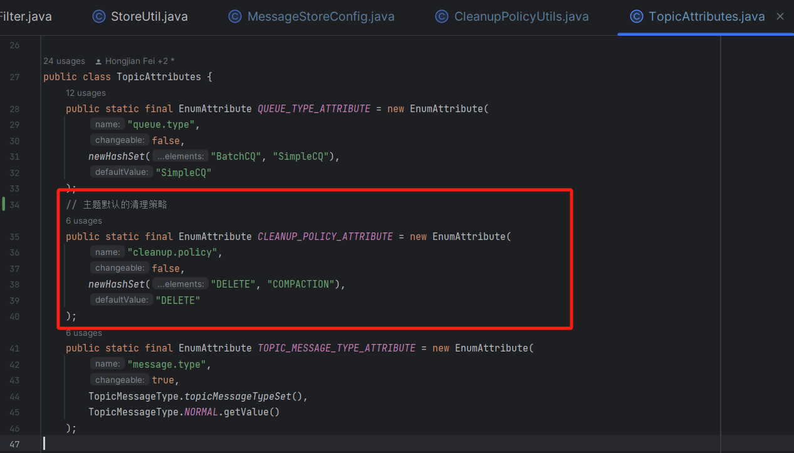

关于清理策略拉取，后续有时间会单独篇章整理，由于篇幅问题，这里就不展开了。

### **3.7.2 校正偏移量**

/\*\*

\* 用于校正下次拉取消息的偏移量

\* @param oldOffset 旧的偏移量

\* @param newOffset 新的偏移量

\* @return 返回校正后的下次拉取消息偏移量

\*/

private long nextOffsetCorrection(long oldOffset,long newOffset) {

long nextOffset \= oldOffset;

// 如果当前角色不是 SLAVE 或者配置了在从节点校验偏移量，则更新为新的偏移量

if (this.getMessageStoreConfig().getBrokerRole() != BrokerRole.SLAVE ||

this.getMessageStoreConfig().isOffsetCheckInSlave()) {

nextOffset = newOffset;

}

return nextOffset;

}

### **3.7.3 估算消息是否在内存中**

/\*\*

\* 根据消息在 CommitLog 中的偏移量和最大偏移量来估算消息是否在内存中

\* 这种估算可能是为了进行消息存储和读取时的内存控制和优化。例如，在消息读取过程中，

\* 可以根据消息在内存中的状态来决定是否从磁盘读取消息，以提高读取效率。

\* @param offsetPy

\* @param maxOffsetPy

\* @return

\*/

private boolean estimateInMemByCommitOffset(long offsetPy, long maxOffsetPy) {

// 计算总物理内存与消息在内存中的最大比例，得到可用于消息的内存大小

// 其中 getAccessMessageInMemoryMaxRatio = 40

long memory \= (long) (StoreUtil.TOTAL\_PHYSICAL\_MEMORY\_SIZE \* (this.messageStoreConfig.getAccessMessageInMemoryMaxRatio() / 100.0));

// 判断消息在内存中的估算值，偏移量差值是否小于等于内存大小

return (maxOffsetPy - offsetPy) <= memory;

}

/\*\*

\* 存储工具类，用于存储相关的辅助方法

\*/

public class StoreUtil {

// 日志记录器

private static final Logger log \= LoggerFactory.getLogger(LoggerName.STORE\_LOGGER\_NAME);

// 获取系统总物理内存大小

public static final long TOTAL\_PHYSICAL\_MEMORY\_SIZE \= getTotalPhysicalMemorySize();

// 获取系统总物理内存大小的方法

@SuppressWarnings("restriction")

public static long getTotalPhysicalMemorySize() {

long physicalTotal \= 1024 \* 1024 \* 1024 \* 24L;// 默认值24GB

OperatingSystemMXBean osmxb \= ManagementFactory.getOperatingSystemMXBean();

// 通过获取操作系统 MXBean 来获取系统物理内存大小

if (osmxb instanceof com.sun.management.OperatingSystemMXBean) {

physicalTotal = ((com.sun.management.OperatingSystemMXBean) osmxb).getTotalPhysicalMemorySize();

}

return physicalTotal;

}

}

### **3.7.4 消息缓冲区是否已填满**

/\*\*

\* 检查批次是否已满

\* @param sizePy 单条消息大小

\* @param unitBatchNum 单元批次消息数

\* @param maxMsgNums 最大消息数

\* @param maxMsgSize 最大消息大小

\* @param bufferTotal 缓冲区总大小

\* @param messageTotal 消息总数

\* @param isInMem 是否在内存中

\* @return 如果批次已满，则返回true；否则返回false

\*/

private boolean isTheBatchFull(int sizePy,int unitBatchNum,int maxMsgNums,long maxMsgSize,int bufferTotal,

int messageTotal,boolean isInMem) {

// 如果缓冲区或消息总数为 0，则返回 false

if (0 == bufferTotal || 0 == messageTotal) {

return false;

}

// 如果添加单元批次消息后超过了最大消息数，则返回 true

if (messageTotal + unitBatchNum > maxMsgNums) {

return true;

}

// 如果添加单条消息后超过了最大消息大小，则返回 true

if (bufferTotal + sizePy > maxMsgSize) {

return true;

}

// 如果消息在内存中，且添加消息后超过了内存中的最大传输字节数，则返回 true

if (isInMem) {

// getMaxTransferBytesOnMessageInMemory = 256M

if ((bufferTotal + sizePy) > this.messageStoreConfig.getMaxTransferBytesOnMessageInMemory()) {

return true;

}

// 如果消息在内存中，且消息总数超过了内存中的最大传输消息数 31，则返回true

return messageTotal > this.messageStoreConfig.getMaxTransferCountOnMessageInMemory() - 1;

} else {

// 如果消息在磁盘中，且添加消息后超过了磁盘中的最大传输字节数 64M，则返回true

if ((bufferTotal + sizePy) > this.messageStoreConfig.getMaxTransferBytesOnMessageInDisk()) {

return true;

}

// 如果消息在磁盘中，且消息总数超过了磁盘中的最大传输消息数 8，则返回true

return messageTotal > this.messageStoreConfig.getMaxTransferCountOnMessageInDisk() - 1;

}

}

## **3.8 消息搜索**

这里我们来看下同步搜索消息，异步会在内部调用同步搜索。

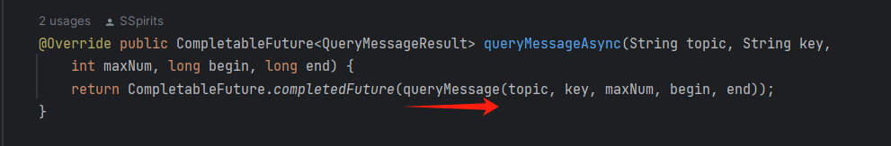

消息搜索是通过 [IndexFile](http://indexfile%20/) 实现的，源码如下：

/\*\*

\* 搜索消息

\* 根据主题、消息键、数量、时间范围等条件进行多次查询

\* @param topic 主题

\* @param key 消息键

\* @param maxNum 最大数量

\* @param begin 开始时间戳

\* @param end 结束时间戳

\* @return 查询消息结果对象

\*/

@Override

public QueryMessageResult queryMessage(String topic,String key,int maxNum,long begin,long end) {

// 创建查询消息结果对象

QueryMessageResult queryMessageResult \= new QueryMessageResult();

// 记录上次查询消息的时间戳为结束时间戳

long lastQueryMsgTime \= end;

// 迭代三次查询

for (int i \= 0;i < 3;i++) {

// 首先调用索引服务从 IndexFile 文件中查询消息偏移量

QueryOffsetResult queryOffsetResult \= this.indexService.queryOffset(topic,key,maxNum,begin,lastQueryMsgTime);

// 如果查询结果中的消息偏移量为空，则退出循环

if (queryOffsetResult.getPhyOffsets().isEmpty()) {

break;

}

// 对消息偏移量进行排序

Collections.sort(queryOffsetResult.getPhyOffsets());

// 设置查询消息结果对象的索引最后更新物理偏移量

queryMessageResult.setIndexLastUpdatePhyoffset(queryOffsetResult.getIndexLastUpdatePhyoffset());

// 设置查询消息结果对象的索引最后更新时间戳

queryMessageResult.setIndexLastUpdateTimestamp(queryOffsetResult.getIndexLastUpdateTimestamp());

// 遍历消息偏移量

for (int m \= 0;m < queryOffsetResult.getPhyOffsets().size();m++) {

// 获取消息偏移量

long offset \= queryOffsetResult.getPhyOffsets().get(m);

try {

// 根据偏移量查找消息

MessageExt msg \= this.lookMessageByOffset(offset);

if (0 == m) {

// 更新上次查询消息的时间戳为消息的存储时间戳

lastQueryMsgTime = msg.getStoreTimestamp();

}

// 根据 offset 从 CommitLog 中获取数据

SelectMappedBufferResult result \= this.commitLog.getData(offset,false);

if (result != null) {

int size \= result.getByteBuffer().getInt(0); // 从ByteBuffer中获取消息大小

result.getByteBuffer().limit(size); // 设置ByteBuffer的限制

result.setSize(size); // 设置结果的大小

queryMessageResult.addMessage(result); // 将消息添加到查询消息结果对象中

}

} catch (Exception e) {

LOGGER.error("queryMessage exception",e); // 记录异常日志

}

}

// 如果查询消息结果中的缓冲区总大小大于0，则退出循环

if (queryMessageResult.getBufferTotalSize() > 0) {

break;

}

// 如果上次查询消息的时间戳小于开始时间戳，则退出循环

if (lastQueryMsgTime < begin) {

break;

}

}

// 返回查询消息结果对象

return queryMessageResult;

}

/\*\*

\* 根据偏移量从 CommitLog 文件中查找消息

\* @param commitLogOffset CommitLog的偏移量

\* @return 返回消息对象，如果未找到则返回null

\*/

@Override

public MessageExt lookMessageByOffset(long commitLogOffset) {

// 从 CommitLog 中获取指定偏移量的消息

SelectMappedBufferResult sbr \= this.commitLog.getMessage(commitLogOffset,4);

if (null != sbr) {

try {

// 1 TOTALSIZE

// 从 ByteBuffer 中获取消息的总大小

int size \= sbr.getByteBuffer().getInt();

// 根据偏移量和消息总大小查找消息

return lookMessageByOffset(commitLogOffset,size);

} finally {

// 释放 SelectMappedBufferResult

sbr.release();

}

}

// 如果未找到消息，则返回null

return null;

}

## **3.9 根据时间戳获取队列偏移量**

/\*\*

\* 根据时间戳获取队列中的偏移量

\* @param topic 主题

\* @param queueId 队列ID

\* @param timestamp 时间戳

\* @return 返回时间戳对应的偏移量

\*/

@Override

public long getOffsetInQueueByTime(String topic,int queueId,long timestamp) {

ConsumeQueueInterface logic \= this.findConsumeQueue(topic,queueId);// 查找消费队列

if (logic != null) {

long resultOffset \= logic.getOffsetInQueueByTime(timestamp);// 根据时间戳获取队列中的偏移量

// 确保结果偏移量在有效范围内

resultOffset = Math.max(resultOffset,logic.getMinOffsetInQueue());

resultOffset = Math.min(resultOffset,logic.getMaxOffsetInQueue());

return resultOffset;

}

return 0;// 未找到消费队列时返回0偏移量

}

这里会从 [ConsumeQueue](http://consumequeue%20/) 文件中根据时间戳获取偏移量，会在后面篇章单独剖析。

## **3.10 根据偏移量获取单条消息**

/\*\*

\* 根据偏移量从CommitLog中选择消息并返回结果

\* @param commitLogOffset CommitLog的偏移量

\* @return 包含消息内容的SelectMappedBufferResult

\*/

@Override

public SelectMappedBufferResult selectOneMessageByOffset(long commitLogOffset) {

// 从CommitLog中获取指定偏移量的消息内容

SelectMappedBufferResult sbr \= this.commitLog.getMessage(commitLogOffset,4);

if (null != sbr) {

try {

// 1 TOTALSIZE

// 从ByteBuffer中获取消息的总大小

int size \= sbr.getByteBuffer().getInt();

// 根据偏移量和消息总大小再次获取消息内容

return this.commitLog.getMessage(commitLogOffset,size);

} finally {

sbr.release(); // 释放SelectMappedBufferResult

}

}

return null; // 如果未找到消息，则返回null

}

/\*\*

\* 根据偏移量和消息大小从CommitLog中选择消息并返回结果

\* @param commitLogOffset CommitLog的偏移量

\* @param msgSize 消息的大小

\* @return 包含消息内容的SelectMappedBufferResult

\*/

@Override

public SelectMappedBufferResult selectOneMessageByOffset(long commitLogOffset,int msgSize) {

// 从CommitLog中获取指定偏移量和消息大小的消息内容

return this.commitLog.getMessage(commitLogOffset,msgSize);

}

这里会从 [CommitLog](http://commitlog/) 文件中根据偏移量获取单条消息，会在后面篇章单独剖析。

还有很多其他方法，这里就不一一展开剖析了，自行研究，如果有问题可以评论区讨论，也可以私聊我。

## **04 总结**

[DefaultMessageStore](http://defaultmessagestore/) 底层依赖 [CommitLog](http://commitlog/)、[ConsumeQueue](http://consumequeue/)、[IndexFile](http://indexfile/) 这三类文件实现了消息存储检索的功能。

[DefaultMessageStore](http://defaultmessagestore/) 作为 RocketMQ 底层存储的最外层接口，提供了消息存、取、消息HA 等功能。