大家好，我是**华仔**, 又跟大家见面了。

从今天开始我将继续为大家奉上 RocketMQ 消费者源码剖析系列文章，正式开启「**RocketMQ 的服务端 Broker 源码之旅**」，这是第十三篇，本篇我们将以「**RocketMQ 5.1.2**」版本为主，来剖析下 RocketMQ 源码之 BrokerOuterAPI 发送请求组件剖析。

这里我将以「**RocketMQ 5.1.2**」版本为主，通过「**场景驱动**」的方式带大家一点点的对 RocketMQ 源码进行深度剖析，正式开启「**RocketMQ 的源码之旅**」，跟我一起来掌握 RocketMQ 源码核心架构设计思想吧。

  
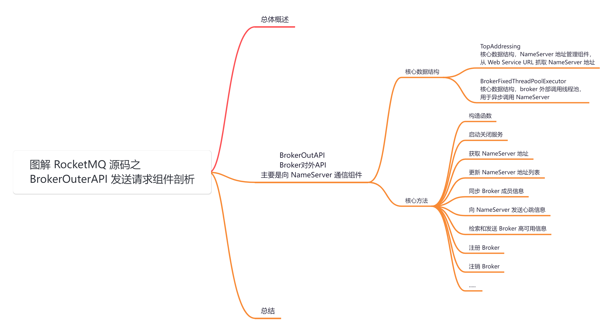

## **01 总体概述**

在 [BrokerController 构造方法](https://articles.zsxq.com/id_chxqzhg8psk4.html) 里面创建了很多「**管理器**」、「**处理器**」、「**线程队列**」等，跟本文有关系的就是下面这个组件，该组件是「**Broker 端**」向「**NameServer 集群**」发送请求的，它主要负责使用 「**RemotingClient**」网络通信客户端向「**NameServer 集群**」集群发送请求。主要操作包括：

1.  注册 Broker 信息到 NameServer 集群。
2.  取消注册 Broker。
3.  询问 NameServer 集群是否需要更新 Broker 的注册信息。
4.  获取所有 topic 配置。
5.  获取所有消费者配置。
6.  获取所有延迟消息。
7.  获取所有消费者订阅配置。

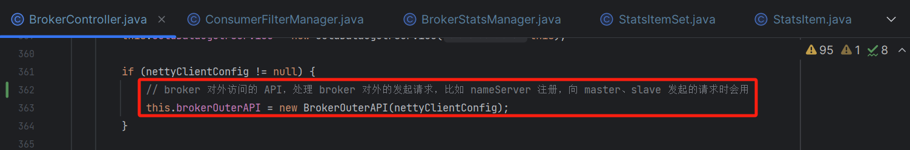

那么今天我们就来看看这个类的源码实现。

## **02 BrokerOutAPI**

源码位置：[https://github.com/apache/rocketmq/blob/release-5.1.2/broker/src/main/java/org/apache/rocketmq/broker/](https://github.com/apache/rocketmq/blob/release-5.1.2/broker/src/main/java/org/apache/rocketmq/broker/out/BrokerOuterAPI.java)[out/BrokerOuterAPI](https://github.com/apache/rocketmq/blob/release-5.1.2/broker/src/main/java/org/apache/rocketmq/broker/out/BrokerOuterAPI.java)[.java](https://github.com/apache/rocketmq/blob/release-5.1.2/broker/src/main/java/org/apache/rocketmq/broker/out/BrokerOuterAPI.java)

## **2.1 核心数据结构**

/\*\*

\* broker 向 NameServer 发送请求组件

\*/

public class BrokerOuterAPI {

private static final Logger LOGGER \= LoggerFactory.getLogger(LoggerName.BROKER\_LOGGER\_NAME);

// Netty 客户端网络通信组件

private final RemotingClient remotingClient;

// AddressServer 配置

// NameServer 地址管理组件，从 Web Service URL 抓取 NameServer 地址

private final TopAddressing topAddressing \= new DefaultTopAddressing(MixAll.getWSAddr());

// broker 外部调用线程池，用于异步调用 NameServer，核心线程数 4 个，最大线程数 10 个，线程存活时间 1 分钟，队列长度 32

private final BrokerFixedThreadPoolExecutor brokerOuterExecutor \= new BrokerFixedThreadPoolExecutor(4, 10, 1, TimeUnit.MINUTES,

new ArrayBlockingQueue<>(32), new ThreadFactoryImpl("brokerOutApi\_thread\_", true));

// 客户端元数据

private final ClientMetadata clientMetadata;

// rpc 客户端

private final RpcClient rpcClient;

// NameServer 地址

private String nameSrvAddr \= null;

....

}

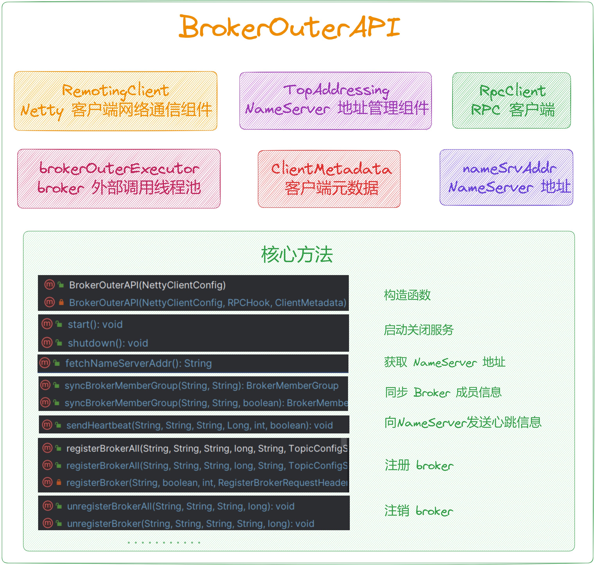

## **2.2 核心方法**

### **2.2.1 构造函数**

public BrokerOuterAPI(final NettyClientConfig nettyClientConfig) {

this(nettyClientConfig, new DynamicalExtFieldRPCHook(), new ClientMetadata());

}

private BrokerOuterAPI(final NettyClientConfig nettyClientConfig, RPCHook rpcHook, ClientMetadata clientMetadata) {

// 创建 Netty 客户端

this.remotingClient = new NettyRemotingClient(nettyClientConfig);

this.clientMetadata = clientMetadata;

// 注册 RPC 钩子函数

this.remotingClient.registerRPCHook(rpcHook);

// 创建 RPC 客户端

this.rpcClient = new RpcClientImpl(this.clientMetadata, this.remotingClient);

}

### **2.2.2 启动关闭服务**

// 启动 Netty 网络通信客户端组件

public void start() {

this.remotingClient.start();

}

// 关闭网络通信客户端组件，关闭线程池

public void shutdown() {

// 关闭网络通信客户端组件

this.remotingClient.shutdown();

// 关闭线程池

this.brokerOuterExecutor.shutdown();

}

### **2.2.3 获取 NameServer 地址**

/\*\*

\* 获取 NameServer 地址

\* @return

\*/

public String fetchNameServerAddr() {

try {

// 使用 NameServer 地址管理组件从 Web Service URL 抓取 NameServer 地址

String addrs \= this.topAddressing.fetchNSAddr();

// 地址不为空

if (!UtilAll.isBlank(addrs)) {

// 与当前的NameServer地址不同

if (!addrs.equals(this.nameSrvAddr)) {

// 打印日志，记录 NameServer 地址的变更情况。

LOGGER.info("name server address changed, old: {} new: {}", this.nameSrvAddr, addrs);

// 更新 NameServer 地址列表

this.updateNameServerAddressList(addrs);

this.nameSrvAddr = addrs;

// 返回新的 NameServer 地址

return nameSrvAddr;

}

}

} catch (Exception e) {

LOGGER.error("fetchNameServerAddr Exception", e);

}

return nameSrvAddr;

}

我们重点来看下这个类是如何实现的。

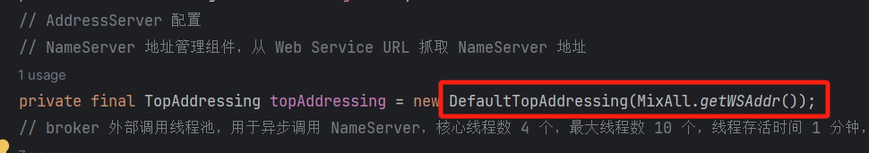

public class DefaultTopAddressing implements TopAddressing {

private static final Logger LOGGER \= LoggerFactory.getLogger(LoggerName.COMMON\_LOGGER\_NAME);

// 存储 NameServer 地址

private String nsAddr;

// 存储 Web 服务地址

private String wsAddr;

// 存储单元名称

private String unitName;

// 存储一组参数

private Map<String, String> para;

// 用于存储 TopAddressing 对象的列表

private List<TopAddressing> topAddressingList;

@Override

public final String fetchNSAddr() {

// 检查 topAddressingList 是否不为空

if (!topAddressingList.isEmpty()) {

// 遍历 topAddressingList 中的 TopAddressing 对象

for (TopAddressing topAddressing : topAddressingList) {

// 获取 NameServer 地址

String nsAddress \= topAddressing.fetchNSAddr();

// 检查获取到的 NameServer 地址是否非空

if (!Strings.isNullOrEmpty(nsAddress)) {

// 如果获取到有效的 NameServer 地址，则直接返回

return nsAddress;

}

}

}

// Return result of default implementation

// 如果 topAddressingList 为空或者获取 NameServer 地址失败，则调用重载的 fetchNSAddr 方法，并传入 tru 和 3000 作为参数

return fetchNSAddr(true, 3000);

}

/\*\*

\* 默认实现

\* @param verbose

\* @param timeoutMills

\* @return

\*/

public final String fetchNSAddr(boolean verbose, long timeoutMills) {

// 获取 wsAddr 作为基础 URL

String url \= this.wsAddr;

try {

// 检查 para 是否不为空且含有元素

if (null != para && para.size() > 0) {

// 检查 unitName 是否非空

if (!UtilAll.isBlank(this.unitName)) {

// 构建 URL 参数

url = url + "-" + this.unitName + "?nofix=1&";

}

else {

// 如果 unitName 为空，则构建 URL 参数

url = url + "?";

}

// 遍历 para 中的键值对

for (Map.Entry<String, String> entry : this.para.entrySet()) {

// 添加 URL 参数

url += entry.getKey() + "=" + entry.getValue() + "&";

}

// 移除最后的 "&"

url = url.substring(0, url.length() - 1);

}

else {

// 否则检查 unitName 是否非空

if (!UtilAll.isBlank(this.unitName)) {

// 构建 URL 参数

url = url + "-" + this.unitName + "?nofix=1";

}

}

// 发起 HTTP GET 请求

HttpTinyClient.HttpResult result \= HttpTinyClient.httpGet(url, null, null, "UTF-8", timeoutMills);

if (200 == result.code) {

// 获取 HTTP 响应内容

String responseStr \= result.content;

if (responseStr != null) {

// 返回处理过的响应内容

return clearNewLine(responseStr);

} else {

// 记录错误日志

LOGGER.error("fetch nameserver address is null");

}

} else {

// 记录错误日志

LOGGER.error("fetch nameserver address failed. statusCode=" + result.code);

}

} catch (IOException e) {

if (verbose) {

// 记录详细错误日志

LOGGER.error("fetch name server address exception", e);

}

}

// 如果需要详细日志

if (verbose) {

// 构建错误信息

String errorMsg \=

"connect to " + url + " failed, maybe the domain name " + MixAll.getWSAddr() + " not bind in /etc/hosts";

// 添加 FAQUrl 建议

errorMsg += FAQUrl.suggestTodo(FAQUrl.NAME\_SERVER\_ADDR\_NOT\_EXIST\_URL);

// 记录警告日志

LOGGER.warn(errorMsg);

}

// 获取 NameServer 地址失败返回空

return null;

}

....

}

### **2.2.3 更新 NameServer 地址列表**

/\*\*

\* 根据地址来更新 NameServer 地址列表

\* @param addrs

\*/

public void updateNameServerAddressList(final String addrs) {

// 使用分号分割传入的地址字符串，得到地址数组

String\[\] addrArray = addrs.split(";");

// 将地址数组转换为 ArrayList

List<String> lst = new ArrayList<String>(Arrays.asList(addrArray));

// 更新 NameServer 地址列表

this.remotingClient.updateNameServerAddressList(lst);

}

/\*\*

\* 根据域名进行 DNS 查找并更新 NameServer 地址列表

\* @param domain

\*/

public void updateNameServerAddressListByDnsLookup(final String domain) {

// 通过域名进行DNS查找，获取地址列表

List<String> lst = this.dnsLookupAddressByDomain(domain);

// 更新 NameServer 地址列表

this.remotingClient.updateNameServerAddressList(lst);

}

/\*\*

\* NettyRemotingClient 类方法

\* 更新 NameServer 地址列表

\* @param addrs

\*/

@Override

public void updateNameServerAddressList(List<String> addrs) {

// 获取当前的 NameServer 地址列表

List<String> old = this.namesrvAddrList.get();

// 标记是否需要进行更新

boolean update \= false;

// 检查传入的 NameServer 地址列表是否非空

if (!addrs.isEmpty()) {

if (null == old) {

// 如果当前的 NameServer 地址列表为空，则需要更新

update = true;

} else if (addrs.size() != old.size()) {

// 如果新旧地址列表长度不一致，则需要更新

update = true;

} else {

for (String addr : addrs) {

if (!old.contains(addr)) {

// 如果旧地址列表中不包含该地址，则需要更新

update = true;

break;

}

}

}

// 如果需要更新

if (update) {

// 打乱新的地址列表的顺序

Collections.shuffle(addrs);

LOGGER.info("name server address updated. NEW : {} , OLD: {}", addrs, old);

// 更新 NameServer 地址列表

this.namesrvAddrList.set(addrs);

// should close the channel if choosed addr is not exist.

// 如果已选择的地址不在新的地址列表中

if (this.namesrvAddrChoosed.get() != null && !addrs.contains(this.namesrvAddrChoosed.get())) {

// 获取已选择的地址

String namesrvAddr \= this.namesrvAddrChoosed.get();

for (String addr : this.channelTables.keySet()) {

// 如果包含已选择的地址

if (addr.contains(namesrvAddr)) {

// 获取对应的ChannelWrapper

ChannelWrapper channelWrapper \= this.channelTables.get(addr);

if (channelWrapper != null) {

// 关闭对应的通道

closeChannel(channelWrapper.getChannel());

}

}

}

}

}

}

}

/\*\*

\* NettyRemotingClient 类方法

\* 关闭指定的 Channel 对象

\* @param channel

\*/

public void closeChannel(final Channel channel) {

if (null == channel) {

return;

}

try {

// 尝试获取锁，3秒超时

if (this.lockChannelTables.tryLock(LOCK\_TIMEOUT\_MILLIS, TimeUnit.MILLISECONDS)) {

try {

// 标记是否需要从表中移除目标通道

boolean removeItemFromTable \= true;

// 记录前一个 ChannelWrapper

ChannelWrapper prevCW \= null;

// 记录远程地址

String addrRemote \= null;

// 遍历 channelTables 通道表中的每个条目

for (Map.Entry<String, ChannelWrapper> entry : channelTables.entrySet()) {

// 获取键（远程地址）

String key \= entry.getKey();

// 获取值（通道包装器）

ChannelWrapper prev \= entry.getValue();

// 如果通道包装器中的通道不为空

if (prev.getChannel() != null) {

// 如果通道包装器中的通道就是要关闭的通道

if (prev.getChannel() == channel) {

// 记录前一个通道包装器

prevCW = prev;

// 记录远程地址

addrRemote = key;

break;

}

}

}

// 如果找不到对应的通道包装器

if (null == prevCW) {

// 记录日志，说明该通道已经在关闭前从通道表中删除

LOGGER.info("eventCloseChannel: the channel\[{}\] has been removed from the channel table before", addrRemote);

// 不需要从表中移除该通道

removeItemFromTable = false;

}

// 如果需要从表中移除该通道

if (removeItemFromTable) {

// 从通道表中移除该通道

this.channelTables.remove(addrRemote);

// 记录日志，说明该通道已从通道表中移除

LOGGER.info("closeChannel: the channel\[{}\] was removed from channel table", addrRemote);

// 关闭通道

RemotingHelper.closeChannel(channel);

}

} catch (Exception e) {

LOGGER.error("closeChannel: close the channel exception", e);

} finally {

this.lockChannelTables.unlock();

}

} else {

LOGGER.warn("closeChannel: try to lock channel table, but timeout, {}ms", LOCK\_TIMEOUT\_MILLIS);

}

} catch (InterruptedException e) {

LOGGER.error("closeChannel exception", e);

}

}

### **2.2.4 同步 Broker 成员信息**

/\*\*

\* 同步Broker成员组信息

\* @param clusterName 集群名称

\* @param brokerName Broker名称

\* @return BrokerMemberGroup对象

\* @throws InterruptedException 线程中断异常

\* @throws RemotingTimeoutException 远程调用超时异常

\* @throws RemotingSendRequestException 远程调用发送请求异常

\* @throws RemotingConnectException 远程调用连接异常

\*/

public BrokerMemberGroup syncBrokerMemberGroup(String clusterName,String brokerName)

throws InterruptedException,RemotingTimeoutException,RemotingSendRequestException,RemotingConnectException {

return syncBrokerMemberGroup(clusterName,brokerName,false);

}

/\*\*

\* 根据参数决定调用不同的方法来同步Broker成员组信息

\* @param clusterName 集群名称

\* @param brokerName Broker名称

\* @param isCompatibleWithOldNameSrv 是否与旧的NameServer兼容

\* @return BrokerMemberGroup对象

\* @throws InterruptedException 线程中断异常

\* @throws RemotingTimeoutException 远程调用超时异常

\* @throws RemotingSendRequestException 远程调用发送请求异常

\* @throws RemotingConnectException 远程调用连接异常

\*/

public BrokerMemberGroup syncBrokerMemberGroup(String clusterName,String brokerName,boolean isCompatibleWithOldNameSrv)

throws InterruptedException,RemotingTimeoutException,RemotingSendRequestException,RemotingConnectException {

if (isCompatibleWithOldNameSrv) {

return getBrokerMemberGroupCompatible(clusterName,brokerName);// 如果与旧的 NameServer 兼容，调用对应方法

} else {

return getBrokerMemberGroup(clusterName,brokerName);// 否则调用对应方法

}

}

/\*\*

\* 获取指定集群和Broker的成员组信息

\* @param clusterName 集群名称

\* @param brokerName Broker名称

\* @return BrokerMemberGroup对象

\* @throws InterruptedException 线程中断异常

\* @throws RemotingTimeoutException 远程调用超时异常

\* @throws RemotingSendRequestException 远程调用发送请求异常

\* @throws RemotingConnectException 远程调用连接异常

\*/

public BrokerMemberGroup getBrokerMemberGroup(String clusterName,String brokerName)

throws InterruptedException,RemotingTimeoutException,RemotingSendRequestException,RemotingConnectException {

// 创建 BrokerMemberGroup 对象

BrokerMemberGroup brokerMemberGroup \= new BrokerMemberGroup(clusterName,brokerName);

// 创建 GetBrokerMemberGroupRequestHeader 并设置集群名称和 Broker 名称

GetBrokerMemberGroupRequestHeader requestHeader \= new GetBrokerMemberGroupRequestHeader();

requestHeader.setClusterName(clusterName);

requestHeader.setBrokerName(brokerName);

// 创建请求命令 code = GET\_BROKER\_MEMBER\_GROUP

RemotingCommand request \= RemotingCommand.createRequestCommand(RequestCode.GET\_BROKER\_MEMBER\_GROUP,requestHeader);

// 发起同步调用，获取响应

RemotingCommand response \= this.remotingClient.invokeSync(null,request,3000);

assert response != null;

// 根据响应结果处理

switch (response.getCode()) {

case ResponseCode.SUCCESS:{

// 获取响应体字节数组

byte\[\] body = response.getBody();

if (body != null) {

// 解码响应体为 GetBrokerMemberGroupResponseBody 对象

GetBrokerMemberGroupResponseBody brokerMemberGroupResponseBody \=

GetBrokerMemberGroupResponseBody.decode(body,GetBrokerMemberGroupResponseBody.class);

// 返回解析得到的 BrokerMemberGroup 对象

return brokerMemberGroupResponseBody.getBrokerMemberGroup();

}

}

default:

break;

}

// 返回初始创建的 BrokerMemberGroup 对象

return brokerMemberGroup;

}

/\*\*

\* 在兼容旧的NameServer情况下获取指定集群和Broker的成员组信息

\* @param clusterName 集群名称

\* @param brokerName Broker名称

\* @return BrokerMemberGroup对象

\* @throws InterruptedException 线程中断异常

\* @throws RemotingTimeoutException 远程调用超时异常

\* @throws RemotingSendRequestException 远程调用发送请求异常

\* @throws RemotingConnectException 远程调用连接异常

\*/

public BrokerMemberGroup getBrokerMemberGroupCompatible(String clusterName,String brokerName)

throws InterruptedException,RemotingTimeoutException,RemotingSendRequestException,RemotingConnectException {

// 创建 BrokerMemberGroup 对象

BrokerMemberGroup brokerMemberGroup \= new BrokerMemberGroup(clusterName,brokerName);

// 创建 GetRouteInfoRequestHeader 并设置要查询的主题名称

GetRouteInfoRequestHeader requestHeader \= new GetRouteInfoRequestHeader();

requestHeader.setTopic(TopicValidator.SYNC\_BROKER\_MEMBER\_GROUP\_PREFIX + brokerName);

// 创建请求命令 code = GET\_ROUTEINFO\_BY\_TOPIC

RemotingCommand request \= RemotingCommand.createRequestCommand(RequestCode.GET\_ROUTEINFO\_BY\_TOPIC,requestHeader);

// 发起同步调用，获取响应

RemotingCommand response \= this.remotingClient.invokeSync(null,request,3000);

assert response != null;

// 根据响应结果处理

switch (response.getCode()) {

case ResponseCode.SUCCESS:{

// 获取响应体字节数组

byte\[\] body = response.getBody();

if (body != null) {

// 解码响应体为 TopicRouteData 对象

TopicRouteData topicRouteData \= TopicRouteData.decode(body,TopicRouteData.class);

for (BrokerData brokerData :topicRouteData.getBrokerDatas()) {

if (brokerData != null

&& brokerData.getBrokerName().equals(brokerName)

&& brokerData.getCluster().equals(clusterName)) {

// 将 Broker 的地址信息添加到 brokerMemberGroup 中

brokerMemberGroup.getBrokerAddrs().putAll(brokerData.getBrokerAddrs());

break;

}

}

return brokerMemberGroup;

}

}

default:

break;

}

// 返回初始创建的 BrokerMemberGroup 对象

return brokerMemberGroup;

}

### **2.2.5 向 NameServer 发送心跳信息**

/\*\*

\* 向 NameServer 发送心跳信息

\* @param clusterName 集群名称

\* @param brokerAddr Broker地址

\* @param brokerName Broker名称

\* @param brokerId Broker ID

\* @param timeoutMills 超时时间（毫秒）

\* @param isInBrokerContainer 是否在Broker容器中

\*/

public void sendHeartbeat(final String clusterName,

final String brokerAddr,

final String brokerName,

final Long brokerId,

final int timeoutMills,

final boolean isInBrokerContainer) {

// 获取可用的 NameServer 地址列表

List<String> nameServerAddressList = this.remotingClient.getAvailableNameSrvList();

// 创建 BrokerHeartbeatRequestHeader 并设置集群名称、Broker 地址和 Broker 名称

final BrokerHeartbeatRequestHeader requestHeader \= new BrokerHeartbeatRequestHeader();

requestHeader.setClusterName(clusterName);

requestHeader.setBrokerAddr(brokerAddr);

requestHeader.setBrokerName(brokerName);

// 如果存在可用的 NameServer 地址列表

if (nameServerAddressList != null && nameServerAddressList.size() > 0) {

// 遍历 NameServer 地址列表

for (final String namesrvAddr :nameServerAddressList) {

// 提交任务到线程池

brokerOuterExecutor.execute(new AbstractBrokerRunnable(new BrokerIdentity(clusterName,brokerName,brokerId,isInBrokerContainer)) {

@Override

public void run0() {

// 创建心跳请求命令

RemotingCommand request \= RemotingCommand.createRequestCommand(RequestCode.BROKER\_HEARTBEAT,requestHeader);

try {

// 发起单向调用，向 NameServer 发送心跳

BrokerOuterAPI.this.remotingClient.invokeOneway(

namesrvAddr,request,timeoutMills);

} catch (Exception e) {

LOGGER.error("sendHeartbeat Exception " + namesrvAddr,e);

}

}

});

}

}

}

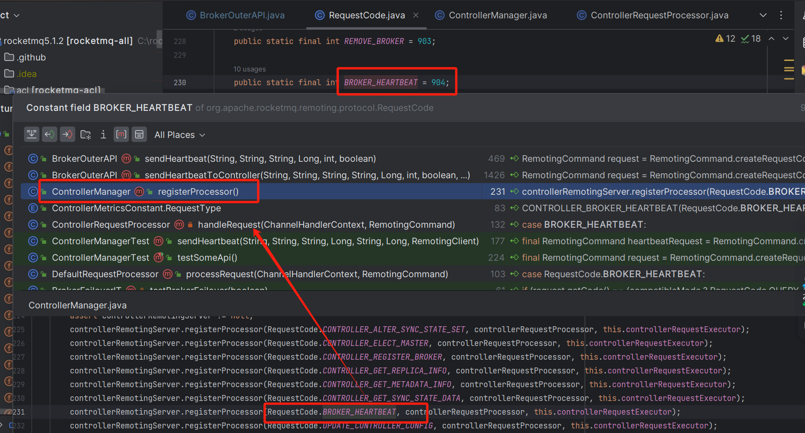

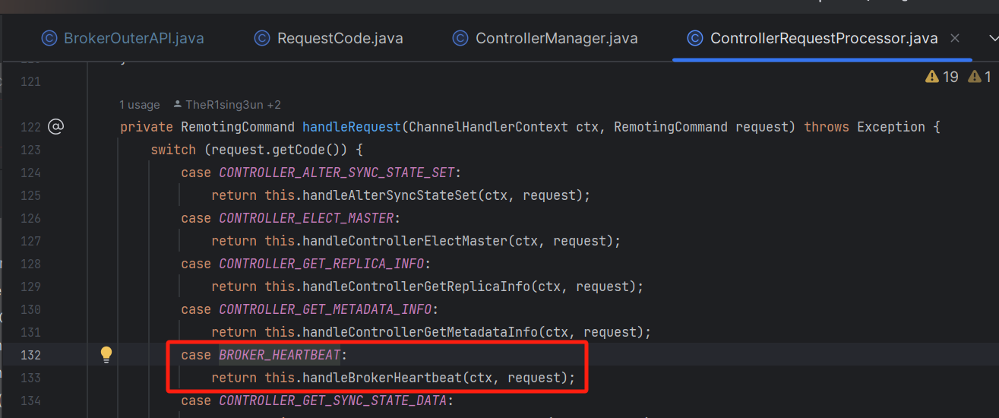

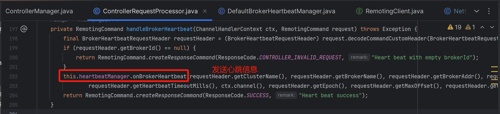

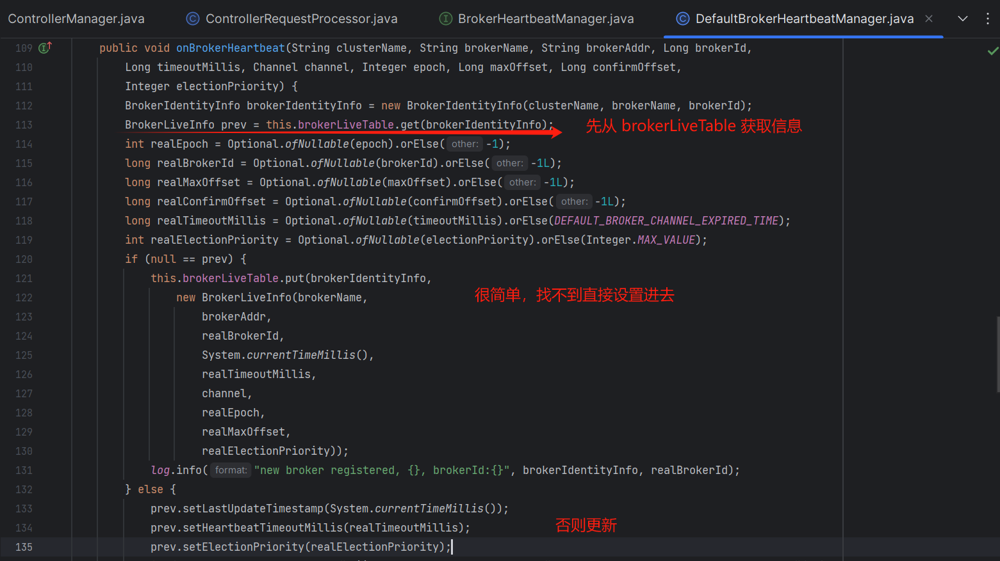

关于 [BrokerLiveInfo](http://brokerliveinfo%20/) 结构图如下：

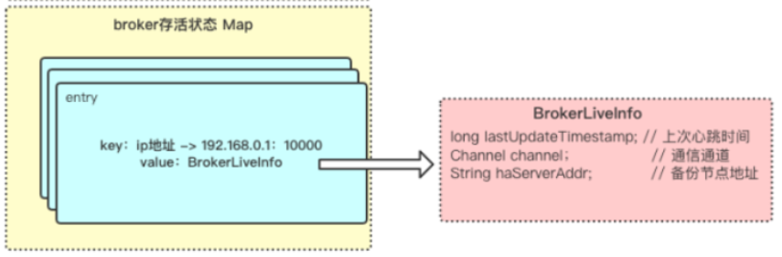

### **2.2.6 检索和发送 Broker 高可用信息**

/\*\*

\* 检索 Broker 的高可用信息

\* @param masterBrokerAddr 主 Broker 地址

\* @return BrokerSyncInfo

\* @throws InterruptedException 线程中断异常

\* @throws RemotingTimeoutException 远程调用超时异常

\* @throws RemotingSendRequestException 远程调用发送请求异常

\* @throws RemotingConnectException 远程调用连接异常

\* @throws MQBrokerException MQBroker异常

\* @throws RemotingCommandException 远程命令异常

\*/

public BrokerSyncInfo retrieveBrokerHaInfo(String masterBrokerAddr)

throws InterruptedException,RemotingTimeoutException,RemotingSendRequestException,RemotingConnectException,

MQBrokerException,RemotingCommandException {

// 构建请求头

ExchangeHAInfoRequestHeader requestHeader \= new ExchangeHAInfoRequestHeader();

requestHeader.setMasterHaAddress(null);

// 创建请求命令 code = EXCHANGE\_BROKER\_HA\_INFO

RemotingCommand request \= RemotingCommand.createRequestCommand(RequestCode.EXCHANGE\_BROKER\_HA\_INFO,requestHeader);

// 发起同步调用，获取响应

RemotingCommand response \= this.remotingClient.invokeSync(masterBrokerAddr,request,3000);

assert response != null;

switch (response.getCode()) {

case ResponseCode.SUCCESS:{

// 返回响应头

ExchangeHAInfoResponseHeader responseHeader \= (ExchangeHAInfoResponseHeader) response.decodeCommandCustomHeader(ExchangeHAInfoResponseHeader.class);

return new BrokerSyncInfo(responseHeader.getMasterHaAddress(),responseHeader.getMasterFlushOffset(),responseHeader.getMasterAddress());

}

default:

break;

}

throw new MQBrokerException(response.getCode(),response.getRemark());

}

/\*\*

\* 发送 Broker 的高可用信息

\* @param brokerAddr Broker 地址

\* @param masterHaAddr 主 Broker 的高可用地址

\* @param brokerInitMaxOffset Broker 的初始最大偏移量

\* @param masterAddr 主 Broker 地址

\* @throws InterruptedException 线程中断异常

\* @throws RemotingTimeoutException 远程调用超时异常

\* @throws RemotingSendRequestException 远程调用发送请求异常

\* @throws RemotingConnectException 远程调用连接异常

\* @throws MQBrokerException MQBroker 异常

\*/

public void sendBrokerHaInfo(String brokerAddr,String masterHaAddr,long brokerInitMaxOffset,String masterAddr)

throws InterruptedException,RemotingTimeoutException,RemotingSendRequestException,RemotingConnectException,MQBrokerException {

// 构建请求头

ExchangeHAInfoRequestHeader requestHeader \= new ExchangeHAInfoRequestHeader();

// 设置 Ha 地址

requestHeader.setMasterHaAddress(masterHaAddr);

// 将 Broker 的初始最大偏移量设置为主 Broker 的刷新偏移量

// 其中 masterFlushOffset 表示主 Broker 的刷新偏移量，brokerInitMaxOffset 为 Broker 的初始最大偏移量。

requestHeader.setMasterFlushOffset(brokerInitMaxOffset);

// 设置主节点地址

requestHeader.setMasterAddress(masterAddr);

// 创建请求命令 code = EXCHANGE\_BROKER\_HA\_INFO

RemotingCommand request \= RemotingCommand.createRequestCommand(RequestCode.EXCHANGE\_BROKER\_HA\_INFO,requestHeader);

// 发起同步调用，获取响应

RemotingCommand response \= this.remotingClient.invokeSync(brokerAddr,request,3000);

assert response != null;

switch (response.getCode()) {

case ResponseCode.SUCCESS:{

return;

}

default:

break;

}

throw new MQBrokerException(response.getCode(),response.getRemark());

}

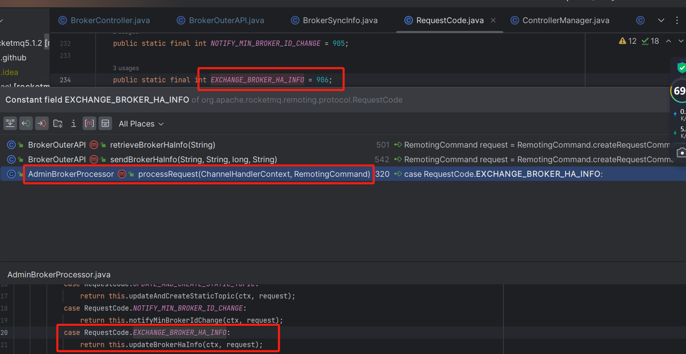

/\*\*

\* AdminBrokerProcessor 类方法

\* 更新Broker的高可用信息

\* @param ctx ChannelHandlerContext

\* @param request RemotingCommand

\* @return RemotingCommand

\* @throws RemotingCommandException 远程命令异常

\*/

private RemotingCommand updateBrokerHaInfo(ChannelHandlerContext ctx,RemotingCommand request) throws RemotingCommandException {

// 创建响应命令

RemotingCommand response \= RemotingCommand.createResponseCommand(ExchangeHAInfoResponseHeader.class);

// 解码请求命令的自定义头部 ExchangeHAInfoRequestHeader

ExchangeHAInfoRequestHeader requestHeader \= (ExchangeHAInfoRequestHeader) request.decodeCommandCustomHeader(ExchangeHAInfoRequestHeader.class);

if (requestHeader.getMasterHaAddress() != null) {

// 如果请求中包含主 Broker 的高可用地址，则更新消息存储中的主 Broker 高可用地址和主 Broker 地址

this.brokerController.getMessageStore().updateHaMasterAddress(requestHeader.getMasterHaAddress());

this.brokerController.getMessageStore().updateMasterAddress(requestHeader.getMasterAddress());

// 如果主Broker的刷盘偏移量为 0 且在启动时需要同步主 Broker 刷盘偏移量

if (this.brokerController.getMessageStore().getMasterFlushedOffset() == 0

&& this.brokerController.getMessageStoreConfig().isSyncMasterFlushOffsetWhenStartup()) {

// 设置从 Broker 的刷盘偏移量为主 Broker 的刷盘偏移量

LOGGER.info("Set master flush offset in slave to {}",requestHeader.getMasterFlushOffset());

this.brokerController.getMessageStore().setMasterFlushedOffset(requestHeader.getMasterFlushOffset());

}

} else if (this.brokerController.getBrokerConfig().getBrokerId() == MixAll.MASTER\_ID) {

// 如果请求中不包含主 Broke r的高可用地址且当前 Broker 为主 Broker，则设置响应的主 Broker 高可用地址、刷盘偏移量和主 Broker 地址

final ExchangeHAInfoResponseHeader responseHeader \= (ExchangeHAInfoResponseHeader) response.readCustomHeader();

responseHeader.setMasterHaAddress(this.brokerController.getHAServerAddr());

responseHeader.setMasterFlushOffset(this.brokerController.getMessageStore().getBrokerInitMaxOffset());

responseHeader.setMasterAddress(this.brokerController.getBrokerAddr());

}

// 设置响应码为 SUCCESS，清空备注

response.setCode(ResponseCode.SUCCESS);

response.setRemark(null);

// 返回响应命令

return response;

}

### **2.2.7 注册 Broker**

public List<RegisterBrokerResult> registerBrokerAll(

final String clusterName,

final String brokerAddr,

final String brokerName,

final long brokerId,

final String haServerAddr,

final TopicConfigSerializeWrapper topicConfigWrapper,

final List<String> filterServerList,

final boolean oneway,

final int timeoutMills,

final boolean enableActingMaster,

final boolean compressed,

final BrokerIdentity brokerIdentity) {

return registerBrokerAll(clusterName,

brokerAddr,

brokerName,

brokerId,

haServerAddr,

topicConfigWrapper,

filterServerList,

oneway, timeoutMills,

enableActingMaster,

compressed,

null,

brokerIdentity);

}

/\*\*

\* Considering compression brings much CPU overhead to name server, stream API will not support compression and

\* compression feature is deprecated.

\* broker 向 所有 nameServer 进行注册

\* @param clusterName

\* @param brokerAddr

\* @param brokerName

\* @param brokerId

\* @param haServerAddr

\* @param topicConfigWrapper

\* @param filterServerList

\* @param oneway

\* @param timeoutMills

\* @param compressed default false

\* @return

\*/

public List<RegisterBrokerResult> registerBrokerAll(

final String clusterName,

final String brokerAddr,

final String brokerName,

final long brokerId,

final String haServerAddr,

final TopicConfigSerializeWrapper topicConfigWrapper,

final List<String> filterServerList,

final boolean oneway,

final int timeoutMills,

final boolean enableActingMaster,

final boolean compressed,

final Long heartbeatTimeoutMillis,

final BrokerIdentity brokerIdentity) {

// 创建一个 CopyOnWriteArrayList 类型的集合 用来保存请求的返回结果

final List<RegisterBrokerResult> registerBrokerResultList = new CopyOnWriteArrayList<>();

// 获得 nameServer 的地址信息集合

List<String> nameServerAddressList = this.remotingClient.getAvailableNameSrvList();

// 如果获取到的 nameServer 地址信息集合不为 null && 集合长度 > 0

if (nameServerAddressList != null && nameServerAddressList.size() > 0) {

// 封装请求头

final RegisterBrokerRequestHeader requestHeader \= new RegisterBrokerRequestHeader();

requestHeader.setBrokerAddr(brokerAddr); // broker地址 ip:port

requestHeader.setBrokerId(brokerId); // brokerId 也就是角色，等于 0 为 master， 大于 0 为 slave

requestHeader.setBrokerName(brokerName);

requestHeader.setClusterName(clusterName); // broker 集群名称

requestHeader.setHaServerAddr(haServerAddr); // haServer 地址

requestHeader.setEnableActingMaster(enableActingMaster); // 是否替代主节点

requestHeader.setCompressed(false); // 是否开启压缩

if (heartbeatTimeoutMillis != null) {

// 如果心跳超时毫秒不为 null ，将其也封装在请求头里面

requestHeader.setHeartbeatTimeoutMillis(heartbeatTimeoutMillis);

}

/\*\*

\* 封装请求体

\* 当前 broker 所有的 topic 信息，名称，读写队列数以及版本信息 dataVersion

\* 依次向各个 nameServer 注册

\*/

RegisterBrokerBody requestBody \= new RegisterBrokerBody();

requestBody.setTopicConfigSerializeWrapper(TopicConfigAndMappingSerializeWrapper.from(topicConfigWrapper));

requestBody.setFilterServerList(filterServerList);

final byte\[\] body = requestBody.encode(compressed);

final int bodyCrc32 \= UtilAll.crc32(body);

requestHeader.setBodyCrc32(bodyCrc32);

/\*\*

\* CountDownLatch：

\* 它是一个同步工具类，用来协调多个线程之间的同步，或者说起到线程之间的通信（而不是用作互斥的作用）。

\* 它能够使一个线程在等待另外一些线程完成各自工作之后，再继续执行。使用一个计数器进行实现。计数器初始值为线程的数量。

\* 当每一个线程完成自己任务后，计数器的值就会减一。当计数器的值为0时，表示所有的线程都已经完成一些任务，然后在CountDownLatch上等待的线程就可以恢复执行接下来的任务。

\* 使用 CountDownLatch 作为倒数计数器，用于并发控制

\* CountDownLatch 使得只有所有 nameServer 的响应结果都返回时才会继续执行后续的逻辑

\*/

final CountDownLatch countDownLatch \= new CountDownLatch(nameServerAddressList.size());

/\*\*

\* 采用线程池的方式，即多线程并发的向所有的 nameServer 发起注册请求

\* 遍历所有的 nameServer，并将注册任务 registerBroker 丢进 brokerOuterExecutor 线程池中执行

\*/

for (final String namesrvAddr : nameServerAddressList) {

// 并发的执行线程任务

brokerOuterExecutor.execute(new AbstractBrokerRunnable(brokerIdentity) {

@Override

public void run0() {

try {

// 真正执行注册的地方

RegisterBrokerResult result \= registerBroker(namesrvAddr, oneway, timeoutMills, requestHeader, body);

if (result != null) {

registerBrokerResultList.add(result);

}

// 已完成当前 broker 注册到 nameServer。目标主机=｛｝

LOGGER.info("Registering current broker to name server completed. TargetHost={}", namesrvAddr);

} catch (Exception e) {

LOGGER.error("Failed to register current broker to name server. TargetHost={}", namesrvAddr, e);

} finally {

// 每一个请求执行完毕，无论是正常还是异常，都需要减少一个计数

countDownLatch.countDown();

}

}

});

}

try {

// 主线程在此限时等待 6000 ms，直到上面的任务全部执行完毕之后计数变为 0，会唤醒主线程继续执行后面的逻辑

if (!countDownLatch.await(timeoutMills, TimeUnit.MILLISECONDS)) {

LOGGER.warn("Registration to one or more name servers does NOT complete within deadline. Timeout threshold: {}ms", timeoutMills);

}

} catch (InterruptedException ignore) {

}

}

return registerBrokerResultList;

}

/\*\*

\* 通过底层的 NettyClient 把这个请求发送到 NameServer 进行注册

\* @param namesrvAddr

\* @param oneway

\* @param timeoutMills

\* @param requestHeader

\* @param body

\* @return

\* @throws RemotingCommandException

\* @throws MQBrokerException

\* @throws RemotingConnectException

\* @throws RemotingSendRequestException

\* @throws RemotingTimeoutException

\* @throws InterruptedException

\*/

private RegisterBrokerResult registerBroker(

final String namesrvAddr,

final boolean oneway,

final int timeoutMills,

final RegisterBrokerRequestHeader requestHeader,

final byte\[\] body

) throws RemotingCommandException, MQBrokerException, RemotingConnectException, RemotingSendRequestException, RemotingTimeoutException,

InterruptedException {

// 构建远程调用请求对象，code 为 REGISTER\_BROKER = 103

RemotingCommand request \= RemotingCommand.createRequestCommand(RequestCode.REGISTER\_BROKER, requestHeader);

request.setBody(body);

/\*\*

\* 对于 RocketMQ RPC 通信有三种执行方式：

\* invokeSync方法：以同步的方式向客户端发送消息

\* invokeAsync方法：以异步的方式向客户端发送消息

\* invokeOneway方法：只向客户端发送消息，而不处理客户端返回的消息

\*/

// 如果是单向请求，则 broker 发起异步请求即可返回，不必关心执行结果，注册请求不是单向请求

if (oneway) {

try {

this.remotingClient.invokeOneway(namesrvAddr, request, timeoutMills);

} catch (RemotingTooMuchRequestException e) {

// Ignore

}

return null;

}

/\*\*

\* 最核心的就是 invokeSync() 方法在 NettyRemotingClient 类中

\* 创建连接最终的核心：NettyRemotingClient 底层是基于 Netty 的 Bootstrap 类的 connect 方法，创建了一个连接

\* 发送请求最终的核心：NettyRemotingClient 底层是基于 Netty 的 Channel API，把注册的请求给发送到了 NameServer 就可以了

\*/

// 通过 remotingClient（这个 RemotingClient 其实就是 Netty 客户端） 发起同步调用，非单向请求，即需要同步的获取结果

RemotingCommand response \= this.remotingClient.invokeSync(namesrvAddr, request, timeoutMills);

assert response != null;

switch (response.getCode()) {

case ResponseCode.SUCCESS: {

// 解析响应数据，封装结果

RegisterBrokerResponseHeader responseHeader \=

(RegisterBrokerResponseHeader) response.decodeCommandCustomHeader(RegisterBrokerResponseHeader.class);

RegisterBrokerResult result \= new RegisterBrokerResult();

result.setMasterAddr(responseHeader.getMasterAddr());

result.setHaServerAddr(responseHeader.getHaServerAddr());

if (response.getBody() != null) {

result.setKvTable(KVTable.decode(response.getBody(), KVTable.class));

}

return result;

}

default:

break;

}

throw new MQBrokerException(response.getCode(), response.getRemark(), requestHeader == null ? null : requestHeader.getBrokerAddr());

}

整个 Broker 注册的流程如下：

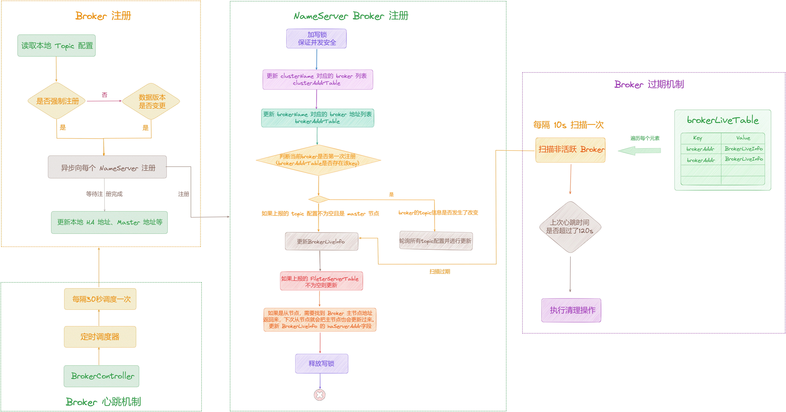

### **2.2.8 注销 Broker**

/\*\*

\* 在所有的NameServer上注销指定的Broker

\* @param clusterName 集群名称

\* @param brokerAddr Broker地址

\* @param brokerName Broker名称

\* @param brokerId Broker ID

\*/

public void unregisterBrokerAll(

final String clusterName,

final String brokerAddr,

final String brokerName,

final long brokerId

) {

// 获取所有的 NameServer 地址列表

List<String> nameServerAddressList = this.remotingClient.getNameServerAddressList();

if (nameServerAddressList != null) {

// 遍历所有的 NameServer 地址

for (String namesrvAddr :nameServerAddressList) {

try {

// 对每个 NameServer 注销指定的 Broker

this.unregisterBroker(namesrvAddr,clusterName,brokerAddr,brokerName,brokerId);

LOGGER.info("unregisterBroker OK,NamesrvAddr:{}",namesrvAddr);

} catch (Exception e) {

LOGGER.warn("unregisterBroker Exception,NamesrvAddr:{}",namesrvAddr,e);

}

}

}

}

/\*\*

\* 向指定的NameServer注销特定的Broker

\* @param namesrvAddr NameServer地址

\* @param clusterName 集群名称

\* @param brokerAddr Broker地址

\* @param brokerName Broker名称

\* @param brokerId Broker ID

\* @throws RemotingConnectException 远程连接异常

\* @throws RemotingSendRequestException 远程发送请求异常

\* @throws RemotingTimeoutException 远程超时异常

\* @throws InterruptedException 线程中断异常

\* @throws MQBrokerException MQBroker异常

\*/

public void unregisterBroker(

final String namesrvAddr,

final String clusterName,

final String brokerAddr,

final String brokerName,

final long brokerId

) throws RemotingConnectException,RemotingSendRequestException,RemotingTimeoutException,InterruptedException,MQBrokerException {

// 创建注销 Broker 请求头部

UnRegisterBrokerRequestHeader requestHeader \= new UnRegisterBrokerRequestHeader();

requestHeader.setBrokerAddr(brokerAddr);

requestHeader.setBrokerId(brokerId);

requestHeader.setBrokerName(brokerName);

requestHeader.setClusterName(clusterName);

// 创建远程调用命令 code = UNREGISTER\_BROKER

RemotingCommand request \= RemotingCommand.createRequestCommand(RequestCode.UNREGISTER\_BROKER,requestHeader);

// 同步调用 NameServer 的注销 Broker 请求

RemotingCommand response \= this.remotingClient.invokeSync(namesrvAddr,request,3000);

assert response != null;

switch (response.getCode()) {

case ResponseCode.SUCCESS:{

return;

}

default:

break;

}

throw new MQBrokerException(response.getCode(),response.getRemark(),brokerAddr);

}

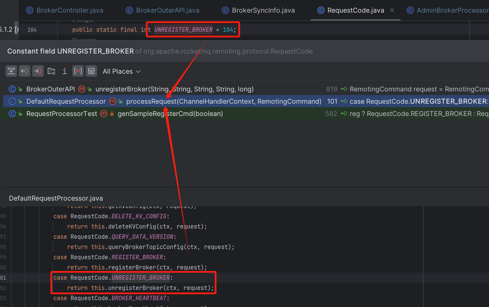

/\*\*

\* 处理注销Broker的请求

\* @param ctx ChannelHandlerContext

\* @param request RemotingCommand

\* @return RemotingCommand

\* @throws RemotingCommandException 远程命令异常

\*/

public RemotingCommand unregisterBroker(ChannelHandlerContext ctx,RemotingCommand request) throws RemotingCommandException {

// 创建响应命令

final RemotingCommand response \= RemotingCommand.createResponseCommand(null);

// 解码请求命令的自定义头部 UnRegisterBrokerRequestHeader

final UnRegisterBrokerRequestHeader requestHeader \= (UnRegisterBrokerRequestHeader) request.decodeCommandCustomHeader(UnRegisterBrokerRequestHeader.class);

// 提交注销 Broker 请求给路由信息管理器处理

if (!this.namesrvController.getRouteInfoManager().submitUnRegisterBrokerRequest(requestHeader)) {

log.warn("Couldn't submit the unregister broker request to handler,broker info:{}",requestHeader);

response.setCode(ResponseCode.SYSTEM\_ERROR);

response.setRemark(null);

return response;

}

// 设置响应码为 SUCCESS

response.setCode(ResponseCode.SUCCESS);

response.setRemark(null);

return response;

}

还有一些其他方法，这里就不展开了，自行研究。

## **03 总结**

本篇主要剖析了 [BrokerController](http://brokercontroller%20/) 初始化时中用到的 「**BrokerStatsManager**」，该组件是「**Broker 端**」向「**NameServer 集群**」发送请求的，它主要负责使用 「**RemotingClient**」网络通信客户端向「**NameServer 集群**」集群发送请求。

示意图如下：

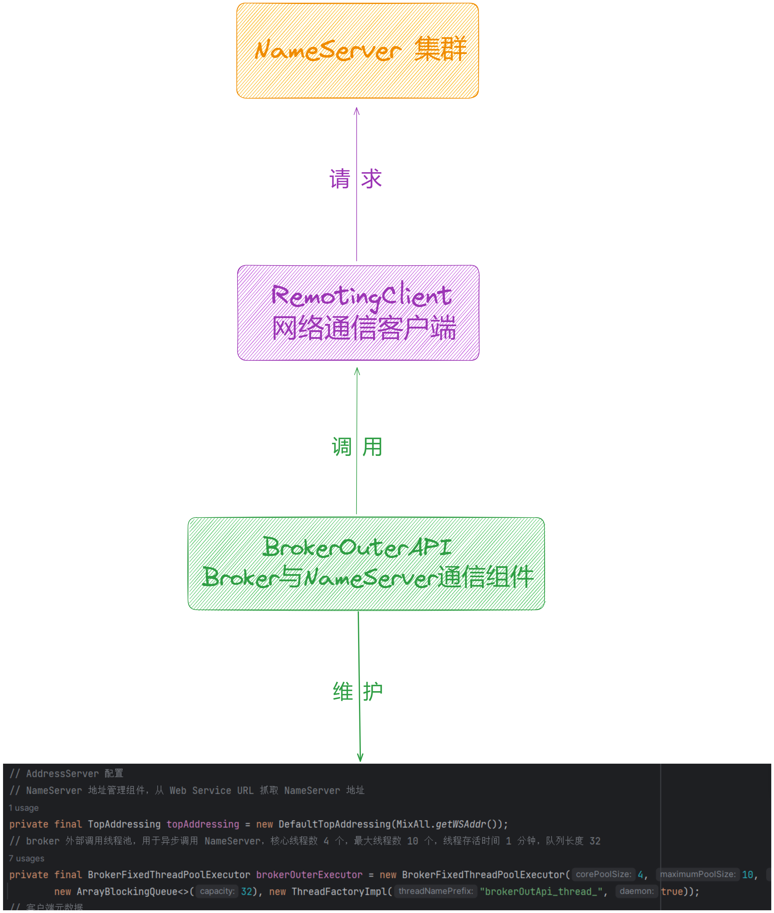