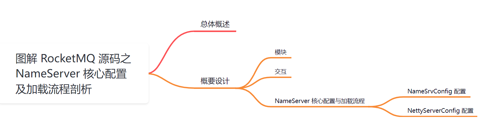
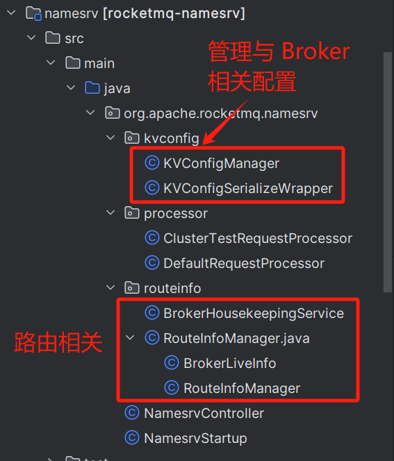
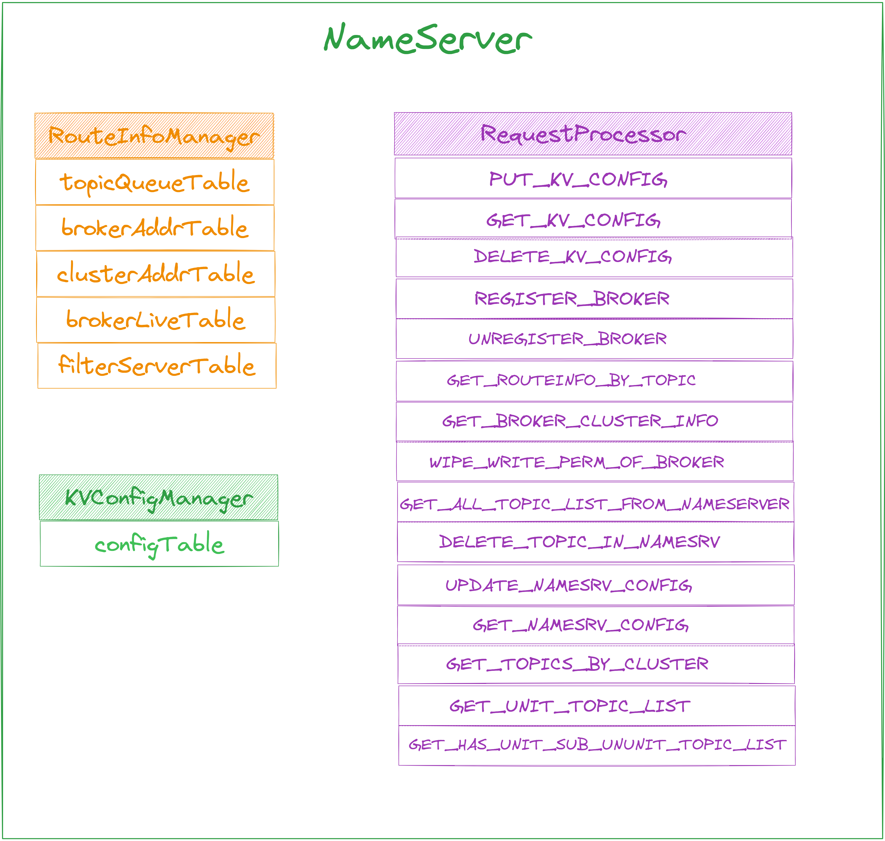
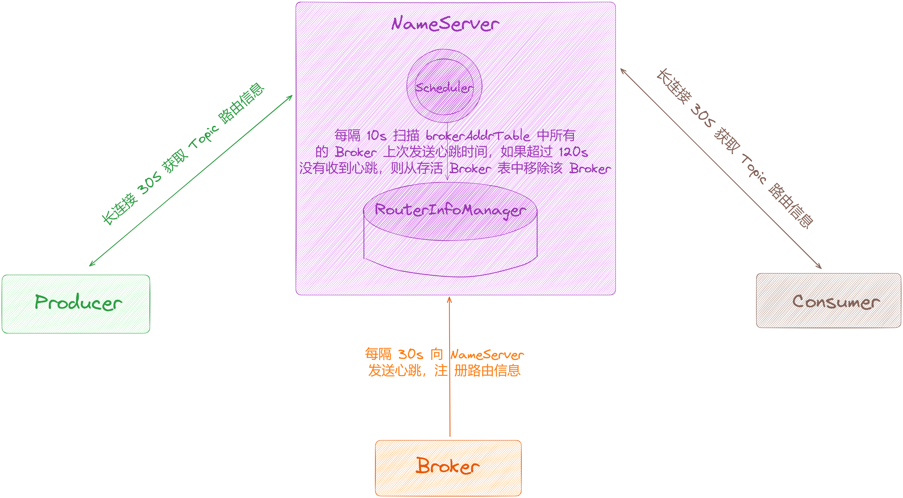
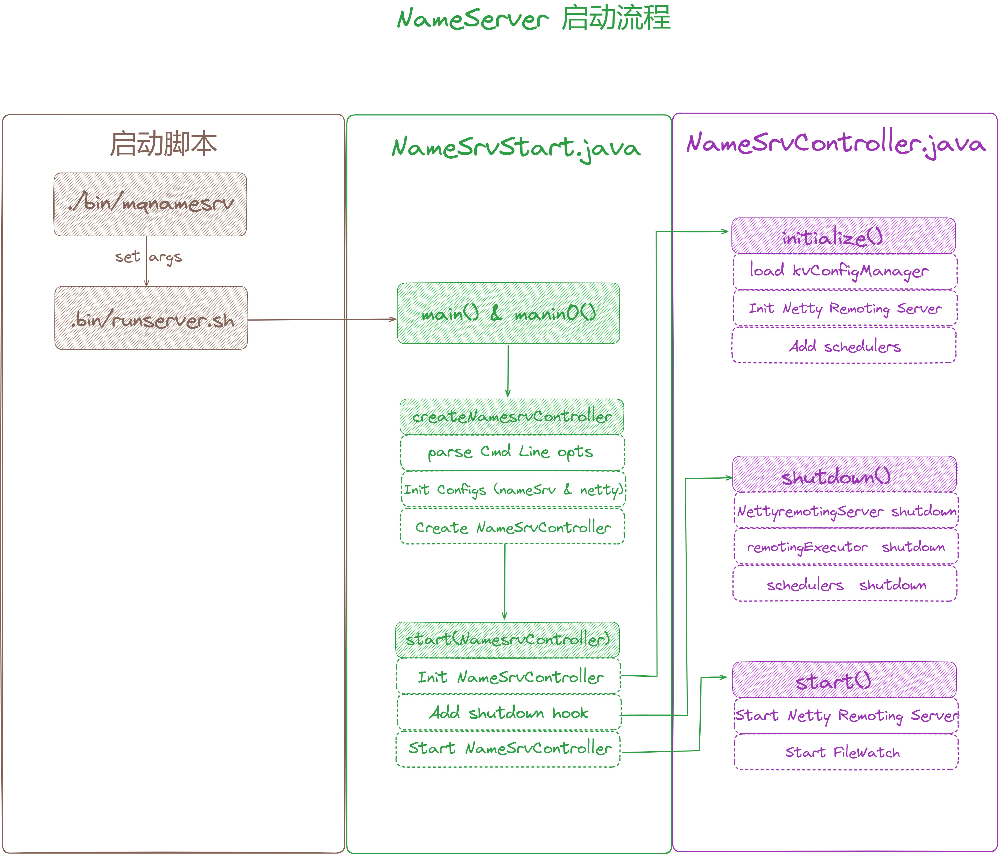
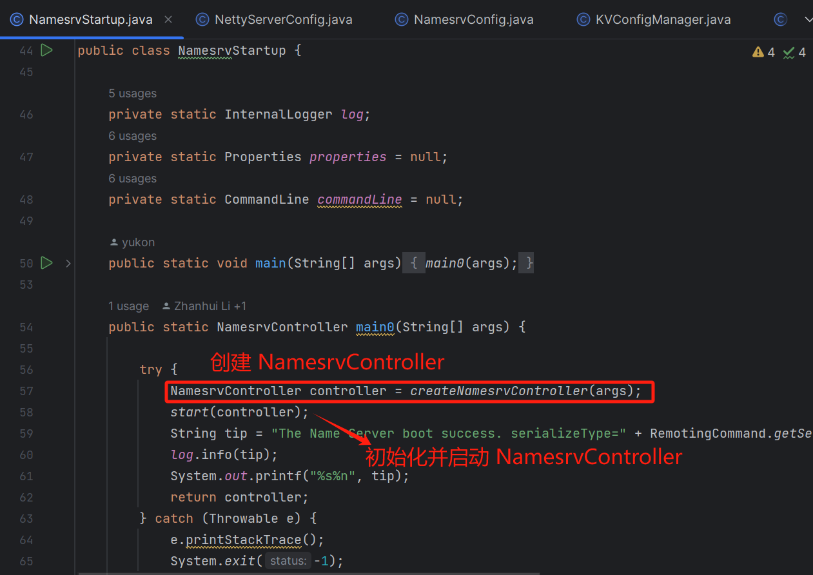
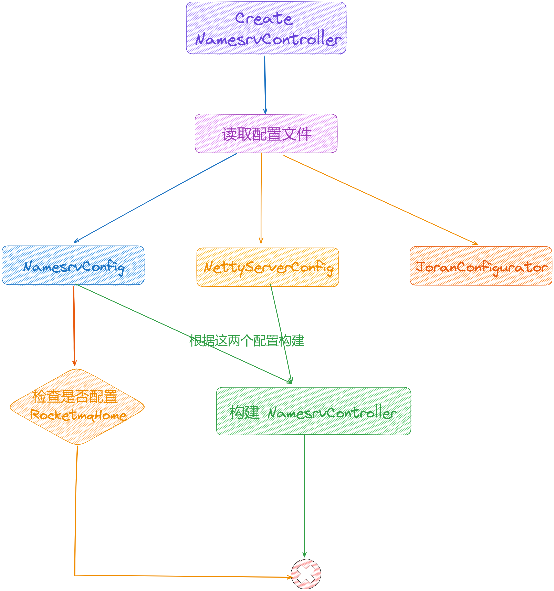
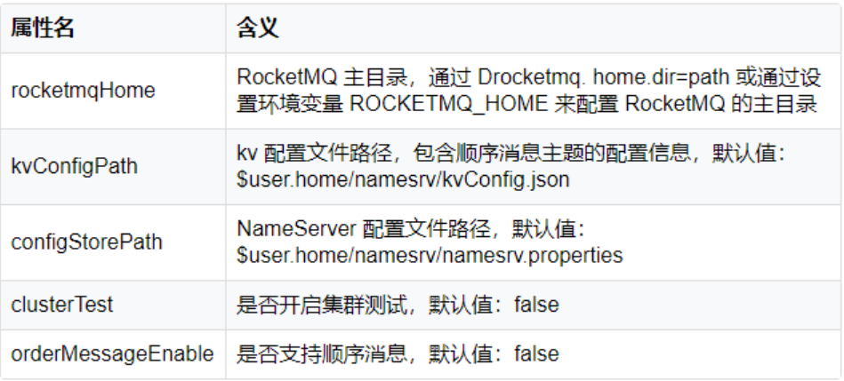
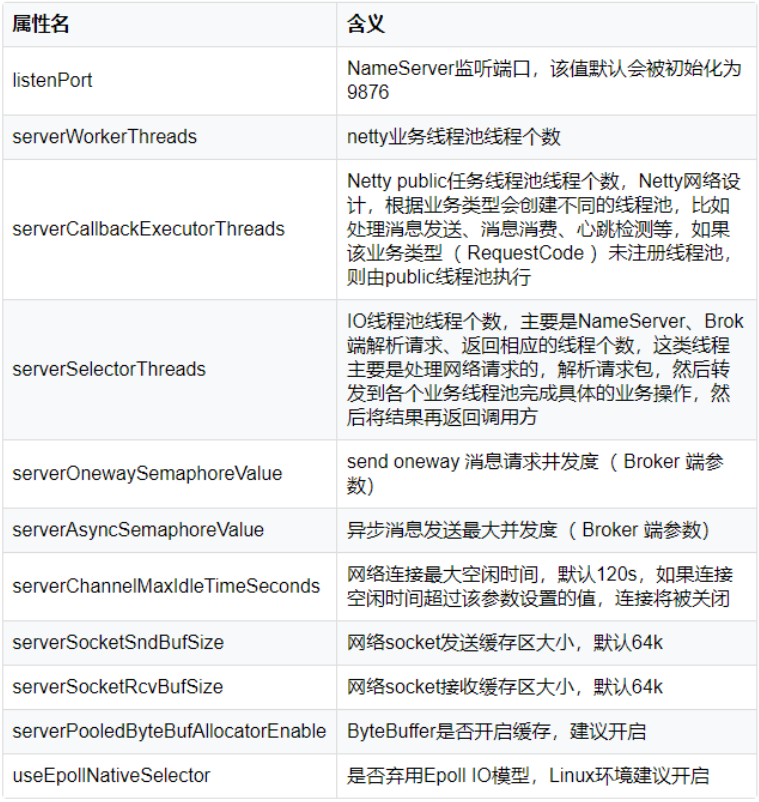

大家好，我是**华仔**, 又跟大家见面了。

从今天开始我将为大家奉上 RocketMQ 生产者源码剖析系列文章，正式开启「**RocketMQ 的 NameServer 源码之旅**」，这是第一篇，我们来剖析下 RocketMQ 源码之 NameServer 核心配置及加载流程剖析。

这里我将以「**RocketMQ 4.9.7**」版本为主，通过「**场景驱动**」的方式带大家一点点的对 RocketMQ 源码进行深度剖析，正式开启「**RocketMQ 的源码之旅**」，跟我一起来掌握 RocketMQ 源码核心架构设计思想吧。

  

##   
**01 总体概述**

NameServer 是 RocketMQ 系统的核心组件之一，与 zookeeper 一样天生具有分布式的特性，在 RocketMQ 中担当着「**路由注册**」、「**发现**」、「**动态维护 Broker 相关信息**」的角色。

设想这样一个问题：

> RocketMQ 的 Topic 分布在不同的 Broker 上，作为消息的生产者和消费者，如何知道要从哪个 Broker 地址生产或消费消息？
> 
> 如果连接的 Broker 宕机了，如何在不重启的情况下感知？

NameServer 就是为了解决这些问题设计的。

NameServer 是一个简单的「**Topic 路由注册中心**」，类似 Kafka、Dubbo 中的 Zookeeper，支持 Broker 的动态注册与发现。主要包含两个功能：

1.  Broker 管理：NameServer 接受 Broker 集群的注册信息并且保存下来作为路由信息的基本数据。然后提供心跳检测机制，检查 Broker 是否还存活。
2.  路由信息管理：每个 NameServer 将保存关于 Broker 集群的整个路由信息和用于客户端查询的队列信息。然后 Producer 和 Conumser 通过 NameServer 就可以知道整个 Broker 集群的路由信息，从而进行消息的投递和消费。

关于原理部分可以点击 [【原理分析系列第三篇】图解 RocketMQ NameServer 架构设计](https://articles.zsxq.com/id_plt5q5i603r3.html) 查看。

在剖析 NameServer 源码之前，我们先带着这几个问题去探究：

1.  NameServer 启动时需要加载哪些配置以及加载流程如何？
2.  NameServer 启动流程是什么样的？会创建哪些核心数据结构？
3.  NameServer 以什么样的数据结构存储着 Broker 与路由信息的？
4.  Broker 上线、下线、发送心跳这些操作在 NameServer 中是如何进行的？
5.  NameServer 是如何进行 Broker 心跳检测的？

接下来本篇我们先来聊聊第一个问题。

## **02 概要设计**

「**NameServer**」用来处理其他模块的请求，它不会主动向其他模块发起请求，其本质上就是一个「**NettyServer**」 。

## **2.1 模块**

「**NameServer**」的代码并不多，如下所示：

  

具体类含义如下：

├─ [NamesrvController.java](http://namesrvcontroller.java/) // 执行初始化逻辑，加载配置、注册Processor等

├─ [NamesrvStartup.java](http://namesrvstartup.java/) // NameServer的启动类, 启动netty server

├─ kvconfig

│ ├─ [KVConfigManager.java](http://kvconfigmanager.java/) // namespace 和 config 配置管理

│ └─ [KVConfigSerializeWrapper.java](http://kvconfigserializewrapper.java/) // 将获取到的配置 json 序列化

├─ processor

│ ├─ [ClusterTestRequestProcessor.java](http://clustertestrequestprocessor.java/) // 处理请求类型。

│ └─ [DefaultRequestProcessor.java](http://defaultrequestprocessor.java/) // 默认地请求处理器, 处理数据包

└─ routeinfo

├─ [BrokerHousekeepingService.java](http://brokerhousekeepingservice.java/) // netty 的 channel 共用方法抽象

└─ [RouteInfoManager.java](http://routeinfomanager.java/) // 路由管理器，维护 topic, broker, clusterName, brokerAddr等信息

通过上面分析，可以得出「**NameServer**」主要有 3 个模块：

1.  Topic 路由管理模块（RouteInfoManager）。
2.  通信模块（DefaultRequestProcessor、ClusterTestRequestProcessor）。
3.  KV 数据存储模块（KVConfigManager) 。

1.  RouteInfoManager 中存储 5 个 HashMap，这就是 NameServer 中主要存储的数据，它们仅存在于内存中，并不会持久化，其中数据内容如下：
2.  topicQueueTable：保存 Topic 的队列信息，也是真正的路由信息。队列信息中包含了其所在的 Broker 名称和读写队列数量。
3.  brokerAddrTable：保存 Broker 信息，包含其名称、集群名称、主备 Broker 地址。
4.  clusterAddrTable：保存 Cluster信息，包含每个集群中所有的 Broker 名称列表。
5.  brokerLiveTable：Broker 状态信息，包含当前所有存活的 Broker，和它们最后一次上报心跳的时间。
6.  filterServerTable：Broker 上的 FilterServer 列表，用于类模式消息过滤，该机制在 4.4 版本后被废弃。
7.  RequestProcessor 继承了 AsyncNettyRequestProcessor。作为 NameServer 的请求处理器，根据不同种类的请求做不同类型的处理。其中 KV\_CONFIG 类型的请求用于 KVConfig 模块，当前不会用到。其他请求类型由 Broker 和 Producer、Consumer 发起。
8.  KVConfigManager 内部保存了一个二级 HashMap： configTable，并且会将该对象进行持久化。

## **2.2 交互**

上图为 NameServer 与其他组件交互的示意图，可以看到 Producer、Consumer、Broker 均每 30s 向 NameServer 发起一次请求，NameServer 中也有定时器，定期扫描和更新内部数据。

1.  Broker
2.  每隔 30s 向 NameServer 集群的每台机器都发送心跳包，包含自身 Topic 队列的路由信息。
3.  当有 Topic 改动（创建/更新），Broker 会立即发送 Topic 增量信息到 NameServer，同时触发 NameServer 的数据版本号发生变更（+1）。
4.  NameServer
5.  将路由信息保存在内存中。它只被其他模块调用（被 Broker 上传，被客户端拉取），不会主动调用其他模块。
6.  启动一个定时任务线程，每隔 10s 扫描 brokerAddrTable 中所有的 Broker 上次发送心跳时间，如果超过 120s 没有收到心跳，则从存活 Broker 表中移除该 Broker。
7.  Client
8.  生产者第一次发送消息时，向 NameServer 拉取该 Topic 的路由信息。
9.  消费者启动过程中会向 NameServer 请求 Topic 路由信息。
10.  每隔 30s 向 NameServer 发送请求，获取它们要生产/消费的 Topic 的路由信息。

## **2.3 NameServer 核心配置与加载流程**

在整理了解了 NameServer 的架构设计之后，我们先来看下NameServer到底是如何启动的呢？

我们先来看下代码入口：[org.apache.rocketmq.namesrv.NamesrvStartup#main](http://org.apache.rocketmq.namesrv.namesrvstartup/#main)(String\[\] args)，实际调用的是main0()方法，

  

启动流程如下：

1.  由启动脚本调用 [NamesrvStartup#main](http://namesrvstartup/#main) 函数触发启动流程。
2.  [NamesrvStartup#createNamesrvController](http://namesrvstartup/#createNamesrvController) 函数中先解析命令行参数，然后初始化 [NameServer](http://nameserver/) 和 [Netty remote server](http://netty%20remote%20server/) 配置，最后创建 [NamesrvController](http://namesrvcontroller/) 的实例。
3.  [NamesrvStartup#start](http://namesrvstartup/#start) 初始化 [NamesrvController](http://namesrvcontroller/)；调用 [NamesrvController#start()](http://namesrvcontroller/#start\(\)) 方法，启动 [Netty remoting server](http://netty%20remoting%20server/)；最后注册关闭钩子函数，在 JVM 线程关闭之前，关闭 [Netty remoting server](http://netty%20remoting%20server/) 和处理线程池，关闭定时任务线程。
4.  [NamesrvController](http://namesrvcontroller/) 实例是 NameServer 的核心控制器，它的初始化方法 [initialize()](http://initialize\(\)/) 先加载 [KVConfig manager](http://kvconfig%20manager/)，然后初始化 [Netty remoting server](http://netty%20remoting%20server/)。最后添加 2 个定时任务：
5.  一个每 10s 打印一次 KV 配置。
6.  一个每 10s 扫描 Broker 列表，移除掉线的 Broker。

从上图中，「**NameServer**」启动流程可以看出，其核心配置只有两个：「**NameSrvConfig**」、「**NettyServerConfig**」。

[NamesrvStartup](http://namesrvstartup/) 类是 NameServer 的启动类，它会调用 [NamesrvController](http://namesrvcontroller/) 类的初始化和启动方法，执行 NameServer 具体模块的初始化和启动。

可以看到会在 [NamesrvStartup#createNamesrvController](http://namesrvstartup/#createNamesrvController) 方法中先解析命令行参数，然后初始化 NameServer 和 Netty remote server 配置，最后启动 [NamesrvController](http://namesrvcontroller/) 的初始化。

在此先来看下「**NameSrvConfig**」和「**NettyServerConfig**」的相关配置加载，关于 [NamesrvController](http://namesrvcontroller/) 的初始化会在后面单独篇章剖析。

加载「**NameSrvConfig**」和「**NettyServerConfig**」，如果有手动配置也可以生效，使用 option 类封装参数，在程序运行前添加配置 [Program arguments](http://program%20arguments/)， 添加的格式: 例如 -c , -p 等，源码如下：

  
源码位置：[https://github.com/apache/rocketmq/blob/release-4.9.7/client/src/main/java/org/apache/rocketmq/name](https://github.com/apache/rocketmq/blob/release-4.9.7/client/src/main/java/org/apache/rocketmq/namesrv/NamesrvStartup.java)[srv/NamesrvStartup](https://github.com/apache/rocketmq/blob/release-4.9.7/client/src/main/java/org/apache/rocketmq/namesrv/NamesrvStartup.java)[.java](https://github.com/apache/rocketmq/blob/release-4.9.7/client/src/main/java/org/apache/rocketmq/namesrv/NamesrvStartup.java)

public static NamesrvController createNamesrvController(String\[\] args) throws IOException, JoranException {

// 设置 RocketMQ 的版本号为当前版本号，属性名为rocketmq.remoting.version

System.setProperty(RemotingCommand.REMOTING\_VERSION\_KEY, Integer.toString(MQVersion.CURRENT\_VERSION));

//PackageConflictDetect.detectFastjson();

// 使用 jar 包启动时，构建命令行操作的指令，使用main方法启动可以忽略

// 解析命令行参数 构造 org.apache.commons.cli.Options,并添加-h -n参数，-h 参数是打印帮助信息，-n 参数是指定namesrvAddr

Options options \= ServerUtil.buildCommandlineOptions(new Options());

// 初始化 commandLine，并在options中添加-c -p参数，-c指定nameserver的配置文件路径，-p标识打印配置信息

commandLine = ServerUtil.parseCmdLine("mqnamesrv", args, buildCommandlineOptions(options), new PosixParser());

if (null == commandLine) {

System.exit(-1);

return null;

}

// 初始化 NameServer 配置类，包含 NameServer 的配置，比如 ROCKETMQ\_HOME

final NamesrvConfig namesrvConfig \= new NamesrvConfig();

// 初始化 NameServer 网络配置参数（Netty 服务端配置）

final NettyServerConfig nettyServerConfig \= new NettyServerConfig();

// 设置 NameServer 的服务的监听端口号 9876

nettyServerConfig.setListenPort(9876);

// 判断命令行中是否包含字符 c，即是否包含通过命令行指定配置文件的命令

// 命令带有 -c 参数，说明指定配置文件，需要根据配置文件路径读取配置文件内容，并将文件中配置信息赋值给NamesrvConfig和NettyServerConfig

// 例如启动 Broker 的时候添加的 -c /home/wangjianghua/src/rocketmq/config/conf/broker.conf命令

if (commandLine.hasOption('c')) {

// 解析配置文件并且存入 NamesrvConfig 和 NettyServerConfig 中，没有的话就不用管

String file \= commandLine.getOptionValue('c');

if (file != null) {

InputStream in \= new BufferedInputStream(new FileInputStream(file));

properties = new Properties();

properties.load(in);

// 反射的方式打印配置

MixAll.properties2Object(properties, namesrvConfig);

MixAll.properties2Object(properties, nettyServerConfig);

// 设置配置文件路径

namesrvConfig.setConfigStorePath(file);

System.out.printf("load config properties file OK, %s%n", file);

in.close();

}

}

// 判断命令行中是否包含字符 p ，如果存在则打印配置信息并结束 jvm 运行，没有的话就不用管

// 命令行带有 -p，说明是打印参数的命令，那么就打印出 NamesrvConfig 和 NettyServerConfig 的属性。在启动 NameServer 时可以先使用 ./mqnameserver -c configFile -p 打印当前加载的配置属性

if (commandLine.hasOption('p')) {

InternalLogger console \= InternalLoggerFactory.getLogger(LoggerName.NAMESRV\_CONSOLE\_NAME);

// 打印配置

MixAll.printObjectProperties(console, namesrvConfig);

MixAll.printObjectProperties(console, nettyServerConfig);

// 打印参数命令不需要启动nameserver服务，只需要打印参数即可

System.exit(0);

}

// 加载命令行中指定的属性，形如 --listenPort 9876 解析并加载到namesrvConfig中

MixAll.properties2Object(ServerUtil.commandLine2Properties(commandLine), namesrvConfig);

// 检查 ROCKETMQ\_HOME，如果不存在 ROCKETMQ\_HOME 的配置，那么打印异常并退出程序，即最开始启动 NameServer 时抛出异常的位置

if (null == namesrvConfig.getRocketmqHome()) {

System.out.printf("Please set the %s variable in your environment to match the location of the RocketMQ installation%n", MixAll.ROCKETMQ\_HOME\_ENV);

System.exit(-2);

}

// 初始化 logback 日志工厂，rocketmq 默认使用 logback 作为日志输出

LoggerContext lc \= (LoggerContext) LoggerFactory.getILoggerFactory();

JoranConfigurator configurator \= new JoranConfigurator();

configurator.setContext(lc);

lc.reset();

configurator.doConfigure(namesrvConfig.getRocketmqHome() + "/conf/logback\_namesrv.xml");

log = InternalLoggerFactory.getLogger(LoggerName.NAMESRV\_LOGGER\_NAME);

// 打印 nameServer 服务器配置类和 netty 服务器配置类的配置信息

MixAll.printObjectProperties(log, namesrvConfig);

MixAll.printObjectProperties(log, nettyServerConfig);

// 根据 namesrvConfig 和 nettyServerConfig 初始化并创建 NamesrvController

final NamesrvController controller \= new NamesrvController(namesrvConfig, nettyServerConfig);

// remember all configs to prevent discard

// 将所有的 -c 的外部配置信息保存到 NamesrvController.Configuration.allConfigs 属性中

controller.getConfiguration().registerConfig(properties);

return controller;

}

通过上面对每一行代码的注释，可以看出来，创建 [NamesrvController](http://namesrvcontroller/) 的过程主要分为两步：

1.  通过命令行中获取配置。赋值给 [NamesrvConfig](http://namesrvconfig/) 和 [NettyServerConfig](http://nettyserverconfig/) 类。
2.  根据配置类 [NamesrvConfig](http://namesrvconfig/) 和 [NettyServerConfig](http://nettyserverconfig/) 构造一个 [NamesrvController](http://namesrvcontroller/) 实例。

> 注意：在启动 NameServer 时，可以先使用 ./mqnameserver -c configFile -p 命令打印当前加载的配置属性。

可见「**NameSrvConfig**」和「**NettyServerConfig**」是想当重要的，这两个类分别是 NameServer 的「**业务参数**」和「**网络参数**」，我们分别看下这两个类里面有哪些属性。

## **2.3.1 NameSrvConfig 配置**

源码位置：[https://github.com/apache/rocketmq/blob/release-4.9.7/client/src/main/java/org/apache/rocketmq/](https://github.com/apache/rocketmq/blob/release-4.9.7/client/src/main/java/org/apache/rocketmq/common/namesrv/NamesrvConfig.java)[common/namesrv/NamesrvConfig](https://github.com/apache/rocketmq/blob/release-4.9.7/client/src/main/java/org/apache/rocketmq/common/namesrv/NamesrvConfig.java)[.java](https://github.com/apache/rocketmq/blob/release-4.9.7/client/src/main/java/org/apache/rocketmq/common/namesrv/NamesrvConfig.java)

public class NamesrvConfig {

private static final InternalLogger log \= InternalLoggerFactory.getLogger(LoggerName.NAMESRV\_LOGGER\_NAME);

// RocketMQ 主目录，通过 Drocketmq.home.dir=path 或设置环境变量 ROCKETMQ\_HOME 可以配置 RocketMQ 的主目录

private String rocketmqHome \= System.getProperty(MixAll.ROCKETMQ\_HOME\_PROPERTY, System.getenv(MixAll.ROCKETMQ\_HOME\_ENV));

// NameServer 存储KV配置属性的持久化文件路径地址

private String kvConfigPath \= System.getProperty("user.home") + File.separator + "namesrv" + File.separator + "kvConfig.json";

// NameServer 默认配置文件路径地址。

// NameServer 启动时如果要通过配置文件配置 NameServer 启动属性，请使用-c configPath 命令选项

private String configStorePath \= System.getProperty("user.home") + File.separator + "namesrv" + File.separator + "namesrv.properties";

// 生产环境名称

private String productEnvName \= "center";

// 是否启动集群测试

private boolean clusterTest \= false;

// 是否支持顺序消息，默认是不支持

private boolean orderMessageEnable \= false;

....

}

## **2.3.2 NettyServerConfig 配置**

源码位置：[https://github.com/apache/rocketmq/blob/release-4.9.7/client/src/main/java/org/apache/rocketmq/](https://github.com/apache/rocketmq/blob/release-4.9.7/client/src/main/java/org/apache/rocketmq/remoting/netty/NettyServerConfig.java)[remoting/netty/NettyServerConfig](https://github.com/apache/rocketmq/blob/release-4.9.7/client/src/main/java/org/apache/rocketmq/remoting/netty/NettyServerConfig.java)[.java](https://github.com/apache/rocketmq/blob/release-4.9.7/client/src/main/java/org/apache/rocketmq/remoting/netty/NettyServerConfig.java)

public class NettyServerConfig implements Cloneable {

// NameServer 监听端口，该值默认会被初始化为9876

private int listenPort \= 8888;

// Netty业务线程池线程个数

private int serverWorkerThreads \= 8;

/\*\*

\* Netty public任务线程池线程个数，默认是0。

\* Netty网络会根据业务类型创建不同的线程池，比如处理消

\* 息发送、消息消费、心跳检测等。如果该业务类型（RequestCode）未

\* 注册线程池，则由public线程池执行

\*/

private int serverCallbackExecutorThreads \= 0;

/\*\*

\* I/O线程池线程个数，主要是

\* NameServer、Broker端解析请求、返回相应的线程个数。这类线程主

\* 要用于处理网络请求，先解析请求包，然后转发到各个业务线程池完

\* 成具体的业务操作，最后将结果返回给调用方

\*/

private int serverSelectorThreads \= 3;

//Broker端参数，send oneway消息请求的并发度

private int serverOnewaySemaphoreValue \= 256;

// Broker 端参数，异步消息发送的最大并发度

private int serverAsyncSemaphoreValue \= 64;

// 网络连接最大空闲时间，默认为120s。如果连接空闲时间超过该参数设置的值，连接将被关闭

private int serverChannelMaxIdleTimeSeconds \= 120;

// 网络socket发送缓存区大小，默认为64KB

private int serverSocketSndBufSize \= NettySystemConfig.socketSndbufSize;

// 接收端缓存区大小

private int serverSocketRcvBufSize \= NettySystemConfig.socketRcvbufSize;

private int writeBufferHighWaterMark \= NettySystemConfig.writeBufferHighWaterMark;

private int writeBufferLowWaterMark \= NettySystemConfig.writeBufferLowWaterMark;

private int serverSocketBacklog \= NettySystemConfig.socketBacklog;

// ByteBuffer是否开启缓存，建议开启

private boolean serverPooledByteBufAllocatorEnable \= true;

/\*\*

\* make install

\* 是否启用Epoll I/O模型，Linux环境下建议开启

\*

\* ../glibc-2.10.1/configure \\ --prefix=/usr \\ --with-headers=/usr/include \\

\* --host=x86\_64-linux-gnu \\ --build=x86\_64-pc-linux-gnu \\ --without-gd

\*/

private boolean useEpollNativeSelector \= false;

...

}

## **2.3.2 配置如何处理**

这里先简单地看下配置的处理。在启动项目中，可以使用 [\-c /xxx/xxx.conf](http://-c%20/xxx/xxx.conf) 指定配置文件的位置，然后在[createNamesrvController(...)](http://createnamesrvcontroller\(...\)/) 方法中，通过如下源码：

InputStream in \= new BufferedInputStream(new FileInputStream(file));

properties = new Properties();

properties.load(in);

将配置文件的内容加载到 [properties](http://properties/) 对象中，然后调用 [MixAll.properties2Object(properties, namesrvConfig)](http://mixall.properties2object\(properties,%20namesrvconfig\)/)方法将 [properties](http://properties/) 的属性赋值给 [namesrvConfig](http://namesrvconfig/)：

public static void properties2Object(final Properties p, final Object object) {

Method\[\] methods = object.getClass().getMethods();

for (Method method : methods) {

String mn \= method.getName();

if (mn.startsWith("set")) {

try {

String tmp \= mn.substring(4);

String first \= mn.substring(3, 4);

// 首字母小写

String key \= first.toLowerCase() + tmp;

// 从 Properties 中获取对应的值

String property \= p.getProperty(key);

if (property != null) {

// 获取值，并进行相应的类型转换

Class<?>\[\] pt = method.getParameterTypes();

if (pt != null && pt.length > 0) {

String cn \= pt\[0\].getSimpleName();

Object arg \= null;

// 转换成int

if (cn.equals("int") || cn.equals("Integer")) {

arg = Integer.parseInt(property);

// 其他类型如long,double,float,boolean都是这样转换的，这里就省略了

} else if (cn.equals("long") || cn.equals("Long")) {

....

} else {

continue;

}

// 反射调用

method.invoke(object, arg);

}

}

} catch (Throwable ignored) {

}

}

}

}

该方法非常简单:

1.  先获取到 object 中的所有 setXxx(...) 方法。
2.  得到 setXxx(...) 中的 Xxx。
3.  首字母小写得到 xxx。
4.  从 properties 获取 xxx 属性对应的值，并根据 setXxx(...) 方法的参数类型进行转换。
5.  反射调用 setXxx(...) 方法进行赋值。

到这里之后，「**NameSrvConfig**」与 「**NettyServerConfig**」就赋值成功了。