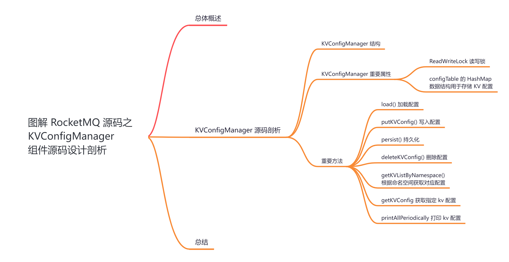
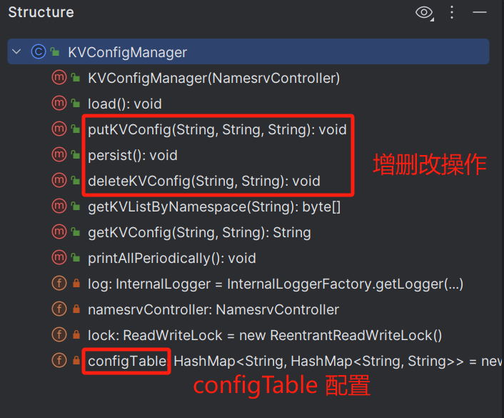
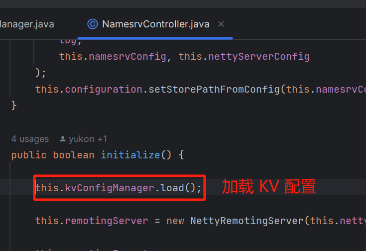
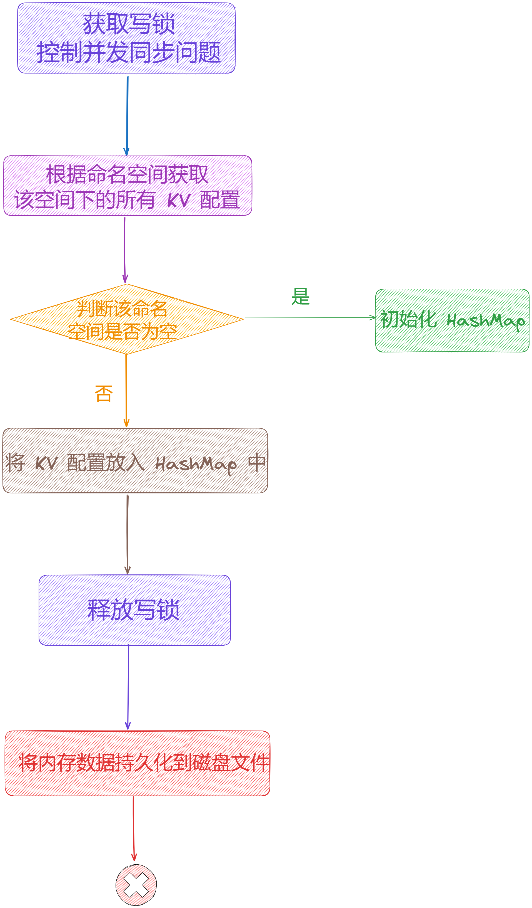
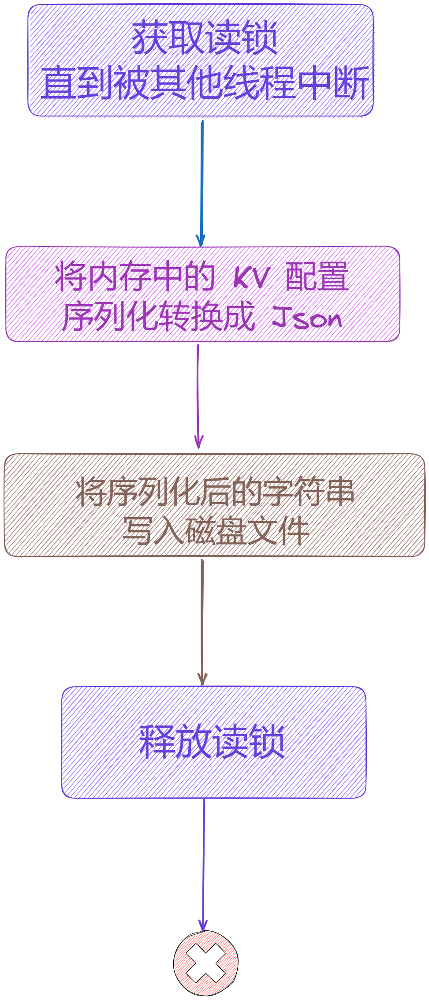
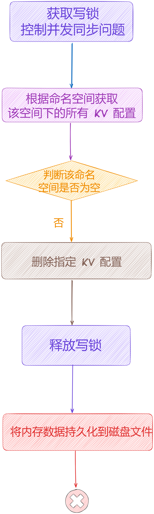
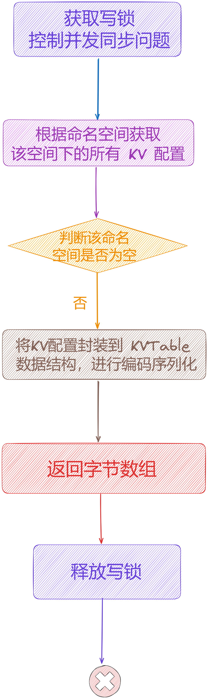
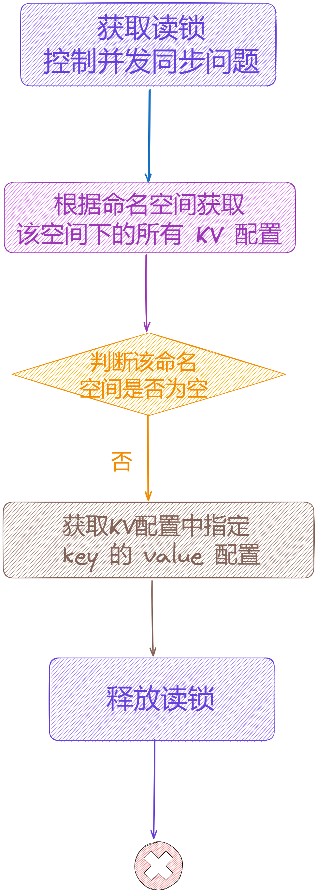
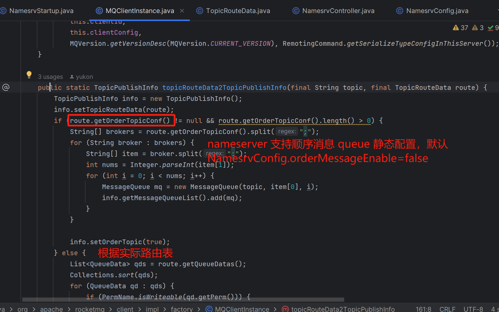
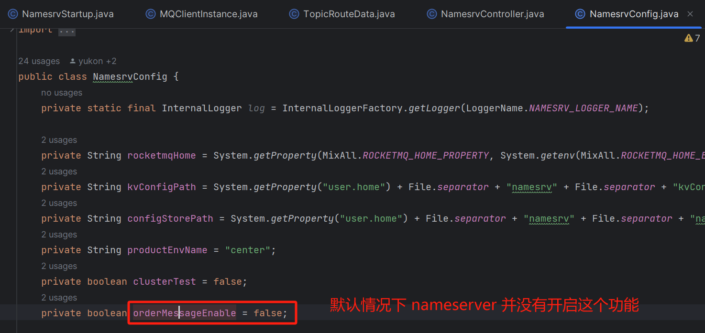

大家好，我是**华仔**, 又跟大家见面了。

从今天开始我将为大家奉上 RocketMQ 生产者源码剖析系列文章，正式开启「**RocketMQ 的 NameServer 源码之旅**」，这是第三篇，我们来剖析下 RocketMQ 源码之 KVConfigManager 组件源码设计剖析。

这里我将以「**RocketMQ 4.9.7**」版本为主，通过「**场景驱动**」的方式带大家一点点的对 RocketMQ 源码进行深度剖析，正式开启「**RocketMQ 的源码之旅**」，跟我一起来掌握 RocketMQ 源码核心架构设计思想吧。

  

##   
**01 总体概述**

在深入剖析 NameServer 源码之前，我们先带着这几个问题去探究：

1.  NameServer 启动时需要加载哪些配置以及加载流程如何？
2.  NameServer 启动流程是什么样的？会创建哪些核心数据结构？
3.  NameServer 以什么样的数据结构存储着 Broker 与路由信息的？
4.  Broker 上线、下线、发送心跳这些操作在 NameServer 中是如何进行的？
5.  NameServer 是如何进行 Broker 心跳检测的？

在上一篇中，我们剖析了「**NameServer**」是如何启动 Netty 服务器的

今天我们继续上篇的内容，剖析下「**NameServer**」中 KVConfigManager 组件是如何实现的以及内部都保存了哪些数据。

##   
**02 KVConfigManager 源码剖析**

RocketMQ 在启动「**NameServer**」的过程中会初始化「**NamesrvController**」核心组件，而「**NamesrvController**」初始化过程中又引用了「**KVConfigManager**」配置管理组件。

从名字上可以看出，「**KVConfigManager**」是注册服务器的配置存储类。会将配置信息存储在文件 ${[user.home](http://user.home/)}/namesrv/[kvConfig.json](http://kvconfig.json/) 。内部用来存储配置信息的是一个 [HashMap<String, HashMap<String, String>>](http://hashmapstring,%20hashmapstring,%20string/) 结构，也就是两级结构。

第一级是「**命名空间**」，第二级是「**KV 对**」KV对，都是字符串形式。

所以其主要作用就是对基于存放 key=namespace,value=HashMap 的一个Hash 表 「**configTable**」进行读写操作。

该类的 load 方法可以从文件中加载数据到内存里，persist 方法可以将内存中的数据再写入到文件中。

## **2.1 KVConfigManager 结构**

## **2.2 KVConfigManager 重要属性**

源码位置：[https://github.com/apache/rocketmq/blob/release-4.9.7/namesrv/src/main/java/org/apache/rocketmq/namesrv/](https://github.com/apache/rocketmq/blob/release-4.9.7/namesrv/src/main/java/org/apache/rocketmq/namesrv/kvconfig/KVConfigManager.java)[kvconfig/KVConfigManager](https://github.com/apache/rocketmq/blob/release-4.9.7/namesrv/src/main/java/org/apache/rocketmq/namesrv/kvconfig/KVConfigManager.java)[.java](https://github.com/apache/rocketmq/blob/release-4.9.7/namesrv/src/main/java/org/apache/rocketmq/namesrv/kvconfig/KVConfigManager.java)

// KV 配置管理器，在内存中维护所有的kv配置列表，并通过一个读写锁解决并发同步问题。

public class KVConfigManager {

private static final InternalLogger log \= InternalLoggerFactory.getLogger(LoggerName.NAMESRV\_LOGGER\_NAME);

// Namesrv 控制器

private final NamesrvController namesrvController;

// 在 KVConfigManager 配置管理组件中，使用到 JDK 并发包中的 ReadWriteLock读写锁，实现对内存数据结构 configTable 的并发控制

private final ReadWriteLock lock \= new ReentrantReadWriteLock();

// 配置 Hash 表，外层的 Namespace 表示的是 Topic 维度，内层的 kv 为就是配置的 key/value

private final HashMap<String/\* Namespace \*/, HashMap<String/\* Key \*/, String/\* Value \*/\>> configTable =

new HashMap<String, HashMap<String, String>>();

public KVConfigManager(NamesrvController namesrvController) {

// 构造方法：传入一个namesrvController为内部的controller属性赋值

this.namesrvController = namesrvController;

}

....

}

以上源码就是 「**KVConfigManager**」组件的实例变量，两个重要的属性：

1.  初始化了一个 ReadWriteLock 读写锁，用于进行读写并发控制。
2.  维护了一个 configTable 的 HashMap 数据结构用于存储 KV 配置， Key 是 Namespace 命名空间，Value 是一个子 HashMap 数据结构，用户存储每个 Namespace 命名空间下的子 KV 配置。

## **2.3 重要方法**

## **2.3.1 load() 加载配置**

在启动「**NameServer**」的过程中会初始化「**NamesrvController**」核心组件，在初始化「**NamesrvController**」时会加载配置，就是调用该方法。我们来看下源码：

  

// 加载 kvConfigPath 下 kvConfig.json 配置文件里的 KV 配置，然后将这些配置放到KVConfigManager#configTable 属性中，KVConfig 配置文件默认路径是 ${user.home}/namesrv/kvConfig.json

public void load() {

String content \= null;

try {

// 加载 KvConfigPath 得到 json，默认路径为 ${user.home}/namesrv/kvConfig.json

content = MixAll.file2String(this.namesrvController.getNamesrvConfig().getKvConfigPath());

} catch (IOException e) {

log.warn("Load KV config table exception", e);

}

if (content != null) {

// 将 json 转换为对象类型

KVConfigSerializeWrapper kvConfigSerializeWrapper \=

KVConfigSerializeWrapper.fromJson(content, KVConfigSerializeWrapper.class);

if (null != kvConfigSerializeWrapper) {

// 最后将 KV 变量放入配置表

this.configTable.putAll(kvConfigSerializeWrapper.getConfigTable());

log.info("load KV config table OK");

}

}

}

可以看到该方法比较简单，就是先从磁盘文件加载历史数据，然后反序列化为 KV 配置对象，存入内存 [configTable](http://configtable/) 属性中。

这里的 [KVConfigSerializeWrapper](http://kvconfigserializewrapper/) 是 KV 配置封装类，为了方便序列化/反序列化的包装类。它和文件中的 json格式数据对应。json 字符串和对象间的转化使用了fastjson。该类集成自 [RemotingSerializable](http://remotingserializable/)，支持编码和解码，内部的 [configTable](http://configtable/) 属性对象维护所有命名空间下的所有 KV 配置信息。

## **2.3.2 putKVConfig() 写入配置**

public void putKVConfig(final String namespace, final String key, final String value) {

try {

// 获取写锁，直到被其他线程中断

this.lock.writeLock().lockInterruptibly();

try {

// 根据命名空间获取该空间下的所有 KV 配置

HashMap<String, String> kvTable = this.configTable.get(namespace);

// 如果该空间下还没有 KV，开始初始化

if (null == kvTable) {

kvTable = new HashMap<>();

// 写入一个空的 hashMap

this.configTable.put(namespace, kvTable);

log.info("putKVConfig create new Namespace {}", namespace);

}

// 将 KV 配置放入 map

final String prev \= kvTable.put(key, value);

if (null != prev) {

log.info("putKVConfig update config item, Namespace: {} Key: {} Value: {}",

namespace, key, value);

} else {

log.info("putKVConfig create new config item, Namespace: {} Key: {} Value: {}",

namespace, key, value);

}

} finally {

this.lock.writeLock().unlock();

}

} catch (InterruptedException e) {

log.error("putKVConfig InterruptedException", e);

}

// 持久化

this.persist();

}

该方法负责将 KV 配置存储指定的命名空间，操作步骤如下：

1.  获取写锁，直到被其他线程中断。
2.  从 configTable 获取当前命名空间下的 KV 配置，如果不存在命名空间，则初始化。
3.  将新的 KV 配置参数写入 KV Map 配置中。
4.  释放写锁。
5.  **将内存中的数据持久化到磁盘文件中。**

## **2.3.3 persist() 持久化**

public void persist() {

try {

// 获取读锁，直到被其他线程中断

this.lock.readLock().lockInterruptibly();

try {

// 新建一个 KV 封装器对象

KVConfigSerializeWrapper kvConfigSerializeWrapper \= new KVConfigSerializeWrapper();

// 将配置表 configTable 放入 KV 封装器对象

kvConfigSerializeWrapper.setConfigTable(this.configTable);

// 转换为 json 对象

String content \= kvConfigSerializeWrapper.toJson();

if (null != content) {

// 持久化磁盘逻辑如下：

// 1、用内存中的 configTable 生成一个临时文件 tmp，同时把旧的 kvConfig.json 中的内容读取出来，写入到一个 bak 的备份文件

// 2、把旧的 kvConfig.json 文件删除

// 3、把最新的 tmp 文件重名回 kvConfig.json

MixAll.string2File(content, this.namesrvController.getNamesrvConfig().getKvConfigPath());

}

} catch (IOException e) {

log.error("persist kvconfig Exception, "

\+ this.namesrvController.getNamesrvConfig().getKvConfigPath(), e);

} finally {

// 释放读锁

this.lock.readLock().unlock();

}

} catch (InterruptedException e) {

log.error("persist InterruptedException", e);

}

}

该方法负责将内存中的 configTable 持久化到磁盘文件，操作步骤如下：

1.  获取读锁，直到被其他线程中断。
2.  将内存中的 KV 配置序列化转换成 Json。
3.  将序列化后的字符串写入磁盘文件并释放读锁。
4.  用内存中的 configTable 生成一个临时文件 tmp，同时把旧的 [kvConfig.json](http://kvconfig.json/) 中的内容读取出来，写入到一个 bak 的备份文件。
5.  把旧的 [kvConfig.json](http://kvconfig.json/) 文件删除。
6.  把最新的 tmp 文件重名回 [kvConfig.json](http://kvconfig.json/)。

从这两个方法中，可以看到内部采用了 JUC 的读写锁 [ReadWriteLock](http://readwritelock/) 结合普通的 HashMap 来实现配置操作，那么此时你是否会有疑问，为什么不直接使用 [ConcurrentHashMap](http://concurrenthashmap/) 来实现呢？

  
此处使用读写锁 [ReentrantReadWriteLock](http://reentrantreadwritelock/) 而不是 [ConcurrentHashMap](http://concurrenthashmap/) 是因为，除了对 HashMap 操作外，还需要进行比如「**序列化**」、「**磁盘同步回写**」等操作。

那为什么不用 [synchronized](http://synchronized/) 关键字呢，不是说在高 JDK 版本下性能反而更好？主要是因为在尝试获取锁的时候是可以「**允许被中端操作**」的，而 [synchronized](http://synchronized/) 关键字是不能被中断的。所以对于这样的并发场景下，采用了 [ReentrantReadWriteLock](http://reentrantreadwritelock/) 读写锁。

> 这里需要注意的是：在 putKVConfig + persist 的过程中，虽然通过读写锁，对锁粒度做了拆分，保证了putKVConfig 获取写独占锁，写入数据的安全性，但是在 persist 过程中并不保证上一步写完之后能立即获取到读锁并将文件写磁盘。此时可能存在多个写入操作完之后，多个线程一起获取到写锁，多线程的将文件写入磁盘。
> 
> 其优点：并发性能高，写内存安全，且刷磁盘的过程中，不影响读内存操作。
> 
> 其缺点：刷磁盘非并发安全操作，存在重复写。但是因为使用的数据结构是 HashMap 接口，重复的 Key 对使用并不影响，所以整体来看问题不大。

## **2.3.4 deleteKVConfig() 删除配置**

public void deleteKVConfig(final String namespace, final String key) {

try {

// 获取写锁，直到被其他线程中断。

this.lock.writeLock().lockInterruptibly();

try {

// 根据命名空间获取该空间下的所有 KV 配置

HashMap<String, String> kvTable = this.configTable.get(namespace);

// 如果不为空，就从 HashMap 中移除目标 KV

if (null != kvTable) {

String value \= kvTable.remove(key);

log.info("deleteKVConfig delete a config item, Namespace: {} Key: {} Value: {}", namespace, key, value);

}

} finally {

// 释放写锁

this.lock.writeLock().unlock();

}

} catch (InterruptedException e) {

log.error("deleteKVConfig InterruptedException", e);

}

// 持久化

this.persist();

}

该方法负责删除指定命名空间下的 KV 配置，操作步骤如下：

1.  获取写锁，直到被其他线程中断。
2.  获取指定命名空间下的KV配置。
3.  删除指定 KV。
4.  释放写锁。
5.  **将内存中的数据持久化到磁盘文件中。**

## **2.3.5 getKVListByNamespace() 根据命名空间获取对应配置**

public byte\[\] getKVListByNamespace(final String namespace) {

try {

// 获取写锁，直到被其他线程中断

this.lock.readLock().lockInterruptibly();

try {

// 获取指定命名空间下的 KV 配置

HashMap<String, String> kvTable = this.configTable.get(namespace);

if (null != kvTable) {

// 将 KV 配置封装到 KVTable 数据结构，且进行编码序列化。

KVTable table \= new KVTable();

table.setTable(kvTable);

// 返回字节数组

return table.encode();

}

} finally {

// 释放读锁；

this.lock.readLock().unlock();

}

} catch (InterruptedException e) {

log.error("getKVListByNamespace InterruptedException", e);

}

return null;

}

该方法负责获取指定命名空间下的 KV 配置，操作步骤如下：

1.  获取写锁，直到被其他线程中断。
2.  获取指定命名空间下的KV配置。
3.  将KV配置封装到 KVTable 数据结构，且进行编码序列化。
4.  KVTable 其内部实现了 RemotingSerializable 通信协议序列化类。
5.  返回字节数组，且释放读锁。

## **2.3.6 getKVConfig 获取指定 kv 配置**

public String getKVConfig(final String namespace, final String key) {

try {

// 获取读锁，直到被其他线程中断

this.lock.readLock().lockInterruptibly();

try {

// 获取指定命名空间下的 KV 配置

HashMap<String, String> kvTable = this.configTable.get(namespace);

// 如果命名空间不为空

if (null != kvTable) {

// 获取 KV 配置中指定 key 的 value 配置

return kvTable.get(key);

}

} finally {

// 释放读锁

this.lock.readLock().unlock();

}

} catch (InterruptedException e) {

log.error("getKVConfig InterruptedException", e);

}

return null;

}

该方法负责获取指定命名空间下指定 key 的 value 配置，操作步骤如下：

1.  获取读锁，直到被其他线程中断。
2.  获取指定命名空间下的 KV 配置。
3.  获取KV配置中指定 key 的 value 配置。
4.  释放读锁。

## **2.3.7 printAllPeriodically 打印 kv 配置**

public void printAllPeriodically() {

try {

// 获取读锁，直到被其他线程中断

this.lock.readLock().lockInterruptibly();

try {

log.info("--------------------------------------------------------");

{

log.info("configTable SIZE: {}", this.configTable.size());

// 利用迭代器遍历 configTable 下命令空间配置

Iterator<Entry<String, HashMap<String, String>>> it =

this.configTable.entrySet().iterator();

while (it.hasNext()) {

Entry<String, HashMap<String, String>> next = it.next();

Iterator<Entry<String, String>> itSub = next.getValue().entrySet().iterator();

// 再利用子迭代器遍历 指定命令空间下的 KV 配置

while (itSub.hasNext()) {

Entry<String, String> nextSub = itSub.next();

log.info("configTable NS: {} Key: {} Value: {}", next.getKey(), nextSub.getKey(), nextSub.getValue());

}

}

}

} finally {

// 释放读锁

this.lock.readLock().unlock();

}

} catch (InterruptedException e) {

log.error("printAllPeriodically InterruptedException", e);

}

}

该方法负责打印内存KV数据结构，步骤如下：

1.  获取读锁，直到被其他线程中断。
2.  利用迭代器遍历 configTable 下命令空间配置。
3.  利用子迭代器遍历指定命令空间下的 KV 配置。
4.  释放读锁。

## **03 总结**

本文重点剖析了「**KVConfigManager**」配置操作类，它在内存中维护所有的 kv 配置列表，并通过一个读写锁解决并发同步问题，还是比较经典的实现。

最后我们来看下 KV 配置的用途。

目前只有一个地方在用这个 kv 配置，主要是针对生产者，场景是「**顺序消息**」。

假设有两个 broker，每个 broker 有 8 个 queue。对于生产者发现路由来说，当一个 broker 下线后，原来是 16 个队列，现在变成 8 个队列，那么有可能乱序。

通过在 nameserver 侧写死路由表，可以保证不发生上面的情况，问题在于消息投递到下线的 broker 会报错。

比如 updateTopic 命令，设置 TopicA 为顺序 topic。

mqadmin updateTopic -n localhost:9876 -b 192.168.56.1:10911 -t topicA -r 8 -w 8 -o true

则会在 [namespace=ORDER\_TOPIC\_CONFIG](http://namespace=order_topic_config/)，新增 kv 配置，key= topic 名，value= broker 名1:队列数量1;broker名2:队列数量2。

生产者获取路由表时，如果 topic 在 nameserver 被配置为顺序消息 topic，将采用静态的路由表给生产者，源码如下：

