大家好，我是**华仔**, 又跟大家见面了。

从今天开始我将为大家奉上 RocketMQ 生产者源码剖析系列文章，正式开启「**RocketMQ 的 NameServer 源码之旅**」，这是第二篇，我们来剖析下 RocketMQ 源码之 NameServer 启动全流程剖析。

这里我将以「**RocketMQ 4.9.7**」版本为主，通过「**场景驱动**」的方式带大家一点点的对 RocketMQ 源码进行深度剖析，正式开启「**RocketMQ 的源码之旅**」，跟我一起来掌握 RocketMQ 源码核心架构设计思想吧。

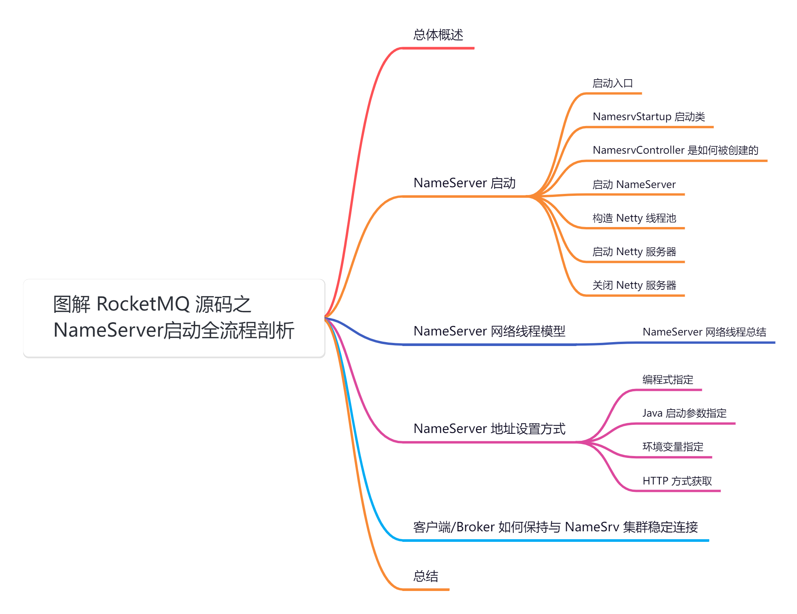

## **01 总体概述**

在深入剖析 NameServer 源码之前，我们先带着这几个问题去探究：

1.  NameServer 启动时需要加载哪些配置以及加载流程如何？
2.  NameServer 启动流程是什么样的？会创建哪些核心数据结构？
3.  NameServer 以什么样的数据结构存储着 Broker 与路由信息的？
4.  Broker 上线、下线、发送心跳这些操作在 NameServer 中是如何进行的？
5.  NameServer 是如何进行 Broker 心跳检测的？

在上一篇中，我们剖析了「**NameServer**」整个模块的源码结构、交互流程、以及核心配置的加载流程等等。

具体可以查看：[【NameServer源码分析系列第一篇】图解 RocketMQ 源码之 NameServer 核心配置及加载流程剖析](https://articles.zsxq.com/id_zsw6krkqiajj.html)

今天我们继续上篇的内容，剖析下「**NameServer**」是如何启动以及「**NettyServer**」是如何启动的。

## **02 NameServer 启动**

## **2.1 启动入口**

「**NameServer**」的启动脚本在 distribution 模块的 bin 目录下—— 「**mqnamesrv**」。

启动命令如下：

nohup sh mqnamesrv &

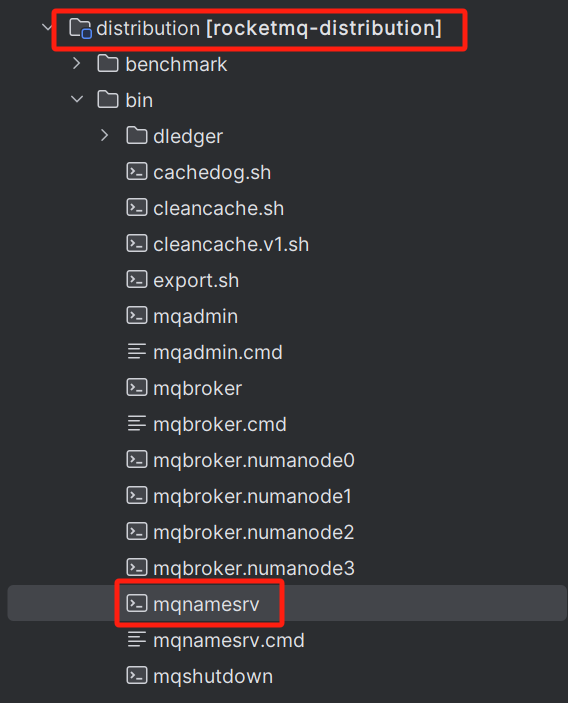

这个脚本中有极为关键的一行命令用于启动 NameServer 进程：

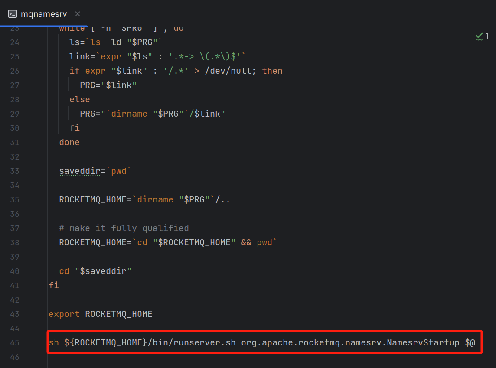

可以看到，上面的命令其实是执行了 [runserver.sh](http://runserver.sh/) 这个脚本，然后通过这个脚本去启动了 NamesrvStartup 这个Java 类，下面是 [runserver.sh](http://runserver.sh/) 这个脚本的一些内容：

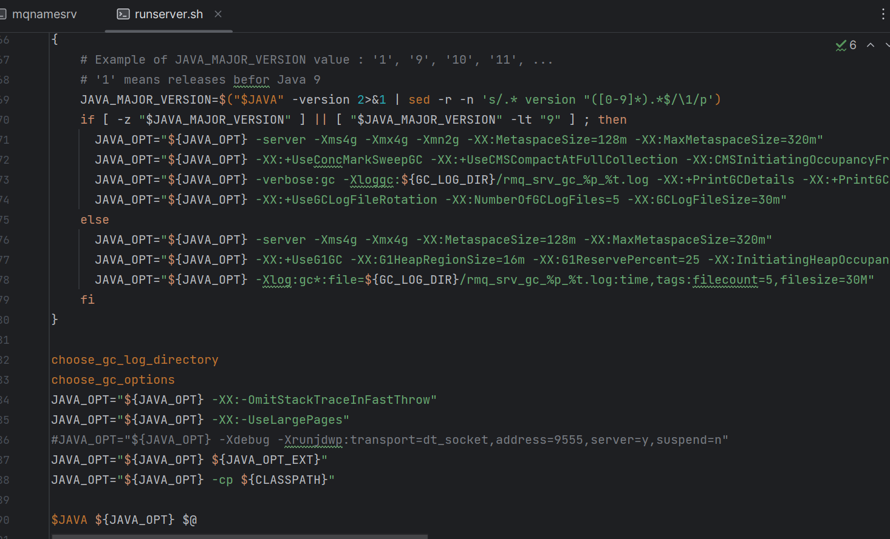

其实就是通过 java 命令去执行 [NamesrvStartup.main()](http://namesrvstartup.main\(\)/) 方法，启动一个 JVM 进程：

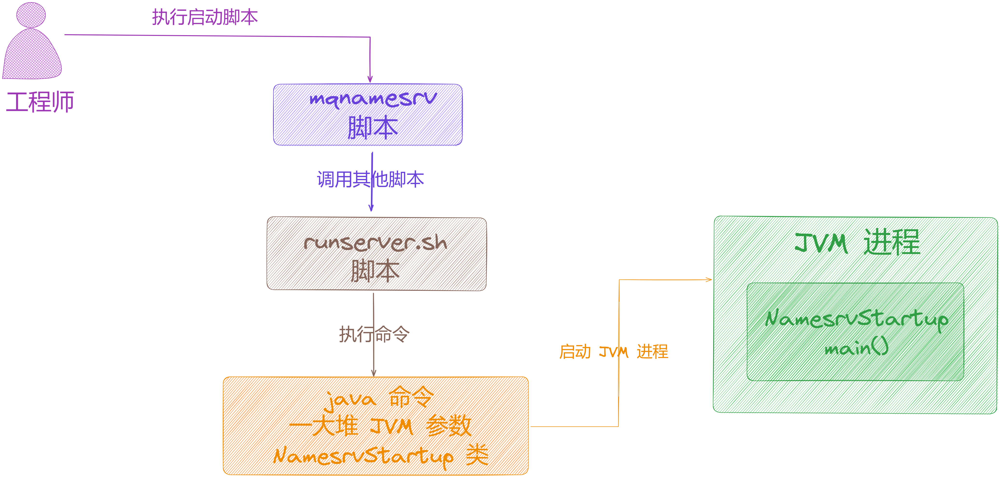

## **2.2 NamesrvStartup 启动类**

主流程很简洁，先创建核心的「**NameSrvController**」控制器，再启动「**控制器**」。

[NamesrvStartup](http://namesrvstartup/) 类是 NameServer 的启动类，它会调用 [NamesrvController](http://namesrvcontroller/) 类的初始化和启动方法，执行 NameServer 具体模块的初始化和启动。

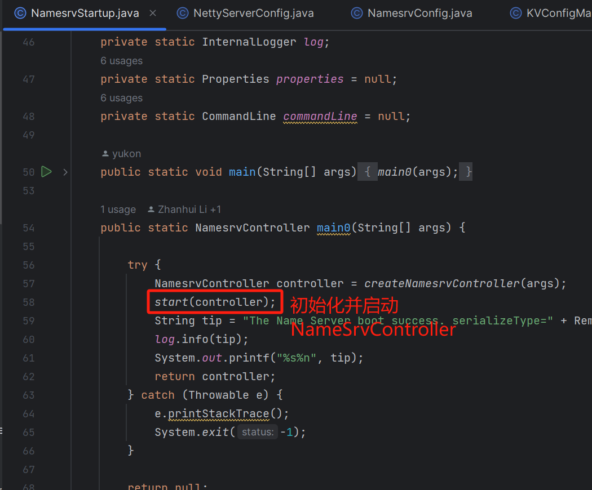

可以看到，在 main() 方法内部最核心的逻辑是创建了一个「**NameSrvController**」对象，然后调用 [start(controller)](http://start\(controller\)/) 方法来启动这个 Controller。

我们继续剖析如何启动 [NamesrvController](http://namesrvcontroller/) 以及 Netty 服务器。

## **2.3 NamesrvController 是如何被创建的**

在上篇中，我们剖析了 [createNamesrvController()](http://createnamesrvcontroller\(\)/) 方法，在结尾的时候初始化了 [NamesrvController](http://namesrvcontroller/) 。

「**NameSrvController**」是什么呢？

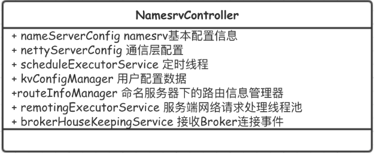

其实从命名就可以看出这是一个控制器，熟悉 Spring 的童鞋应该不会陌生，Controller 一般用于接受请求，那么 NameServer 接受什么请求呢？

当然是 Broker 的「**注册请求**」、「**心跳请求**」，以及Producer 和 Consumer 的「**拉取路由信息请求**」。

「**NameSrvController**」这个组件，就是 NameServer 专门用来接受 Broker 和客户端的网络请求的一个组件。

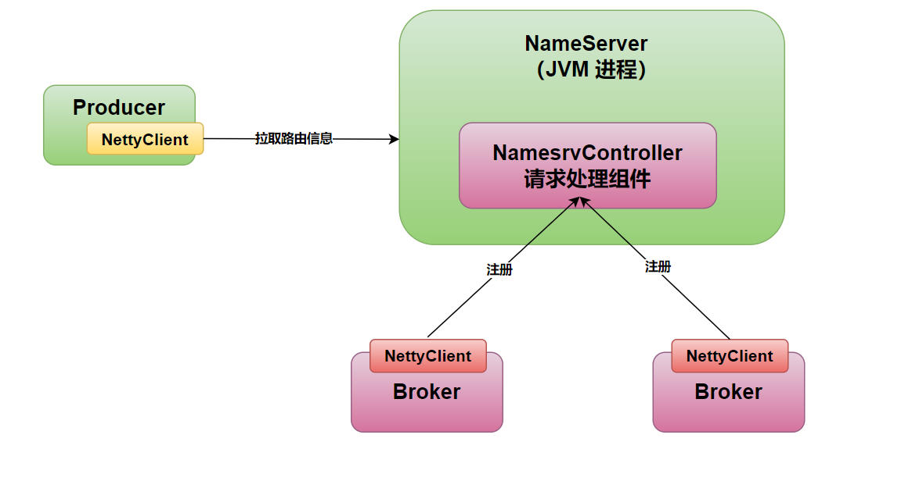

public static NamesrvController createNamesrvController(String\[\] args) throws IOException, JoranException {

...

// 初始化并创建 NamesrvController

final NamesrvController controller \= new NamesrvController(namesrvConfig, nettyServerConfig);

// remember all configs to prevent discard

// 将全局 Properties 的内容复制到 NamesrvController.Configuration.allConfigs 中

controller.getConfiguration().registerConfig(properties);

return controller;

}

乍看上去源码挺多的，其实核心就做了一件事情：**解析命令行中的相关参数，然后构建出两个配置对象----** 「**NamesrvConfig**」和 「**NettyServerConfig**」。

我们在启动 NameServer 的时候，是使用 mqnamesrv 命令来启动的，启动的时候可能会在命令行里带入一些参数，所以开头那部分源码，就是解析一下我们传递进去的一些命令行参数而已！

这里最关键的是创建了两个配置对象：

// 初始化 NameServer 配置类，包含 NameServer 的配置，比如 ROCKETMQ\_HOME

final NamesrvConfig namesrvConfig \= new NamesrvConfig();

// 初始化 NameServer 网络配置参数（Netty 服务端配置）

final NettyServerConfig nettyServerConfig \= new NettyServerConfig();

// 设置 NameServer 的服务的监听端口号 9876

nettyServerConfig.setListenPort(9876);

1.  **NamesrvConfig：**包含的是 NameServer 自身运行的一些配置参数，NameServer 默认监听请求的端口号是9876，用来接收 Broker 和客户端的请求。
2.  **NettyServerConfig：**包含的是用于接收网络请求的 Netty 服务器的配置参数。

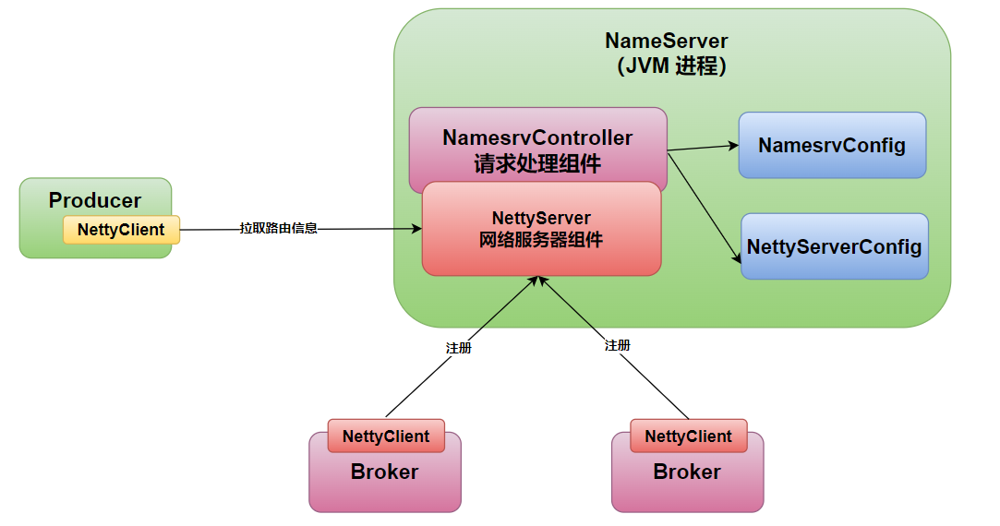

## **2.4 启动 NameServer**

我们回到主流程，当构建完了「**NameSrvController**」对象后，开始执行 start() 方法来启动 「**NameSrvController**」了。

启动 NameServer 的核心入口方法是

我们来看看 start() 方法的源码实现。

源码位置：[https://github.com/apache/rocketmq/blob/release-4.9.7/namesrv/src/main/java/org/apache/rocketmq/namesrv/NamesrvStartup.java](https://github.com/apache/rocketmq/blob/release-4.9.7/namesrv/src/main/java/org/apache/rocketmq/namesrv/NamesrvStartup.java)

public static NamesrvController start(final NamesrvController controller) throws Exception {

if (null == controller) {

throw new IllegalArgumentException("NamesrvController is null");

}

// 初始化 NamesrvController 核心逻辑

boolean initResult \= controller.initialize();

if (!initResult) {

controller.shutdown();

System.exit(-3);

}

// 注册 JVM 钩子函数，如果一个类中使用了线程池，一种优雅的停机方式就是注册一个 JVM 钩子函数，在JVM进程关闭之前，先将线程池关闭，释放资源

Runtime.getRuntime().addShutdownHook(new ShutdownHookThread(log, (Callable<Void>) () -> {

controller.shutdown();

return null;

}));

// 启动 controller

controller.start();

return controller;

}

可以看到该方法中也没有什么核心实现，步骤如下：

1.  初始化核心逻辑。
2.  **注册 JVM 钩子函数，如果一个类中使用了线程池，一种优雅的停机方式就是注册一个 JVM 钩子函数，在 JVM 进程关闭之前，先将线程池关闭，释放资源**。
3.  启动 controller。

其核心就是第一步：初始化核心逻辑。

boolean initResult \= controller.initialize();

public boolean initialize() {

// 加载 kvConfigPath 下 kvConfig.json 配置文件里的 KV 配置，然后将这些配置放到KVConfigManager#configTable 属性中，KVConfig 配置文件默认路径是 ${user.home}/namesrv/kvConfig.json

this.kvConfigManager.load();

// 根据 nettyServerConfig 初始化一个 netty 远程服务器。创建NameServer的netty远程服务

// brokerHousekeepingService 是在 NamesrvController 实例化时构造函数里实例化的，该类负责Broker 连接事件的处理，实现了 ChannelEventListener，主要用来管理 RouteInfoManager#brokerLiveTable

// remotingServer 是一个基于 Netty 的用于 NameServer 与 Broker、Consumer、Producer 进行网络通信的服务端

this.remotingServer = new NettyRemotingServer(this.nettyServerConfig, this.brokerHousekeepingService);

// 初始化负责处理 Netty 网络交互数据的线程池，用作默认的请求处理线程池，默认线程数是8个，线程名以 RemotingExecutorThread\_ 为前缀

this.remotingExecutor =

Executors.newFixedThreadPool(nettyServerConfig.getServerWorkerThreads(), new ThreadFactoryImpl("RemotingExecutorThread\_"));

// 注册默认请求处理器 DefaultRequestProcessor，将 remotingExecutor 绑定到DefaultRequestProcessor 上，用作默认的请求处理线程池，然后将 DefaultRequestProcessor 绑定到remotingServer 的 defaultRequestProcessor 属性上。

// 如果开启了 clusterTest，那么注册的请求处理类是ClusterTestRequestProcessor，否则请求处理类是 DefaultRequestProcessor

this.registerProcessor();

// 启动一个定时任务注册心跳机制线程池，首次延迟 5 秒启动，此后每隔 10 秒遍历 RouteInfoManager#brokerLiveTable 执行一次扫描无效的 Broker，并清除 Broker 相关路由信息的任务

this.scheduledExecutorService.scheduleAtFixedRate(NamesrvController.this.routeInfoManager

::scanNotActiveBroker, 5, 10, TimeUnit.SECONDS);

// 启动一个定时任务注册打印 KV 配置线程池，延迟 1 分钟启动、此后每 10 分钟执行一次打印出 kvConfig 配置的任务

this.scheduledExecutorService.scheduleAtFixedRate(NamesrvController.this.kvConfigManager::

printAllPeriodically, 1, 10, TimeUnit.MINUTES);

// rocketmq 可以通过开启 TLS 来提高数据传输的安全性，如果开启了那么需要注册一个监听器来重新加载 SslContext

// TLS 传输相关配置，通信安全的文件监听模块，用来观察网络加密配置文件的更改

if (TlsSystemConfig.tlsMode != TlsMode.DISABLED) {

// Register a listener to reload SslContext

try {

fileWatchService = new FileWatchService(

new String\[\] {

TlsSystemConfig.tlsServerCertPath,

TlsSystemConfig.tlsServerKeyPath,

TlsSystemConfig.tlsServerTrustCertPath

},

new FileWatchService.Listener() {

boolean certChanged, keyChanged = false;

@Override

public void onChanged(String path) {

if (path.equals(TlsSystemConfig.tlsServerTrustCertPath)) {

log.info("The trust certificate changed, reload the ssl context");

reloadServerSslContext();

}

if (path.equals(TlsSystemConfig.tlsServerCertPath)) {

certChanged = true;

}

if (path.equals(TlsSystemConfig.tlsServerKeyPath)) {

keyChanged = true;

}

if (certChanged && keyChanged) {

log.info("The certificate and private key changed, reload the ssl context");

certChanged = keyChanged = false;

reloadServerSslContext();

}

}

private void reloadServerSslContext() {

((NettyRemotingServer) remotingServer).loadSslContext();

}

});

} catch (Exception e) {

log.warn("FileWatchService created error, can't load the certificate dynamically");

}

}

return true;

}

该方法主要是 NameServer 初始化流程，可以看出这里主要有 5 步骤操作：

1.  加载 KV 配置，并写入到 [KVConfigManager#configTable](http://kvconfigmanager/#configTable) 属性中。
2.  初始化 netty 服务器， NettyRemotingServer 是 RocektMQ 对 Netty 的再一次封装，它负责和客户端进行RPC通信。
3.  初始化处理 netty 网络交互数据的线程池，构建一个默认8个线程的线程池 remotingExecutor。这个线程池就是最终处理业务的线程所在的线程池。 也就是运行 [DefaultRequestProcessor#processRequest](http://defaultrequestprocessor/#processRequest) 方法的线程池。暂且称它为「**M2**」。
4.  注册请求处理器。4.9.x 中，namesrv 定义了 2 种处理器 [DefaultRequestProcessor](http://defaultrequestprocessor/) 和 [ClusterTestRequestProcessor](http://clustertestrequestprocessor/)，后者继承了前者，重写了一个方法 [getRouteInfoByTopic](http://getrouteinfobytopic/)。即在当前 namesrv 中拿不到指定 topic 的路由信息时会到别的namesrv 去拿。其中 [NettyRequestProcessor](http://nettyrequestprocessor/) 就是 [DefaultRequestProcessor](http://defaultrequestprocessor/)，[ExecutorService](http://executorservice/)就是[remotingExecutor](http://remotingexecutor/)。
5.  注册心跳机制线程池，启动 5 秒后每隔 10 秒检测一次 Broker 的存活情况。
6.  注册打印 KV 配置的线程池，启动 1 分钟后，每隔 10 分钟打印一次 KV 配置。

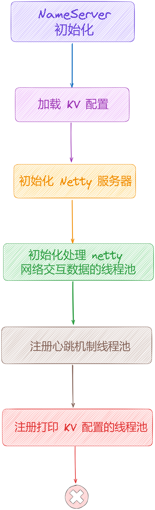

这里有个关键的服务「**NettyRemotingServer**」，那么什么是「**NettyRemotingServer**」呢？

在前面介绍「**NameServer**」的功能时，提到「**NameServer**」是一个简单的注册中心，那么「**NettyRemotingServer**」就是对外开放的入口，用来接收 Broker 的注册消息的，当然还会处理一些其他消息，我们在 「**网络通信模块**」会详细剖析。

## **2.5 构造 Netty 线程池**

这里我们重点看看与 Netty 相关的源码。

// brokerHousekeepingService 是在 NamesrvController 实例化时构造函数里实例化的，该类负责Broker 连接事件的处理，实现了 ChannelEventListener，主要用来管理 RouteInfoManager#brokerLiveTable

this.remotingServer = new NettyRemotingServer(this.nettyServerConfig, this.brokerHousekeepingService);

public NettyRemotingServer(final NettyServerConfig nettyServerConfig,

final ChannelEventListener channelEventListener) {

// 设置服务器单向、异步发送信号量

super(nettyServerConfig.getServerOnewaySemaphoreValue(), nettyServerConfig.getServerAsyncSemaphoreValue());

// 创建 Netty 服务端启动类，引导启动服务端

this.serverBootstrap = new ServerBootstrap();

this.nettyServerConfig = nettyServerConfig;

this.channelEventListener = channelEventListener;

// 服务器回调执行线程数量，默认设置为 4

int publicThreadNums \= nettyServerConfig.getServerCallbackExecutorThreads();

if (publicThreadNums <= 0) {

publicThreadNums = 4;

}

// 创建一个公共线程池，负责处理某些请求业务，例如发送异步消息回调，线程名以NettyServerPublicExecutor\_ 为前缀

this.publicExecutor = Executors.newFixedThreadPool(publicThreadNums, new ThreadFactory() {

private AtomicInteger threadIndex \= new AtomicInteger(0);

@Override

public Thread newThread(Runnable r) {

return new Thread(r, "NettyServerPublicExecutor\_" + this.threadIndex.incrementAndGet());

}

});

/\*\*

\* 是否使用 epoll 模型，并且初始化 Boss EventLoopGroup 和 Worker EventLoopGroup 这两个事件循环组

\* 如果是 linux 内核，并且指定开启 epoll，并且系统支持 epoll，才会使用EpollEventLoopGroup，否则使用 NioEventLoopGroup

\*/

if (useEpoll()) {

// 采用了epoll

this.eventLoopGroupBoss = new EpollEventLoopGroup(1, new ThreadFactory() {

private AtomicInteger threadIndex \= new AtomicInteger(0);

@Override

public Thread newThread(Runnable r) {

return new Thread(r, String.format("NettyEPOLLBoss\_%d", this.threadIndex.incrementAndGet()));

}

});

this.eventLoopGroupSelector = new EpollEventLoopGroup(nettyServerConfig.getServerSelectorThreads(), new ThreadFactory() {

private AtomicInteger threadIndex \= new AtomicInteger(0);

private int threadTotal \= nettyServerConfig.getServerSelectorThreads();

@Override

public Thread newThread(Runnable r) {

return new Thread(r, String.format("NettyServerEPOLLSelector\_%d\_%d", threadTotal, this.threadIndex.incrementAndGet()));

}

});

} else {

// 未采用epoll

// Boss EventLoopGroup 默认1个线程，线程名以NettyNIOBoss\_为前缀

this.eventLoopGroupBoss = new NioEventLoopGroup(1, new ThreadFactory() {

private AtomicInteger threadIndex \= new AtomicInteger(0);

@Override

public Thread newThread(Runnable r) {

return new Thread(r, String.format("NettyNIOBoss\_%d", this.threadIndex.incrementAndGet()));

}

});

// Worker EventLoopGroup 默认3个线程，线程名以 NettyServerNIOSelector\_ 为前缀

this.eventLoopGroupSelector = new NioEventLoopGroup(nettyServerConfig.getServerSelectorThreads(), new ThreadFactory() {

private AtomicInteger threadIndex \= new AtomicInteger(0);

private int threadTotal \= nettyServerConfig.getServerSelectorThreads();

@Override

public Thread newThread(Runnable r) {

return new Thread(r, String.format("NettyServerNIOSelector\_%d\_%d", threadTotal, this.threadIndex.incrementAndGet()));

}

});

}

// 加载 ssl 信息

loadSslContext();

}

通过上面的源码可以看出 [NettyRemotingServer](http://nettyremotingserver/) 的构造器主要做了以下事情：

1.  首先创建 [serverBootstrap](http://serverbootstrap/)，这是 Netty 服务端启动类，引导启动服务端。
2.  接着创建一个公共线程池 [publicExecutor](http://publicexecutor/)，线程数默认 4 个线程，线程名以 [NettyServerPublicExecutor\_](http://nettyserverpublicexecutor_/) 为前缀。用在 [registerProcessor](http://registerprocessor/) 方法中，在该方法注册 Netty 事件处理器时如果没指定线程池，则会统一使用 [publicExecutor](http://publicexecutor/) 来处理具体的业务，用于处理某些特定的请求业务，例如异步发送消息的回调。
3.  根据是否使用 epoll 模型来初始化 [Boss EventLoopGroup](http://boss%20eventloopgroup/) 和 [Worker EventLoopGroup](http://worker%20eventloopgroup/) 这两个事件循环组，线程数分别默认 1 个和 3 个线程，线程名分别以 [NettyEPOLLBoss\_](http://nettyepollboss_/) 和 [NettyServerEPOLLSelector\_](http://nettyserverepollselector_/) 为前缀。这两个线程组对于熟悉 Netty 的同学应该不陌生了，boss 用于处理连接事件，worker 用于处理读写事件。
4.  如果是 Linux 内核，并且指定开启 epoll，并且系统支持 epoll，才会使用 [EpollEventLoopGroup](http://epolleventloopgroup/) 类型，否则使用 [NioEventLoopGroup](http://nioeventloopgroup/) 类型。

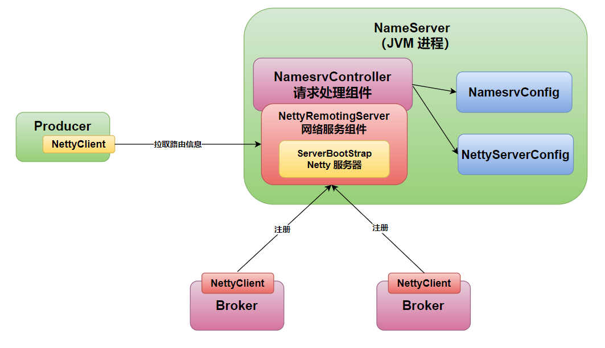

可以看到这里只是创建了一些 Netty 相关的线程池，并没有启动 Netty 服务器。但是创建完成线程池后，接着就是注册了，也就是 [registerProcessor](http://registerprocessor/) 方法所做的工作：

this.registerProcessor();

在 [registerProcessor()](http://registerprocessor\(\)/) 中 ，会把当前的 [NamesrvController](http://namesrvcontroller/) 注册到 [remotingServer](http://remotingserver/) 中：

private void registerProcessor() {

if (namesrvConfig.isClusterTest()) {

this.remotingServer.registerDefaultProcessor(new ClusterTestRequestProcessor(this, namesrvConfig.getProductEnvName()),

this.remotingExecutor);

} else {

// 注册操作

this.remotingServer.registerDefaultProcessor(new DefaultRequestProcessor(this), this.remotingExecutor);

}

}

最终注册到为 [NettyRemotingServer#defaultRequestProcessor](http://nettyremotingserver/#defaultRequestProcessor) 属性：

@Override

public void registerDefaultProcessor(NettyRequestProcessor processor, ExecutorService executor) {

this.defaultRequestProcessor = new Pair<NettyRequestProcessor, ExecutorService>(processor, executor);

}

好了，到这里「**NettyRemotingServer**」相关的配置就准备完成了。

## **2.6 启动 Netty 服务器**

做了这么多准备工作，最后启动 Netty 服务器的实现还是从这里启动的，在初始化 [NettyServer](http://nettyserver/) 完毕并且注册了钩子函数之后，将会启动 [NettyServer](http://nettyserver/)。

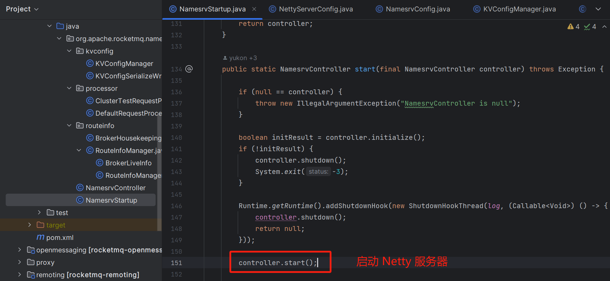

源码位置：[https://github.com/apache/rocketmq/blob/release-4.9.7/namesrv/src/main/java/org/apache/rocketmq/namesrv/](https://github.com/apache/rocketmq/blob/release-4.9.7/namesrv/src/main/java/org/apache/rocketmq/namesrv/NamesrvController.java)[NamesrvController](https://github.com/apache/rocketmq/blob/release-4.9.7/namesrv/src/main/java/org/apache/rocketmq/namesrv/NamesrvController.java)[.java](https://github.com/apache/rocketmq/blob/release-4.9.7/namesrv/src/main/java/org/apache/rocketmq/namesrv/NamesrvController.java)

public void start() throws Exception {

// 调用 remotingServer 的启动方法

this.remotingServer.start();

// 监听 tls 配置文件的变化

if (this.fileWatchService != null) {

// 监听 tls 相关文件是否发生变化

this.fileWatchService.start();

}

}

「**NameSrvController**」的启动，核心就是内部的「**NettyRemotingServer**」的启动，可以看到内部会调用 [NettyRemotingServer#start](http://nettyremotingserver/#start) 方法，该方法才是核心方法，将会启动一个 Netty 服务端。实际上 [NettyRemotingServer](http://nettyremotingserver/) 类属于 remoting 远程通信模块，因此它是 [NameServer](http://nameserver/) 和 [Broker](http://broker/) 共用的进入网络通信类。

@Override

public void start() {

/\*

\* 1、对 Netty 的各种配置，核心就是基于 Netty 的 API 去配置和启动一个网络服务器。

\* 创建默认事件处理器组，线程数默认8个线程，线程名以 NettyServerCodecThread\_ 为前缀。

\* 主要用于执行在真正执行业务逻辑之前需要进行的SSL验证、编解码、空闲检查、网络连接管理等操作

\* 其工作时间位于IO线程组之后，process线程组之前

\*/

this.defaultEventExecutorGroup = new DefaultEventExecutorGroup(

nettyServerConfig.getServerWorkerThreads(),

new ThreadFactory() {

private AtomicInteger threadIndex \= new AtomicInteger(0);

@Override

public Thread newThread(Runnable r) {

return new Thread(r, "NettyServerCodecThread\_" + this.threadIndex.incrementAndGet());

}

});

/\*

\* 准备一些共享handler

\* 包括handshakeHandler、encoder、connectionManageHandler、serverHandler

\*/

prepareSharableHandlers();

/\*

\* 2、配置NettyServer的启动参数

\* 包括handshakeHandler、encoder、connectionManageHandler、serverHandler

\*/

ServerBootstrap childHandler \=

//配置bossGroup为此前创建的eventLoopGroupBoss，默认1个线程，用于处理连接时间

//配置workerGroup为此前创建的eventLoopGroupSelector，默认三个线程，用于处理IO事件

this.serverBootstrap.group(this.eventLoopGroupBoss, this.eventLoopGroupSelector)

//IO模型

.channel(useEpoll() ? EpollServerSocketChannel.class : NioServerSocketChannel.class)

/\*设置通道的选项参数， 对于服务端而言就是ServerSocketChannel， 客户端而言就是SocketChannel\*/

/\*option主要是针对boss线程组，child主要是针对worker线程组\*/

//对应的是tcp/ip协议listen函数中的backlog参数

.option(ChannelOption.SO\_BACKLOG, nettyServerConfig.getServerSocketBacklog())

//对应于套接字选项中的SO\_REUSEADDR，这个参数表示允许重复使用本地地址和端口

.option(ChannelOption.SO\_REUSEADDR, true)

//对应于套接字选项中的SO\_KEEPALIVE，该参数用于设置TCP连接，当设置该选项以后，连接会测试链接的状态

.option(ChannelOption.SO\_KEEPALIVE, false)

//对应于套接字选项中的TCP\_NODELAY，该参数的使用与Nagle算法有关

.childOption(ChannelOption.TCP\_NODELAY, true)

//配置本地地址，监听端口为此前设置的9876

.localAddress(new InetSocketAddress(this.nettyServerConfig.getListenPort()))

/\*设置用于为 Channel 的请求提供服务的 ChannelHandler\*/

.childHandler(new ChannelInitializer<SocketChannel>() {

@Override

public void initChannel(SocketChannel ch) throws Exception {

//ChannelPipeline一个ChannelHandler的链表，Netty处理请求基于责任链默认

//里面的ChannelHandler就是用于处理请求的

ch.pipeline()

//处理TSL协议握手的Handler

.addLast(defaultEventExecutorGroup, HANDSHAKE\_HANDLER\_NAME, handshakeHandler)

//为defaultEventExecutorGroup，添加handler

.addLast(defaultEventExecutorGroup,

//RocketMQ自定义的请求解码器

encoder,

//RocketMQ自定义的请求编码器

new NettyDecoder(),

//Netty自带的心跳管理器，主要是用来检测远端是否存活

//即测试端一定时间内未接受到被测试端消息和一定时间内向被测试端发送消息的超时时间为120秒

new IdleStateHandler(0, 0, nettyServerConfig.getServerChannelMaxIdleTimeSeconds()),

//连接管理器，他负责连接的激活、断开、超时、异常等事件

connectionManageHandler,

//服务请求处理器，处理RemotingCommand消息，即请求和响应的业务处理，并且返回相应的处理结果。这是重点

//例如broker注册、producer/consumer获取Broker、Topic信息等请求都是该处理器处理

//serverHandler最终会将请求根据不同的消息类型code分发到不同的process线程池处理

serverHandler

);

}

});

//对应于套接字选项中的SO\_SNDBUF，接收缓冲区，默认是65535

if (nettyServerConfig.getServerSocketSndBufSize() > 0) {

log.info("server set SO\_SNDBUF to {}", nettyServerConfig.getServerSocketSndBufSize());

childHandler.childOption(ChannelOption.SO\_SNDBUF, nettyServerConfig.getServerSocketSndBufSize());

}

//对应于套接字选项中的SO\_SNDBUF，发送缓冲区，默认是65535

if (nettyServerConfig.getServerSocketRcvBufSize() > 0) {

log.info("server set SO\_RCVBUF to {}", nettyServerConfig.getServerSocketRcvBufSize());

childHandler.childOption(ChannelOption.SO\_RCVBUF, nettyServerConfig.getServerSocketRcvBufSize());

}

//用于设置写缓冲区的低水位线和高水位线。

if (nettyServerConfig.getWriteBufferLowWaterMark() > 0 && nettyServerConfig.getWriteBufferHighWaterMark() > 0) {

log.info("server set netty WRITE\_BUFFER\_WATER\_MARK to {},{}",

nettyServerConfig.getWriteBufferLowWaterMark(), nettyServerConfig.getWriteBufferHighWaterMark());

childHandler.childOption(ChannelOption.WRITE\_BUFFER\_WATER\_MARK, new WriteBufferWaterMark(

nettyServerConfig.getWriteBufferLowWaterMark(), nettyServerConfig.getWriteBufferHighWaterMark()));

}

//分配缓冲区

if (nettyServerConfig.isServerPooledByteBufAllocatorEnable()) {

childHandler.childOption(ChannelOption.ALLOCATOR, PooledByteBufAllocator.DEFAULT);

}

try {

/\*

\* 3、启动Netty服务

\* 核心是这里，bind 方法就是绑定和监听指定端口，默认是 9876

\*/

ChannelFuture sync \= this.serverBootstrap.bind().sync();

InetSocketAddress addr \= (InetSocketAddress) sync.channel().localAddress();

//设置端口号，默认9876

this.port = addr.getPort();

} catch (InterruptedException e1) {

throw new RuntimeException("this.serverBootstrap.bind().sync() InterruptedException", e1);

}

//如果channelEventListener不为null，那么启动netty事件执行器

//这里的listener就是之前初始化的BrokerHousekeepingService

if (this.channelEventListener != null) {

// 启动 netty 服务

this.nettyEventExecutor.start();

}

/\*

\* 启动定时任务，初始启动3秒后执行，此后每隔1秒执行一次

\* 扫描responseTable，将超时的ResponseFuture直接移除，并且执行这些超时ResponseFuture的回调

\*/

this.timer.scheduleAtFixedRate(new TimerTask() {

@Override

public void run() {

try {

NettyRemotingServer.this.scanResponseTable();

} catch (Throwable e) {

log.error("scanResponseTable exception", e);

}

}

}, 1000 \* 3, 1000);

}

核心步骤如下：

1.  构建一个线程数为 8 的线程池 [defaultEventExecutorGroup](http://%20defaulteventexecutorgroup/)，其内有 8 个执行器 [EventExecutor](http://eventexecutor/)，每个执行器都只有一个线程。 这个线程池组暂且称它为「**M1**」。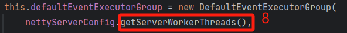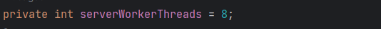
2.  使用构建器模式构建 NettyServer 端引导类，首先是指明要用的 Reactor 线程模型，这里的[eventLoopGroupBoss](http://eventloopgroupboss/) 为只有一个线程的线程池暂且叫它「**1**」，[eventLoopGroupSelector](http://eventloopgroupselector/) 是有 3 个线程的线程池暂且叫它「**n**」。然后指定了 Channel 类型，接着就是对「**端口**」、「**TCP机制设定**」、「**指定感兴趣的IP**」（对连接来的客户端做限制)以及「**监听端口**」。
3.  [childHandler(new ChannelInitializer()](http://childhandler\(new%20channelinitializer\(\)/) 是重点。在新的连接被接受时，新的 Channel 被创建，这里的[ChannelInitializer](http://channelinitializer/) 就是对这个 Channel 进行初始化。可以看到在这个 Channel 的 pipeline 里添加了几个[ChannelHandler](http://channelhandler/)，并且这些 [ChannelHandler](http://channelhandler/) 共用一个线程池 [defaultEventExecutorGroup](http://defaulteventexecutorgroup/) 来执行逻辑，也就是在第一步中创建的「**M1**」。这些 [ChannelHandler](http://channelhandler/) 分别关注不同的 I/O事件，当对应的 I/O 事件被触发后会调用执行里面的方法。对于最后一个 [NettyServerHandler](http://nettyserverhandler/)，最终会被 [defaultEventExecutorGroup](http://defaulteventexecutorgroup/) 线程池再委托给[remotingExecutor](http://remotingexecutor/) 来执行(还记得前面说的「**M2**」吗)，最终会执行 [DefaultRequestProcessor#processRequest](http://defaultrequestprocessor/#processRequest) 方法，对请求做真正的处理。
4.  启动 Netty 服务。

执行完 [NamesrvController#start](http://namesrvcontroller/#start) 方法后，「**NameServer**」就可以对外提供连接服务了。

## **2.7 关闭 Netty 服务器**

在 [initialize](http://initialize/) 方法执行完毕之后，对 JVM 添加关闭钩子方法，在 NameServer 的 JVM 关闭之前执行，关闭[NameServerController](http://nameservercontroller/) 中线程池，NettyServer 进行关闭进行一些内存清理、对象销毁等操作。

源码位置：[https://github.com/apache/rocketmq/blob/release-4.9.7/namesrv/src/main/java/org/apache/rocketmq/namesrv/](https://github.com/apache/rocketmq/blob/release-4.9.7/namesrv/src/main/java/org/apache/rocketmq/namesrv/NamesrvController.java)[NamesrvController](https://github.com/apache/rocketmq/blob/release-4.9.7/namesrv/src/main/java/org/apache/rocketmq/namesrv/NamesrvController.java)[.java](https://github.com/apache/rocketmq/blob/release-4.9.7/namesrv/src/main/java/org/apache/rocketmq/namesrv/NamesrvController.java)

内部主要是调用 controller 的 shutdown 方法：

public void shutdown() {

//关闭nettyserver

this.remotingServer.shutdown();

//关闭线程池

this.remotingExecutor.shutdown();

//关闭定时任务

this.scheduledExecutorService.shutdown();

if (this.fileWatchService != null) {

this.fileWatchService.shutdown();

}

}

## **03 NameServer 网络线程模型**

通过上面「**NameServer**」的启动流程，我们可以看到其中创建了许多的线程池「**1**」、「**n**」、「**M1**」、「**M2**」，来执行客户端请求或者执行定时任务。

这就是接下来我们要讨论的「**NameServer**」的 RPC 通信 + 业务处理的线程模型：「**1+n+M1+M2**」线程模型。

在 RocketMQ 中，组件之间的 PRC 通信采用 Netty， Netty 的设计就是 「**Reactor 线程模型**」，但 Netty 不是采用的「**传统的 Reactor 线程模型（1 + n）**」即一个线程接收连接、一组线程处理IO事件。而是在此基础上加以扩展，发展成了「**1+n+M1+M2**」线程模型。

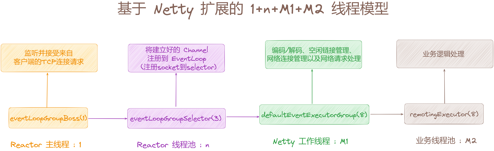

这里简单的解释下：

1.  [eventLoopGroupBoss](http://eventloopgroupboss/) 的任务是负责监听并接受来自客户端的 TCP 连接请求，连接建立好以后马上扔给[eventLoopGroupSelector](http://eventloopgroupselector/)「**n**」。
2.  [eventLoopGroupSelector](http://eventloopgroupselector/) 的任务是在上一步的基础上将建立好的 Channel 注册到 [EventLoop](http://eventloop/) 上（此处是指 [NioEventLoop](http://nioeventloop/)），对应到 java 底层就是调用 NIO 接口将 [SocketChannel](http://socketchannel%20/) 注册到 [selector](http://selector/) 上。然后监听网络数据，拿到网络数据后丢给 [defaultEventExecutorGroup](http://defaulteventexecutorgroup/)「**M1**」线程池。
3.  [defaultEventExecutorGroup](http://defaulteventexecutorgroup/) 的任务主要是负责处理网络通信相关，具体是「**编码/解码**」、「**空闲连接管理**」、「**网络连接管理**」以及「**网络请求处理**」，分别对应如下几个ChannelHandler：NettyEncoder/NettyDecoder、IdleStateHandler、NettyConnectManageHandler、NettyServerHandler。当「**M1**」处理好这些任务后，将最终处理业务逻辑的工作交给 remotingExecutor「**M2**」处理。
4.  [remotingExecutor](http://remotingexecutor/) 处理业务逻辑。根据上一步的分析，最终执行的其实就是[DefaultRequestProcessor#processRequest](http://defaultrequestprocessor/#processRequest) 方法。

如下，在 Netty 中，如果 Channel 是出现了「**连接**」/「**读**」/「**写**」等事件，这些事件会经过 Pipeline 上的 ChannelHandler 上进行流转，「**NettyRemotingServer**」添加的 ChannelHandler 如下：

ch.pipeline()

//处理TSL协议握手的Handler

.addLast(defaultEventExecutorGroup, HANDSHAKE\_HANDLER\_NAME, handshakeHandler)

//为defaultEventExecutorGroup，添加handler

.addLast(defaultEventExecutorGroup,

//RocketMQ自定义的请求解码器

encoder,

//RocketMQ自定义的请求编码器

new NettyDecoder(),

//Netty自带的心跳管理器，主要是用来检测远端是否存活

//即测试端一定时间内未接受到被测试端消息和一定时间内向被测试端发送消息的超时时间为120秒

new IdleStateHandler(0, 0, nettyServerConfig.getServerChannelMaxIdleTimeSeconds()),

//连接管理器，他负责连接的激活、断开、超时、异常等事件

connectionManageHandler,

//服务请求处理器，处理RemotingCommand消息，即请求和响应的业务处理，并且返回相应的处理结果。这是重点

//例如broker注册、producer/consumer获取Broker、Topic信息等请求都是该处理器处理

//serverHandler最终会将请求根据不同的消息类型code分发到不同的process线程池处理

serverHandler

);

这些 ChannelHandler 只要分为几类：

1.  handshakeHandler：处理握手操作，用来判断tls的开启状态。
2.  encoder/NettyDecoder：处理报文的编解码操作。
3.  IdleStateHandler：处理心跳。
4.  connectionManageHandler：处理连接请求。
5.  serverHandler：处理读写请求。

这里我们重点关注的是 serverHandler，这个 ChannelHandler 就是用来处理「**Broker 注册消息**」、「**Producer/Consumer 获取 Topic 消息的**」。

## **3.1 NameServer 网络线程总结**

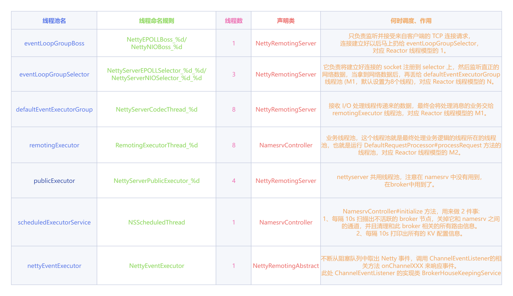

## **04 NameServer 地址设置方式**

客户端在与 broker 交互之前首先要访问「**NameServer**」获取路由信息，那么必须告诉客户端「**NameServer**」的访问地址。

「**NameServer**」地址的设置方式大概分为四种。

## **4.1 编程式指定**

这里以生产者和消费者指定「**NameServer**」的地址列表为例：

DefaultMQProducer producer \= new DefaultMQProducer("please\_rename\_unique\_group\_name");

producer.setNamesrvAddr("name-server1-ip:9876;name-server2-ip:9876");

producer.start();

DefaultMQPushConsumer consumer \= new DefaultMQPushConsumer("please\_rename\_unique\_group\_name");

consumer.setNamesrvAddr("name-server1-ip:9876;name-server2-ip:9876");

consumer.start();

如果你从命令行使用 mqadmin 命令进行各种操作，你可以像这样来指定「**NameServer**」地址列表：

sh mqadmin command-name -n name-server-ip1:port;name-server-ip2:port -X OTHER-OPTION

## **4.2 Java 启动参数指定**

可以通过设置 VM options 来指定「**NameServer**」地址列表：

\-Drocketmq.namesrv.addr=name-server1-ip:port;name-server2-ip:port

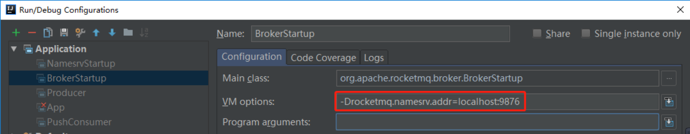

也可以通过设置 Program arguments 来指定「**NameServer**」地址列表：

  
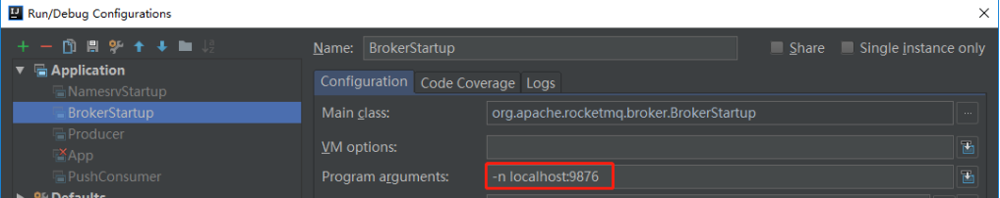

## **4.3 环境变量指定**

通过设置环境变量 [NAMESRV\_ADDR](http://namesrv_addr/) 来指定「**NameServer**」地址列表:

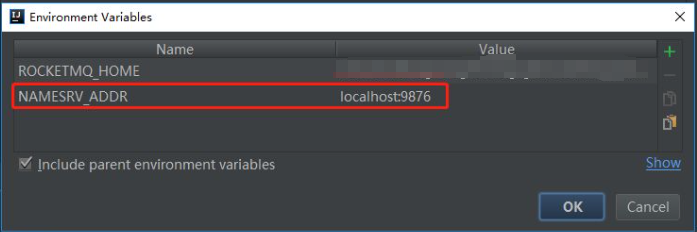

2和3主要用来在本地通过源码启动 RocketMQ 时采用。

##   
**4.4 HTTP 方式获取**

如果你看过 RocketMQ 的源码，你可能会知道在没有通过以上三种方式的任何一种对「**NameServer**」地址进行设置时，RocketMQ 会通过访问以下 HTTP 请求去获取「**NameServer**」地址。

http://jmenv.tbsite.net:8080/rocketmq/nsaddr

我们可以通过设置 JVM 运行参数 [r](http://r/)[ocketmq.namesrv.domain](http://ocketmq.namesrv.domain/) 来覆盖上面 [jmenv.tbsite.net](http://%20jmenv.tbsite.net/) 地址，通过设置参数[rocketmq.namesrv.domain.subgroup](http://rocketmq.namesrv.domain.subgroup/) 来覆盖上面 [nsaddr](http://nsaddr/) 的值。这样你可以搭建自己的一个简单的 web 程序来提供获取「**NameServer**」地址的 Restful 接口。

http 获取「**NameServer**」地址的方式推荐用在生产环境中。这种方式能给你带来最大的灵活度，你可以动态的增加或减少「**NameServer**」节点的数量而对你的「**Broker**」端、客户端不会带来任何影响（不必重启它们）。

producer/consumer客户端启动时会从配置的「**NameServer**」列表中随机选择一个建立 TCP 连接。「**Broker**」端则会和所有的「**NameServer**」建立长连接。

注意，以上 4 种方式的优先级是：

> 1.编程式指定 > 2.Java启动参数中指定 > 3.环境变量指定 > 4.http方式获取

##   
**05 客户端/Broker 如何保持与 NameSrv 集群稳定连接**

我们知道「**Broker**」与所有「**NameServer**」都保持一个长连接，当「**Broker**」端的 topic 信息如有变化，会向所有「**NameServer**」都发送消息，而客户端（生产者和消费者）只是跟某一台「**NameServer**」节点保持联系。

假如一个场景，如果某个「**Broker**」端的 topic 配置发生了变化，它向所有「**NameServer**」发布通知，但是此时如果某一台「**NameServer**」推送失败（超时或者挂掉了），则「**NameServer**」集群之间的信息是不一致的，在这种情况下 RocketMQ 如何保证数据的一致性？

再假如一个场景，如果客户端从「**NameServer**」拉取 topic 路由信息时，「**NameServer**」挂掉导致原先一直保持的长连接断开，客户端如何保证能获取到最新的路由信息？

让我们来看看 RocektMQ 是如何应对这些场景的：

1.  首先 RocketMQ 在进行任何 RPC 请求之前都会检查长连接的状态，如果 channel 的状态不 OK，会尝试进行重连。
2.  对以上 2 种场景分来来讲。
3.  第一个场景，「**Broker**」与「**NameServer**」。如果「**NameServer**」没有真的挂掉，只是瞬间网络不稳定没有响应，经过重连后长连接恢复，则不会产生数据不一致。如果网络不稳定时间比较长，导致本次 topic 上报没有成功，在下一次上报（「**Broker**」会定期上报给「**NameServer**」）之前长连接恢复后，「**NameServer**」会接受到上次没接收到的信息，这期间会出现短暂的数据不一致。所以「**NameServer**」之间确实是「**弱一致性**」，这就是「**NameServer**」提供高性能所牺牲的地方。即使「**NameServer**」真的挂掉，在恢复后「**Broker**」与「**NameServer**」的连接也会自动重连。
4.  第二个场景，客户端与「**NameServer**」。如果与该客户端一直保持长连接状态的「**NameServer**」挂掉。客户端会有「**Failover 故障转移**」机制，当检查到长连接无效后则会通过轮询机制自动连接其他「**NameServer**」。

## **06 总结**

RocketMQ 在启动 「**NameServer**」的过程中会创建「**NameSrvController**」控制器，并初始化一些核心组件「**RouteInfoManager**」路由信息管理组件（[【NameServer源码分析系列第四篇】图解 RocketMQ 源码之RouteInfoManager组件源码设计剖析](https://articles.zsxq.com/id_8boaz51jqig2.html)）、「**NettyRemotingServer**」网络通信服务器组件、「**BrokerHousekeepingService**」网络通信监听器组件，使用了大量 JUC 并发知识和 Netty 网络通信的应用。

它启动后，主要负责与 Broker 通信维护消息队列路由信息，且与 Producer/Consumer 通信分发路由信息。

最后来一张图总结全文，如下：

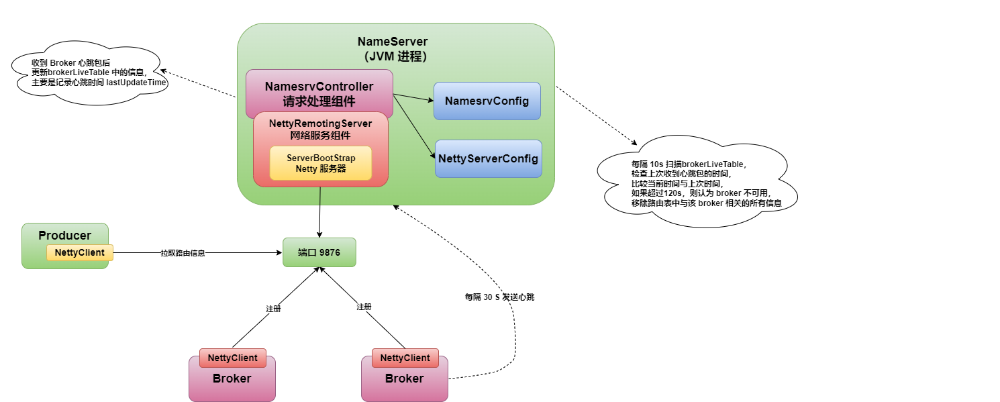