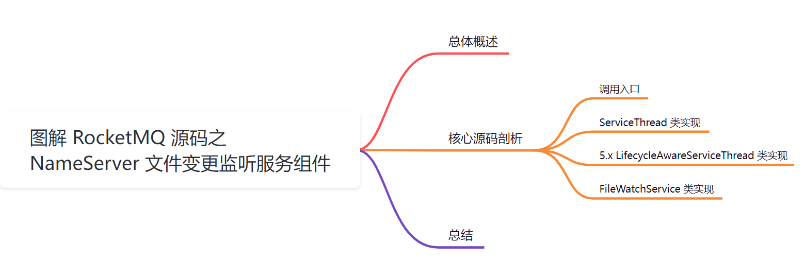
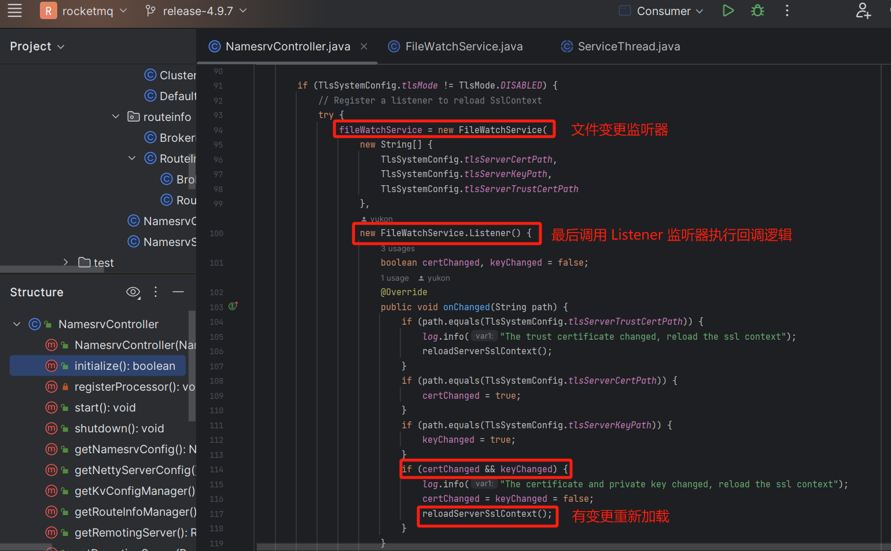
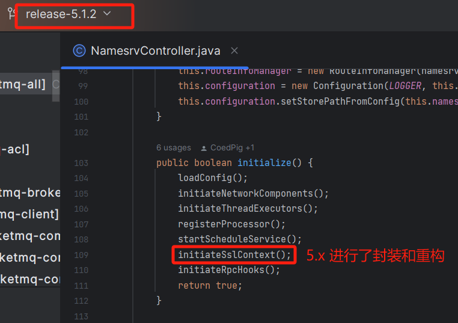
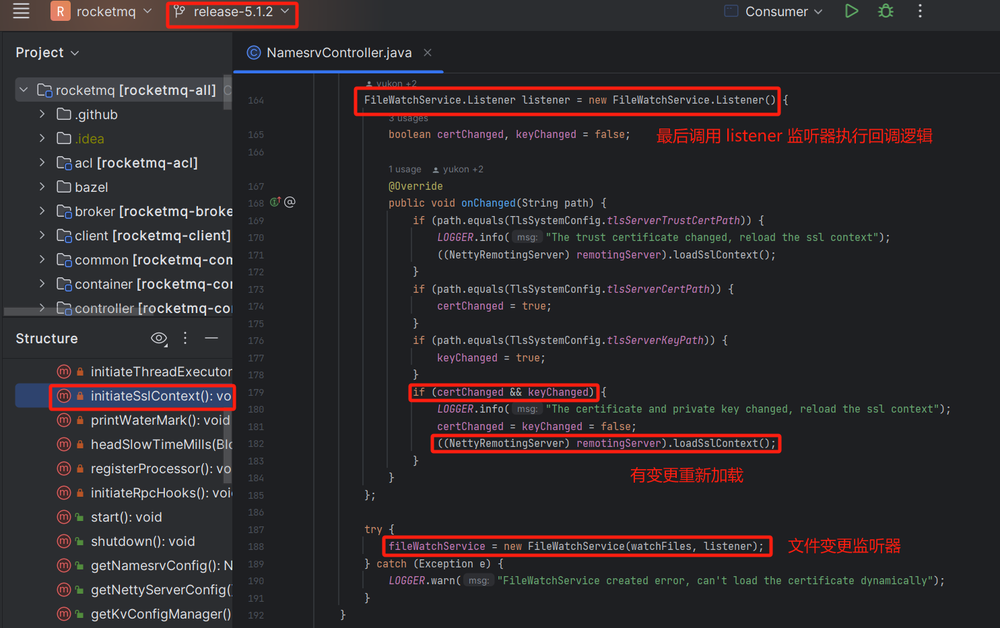
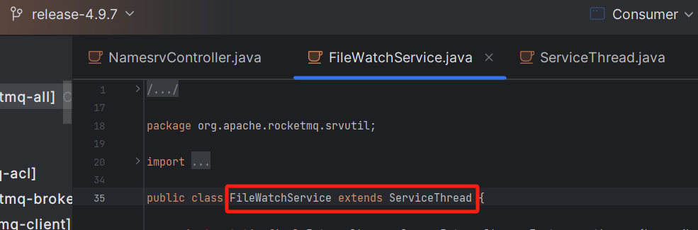
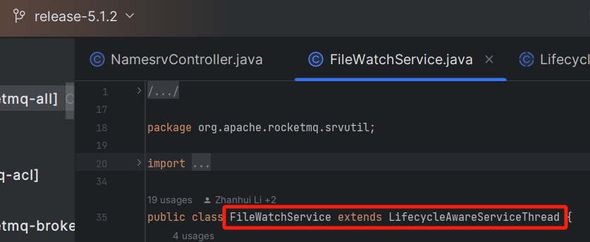
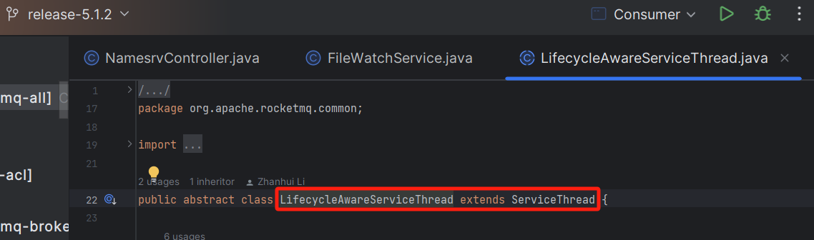

大家好，我是**华仔**, 又跟大家见面了。

从今天开始我将继续为大家奉上 RocketMQ NameServer源码剖析系列文章，正式开启「**RocketMQ 的 NameServer 源码之旅**」，这是第六篇，本篇我们将以「**RocketMQ 4.9.7**」及「**RocketMQ 5.1.2**」版本为主，来剖析下 RocketMQ 源码之 NameServer FileWatchService 文件变更监听服务组件。

## **01 总体概述**

在 RocketMQ 启动 「**NameServer**」的过程中会初始化「**NameSrvController**」核心组件，而「**NameSrvController**」初始化过程中又引用了「**FileWatchService**」文件变更监听服务组件，从源码看它本身是一个实现了「**Runnable**」线程，负责监听系统文件变更，并维护一个文件列表的文件摘要，定时监听「**磁盘文件**」是否与「**内存文件**」的「**文件摘要**」是否相同，如果不同就将「**新的文件摘要**」更新到内存中，再调用注册的listener 监听器，执行最后的回调逻辑。

接下来我们重点来看下该服务的源码设计思想。

## **02 核心源码剖析**

## **2.1 调用入口**

「**4.9.x**」版本中的调用入口：

  

「**5.x**」版本中的调用入口：

  

可以看到「**5.x**」版本对「**4.9.x**」版本中的内容进行了封装和重构。

##   
**2.2 ServiceThread 类实现**

「**4.9.x**」中，FileWatchService 是继承了 ServiceThread 类，可以先看看 ServiceThread 类。

源码位置：[https://github.com/apache/rocketmq/blob/release-4.9.7/common/src/main/java/org/apache/rocketmq/common/](https://github.com/apache/rocketmq/blob/release-4.9.7/common/src/main/java/org/apache/rocketmq/common/ServiceThread.java)[ServiceThread](https://github.com/apache/rocketmq/blob/release-4.9.7/common/src/main/java/org/apache/rocketmq/common/ServiceThread.java)[.java](https://github.com/apache/rocketmq/blob/release-4.9.7/common/src/main/java/org/apache/rocketmq/common/ServiceThread.java)

  

而「**5.x**」中是先继承一个抽象类 LifecycleAwareServiceThread，而抽象类继续了 ServiceThread 类。

  

这里我先来看下「**4.9.x**」版本中的 ServiceThread 类实现。

// 实现了 Runnable 线程，负责监听系统文件变更

public abstract class ServiceThread implements Runnable {

private static final InternalLogger log \= InternalLoggerFactory.getLogger(LoggerName.COMMON\_LOGGER\_NAME);

// 等待线程退出的时间 90 秒

private static final long JOIN\_TIME \= 90 \* 1000;

// 管理的线程任务

private Thread thread;

// 倒计时锁，用于并发控制

protected final CountDownLatch2 waitPoint \= new CountDownLatch2(1);

// 是否已经通知过，用于并发控制避免重复通知。使用了 CAS 并发控制方式，且利用volatile保证了可见性。

protected volatile AtomicBoolean hasNotified \= new AtomicBoolean(false);

// 是否已经停止

protected volatile boolean stopped \= false;

// 是否是守护线程

protected boolean isDaemon \= false;

// 线程是否已经启动

//Make it able to restart the thread

private final AtomicBoolean started \= new AtomicBoolean(false);

public ServiceThread() {

}

public abstract String getServiceName();

// 启动线程

public void start() {

log.info("Try to start service thread:{} started:{} lastThread:{}", getServiceName(), started.get(), thread);

// CAS 方式进行并发控制，避免重复启动

if (!started.compareAndSet(false, true)) {

return;

}

// 初始化停止标志

stopped = false;

// 初始化并启动线程，run 函数实现在子类中

this.thread = new Thread(this, getServiceName());

this.thread.setDaemon(isDaemon); // 设置是否守护

this.thread.start(); // 启动线程

}

// 关闭线程

public void shutdown() {

this.shutdown(false);

}

public void shutdown(final boolean interrupt) {

log.info("Try to shutdown service thread:{} started:{} lastThread:{}", getServiceName(), started.get(), thread);

// CAS方式进行并发控制，避免重复关闭

if (!started.compareAndSet(true, false)) {

return;

}

// 设置停止标志

this.stopped = true;

log.info("shutdown thread " + this.getServiceName() + " interrupt " + interrupt);

// 并发控制，避免重复通知，且利用volatile保证了可见性。

if (hasNotified.compareAndSet(false, true)) {

waitPoint.countDown(); // notify

}

try {

if (interrupt) {

// 如果需要中断，则中断线程

this.thread.interrupt();

}

// 等待线程退出，最多等待 90 秒

long beginTime \= System.currentTimeMillis();

if (!this.thread.isDaemon()) {

// 硬编码 90 秒

this.thread.join(this.getJointime());

}

long elapsedTime \= System.currentTimeMillis() - beginTime;

log.info("join thread " + this.getServiceName() + " elapsed time(ms) " + elapsedTime + " "\+ this.getJointime());

} catch (InterruptedException e) {

log.error("Interrupted", e);

}

}

public long getJointime() {

return JOIN\_TIME;

}

@Deprecated

public void stop() {

this.stop(false); // 是否停止标志

}

@Deprecated

public void stop(final boolean interrupt) {

// 如果没有启动，则直接返回

if (!started.get()) {

return;

}

// 设置为已停止

this.stopped = true;

log.info("stop thread " + this.getServiceName() + " interrupt " + interrupt);

// 并发控制，避免重复通知，且利用volatile保证了可见性。

if (hasNotified.compareAndSet(false, true)) {

waitPoint.countDown(); // notify

}

// 如果需要中断，则中断线程

if (interrupt) {

this.thread.interrupt();

}

}

public void makeStop() {

if (!started.get()) {

return;

}

this.stopped = true;

log.info("makestop thread " + this.getServiceName());

}

public void wakeup() {

if (hasNotified.compareAndSet(false, true)) {

waitPoint.countDown(); // notify

}

}

protected void waitForRunning(long interval) {

// 如果已经通知过，则直接返回

if (hasNotified.compareAndSet(true, false)) {

this.onWaitEnd();

return;

}

//entry to wait

waitPoint.reset(); // 重置倒计时锁

try {

// 倒计时锁等待指定间隔时间后，自动结束

waitPoint.await(interval, TimeUnit.MILLISECONDS);

} catch (InterruptedException e) {

log.error("Interrupted", e);

} finally {

// 重置是否通知标志为false

hasNotified.set(false);

this.onWaitEnd();

}

}

protected void onWaitEnd() {

}

// 是否停止

public boolean isStopped() {

return stopped;

}

// 是否守护

public boolean isDaemon() {

return isDaemon;

}

// 设置守护

public void setDaemon(boolean daemon) {

isDaemon = daemon;

}

}

接着来看下「**5.x**」版本中的 ServiceThread 类实现，大致相同。

  
源码位置：[https://github.com/apache/rocketmq/blob/release-5.1.2/common/src/main/java/org/apache/rocketmq/common/ServiceThread.java](https://github.com/apache/rocketmq/blob/release-5.1.2/common/src/main/java/org/apache/rocketmq/common/ServiceThread.java)

public abstract class ServiceThread implements Runnable {

private static final Logger log \= LoggerFactory.getLogger(LoggerName.COMMON\_LOGGER\_NAME);

// 等待线程退出的时间

private static final long JOIN\_TIME \= 90 \* 1000;

// 管理的线程任务

protected Thread thread;

// 倒计时锁，用于并发控制

protected final CountDownLatch2 waitPoint \= new CountDownLatch2(1);

// 是否已经通知过，用于并发控制，避免重复通知。使用了 CAS 并发控制方式，且利用volatile保证了可见性。

protected volatile AtomicBoolean hasNotified \= new AtomicBoolean(false);

// 是否已经停止

protected volatile boolean stopped \= false;

// 是否是守护线程

protected boolean isDaemon \= false;

// 线程是否已经启动

//Make it able to restart the thread

private final AtomicBoolean started \= new AtomicBoolean(false);

public ServiceThread() {

}

public abstract String getServiceName();

public void start() {

log.info("Try to start service thread:{} started:{} lastThread:{}", getServiceName(), started.get(), thread);

// CAS方式进行并发控制，避免重复启动

if (!started.compareAndSet(false, true)) {

return;

}

// 初始化停止标志

stopped = false;

// 初始化并启动线程，run函数实现在子类中

this.thread = new Thread(this, getServiceName());

this.thread.setDaemon(isDaemon); // 设置是否守护

this.thread.start(); // 启动线程

log.info("Start service thread:{} started:{} lastThread:{}", getServiceName(), started.get(), thread);

}

public void shutdown() {

this.shutdown(false);

}

public void shutdown(final boolean interrupt) {

log.info("Try to shutdown service thread:{} started:{} lastThread:{}", getServiceName(), started.get(), thread);

// CAS方式进行并发控制，避免重复关闭

if (!started.compareAndSet(true, false)) {

return;

}

// 设置停止标志

this.stopped = true;

log.info("shutdown thread\[{}\] interrupt={} ", getServiceName(), interrupt);

//if thead is waiting, wakeup it

// 唤醒

wakeup();

try {

// 如果需要中断，则中断线程

if (interrupt) {

this.thread.interrupt();

}

// 等待线程退出，最多等待 90 秒

long beginTime \= System.currentTimeMillis();

if (!this.thread.isDaemon()) {

this.thread.join(this.getJoinTime());

}

long elapsedTime \= System.currentTimeMillis() - beginTime;

log.info("join thread\[{}\], elapsed time: {}ms, join time:{}ms", getServiceName(), elapsedTime, this.getJoinTime());

} catch (InterruptedException e) {

log.error("Interrupted", e);

}

}

public long getJoinTime() {

return JOIN\_TIME;

}

public void makeStop() {

// 如果没有启动，则直接返回

if (!started.get()) {

return;

}

// 设置已停止

this.stopped = true;

log.info("makestop thread\[{}\] ", this.getServiceName());

}

public void wakeup() {

// 并发控制，避免重复通知，且利用volatile保证了可见性。

if (hasNotified.compareAndSet(false, true)) {

waitPoint.countDown(); // notify

}

}

protected void waitForRunning(long interval) {

// 如果已经通知过，则直接返回

if (hasNotified.compareAndSet(true, false)) {

this.onWaitEnd();

return;

}

// 重置倒计时锁

//entry to wait

waitPoint.reset();

try {

// 倒计时锁等待指定间隔时间后，自动结束

waitPoint.await(interval, TimeUnit.MILLISECONDS);

} catch (InterruptedException e) {

log.error("Interrupted", e);

} finally {

// 重置是否通知标志为false

hasNotified.set(false);

this.onWaitEnd();

}

}

protected void onWaitEnd() {

}

public boolean isStopped() {

return stopped;

}

public boolean isDaemon() {

return isDaemon;

}

public void setDaemon(boolean daemon) {

isDaemon = daemon;

}

}

综上，可以看到组件内部实现，使用到了很多 JUC 包中的并发 API，如 「**CountDownLatch**」、 「**AtomicBoolean**」、「**volatile**」、「**CAS**」等，对于学习 java 并发知识的应用很有帮助。

##   
**2.3 5.x LifecycleAwareServiceThread 类实现**

源码位置：[https://github.com/apache/rocketmq/blob/release-5.1.2/common/src/main/java/org/apache/rocketmq/common/LifecycleAwareServiceThread.java](https://github.com/apache/rocketmq/blob/release-5.1.2/common/src/main/java/org/apache/rocketmq/common/LifecycleAwareServiceThread.java)

// RocketMQ中用于管理线程生命周期的抽象类

public abstract class LifecycleAwareServiceThread extends ServiceThread {

// 标识线程是否已经启动

private final AtomicBoolean started \= new AtomicBoolean(false);

@Override

public void run() {

// 标识线程已经启动为true

started.set(true);

synchronized (started) {

started.notifyAll(); // 唤醒所有等待started对象的线程

}

run0(); // 调用子类实现的run0方法

}

// 子类需要实现的抽象方法，线程实际执行的任务在此方法中实现

public abstract void run0();

/\*\*

\* Take spurious wakeup into account.

\* 等待线程启动，并指定超时时间

\*

\* @param timeout amount of time in milliseconds 超时时间（毫秒）

\* @throws InterruptedException if interrupted 如果中断则抛出异常

\*/

public void awaitStarted(long timeout) throws InterruptedException {

long expire \= System.nanoTime() + TimeUnit.MILLISECONDS.toNanos(timeout);

synchronized (started) {

while (!started.get()) { // 如果线程还未启动，则进入等待

long duration \= expire - System.nanoTime();

if (duration < TimeUnit.MILLISECONDS.toNanos(1)) {

break;

}

started.wait(TimeUnit.NANOSECONDS.toMillis(duration));// 线程等待，直至超时或线程启动

}

}

}

}

通过该类可以控制线程的「**启动**」、「**运行**」和「**等待**」。

具体使用场景包括在 RocketMQ 的各个模块中，需要实现自己的线程类，并且需要在「**特定的时机**」等待线程启动完成后再进行「**后续操作**」，这时可以使用 LifecycleAwareServiceThread 类及其 awaitStarted 方法来实现线程启动的等待。

在多线程并发处理的场景中，通过 awaitStarted 方法可以确保在线程启动完成后再进行后续操作，从而避免并发操作引发的问题。

## **2.4 FileWatchService 类实现**

FileWatchService 文件变更监听服务实现逻辑是在其内部维护了「**需要监听的文件列表**」、「**监听文件列表的 Hash 消息摘要**」、「**监听器**」等。

当调用线程的 start() 方法后，就会执行当前类的 run 方法，只要系统没有停止，就会无限循环切间隔形式，扫描文件又没有变更，如果有变更，则将它维护到内存列表，并且调用消息监听器 changed() 回调方法。

这里我先来看下「**4.9.x**」版本中的实现。

  
源码位置：[https://github.com/apache/rocketmq/blob/release-4.9.7/srvutil/src/main/java/org/apache/rocketmq/srvutil/FileWatchService.java](https://github.com/apache/rocketmq/blob/release-4.9.7/srvutil/src/main/java/org/apache/rocketmq/srvutil/FileWatchService.java)

public class FileWatchService extends ServiceThread {

private static final InternalLogger log \= InternalLoggerFactory.getLogger(LoggerName.COMMON\_LOGGER\_NAME);

// 需要监听的文件列表

private final List<String> watchFiles;

// 监听的文件的当前hash值

private final List<String> fileCurrentHash;

// 监听器

private final Listener listener;

private static final int WATCH\_INTERVAL \= 500;

private MessageDigest md \= MessageDigest.getInstance("MD5");

public FileWatchService(final String\[\] watchFiles,

final Listener listener) throws Exception {

this.listener = listener;

this.watchFiles = new ArrayList<>();

this.fileCurrentHash = new ArrayList<>();

// 遍历传入的文件列表，添加到需要监听的文件列表中，并且计算对应的文件摘要记录到fileCurrentHash列表中

for (int i \= 0; i < watchFiles.length; i++) {

if (StringUtils.isNotEmpty(watchFiles\[i\]) && new File(watchFiles\[i\]).exists()) {

this.watchFiles.add(watchFiles\[i\]);

this.fileCurrentHash.add(hash(watchFiles\[i\]));

}

}

}

@Override

public String getServiceName() {

return "FileWatchService";

}

@Override

public void run() {

log.info(this.getServiceName() + " service started");

// 线程未停止，则循环执行文件监听逻辑

while (!this.isStopped()) {

try {

// 间隔等待500ms

this.waitForRunning(WATCH\_INTERVAL);

// 遍历文件列表

for (int i \= 0; i < watchFiles.size(); i++) {

String newHash;

try {

// 重新计算文件摘要

newHash = hash(watchFiles.get(i));

} catch (Exception ignored) {

log.warn(this.getServiceName() + " service has exception when calculate the file hash. ", ignored);

continue;

}

// 如果文件摘要发生变化，则新的摘要设置到内存，调用监听器的onChanged方法执行回调逻辑

if (!newHash.equals(fileCurrentHash.get(i))) {

fileCurrentHash.set(i, newHash);

listener.onChanged(watchFiles.get(i));

}

}

} catch (Exception e) {

log.warn(this.getServiceName() + " service has exception. ", e);

}

}

log.info(this.getServiceName() + " service end");

}

// 计算文件摘要

private String hash(String filePath) throws IOException {

Path path \= Paths.get(filePath);

md.update(Files.readAllBytes(path));

byte\[\] hash = md.digest();

return UtilAll.bytes2string(hash);

}

// 文件变化监听器接口

public interface Listener {

/\*\*

\* 当目标文件发生变化时调用

\*

\* @param path 发生变化的文件路径

\*/

void onChanged(String path);

}

}

接着来看下「**5.x**」版本中的实现。

源码位置：[https://github.com/apache/rocketmq/blob/release-5.1.2/srvutil/src/main/java/org/apache/rocketmq/srvutil/FileWatchService.java](https://github.com/apache/rocketmq/blob/release-5.1.2/srvutil/src/main/java/org/apache/rocketmq/srvutil/FileWatchService.java)

public class FileWatchService extends LifecycleAwareServiceThread {

private static final Logger log \= LoggerFactory.getLogger(LoggerName.COMMON\_LOGGER\_NAME);

// 当前文件的MD5哈希值

private final Map<String,String> currentHash = new HashMap<>();

// 监听器

private final Listener listener;

private static final int WATCH\_INTERVAL \= 500;// 监控间隔时间，单位毫秒

private final MessageDigest md \= MessageDigest.getInstance("MD5");// 用于计算MD5哈希值的实例

public FileWatchService(final String\[\] watchFiles,final Listener listener) throws Exception {

// 监听器，当文件变化时触发相应回调

this.listener = listener;

for (String file :watchFiles) {

if (!Strings.isNullOrEmpty(file) && new File(file).exists()) {

// 初始化当前文件的MD5哈希值

currentHash.put(file,md5Digest(file));

}

}

}

@Override

public String getServiceName() {

return "FileWatchService";// 返回服务的名称

}

@Override

public void run0() {

log.info(this.getServiceName() + " service started");

while (!this.isStopped()) {

try {

this.waitForRunning(WATCH\_INTERVAL);// 等待指定的时间间隔

for (Map.Entry<String,String> entry :currentHash.entrySet()) {

String newHash \= md5Digest(entry.getKey());

if (!newHash.equals(currentHash.get(entry.getKey()))) {

// 当文件的MD5哈希值发生变化时，触发回调

entry.setValue(newHash);

listener.onChanged(entry.getKey());

}

}

} catch (Exception e) {

log.warn(this.getServiceName() + " service raised an unexpected exception.",e);

}

}

log.info(this.getServiceName() + " service end");

}

/\*\*

\* 计算文件的MD5哈希值

\*

\* @param filePath 要计算MD5哈希值的文件的绝对路径

\* @return 如果文件存在，则返回其哈希值；否则返回空字符串。

\*/

private String md5Digest(String filePath) {

Path path \= Paths.get(filePath);

if (!path.toFile().exists()) {

// 重用先前的哈希值

return currentHash.getOrDefault(filePath,"");

}

byte\[\] raw;

try {

raw = Files.readAllBytes(path);

} catch (IOException e) {

log.info("Failed to read content of {}",filePath);

// 重用先前的哈希值

return currentHash.getOrDefault(filePath,"");

}

md.update(raw);

byte\[\] hash = md.digest();

return UtilAll.bytes2string(hash);

}

// 文件变化监听器接口

public interface Listener {

/\*\*

\* 当目标文件发生变化时调用

\*

\* @param path 发生变化的文件路径

\*/

void onChanged(String path);

}

}