大家好，我是**华仔**, 又跟大家见面了。

从今天开始我将为大家奉上 RocketMQ 生产者源码剖析系列文章，正式开启「**RocketMQ 的 NameServer 源码之旅**」，这是第四篇，我们来剖析下 RocketMQ 源码之 RouteInfoManager 组件源码设计剖析。

这里我将以「**RocketMQ 4.9.7**」版本为主，通过「**场景驱动**」的方式带大家一点点的对 RocketMQ 源码进行深度剖析，正式开启「**RocketMQ 的源码之旅**」，跟我一起来掌握 RocketMQ 源码核心架构设计思想吧。

  
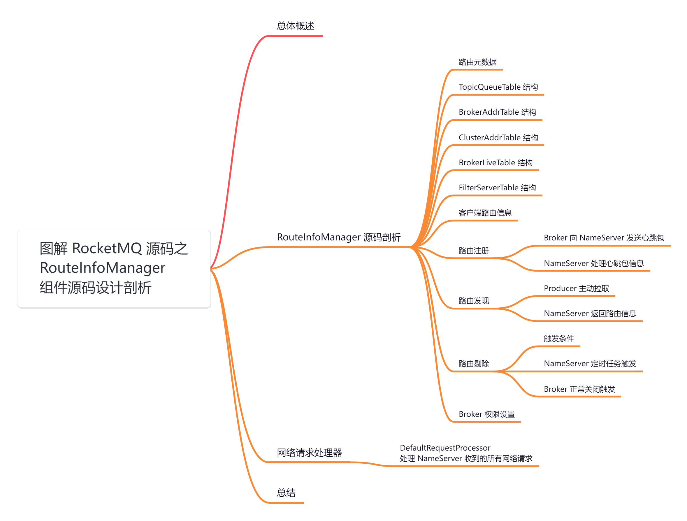

## **01 总体概述**

在深入剖析 NameServer 源码之前，我们先带着这几个问题去探究：

1.  NameServer 启动时需要加载哪些配置以及加载流程如何？
2.  NameServer 启动流程是什么样的？会创建哪些核心数据结构？
3.  NameServer 以什么样的数据结构存储着 Broker 与路由信息的？
4.  Broker 上线、下线、发送心跳这些操作在 NameServer 中是如何进行的？
5.  NameServer 是如何进行 Broker 心跳检测的？

在上一篇中，我们剖析了「**NameServer**」中 「**KVConfigManager**」组件的底层实现以及增删改查的操作流程。

今天我们继续上篇的内容，剖析下3、4、5 三个问题。

## **02 RouteInfoManager 源码剖析**

在「**NameServer**」源码开篇中，我们了解到其作为一个轻量级的注册中心，主要是为消息生产者和消费者提供「**Topic 路由信息**」，并对这些路由信息和 Broker 节点进行管理，主要包括「**路由注册**」、「**路由发现**」和「**路由剔除**」等。

RouteInfoManager 主要用来管理所有的 Broker、cluster集群、TtopicQueue 主题队列以及 broker 存活的信息，类关系如下：

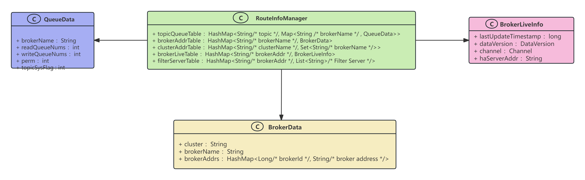

##   
**2.1 路由元数据**

在了解路由信息管理之前，我们首先需要了解「**NameServer**」到底存储了哪些路由元信息，数据结构分别是什么样的。

通过阅读源码可以发现其路由信息主要是由 「**RouteInfoManager**」中的 5 个 HashMap 来维护和存储路由元数据的。它们只会保存在内存中，不会被持久化。下面看一下它们的具体结构。

  
源码位置：[https://github.com/apache/rocketmq/blob/release-4.9.7/namesrv/src/main/java/org/apache/rocketmq/namesrv/](https://github.com/apache/rocketmq/blob/release-4.9.7/namesrv/src/main/java/org/apache/rocketmq/namesrv/routeinfo%5CRouteInfoManager.java)[routeinfo\\RouteInfoManager.](https://github.com/apache/rocketmq/blob/release-4.9.7/namesrv/src/main/java/org/apache/rocketmq/namesrv/routeinfo%5CRouteInfoManager.java)[java](https://github.com/apache/rocketmq/blob/release-4.9.7/namesrv/src/main/java/org/apache/rocketmq/namesrv/routeinfo%5CRouteInfoManager.java)

public class RouteInfoManager {

....

// Topic 中 Queue 的路由表，消息发送时根据路由表进行 Topic 内的负载均衡，包括broker名称、读写队列的数量等

private final HashMap<String/\* topic \*/, Map<String /\* brokerName \*/ , QueueData>> topicQueueTable;

// Broker 基础信息表，包含 brokerName、所属集群名称、broker ID、主备 Broker 地址

private final HashMap<String/\* brokerName \*/, BrokerData> brokerAddrTable;

// Broker 集群信息，存储集群中所有 Broker 的名称，每个 broker 集群下，包含多个 broker，这里是用 Set 来存储 broker 的名称

private final HashMap<String/\* clusterName \*/, Set<String/\* brokerName \*/\>> clusterAddrTable;

// Broker 心跳状态信息，每个 broker 地址对应了 broker 的存活信息，存活信息状态包括最后更新的时间戳、注册到 NameServer 时的 Channel 通道、以及 broker 的 HA 地址

private final HashMap<String/\* brokerAddr \*/, BrokerLiveInfo> brokerLiveTable;

// Broker 上的 FilterServer 列表，用于类模式的消息过滤。在 4.4 之后的版本被废弃

private final HashMap<String/\* brokerAddr \*/, List<String>/\* Filter Server \*/\> filterServerTable;

public RouteInfoManager() {

// 构造方法 初始化内部对象

this.topicQueueTable = new HashMap<>(1024);

this.brokerAddrTable = new HashMap<>(128);

this.clusterAddrTable = new HashMap<>(32);

this.brokerLiveTable = new HashMap<>(256);

this.filterServerTable = new HashMap<>(256);

}

....

}

## **相关模型如下：**

1.  1个 namesrv 对应 N 个 broker 集群。
2.  1个 broker 集群对应 N 个 broker 组。
3.  1个 broker 组对应 N 个 broker 节点，组成一个 HA 高可用架构模式。
4.  1个 topic 对应 N 个 queue 队列，队列相当于 topic 的单个数据分片，队列可分布在不同 broker 组，同一个 broker 组存储的内存队列数据相同。

接下来我们依次对这 5 个属性进行展开剖析。

##   
**2.2 TopicQueueTable 结构**

Topic 中 Queue 的路由表，消息发送时根据路由表进行 Topic 内的负载均衡，包括「**Broker 名称**」、「**读写队列数量**」等。

这里存储 Topic 与 queues 的关系，RocketMQ 中发布订阅是基于 Topic 进行的，但是消息的发送和消费是基于 queue 进行的，每个 Topic 下面有很多个 queue，我们看一下 QueueData 的数据结构。

### **数据结构：**

HashMap 结构，key是 Topic 名字，value是一个类型是 Map 结构的 QueueData 的队列集合，

key 是 brokerName，value 是 QueueData 对象 topicQueueTable 中的 broker 是一个 broker 组，包含 Master 和 Slave 两部分。一个 Topic 中有多个队列。

QueueData 的数据结构如下：

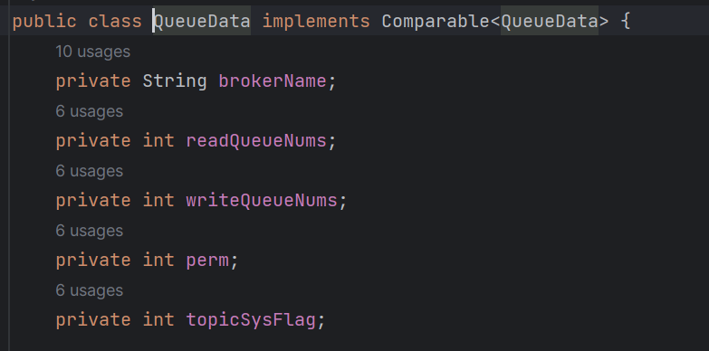

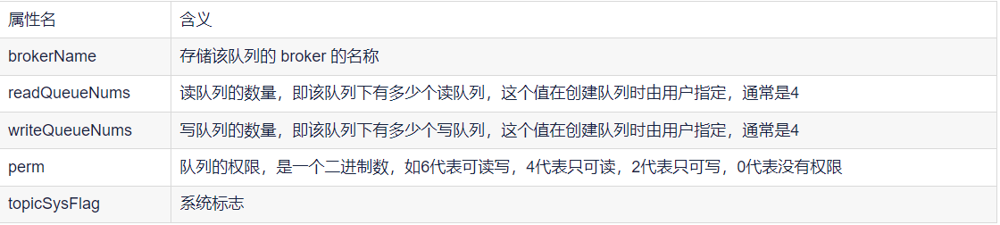

QueueData 包含 Broker 的名称，代表一个 Topic 下的 Queue 会分散在多个 Broker 上，这样 RocketMQ 的消息就实现了分布式的存储。

readQueueNums：读队列的数量，用来进行消费数据的路由。

writeQueueNums：写队列的数量，用来进行消息写入的路由。

比如 Broker 的 readQueueNums 设置为 4 ，writeQueueNums 设置为 4，生产者随机从 4 个 write queue 中选择一个 queue 进行消息的写入，消费者从 4 个 read queue 中随机获取一个 queue 进行数据的消费。

假如 writeQueueNums 设置为 4 ，readQueueNums 设置为 2，数据会均匀写入到 4 个 write queue 中，但是读数据只会读取到 2 个 write queue 的数据。

假如 writeQueueNums 设置为 4 ，readQueueNums 设置为 8，数据会写入到 4 个 write queue 中，消费是时候会从 8 个 queue 中获取，但是只有 4 个 queue 是有数据的。

**这么设计的目的就是为了方便进行扩缩容操作**，假如我们的 readQueueNums 和 writeQueueNums 都是 8个，如果要缩容，就可以先减少 4 个 write，然后等 read 数据读完了数据后，再把 read 缩容为 4个。

perm 设置的是权限，是否可以读/写的权限。

### **内存结构：**

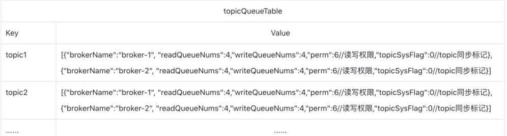

topicQueueTable:{

"topic1": \[

{

"brokerName": "broker-1",

"readQueueNums":4,

"writeQueueNums":4,

"perm":6,

"topicSynFlag":0,

},

{

"brokerName": "broker-2",

"readQueueNums":4,

"writeQueueNums":4,

"perm":6,

"topicSynFlag":0,

}

\],

"topic2": \[

{

"brokerName": "broker-1",

"readQueueNums":4,

"writeQueueNums":4,

"perm":6,

"topicSynFlag":0,

},

{

"brokerName": "broker-2",

"readQueueNums":4,

"writeQueueNums":4,

"perm":6,

"topicSynFlag":0,

}

\]

}

当前没有注册自定义 Topic，只注册了默认 Topic。

{

"RMQ\_SYS\_TRANS\_HALF\_TOPIC":{

"broker-local":{

"brokerName":"broker-local",

"perm":6,

"readQueueNums":1,

"topicSysFlag":0,

"writeQueueNums":1

}

},

"SCHEDULE\_TOPIC\_XXXX":{

"broker-local":{

"brokerName":"broker-local",

"perm":6,

"readQueueNums":18,

"topicSysFlag":0,

"writeQueueNums":18

}

},

"SELF\_TEST\_TOPIC":{

"broker-local":{

"brokerName":"broker-local",

"perm":6,

"readQueueNums":1,

"topicSysFlag":0,

"writeQueueNums":1

}

},

"broker-local":{

"broker-local":{

"brokerName":"broker-local",

"perm":7,

"readQueueNums":1,

"topicSysFlag":0,

"writeQueueNums":1

}

},

"TBW102":{

"broker-local":{

"brokerName":"broker-local",

"perm":7,

"readQueueNums":8,

"topicSysFlag":0,

"writeQueueNums":8

}

},

"BenchmarkTest":{

"broker-local":{

"brokerName":"broker-local",

"perm":6,

"readQueueNums":1024,

"topicSysFlag":0,

"writeQueueNums":1024

}

},

"DefaultCluster":{

"broker-local":{

"brokerName":"broker-local",

"perm":7,

"readQueueNums":16,

"topicSysFlag":0,

"writeQueueNums":16

}

},

"DefaultCluster\_REPLY\_TOPIC":{

"broker-local":{

"brokerName":"broker-local",

"perm":6,

"readQueueNums":1,

"topicSysFlag":0,

"writeQueueNums":1

}

},

"OFFSET\_MOVED\_EVENT":{

"broker-local":{

"brokerName":"broker-local",

"perm":6,

"readQueueNums":1,

"topicSysFlag":0,

"writeQueueNums":1

}

}

}

## **2.3 BrokerAddrTable 结构**

Broker 基础信息表，包含 brokerName、所属集群名称、broker ID、主备 Broker 地址。

### **数据结构：**

HashMap 结构，key是 BrokerName，value 是一个类型是 [BrokerData](http://brokerdata/) 的对象，brokerAddrTable 中的 broker 是一个 broker 组，包含 Master 和 Slave 两部分。[BrokerData](http://brokerdata/) 的数据结构如下，这里可以结合下面 Broker 主从结构逻辑图来理解：

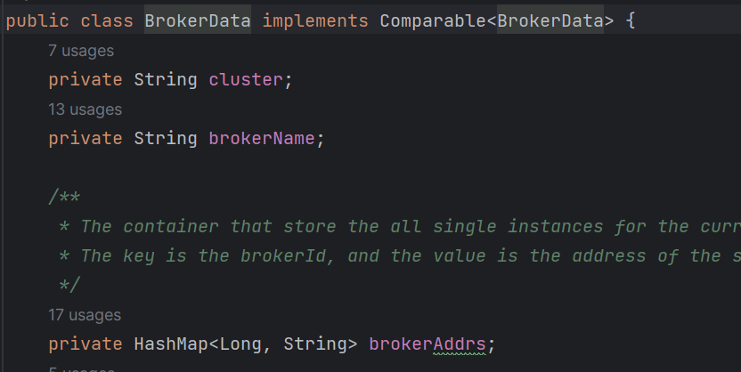

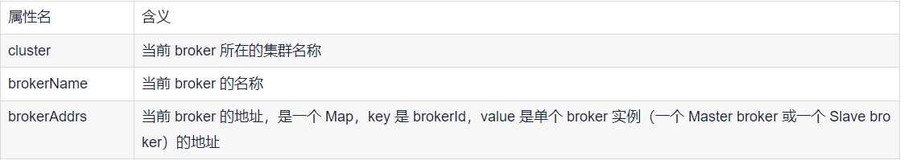

Broker 主从结构逻辑图：

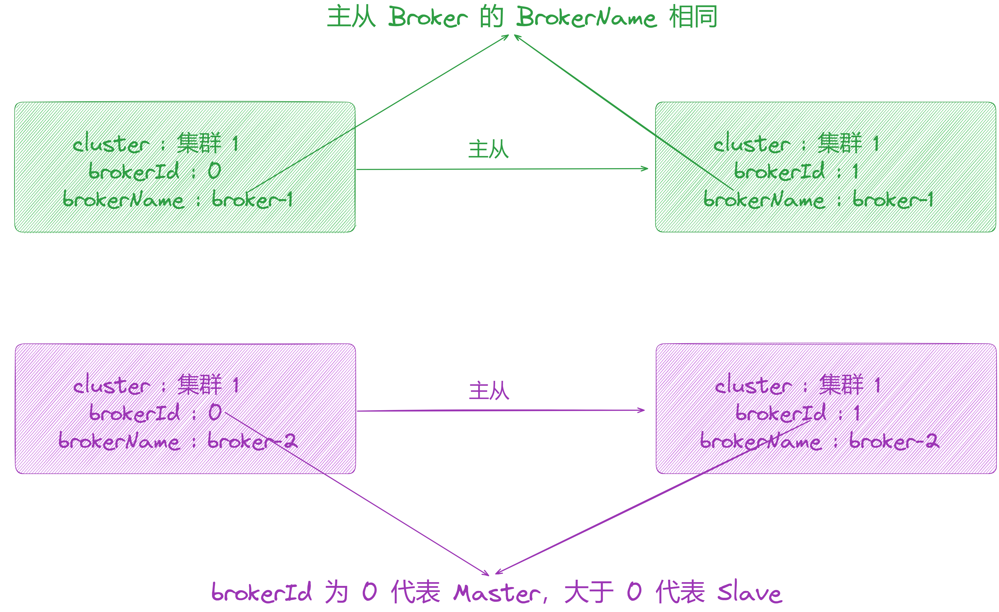

### **内存结构：**

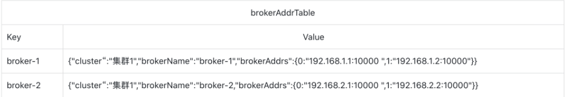

brokerAddrTable:{

"broker-1": {

"cluster": "集群1",

"brokerName": "broker-2a",

"brokerAddrs": {

0: "192.168.1.1:10000",

1: "192.168.1.2:10000"

}

},

"broker-2": {

"cluster": "集群2",

"brokerName": "broker-2",

"brokerAddrs": {

0: "192.168.1.3:10000",

1: "192.168.1.4:10000"

}

}

}

## **2.4 ClusterAddrTable 结构**

Broker 集群信息，存储集群中所有 Broker 的名称，每个 broker 集群下，包含多个 broker，这里是用 Set 来存储 broker 的名称。

### **数据结构：**

HashMap 结构，key 是 ClusterName 即 broker 所在的集群的名称，value 是存储 BrokerName 的 Set 结构。clusterAddrTable 中的 broker 是一个 broker 系统。

### **内存结构：**

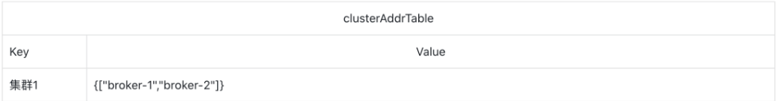

clusterAddrTable:{

"集群1": \["broker-1","broker-2"\]

}

## **2.5 BrokerLiveTable 结构**

Broker 心跳状态信息，每个 broker 地址对应了 broker 的存活信息，存活信息状态包括最后更新的时间戳、注册到 NameServer 时的 Channel 通道、以及 broker 的 HA 地址。

### **数据结构：**

HashMap结构，key是 BrokerAddrInfo 对象地址，value 是 BrokerLiveInfo 结构的该 Broker 信息对象。

brokerLiveTable 中的 broker 是一个 broker 实例，如一个 Master broker 或 一个 Slave broker 实例。BrokerLiveInfo的数据结构如下：

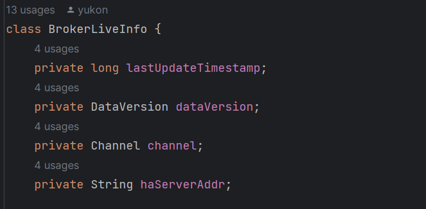

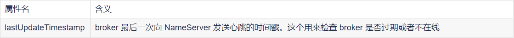

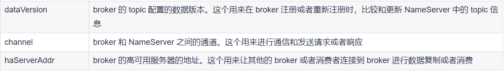

Broker 会定时往 NameServer 进行心跳的发送，更新这个 BrokerLiveInfo 这个数据结构，维护心跳信息。NameServer 心跳检测也是检测的这个信息。

### **内存结构：**

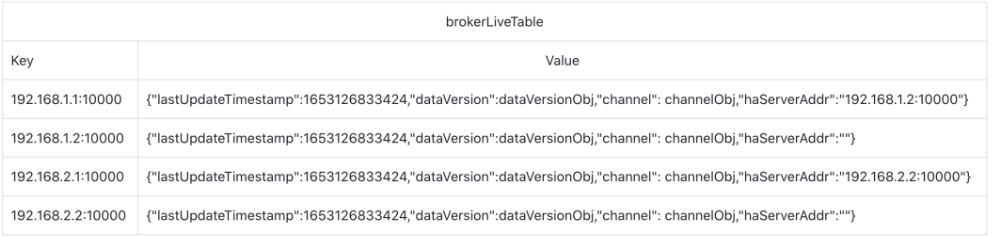

brokerLiveTable:{

"192.168.1.1:10000": {

"lastUpdateTimestamp": 1653126833424,

"dataVersion":dataversionObj,

"channel":channel,

"haServerAddr":"192.168.1.2:10000"

},

"192.168.1.2:10000": {

"lastUpdateTimestamp": 1653126833424,

"dataVersion":dataversionObj,

"channel":channel,

"haServerAddr":""

},

"192.168.2.1:10000": {

"lastUpdateTimestamp": 1653126833424,

"dataVersion":dataversionObj,

"channel":channel,

"haServerAddr":"192.168.2.2:10000"

},

"192.168.2.2:10000": {

"lastUpdateTimestamp": 1653126833424,

"dataVersion":dataversionObj,

"channel":channel,

"haServerAddr":""

}

}

## **2.6 FilterServerTable 结构**

Broker 上的 FilterServer 列表，用于类模式的消息过滤。会在介绍 Consumer 时会介绍，consumer 拉取数据是通过 filterServer 拉取，consumer 向 Broker 注册。

### **数据结构：**

HashMap 结构，key 是 BrokerAddrInfo 地址对象，value 是记录了 filterServer 过滤器服务器地址的 List 集合。

过滤器服务器用于支持消息过滤功能，filterServerTable 中的 broker 是一个 broker 实例。

## **2.7 客户端路由信息**

源码位置：[https://github.com/apache/rocketmq/blob/release-4.9.7/common/src/main/java/org/apache/rocketmq/](https://github.com/apache/rocketmq/blob/release-4.9.7/common/src/main/java/org/apache/rocketmq/common/protocol/route/TopicRouteData.java)[common/protocol/route/TopicRouteData](https://github.com/apache/rocketmq/blob/release-4.9.7/common/src/main/java/org/apache/rocketmq/common/protocol/route/TopicRouteData.java)[.java](https://github.com/apache/rocketmq/blob/release-4.9.7/common/src/main/java/org/apache/rocketmq/common/protocol/route/TopicRouteData.java)

public class MQClientInstance {

private final ConcurrentMap<String/\* Topic \*/, TopicRouteData> topicRouteTable = new ConcurrentHashMap<String, TopicRouteData>();

}

public class TopicRouteData extends RemotingSerializable {

// 顺序消息的配置，来自 KvConfig

private String orderTopicConf;

// Topic 队列元数据

private List<QueueData> queueDatas;

// Topic 分布的 Broker 元数据

private List<BrokerData> brokerDatas;

// Topic 上 FilterServer 的地址列表

private HashMap<String/\* brokerAddr \*/, List<String>/\* Filter Server \*/\> filterServerTable;

public TopicRouteData cloneTopicRouteData() {

// 初始化 Topic 路由信息

TopicRouteData topicRouteData \= new TopicRouteData();

topicRouteData.setQueueDatas(new ArrayList<>());

topicRouteData.setBrokerDatas(new ArrayList<>());

topicRouteData.setFilterServerTable(new HashMap<>());

topicRouteData.setOrderTopicConf(this.orderTopicConf);

// 不为空直接添加 Topic 队列元数据

if (this.queueDatas != null) {

topicRouteData.getQueueDatas().addAll(this.queueDatas);

}

// 不为空直接添加 Broker 元数据

if (this.brokerDatas != null) {

topicRouteData.getBrokerDatas().addAll(this.brokerDatas);

}

// 不为空直接添加 FilterServer 的地址列表

if (this.filterServerTable != null) {

topicRouteData.getFilterServerTable().putAll(this.filterServerTable);

}

// 返回路由信息

return topicRouteData;

}

....

}

### **内存结构：**

{

"%RETRY%benchmark\_consumer":{

"brokerDatas":\[

{

"brokerAddrs":{

"0":"127.0.0.1:10911"

},

"brokerName":"broker-local",

"cluster":"DefaultCluster"

}

\],

"filterServerTable":{

},

"queueDatas":\[

{

"brokerName":"broker-local",

"perm":6,

"readQueueNums":1,

"topicSysFlag":0,

"writeQueueNums":1

}

\]

},

"TBW102":{

"brokerDatas":\[

{

"brokerAddrs":{

"0":"127.0.0.1:10911"

},

"brokerName":"broker-local",

"cluster":"DefaultCluster"

}

\],

"filterServerTable":{

},

"queueDatas":\[

{

"brokerName":"broker-local",

"perm":7,

"readQueueNums":8,

"topicSysFlag":0,

"writeQueueNums":8

}

\]

}

}

最后来一张图来梳理下这 4 个结构体的关系，如下：

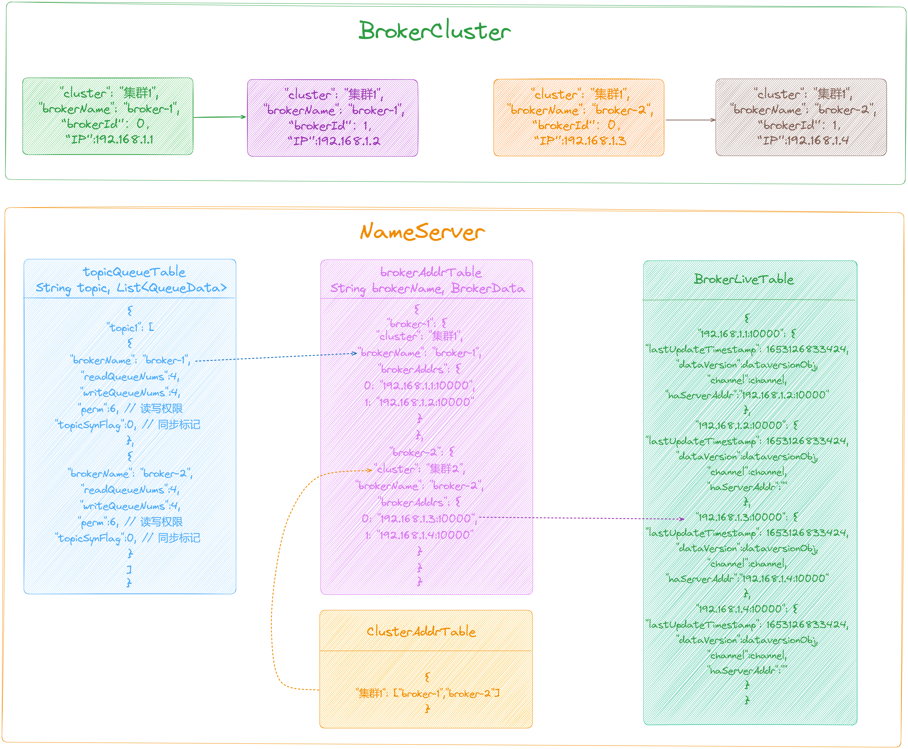

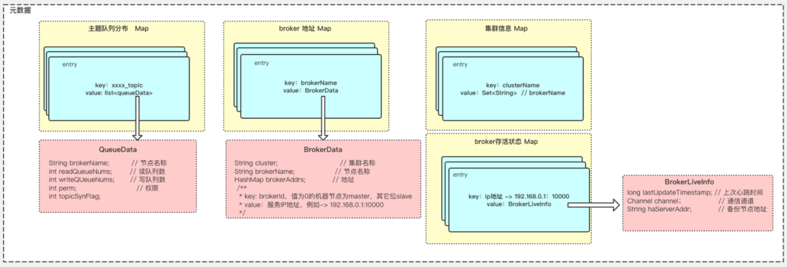

剖析完这些数据结构之后，我们来看看路由相关操作。

## **2.8 路由注册**

路由注册是通过 Broker 和 NameServer 之间的心跳功能来实现的。主要分为两步：

1.  Broker 启动时向集群中所有 NameServer 发送心跳语句，每隔 30 秒（默认30s，时间间隔在10秒到60秒之间）再发一次。
2.  NameServer 收到心跳包更新 topicQueueTable，brokerAddrTable，brokerLiveTable，clusterAddrTable，filterServerTable。

接下来我们分别来看下。

## **2.8.1 Broker 向 NameServer 发送心跳包**

所谓 RocketMQ 路由注册是通过 Broker 与 NameServer 的心跳功能来实现的。当 Broker 启动时，会开启一个定时任务，默认每隔 30s 向集群中的所有 NameServer 发送心跳包信息。

创建了一个线程池注册 Broker，程序启动 10 秒后执行，每隔 30 秒执行一次，默认 30s，时间间隔在 10 秒到 60 秒之间。

源码位置：[https://github.com/apache/rocketmq/blob/release-4.9.7/broker/src/main/java/org/apache/rocketmq/broker/BrokerController.java](https://github.com/apache/rocketmq/blob/release-4.9.7/broker/src/main/java/org/apache/rocketmq/broker/BrokerController.java)

this.scheduledExecutorService.scheduleAtFixedRate(new Runnable() {

@Override

public void run() {

try {

BrokerController.this.registerBrokerAll(true, false, brokerConfig.isForceRegister());

} catch (Throwable e) {

log.error("registerBrokerAll Exception", e);

}

}

}, 1000 \* 10, Math.max(10000, Math.min(brokerConfig.getRegisterNameServerPeriod(), 60000)), TimeUnit.MILLISECONDS);

可以看到 Broker 发送心跳包的定时任务在 [BrokerController#start()](http://brokercontroller/#start\(\)) 方法中启动，每隔 30s 调用 [registerBrokerAll](http://registerbrokerall/) 方法发送一次心跳包（[REGISTER\_BROKER](http://register_broker/) 请求），并将自身的 Topic 队列路由信息发送给 NameServer。

主节点和从节点都会发送心跳和路由信息，Broker 会遍历 NameServer 列表，Broker 依次向每个 NameServer 发送心跳包，发送心跳包的逻辑是采用了 Netty 框架。

另外一个触发 Broker 上报 Topic 配置的操作是修改 Broker 的 Topic 配置（创建/更新），由 [TopicConfigManager](http://topicconfigmanager/) 触发上报。

上报的心跳包请求类型是 [RequestCode.REGISTER\_BROKER](http://requestcode.register_broker/)，当封装 Topic 配置和版本号之后，开始进行实际的路由注册，具体源码如下：

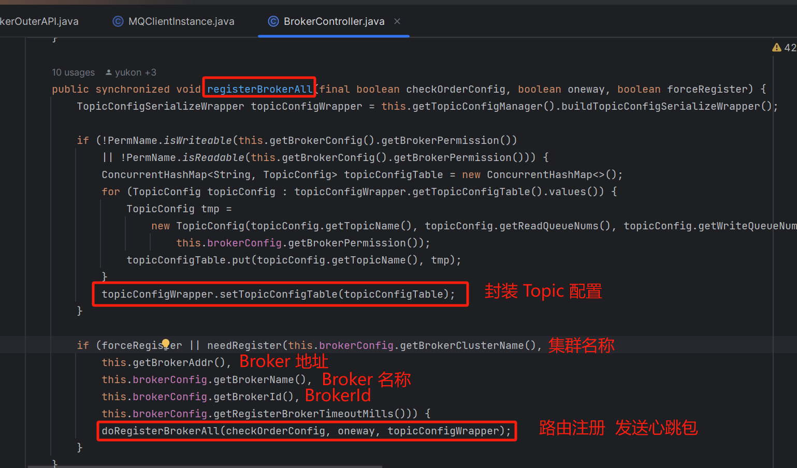

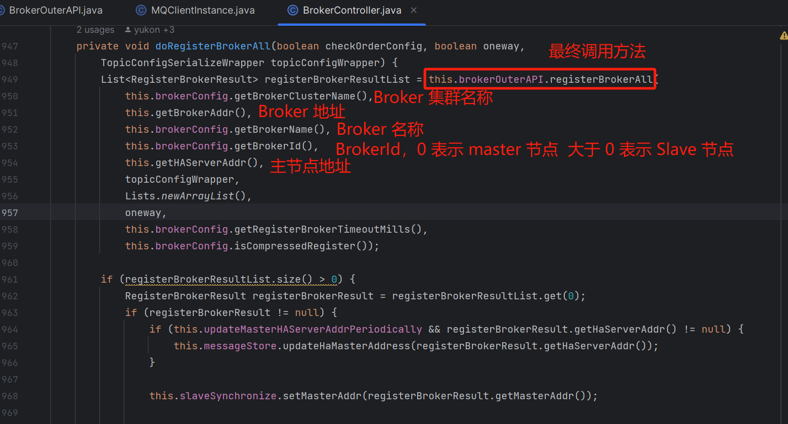

源码位置：[https://github.com/apache/rocketmq/blob/release-4.9.7/broker/src/main/java/org/apache/rocketmq/broker/out/BrokerOuterAPI.java](https://github.com/apache/rocketmq/blob/release-4.9.7/broker/src/main/java/org/apache/rocketmq/broker/out/BrokerOuterAPI.java)

/\*\*

\* 向所有 Name server 发送心跳包

\* @return 心跳包发送的响应列表

\*/

public List<RegisterBrokerResult> registerBrokerAll(

final String clusterName,

final String brokerAddr,

final String brokerName,

final long brokerId,

final String haServerAddr,

final TopicConfigSerializeWrapper topicConfigWrapper,

final List<String> filterServerList,

final boolean oneway,

final int timeoutMills,

final boolean compressed) {

final List<RegisterBrokerResult> registerBrokerResultList = new CopyOnWriteArrayList<>();

// 获取 NameServer 地址列表

List<String> nameServerAddressList = this.remotingClient.getNameServerAddressList();

if (nameServerAddressList != null && nameServerAddressList.size() > 0) {

// 为所有心跳请求构造统一的请求头，主要封装 broker 相关信息

final RegisterBrokerRequestHeader requestHeader \= new RegisterBrokerRequestHeader();

requestHeader.setBrokerAddr(brokerAddr);

requestHeader.setBrokerId(brokerId);

requestHeader.setBrokerName(brokerName);

requestHeader.setClusterName(clusterName);

// 主节点地址，初次请求时为空，从节点向 NameServer 注册后更新

requestHeader.setHaServerAddr(haServerAddr);

requestHeader.setCompressed(compressed);

// 构造统一的请求体，包括 topic 和 filterServerList 相关信息

RegisterBrokerBody requestBody \= new RegisterBrokerBody();

// Topic 配置，存储 Broker 启动时的一些默认 Topic

requestBody.setTopicConfigSerializeWrapper(topicConfigWrapper);

// 消息过滤服务器列表

requestBody.setFilterServerList(filterServerList);

final byte\[\] body = requestBody.encode(compressed);

final int bodyCrc32 \= UtilAll.crc32(body);

requestHeader.setBodyCrc32(bodyCrc32);

// 开启多线程到每个 NameServer 进行注册

final CountDownLatch countDownLatch \= new CountDownLatch(nameServerAddressList.size());

// 遍历所有 NameServer 地址，发送心跳请求

for (final String namesrvAddr : nameServerAddressList) {

brokerOuterExecutor.execute(() -> {

try {

// 实际进行注册方法

RegisterBrokerResult result \= registerBroker(namesrvAddr, oneway, timeoutMills, requestHeader, body);

if (result != null) {

// 封装 NameServer 返回的信息

registerBrokerResultList.add(result);

}

log.info("register broker\[{}\]to name server {} OK", brokerId, namesrvAddr);

} catch (Exception e) {

log.warn("registerBroker Exception, {}", namesrvAddr, e);

} finally {

countDownLatch.countDown();

}

});

}

try {

countDownLatch.await(timeoutMills, TimeUnit.MILLISECONDS);

} catch (InterruptedException e) {

}

}

return registerBrokerResultList;

}

从上面源码来看相对比较简单，步骤如下：

1.  首先获取 NameServer 地址列表。
2.  其次为所有心跳请求封装统一的请求包头和请求体。
3.  然后开启多线程到每个 NameServer 服务器去注册。
4.  最后遍历所有 NameServer 地址，发送心跳请求。

其中，心跳包的请求头类型为 [RegisterBrokerRequestHeader](http://registerbrokerrequestheader/)，主要包含如下：

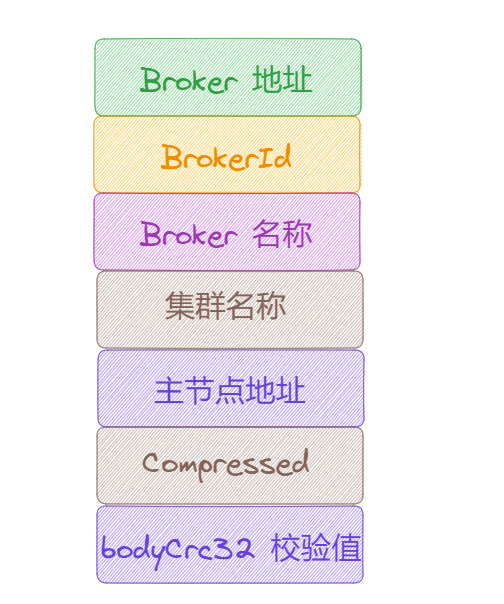

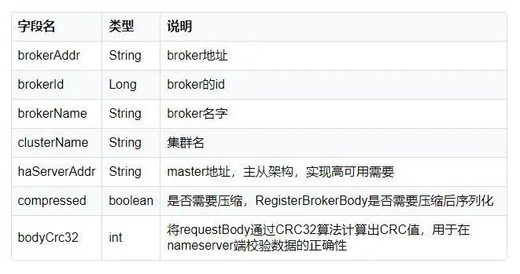

请求体类型是 [RegisterBrokerBody](http://registerbrokerbody/)，主要包含如下：

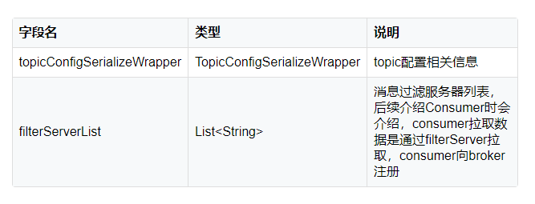

来看下实际的路由注册方法实现，核心源码如下：

private RegisterBrokerResult registerBroker(

final String namesrvAddr,

final boolean oneway,

final int timeoutMills,

final RegisterBrokerRequestHeader requestHeader,

final byte\[\] body

) throws RemotingCommandException, MQBrokerException, RemotingConnectException, RemotingSendRequestException, RemotingTimeoutException,

InterruptedException {

// 创建请求指令，需要注意 RequestCode.REGISTER\_BROKER，NameServer 端的网络处理器会根据requestCode 进行相应的业务处理

RemotingCommand request \= RemotingCommand.createRequestCommand(RequestCode.REGISTER\_BROKER, requestHeader);

request.setBody(body);

// 基于 netty 框架进行网络传输

if (oneway) {

// 如果是单向调用，没有返回值，不返回 NameServer 返回结果

try {

this.remotingClient.invokeOneway(namesrvAddr, request, timeoutMills);

} catch (RemotingTooMuchRequestException e) {

// Ignore

}

return null;

}

// 异步调用向 NameServer 发起注册，获取 NameServer 的返回信息

RemotingCommand response \= this.remotingClient.invokeSync(namesrvAddr, request, timeoutMills);

assert response != null;

switch (response.getCode()) {

case ResponseCode.SUCCESS: {

// 获取返回的 reponseHeader

RegisterBrokerResponseHeader responseHeader \=

(RegisterBrokerResponseHeader) response.decodeCommandCustomHeader(RegisterBrokerResponseHeader.class);

// 重新封装返回结果，更新 masterAddr 和 haServerAddr

RegisterBrokerResult result \= new RegisterBrokerResult();

result.setMasterAddr(responseHeader.getMasterAddr());

result.setHaServerAddr(responseHeader.getHaServerAddr());

if (response.getBody() != null) {

result.setKvTable(KVTable.decode(response.getBody(), KVTable.class));

}

return result;

}

default:

break;

}

throw new MQBrokerException(response.getCode(), response.getRemark(), requestHeader == null ? null : requestHeader.getBrokerAddr());

}

从这段源码得出，borker 和 NameServer 之间通过 netty 进行网络传输，Broker 向 NameServer 发起注册时会在请求中添加注册码 [RequestCode.REGISTER\_BROKER](http://requestcode.register_broker/)。

RocketMQ 的每个请求都会定义一个 [requestCode](http://requestcode/)，服务端的网络处理器会根据不同的 [requestCode](http://requestcode/) 进行影响的业务处理。

## **2.8.2 NameServer 处理心跳包信息**

Broker 发出路由注册的心跳包之后，NameServer 会根据心跳包中的 [requestCode](http://requestcode/) 进行处理，NameServer 的默认网络处理器是 [DefaultRequestProcessor](http://defaultrequestprocessor/)，当其接收到 [RequestCode.](http://requestcode./)[REGISTER\_BROKER](http://register_broker/) 类型的请求后，将上报的路由信息调用 [RouteInfoManager#registerBroker()](http://routeinfomanager/#registerBroker\(\)) 写入内存中的路由表。

  
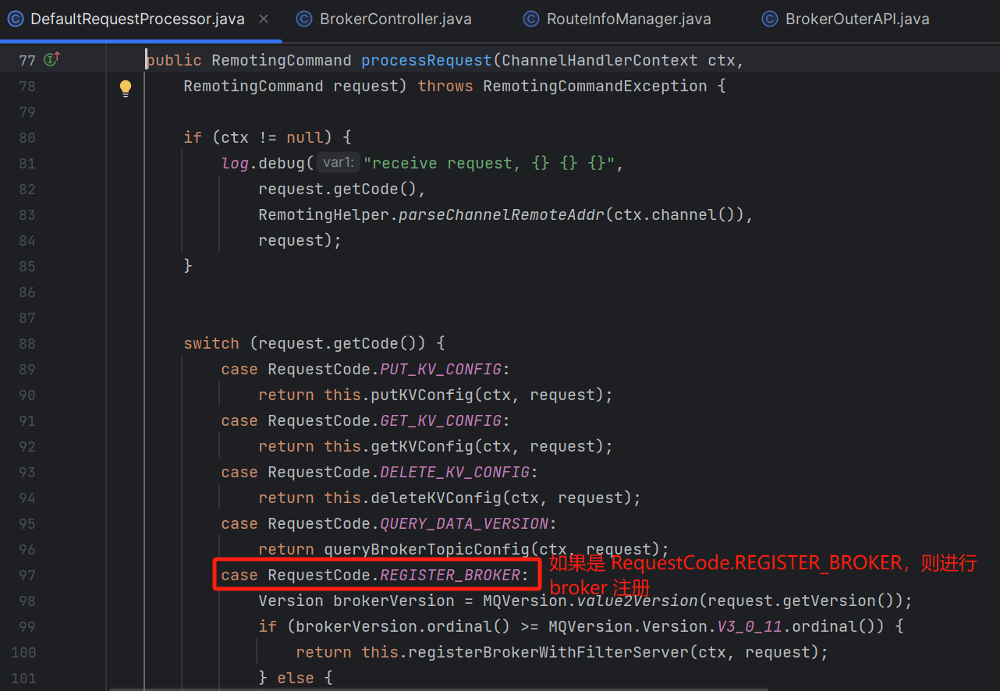

可以看到该方法主要就是判断 [requestCode](http://requestcode/)，如果是 [RequestCode.REGISTER\_BROKER](http://requestcode.register_broker/)，那么确定业务处理逻辑是「**注册 Broker**」。

首先根据 Broker 版本号选择不同的方法，这里以 [V3\_0\_11](http://v3_0_11/) 以上为例，调用 [registerBrokerWithFilterServer](http://registerbrokerwithfilterserver/) 方法进行注册。

public RemotingCommand registerBrokerWithFilterServer(ChannelHandlerContext ctx, RemotingCommand request)

throws RemotingCommandException {

// 获取返回结果

final RemotingCommand response \= RemotingCommand.createResponseCommand(RegisterBrokerResponseHeader.class);

// 响应头

final RegisterBrokerResponseHeader responseHeader \= (RegisterBrokerResponseHeader) response.readCustomHeader();

// 请求头

final RegisterBrokerRequestHeader requestHeader \=

(RegisterBrokerRequestHeader) request.decodeCommandCustomHeader(RegisterBrokerRequestHeader.class);

// 1、解析 requestHeader 并基于 crc32 验签，判断数据是否正确。

if (!checksum(ctx, request, requestHeader)) {

response.setCode(ResponseCode.SYSTEM\_ERROR);

response.setRemark("crc32 not match");

return response;

}

// 2、处理 registerBrokerBody，解析 Topic 信息

RegisterBrokerBody registerBrokerBody \= new RegisterBrokerBody();

if (request.getBody() != null) {

try {

registerBrokerBody = RegisterBrokerBody.decode(request.getBody(), requestHeader.isCompressed());

} catch (Exception e) {

throw new RemotingCommandException("Failed to decode RegisterBrokerBody", e);

}

} else {

registerBrokerBody.getTopicConfigSerializeWrapper().getDataVersion().setCounter(new AtomicLong(0));

registerBrokerBody.getTopicConfigSerializeWrapper().getDataVersion().setTimestamp(0);

}

// 调用 RouteInfoManager#registerBroker 来进行 Broker 注册并发送心跳包

RegisterBrokerResult result \= this.namesrvController.getRouteInfoManager().registerBroker(

requestHeader.getClusterName(),

requestHeader.getBrokerAddr(),

requestHeader.getBrokerName(),

requestHeader.getBrokerId(),

requestHeader.getHaServerAddr(),

registerBrokerBody.getTopicConfigSerializeWrapper(),

registerBrokerBody.getFilterServerList(),

ctx.channel());

responseHeader.setHaServerAddr(result.getHaServerAddr());

responseHeader.setMasterAddr(result.getMasterAddr());

byte\[\] jsonValue = this.namesrvController.getKvConfigManager().getKVListByNamespace(NamesrvUtil.NAMESPACE\_ORDER\_TOPIC\_CONFIG);

response.setBody(jsonValue);

response.setCode(ResponseCode.SUCCESS);

response.setRemark(null);

return response;

}

主要步骤分为三步：

1.  首先解析 [requestHeader](http://requestheader/) 并基于 crc32 验签，判断数据是否正确。
2.  接着解析 Topic 信息。
3.  最后调用 [RouteInfoManager#registerBroker](http://routeinfomanager/#registerBroker) 来进行 Broker 注册并发送心跳包。

核心注册以及处理 Broker 心跳信息逻辑是由 [RouteInfoManager#registerBroker](http://routeinfomanager/#registerBroker) 来实现，源码如下：

/\*\*

\* 处理 Broker 心跳信息，存到本地路由表

\* 如果是 SLAVE，则返回 MASTER 的 HA 地址

\*/

public RegisterBrokerResult registerBroker(

final String clusterName,// broker 所属的集群名称

final String brokerAddr,// broker 机器地址

final String brokerName,// broker 名称

final long brokerId,// brokerId

final String haServerAddr,// 跟这个broker互为HA高可用的一个机器地址

final TopicConfigSerializeWrapper topicConfigWrapper,// broker 上面的 Topic 信息

final List<String> filterServerList,// broker 机器上的filter Server 列表

final Channel channel) { // netty channel 网络长连接

RegisterBrokerResult result \= new RegisterBrokerResult();

try {

try {

// 1、路由注册需要加写锁，防止并发修改 RouteInfoManager 中的路由表信息

// RouteInfoManager 管理元数据内存结构读的并发一般是大于写的并发的，所以通过读写锁来保证并发安全性的前提下，还可以提升读的性能

this.lock.writeLock().lockInterruptibly();

// 2、更新集群信息表。根据 Broker 所属的集群名称 clusterName，从 clusterAddrTable 中获取 BrokerName 的集合，然后把 BrokerName 添加进去。

// 这个computeIfAbsent()是java.util提供的方法，在这里的作用很简单，如果我们传入的clusterName不存在，则执行k -> new HashSet<>()这部分逻辑，这里的含义是为不存在的Key创建默认的空Set作为Value。而返回的brokerNames 就是返回的Set的引用，

Set<String> brokerNames = this.clusterAddrTable.computeIfAbsent(clusterName, k -> new HashSet<>());

brokerNames.add(brokerName); // 将Broker的名称更新到clusterAddrTable当中去。

boolean registerFirst \= false;

// 3、维护 brokerAddrTable，根据 brokerName 尝试从 brokerAddrTable 中获取 brokerData 信息

BrokerData brokerData \= this.brokerAddrTable.get(brokerName);

// 第一次维护则创建

if (null == brokerData) {

// 设置 registerFirst 设置为 true，表示该 Broker 首次注册

registerFirst = true;

brokerData = new BrokerData(clusterName, brokerName, new HashMap<>());

// 创建 BrokerData，并且维护到 brokerAddrTable 中

this.brokerAddrTable.put(brokerName, brokerData);

}

// 4、获取 broker 分组信息

Map<Long, String> brokerAddrsMap = brokerData.getBrokerAddrs();

//Switch slave to master: first remove <1, IP:PORT> in namesrv, then add <0, IP:PORT>

//The same IP:PORT must only have one record in brokerAddrTable

// 对 broker 地址进行迭代遍历，这个地方是处理异常的数据。比如主从切换，之前是主节点，现在是从节点。

Iterator<Entry<Long, String>> it = brokerAddrsMap.entrySet().iterator();

while (it.hasNext()) {

Entry<Long, String> item = it.next();

// 考虑到可能出现 master 挂了，slave 变成 master 的情况，这时候 brokerId 会变成0，这时候需要把老的 brokerAddr 给删除

if (null != brokerAddr && brokerAddr.equals(item.getValue()) && brokerId != item.getKey()) {

log.debug("remove entry {} from brokerData", item);

it.remove();

}

}

// 5、维护 BrokerData 的地址数据，并且获取 oldAddr，然后校验一下是否是第一次注册。

// 把本次要注册的 broker 地址放入到 broker 列表中

String oldAddr \= brokerData.getBrokerAddrs().put(brokerId, brokerAddr);

if (MixAll.MASTER\_ID == brokerId) {

log.info("cluster \[{}\] brokerName \[{}\] master address change from {} to {}",

brokerData.getCluster(), brokerData.getBrokerName(), oldAddr, brokerAddr);

}

registerFirst = registerFirst || (null == oldAddr);

// 6、更新 Topic 信息表。只有主节点 Topic 配置信息发生变化或第一次注册才会更新

if (null != topicConfigWrapper

&& MixAll.MASTER\_ID == brokerId) {

if (this.isBrokerTopicConfigChanged(brokerAddr, topicConfigWrapper.getDataVersion())

|| registerFirst) {

ConcurrentMap<String, TopicConfig> tcTable =

topicConfigWrapper.getTopicConfigTable();

if (tcTable != null) {

for (Map.Entry<String, TopicConfig> entry : tcTable.entrySet()) {

// 创建或更新 Topic 路由元数据

this.createAndUpdateQueueData(brokerName, entry.getValue());

}

}

}

}

// 7、更新 Broker 保活状态信息，BrokeLivelnfo 是执行路由删除的重要依据，其中包含最后更新时间

BrokerLiveInfo prevBrokerLiveInfo \= this.brokerLiveTable.put(brokerAddr,

new BrokerLiveInfo(

System.currentTimeMillis(),

topicConfigWrapper.getDataVersion(),

channel,

haServerAddr));

if (null == prevBrokerLiveInfo) {

log.info("new broker registered, {} HAServer: {}", brokerAddr, haServerAddr);

}

// 更新 Broker 的 filterServer 地址列表，一个 Broker 可能有多个 Filter Server

if (filterServerList != null) {

if (filterServerList.isEmpty()) {

this.filterServerTable.remove(brokerAddr);

} else {

this.filterServerTable.put(brokerAddr, filterServerList);

}

}

// 8、如果注册过来的此Broker为从节点，则需要查找Broker Master的节点信息并返回，更新对应 master HaAddr 属性

if (MixAll.MASTER\_ID != brokerId) {

String masterAddr \= brokerData.getBrokerAddrs().get(MixAll.MASTER\_ID);

if (masterAddr != null) {

BrokerLiveInfo brokerLiveInfo \= this.brokerLiveTable.get(masterAddr);

if (brokerLiveInfo != null) {

result.setHaServerAddr(brokerLiveInfo.getHaServerAddr());

result.setMasterAddr(masterAddr);

}

}

}

} finally {

this.lock.writeLock().unlock();

}

} catch (Exception e) {

log.error("registerBroker Exception", e);

}

return result;

}

该方法比较重要，执行步骤如下：

1.  加写锁，RouteInfoManager 管理元数据内存结构读的并发一般是大于写的并发的，所以通过读写锁来保证并发安全性的前提下，还可以提升读的性能。
2.  **由于 RouteInfoManager 维护路由信息的数据结构都为 HashMap，存在并发修改的问题，所以要更改路由信息前，需要先加写锁。**
3.  根据 Broker 所属的集群名称 clusterName，从 clusterAddrTable 这个 Map 中获取 BrokerName 的集合，把 BrokerName 添加进去。
4.  维护 brokerAddrTable，根据 BrokerName 获取 Broker 的信息，如果是第一次维护的话，registerFirst 设置为 true，然后创建 BrokerData，并且维护到 brokerAddrTable 中。
5.  从 BrokerData 中获取当前所有 Broker 的地址信息，然后进行遍历，判断一下这个 BrokerId 是否正常，因为可能出现主从切换，原先是主节点，brokerId 是 0 ，现在变为从节点 brokerId 变为 2，那需要将这个数据移除掉之后重新维护进来。
6.  维护 BrokerData 的地址数据，并且获取 oldAddr，然后校验一下是否是第一次注册。
7.  维护 topicQueueTable 数据结构，如果是主节点，Topic 数据有变更或者是Broker第一次注册，需要重新维护一下 TopicQueueTable 的数据。
8.  维护 Broker 的心跳信息到 BrokerLiveTable 中。
9.  如果注册的 Broker 是 Slave 节点，查找对应的 Master 节点信息并返回 Master 的地址。

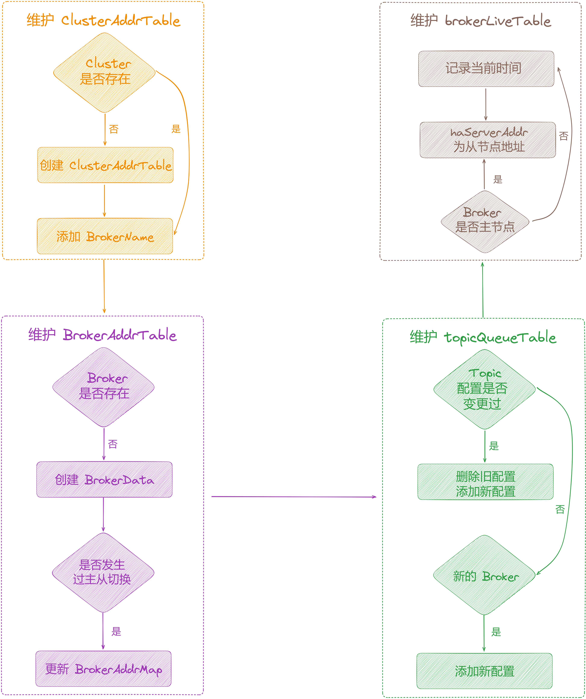

注册路由流程如下：

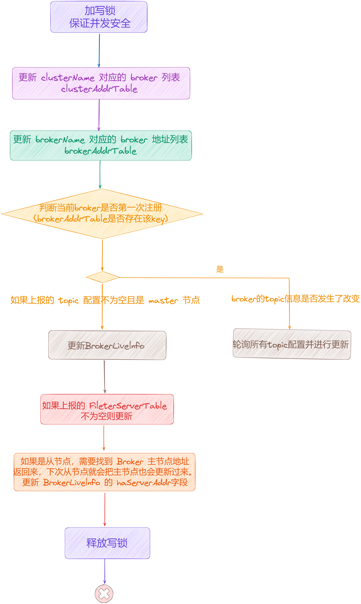

## **2.9 路由发现**

RocketMQ 的路由发现是非实时的，当 topic 路由信息发生变化后，NameServer 并不会主动推送给客户端，而是等待客户端定期到 NameServer 主动拉取 Topic 最新路由信息。

这种设计方式大大降低了 NameServer 实现的复杂性。

## **2.9.1 Producer 主动拉取**

Producer 端在启动后会开启一系列定时任务，其中有一个任务就是定期从 NameServer 获取 Topic 路由信息。入口是 [MQClientInstance#startScheduledTask()](http://mqclientinstance/#startScheduledTask\(\))，核心源码如下：

private void startScheduledTask() {

....

this.scheduledExecutorService.scheduleAtFixedRate(new Runnable() {

@Override

public void run() {

try {

// 从 nameserver 更新最新的 topic 路由信息

MQClientInstance.this.updateTopicRouteInfoFromNameServer();

} catch (Exception e) {

log.error("ScheduledTask updateTopicRouteInfoFromNameServer exception", e);

}

}

}, 10, this.clientConfig.getPollNameServerInterval(), TimeUnit.MILLISECONDS);

....

}

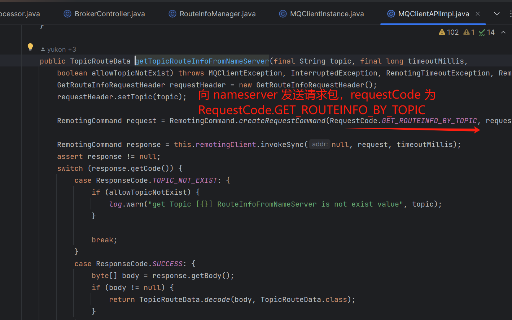

Producer 端 和 NameServer 端之间通过 netty 进行网络传输，producer 端向 NameServer 端发起的请求中添加注册码 [RequestCode.GET\_ROUTEINFO\_BY\_TOPIC](http://requestcode.get_routeinfo_by_topic/)。

## **2.9.2 NameServer 返回路由信息**

NameServer 收到 Producer 端发送的请求后，会根据请求中的 [requestCode](http://requestcode/) 进行处理。处理 [requestCode](http://requestcode/) 同样是在默认的网络处理器 [DefaultRequestProcessor](http://defaultrequestprocessor/) 中进行处理，最终通过[RouteInfoManager#pickupTopicRouteData()](http://routeinfomanager/#pickupTopicRouteData\(\)) 来实现。

## **TopicRouteData 结构**

在剖析源码前，我们先看下 NameServer 端返回给 Producer 端的数据结构。通过源码可以看到，返回的是一个TopicRouteData 对象，具体结构如下。

源码位置：[https://github.com/apache/rocketmq/blob/release-4.9.7/common/src/main/java/org/apache/rocketmq/common/protocol/route/TopicRouteData.java](https://github.com/apache/rocketmq/blob/release-4.9.7/common/src/main/java/org/apache/rocketmq/common/protocol/route/TopicRouteData.java)

public class TopicRouteData extends RemotingSerializable {

// 顺序消息配置内容，来自kvConfig

private String orderTopicConf;

// topic 的队列元数据

private List<QueueData> queueDatas;

// topic 存储的 broker 信息列表

private List<BrokerData> brokerDatas;

// Broker 上过滤服务器的地址列表

private HashMap<String/\* brokerAddr \*/, List<String>/\* Filter Server \*/\> filterServerTable;

....

}

了解了返回给 Producer 端的 [TopicRouteData](http://topicroutedata/) 结构后，我们来看下[RouteInfoManager#pickupTopicRouteData](http://routeinfomanager/#pickupTopicRouteData) 方法具体如何实现。

## **pickupTopicRouteData 根据 Topic 选择路由信息**

// 根据 topic 选择路由信息

public TopicRouteData pickupTopicRouteData(final String topic) {

// 初始化 Topic 路由数据

TopicRouteData topicRouteData \= new TopicRouteData();

boolean foundQueueData \= false;

boolean foundBrokerData \= false;

// 初始化 brokerName 集合

Set<String> brokerNameSet = new HashSet<>();

// 初始化 brokerData 集合

List<BrokerData> brokerDataList = new LinkedList<>();

topicRouteData.setBrokerDatas(brokerDataList);

HashMap<String, List<String>> filterServerMap = new HashMap<>();

topicRouteData.setFilterServerTable(filterServerMap);

try {

try {

// 加读锁

this.lock.readLock().lockInterruptibly();

// 从元数据 topicQueueTable 中根据 topic 名字获取队列集合

Map<String, QueueData> queueDataMap = this.topicQueueTable.get(topic);

if (queueDataMap != null) {

// 将获取到的队列集合写入 topicRouteData 的 queueDatas 中

topicRouteData.setQueueDatas(new ArrayList<>(queueDataMap.values()));

foundQueueData = true;

brokerNameSet.addAll(queueDataMap.keySet());

// 遍历从 QueueData 集合中提取的 brokerName

for (String brokerName : brokerNameSet) {

// 根据 brokerName 从 brokerAddrTable 获取 brokerData

BrokerData brokerData \= this.brokerAddrTable.get(brokerName);

if (null != brokerData) {

// 克隆 brokerData 对象，并写入到 topicRouteData 的 brokerDatas 中

BrokerData brokerDataClone \= new BrokerData(brokerData.getCluster(), brokerData.getBrokerName(), (HashMap<Long, String>) brokerData

.getBrokerAddrs().clone());

brokerDataList.add(brokerDataClone);

foundBrokerData = true;

// skip if filter server table is empty

if (!filterServerTable.isEmpty()) {

// 遍历 brokerAddrs

for (final String brokerAddr : brokerDataClone.getBrokerAddrs().values()) {

// 根据 brokerAddr 获取 filterServerList，封装后写入到topicRouteData 的 filterServerTable 中

List<String> filterServerList = this.filterServerTable.get(brokerAddr);

// only add filter server list when not null

if (filterServerList != null) {

filterServerMap.put(brokerAddr, filterServerList);

}

}

}

}

}

}

} finally {

// 释放读锁

this.lock.readLock().unlock();

}

} catch (Exception e) {

log.error("pickupTopicRouteData Exception", e);

}

log.debug("pickupTopicRouteData {} {}", topic, topicRouteData);

if (foundBrokerData && foundQueueData) {

return topicRouteData;

}

return null;

}

该方法主要是根据 topic 名找到该 topic 下所有 Queue 在 Broker 上的分布信息。

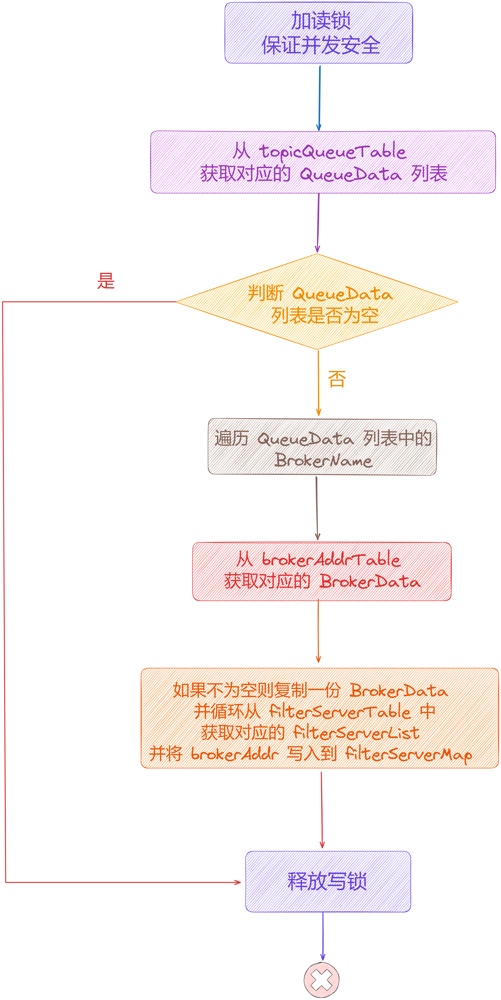

从上面源码可以看出封装了 TopicRouteData 的「**queueDatas**」、「**BrokerDatas**」和「**filterServerTable**」三个字段。还有「**orderTopicConf**」字段没封装，接下来我们再看下这个字段是在什么时候封装的，我们返回该方法的上层调用方法 [DefaultRequestProcessor#getRouteInfoByTopic()](http://defaultrequestprocessor/#getRouteInfoByTopic\(\))。

源码位置：[https://github.com/apache/rocketmq/blob/release-4.9.7/namesrv/src/main/java/org/apache/rocketmq/](https://github.com/apache/rocketmq/blob/release-4.9.7/namesrv/src/main/java/org/apache/rocketmq/namesrv/processor/DefaultRequestProcessor.java)[namesrv/processor/DefaultRequestProcessor.java](https://github.com/apache/rocketmq/blob/release-4.9.7/namesrv/src/main/java/org/apache/rocketmq/namesrv/processor/DefaultRequestProcessor.java)

/\*\*

\* 处理客户端拉取路由信息请求，返回包含 TopicRouteData 的返回体

\*/

public RemotingCommand getRouteInfoByTopic(ChannelHandlerContext ctx,

RemotingCommand request) throws RemotingCommandException {

final RemotingCommand response \= RemotingCommand.createResponseCommand(null);

final GetRouteInfoRequestHeader requestHeader \=

(GetRouteInfoRequestHeader) request.decodeCommandCustomHeader(GetRouteInfoRequestHeader.class);

// 根据请求的主题获取该主题的路由信息

TopicRouteData topicRouteData \= this.namesrvController.getRouteInfoManager().pickupTopicRouteData(requestHeader.getTopic());

// 如果该主题为顺序消息，则从 NameServer KvConfig 中获取顺序消息相关配置

if (topicRouteData != null) {

// 判断 NameServer 的 orderMessageEnable 配置是否打开

if (this.namesrvController.getNamesrvConfig().isOrderMessageEnable()) {

// 如果配置打开了，根据 namespace 和 topic 名字获取 kvConfig 配置文件中顺序消息配置内容

String orderTopicConf \= this.namesrvController.getKvConfigManager().

getKVConfig(NamesrvUtil.NAMESPACE\_ORDER\_TOPIC\_CONFIG,requestHeader.getTopic());

// 封装 orderTopicConf

topicRouteData.setOrderTopicConf(orderTopicConf);

}

byte\[\] content;

Boolean standardJsonOnly \= requestHeader.getAcceptStandardJsonOnly();

if (request.getVersion() >= Version.V4\_9\_4.ordinal() || (null != standardJsonOnly && standardJsonOnly)) {

content = topicRouteData.encode(SerializerFeature.BrowserCompatible,

SerializerFeature.QuoteFieldNames, SerializerFeature.SkipTransientField,

SerializerFeature.MapSortField);

} else {

content = RemotingSerializable.encode(topicRouteData);

}

// 如果没有获取到 topic 路由，那么 reponseCode 为 TOPIC\_NOT\_EXIST

response.setBody(content);

response.setCode(ResponseCode.SUCCESS);

response.setRemark(null);

return response;

}

response.setCode(ResponseCode.TOPIC\_NOT\_EXIST);

response.setRemark("No topic route info in name server for the topic: " + requestHeader.getTopic()

\+ FAQUrl.suggestTodo(FAQUrl.APPLY\_TOPIC\_URL));

return response;

}

结合上面两个方法，总结出查找 Topic 路由主要分为3个步骤：

1.  调用 [RouteInfoManager#pickupTopicRouteData](http://routeinfomanager/#pickupTopicRouteData)，从 topicQueueTable，brokerAddrTable，filterServerTable 中获取信息，分别填充 queue-Datas、BrokerDatas、filterServerTable。
2.  如果 topic 为顺序消息，那么从 KVconfig 中获取关于顺序消息先关的配置填充到 orderTopicConf 中。
3.  如果找不到路由信息，那么返回 code 为 [ResponseCode.TOPIC\_NOT\_EXIST](http://responsecode.topic_not_exist/)。

## **2.9 路由剔除**

当 Broker 挂了，无法向 NameServer 发送心跳包，此时 NameServer 需要把挂掉的 Broker 从路由信息表中删除。

## **2.9.1 触发条件**

根据前面对 NameServer 启动流程的源码分析，我们知道路由剔除的触发条件主要有两个：

1.  NameServer 会维护一个定时任务，每隔 10s 会扫描一次 brokerLiveTable，如果 [brokerLiveTable#lastUpdateTimestamp](http://brokerlivetable/#lastUpdateTimestamp) 与当前扫描的时间戳进行对比，若超过 120 s，则认为该 Broker 已经无心跳，将失效的 Broker 信息移除，关闭对应的 socket channel，同时更新 topicQueueTable、 brokerAddrTable、clusterAddrTable、brokerLiveTable、filterServerTable。
2.  Broker 正常关闭，触发路由删除，此时会执行 [unregisterBroker](http://unregisterbroker/) 指令。

接下来我们分别来看下。

## **2.9.2 NameServer 定时任务触发**

如果某个 Broker 在 NameServer 注册之后又因自身或者网络问题下线了，NameServer 不做处理的话就会被其他的组件当成有效的 Broker，即使这个 Broker 已经挂掉了。

所以，定期对 Broker 的状态进行判断、再根据状态执行对应的清理操作是很有必要的。

我们知道，Broker 会「**每隔 30 秒**」向 NameServer 发送心跳，而 NameServer 端的检查逻辑则是「**每隔 10 秒**」执行一次，所以根据上次心跳到当前时间超过 120 s 就可以判定 broker 是否失效，如下：

// newSingleThreadScheduledExecutor 线程池里只有一个线程实例，利用此线程池能极大地减少系统资源地开销，因为扫描broker本身不需要过多的资源，开启一个线程足以。

private final ScheduledExecutorService scheduledExecutorService \= Executors.newSingleThreadScheduledExecutor(new ThreadFactoryImpl(

"NSScheduledThread"));

// 在 NamesrvController 初始化时会启动定时任务

this.scheduledExecutorService.scheduleAtFixedRate(NamesrvController.this.routeInfoManager::scanNotActiveBroker, 5, 10, TimeUnit.SECONDS);

// 每隔 10s 进行扫描判断是否存在失效的 Broker，如果存在则移除失效 broker

public int scanNotActiveBroker() {

int removeCount \= 0;

// 迭代 brokerLiveTable

Iterator<Entry<String, BrokerLiveInfo>> it = this.brokerLiveTable.entrySet().iterator();

while (it.hasNext()) {

Entry<String, BrokerLiveInfo> next = it.next();

// 获取上一次更新时间

long last \= next.getValue().getLastUpdateTimestamp();

// 如果上一次更新与当前扫描的时间戳进行对比，若超过 120 s，则认为该 Broker 无效

if ((last + BROKER\_CHANNEL\_EXPIRED\_TIME) < System.currentTimeMillis()) {

// 关闭 sockrt channel

RemotingUtil.closeChannel(next.getValue().getChannel());

// 移除

it.remove();

log.warn("The broker channel expired, {} {}ms", next.getKey(), BROKER\_CHANNEL\_EXPIRED\_TIME);

// 执行路由剔除操作

this.onChannelDestroy(next.getKey(), next.getValue().getChannel());

removeCount++;

}

}

return removeCount;

}

可以得出 [newSingleThreadScheduledExecutor](http://newsinglethreadscheduledexecutor/) 线程池里只有一个线程实例，利用此线程池能极大地减少系统资源地开销，因为扫描broker本身不需要过多的资源，开启一个线程足以。

  
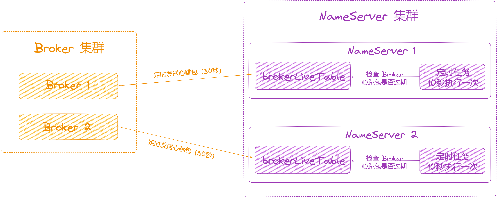

## 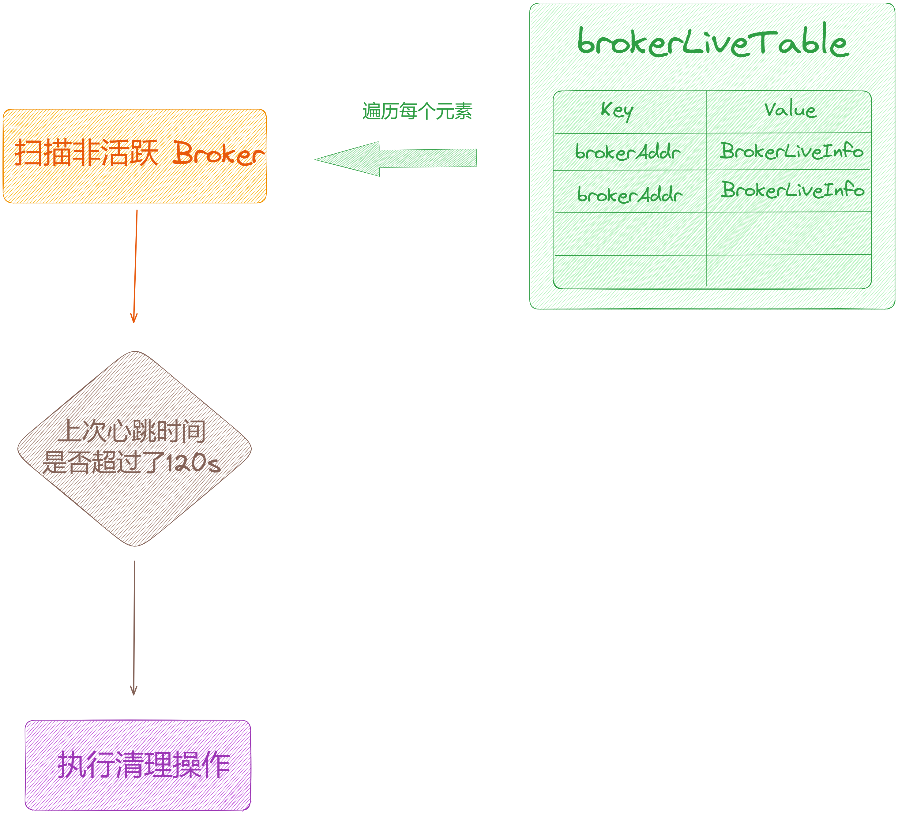

如果判断失效，将其从「**brokerLiveTable**」 中剔除，并且会将与该 broker 相关联的 「**clusterAddrTable**」 、「**brokerAddrTable**」 、「**topicQueueTable**」所有数据清除，最后执行关闭与 Broker 的连接。

当 producer 或 consumer 向「**NameServer**」请求 topic 数据时，「**NameServer**」通过 「**topicQueueTable**」获取 queue 信息，通过 queue 获取 broker 信息，通过 「**brokerAddrTable**」和 「**clusterAddrTable**」来填充 broker 相关信息，最后将信息组合后返回给调用方，由调用方自己构建策略，完成调用逻辑。

/\*\*

\* Channel 被关闭，或者 Channel Idle 时间超限

\* 关闭与 Broker 的连接，删除它的路由信息

\*/

public void onChannelDestroy(String remoteAddr, Channel channel) {

String brokerAddrFound \= null;

// 先找对应 broker 的 channel 连接

if (channel != null) {

try {

try {

// 加读锁

this.lock.readLock().lockInterruptibly();

// 通过 channel 从 brokerLiveTable 中找出对应的 Broker 地址

Iterator<Entry<String, BrokerLiveInfo>> itBrokerLiveTable =

this.brokerLiveTable.entrySet().iterator();

while (itBrokerLiveTable.hasNext()) {

Entry<String, BrokerLiveInfo> entry = itBrokerLiveTable.next();

if (entry.getValue().getChannel() == channel) {

brokerAddrFound = entry.getKey();

break;

}

}

} finally {

//释放读锁

this.lock.readLock().unlock();

}

} catch (Exception e) {

log.error("onChannelDestroy Exception", e);

}

}

// 如果该 Broker 已经从存活的 Broker 地址列表中被清除，则直接使用 remoteAddr

if (null == brokerAddrFound) {

brokerAddrFound = remoteAddr;

} else {

log.info("the broker's channel destroyed, {}, clean it's data structure at once", brokerAddrFound);

}

// 开始关闭

if (brokerAddrFound != null && brokerAddrFound.length() > 0) {

try {

try {

// 加写锁，删除该 Broker 的路由信息

this.lock.writeLock().lockInterruptibly();

// 移除 Broker 基础信息表中的该 Broker 信息

this.brokerLiveTable.remove(brokerAddrFound);

this.filterServerTable.remove(brokerAddrFound);

String brokerNameFound \= null;

boolean removeBrokerName \= false;

Iterator<Entry<String, BrokerData>> itBrokerAddrTable =

this.brokerAddrTable.entrySet().iterator();

// 遍历 brokerAddrTable

while (itBrokerAddrTable.hasNext() && (null == brokerNameFound)) {

BrokerData brokerData \= itBrokerAddrTable.next().getValue();

Iterator<Entry<Long, String>> it = brokerData.getBrokerAddrs().entrySet().iterator();

while (it.hasNext()) {

Entry<Long, String> entry = it.next();

Long brokerId \= entry.getKey();

String brokerAddr \= entry.getValue();

// 根据 brokerAddress 找到对应的 brokerData，并将 brokerData 中对应的brokerAddress 移除

if (brokerAddr.equals(brokerAddrFound)) {

brokerNameFound = brokerData.getBrokerName();

it.remove();

log.info("remove brokerAddr\[{}, {}\] from brokerAddrTable, because channel destroyed", brokerId, brokerAddr);

break;

}

}

// 如果移除后，整个 brokerData 的 brokerAddress 空了，那么将整个brokerData 移除

if (brokerData.getBrokerAddrs().isEmpty()) {

removeBrokerName = true;

itBrokerAddrTable.remove();

log.info("remove brokerName\[{}\] from brokerAddrTable, because channel destroyed", brokerData.getBrokerName());

}

}

// 从集群信息表中移除该 Broker

if (brokerNameFound != null && removeBrokerName) {

// 遍历 clusterAddrTable

Iterator<Entry<String, Set<String>>> it = this.clusterAddrTable.entrySet().iterator();

while (it.hasNext()) {

Entry<String, Set<String>> entry = it.next();

String clusterName \= entry.getKey();

Set<String> brokerNames = entry.getValue();

// 根据第三步中获取的需要移除的 brokerName，将对应的 brokerName 移除了

boolean removed \= brokerNames.remove(brokerNameFound);

if (removed) {

log.info("remove brokerName\[{}\], clusterName\[{}\] from clusterAddrTable, because channel destroyed",brokerNameFound, clusterName);

// 如果移除后该集合为空，那么将整个集群从 clusterAddrTable 中移除

if (brokerNames.isEmpty()) {

log.info("remove the clusterName\[{}\] from clusterAddrTable, because channel destroyed and no broker in this cluster",clusterName);

it.remove();

}

break;

}

}

}

// 移除 TopicQueue 表中该 Broker 的队列

if (removeBrokerName) {

String finalBrokerNameFound \= brokerNameFound;

Set<String> needRemoveTopic = new HashSet<>();

// 遍历 topicQueueTable

topicQueueTable.forEach((topic, queueDataMap) -> {

QueueData old \= queueDataMap.remove(finalBrokerNameFound);

log.info("remove topic\[{} {}\], from topicQueueTable, because channel destroyed",topic, old);

if (queueDataMap.size() == 0) {

log.info("remove topic\[{}\] all queue, from topicQueueTable, because channel destroyed",topic);

needRemoveTopic.add(topic);

}

});

needRemoveTopic.forEach(topicQueueTable::remove);

}

} finally {

// 释放写锁

this.lock.writeLock().unlock();

}

} catch (Exception e) {

log.error("onChannelDestroy Exception", e);

}

}

}

路由踢除整体逻辑主要分为 6 步：

1.  先加读锁，通过 channel 从 BrokerLiveTable 中找出对应的 Broker 地址，释放读锁，若该 Broker 已经从存活的Broker 地址列表中被清除，则直接使用 remoteAddr。
2.  申请写锁，根据BrokerAddress从BrokerLiveTable、filterServerTable移除。
3.  遍历 BrokerAddrTable，根据 BrokerAddress 找到对应的 brokerData，并将 brokerData 中对应的 brokerAddress 移除，如果移除后，整个 brokerData 的 brokerAddress 空了，那么将整个 brokerData 移除。
4.  遍历 clusterAddrTable，根据第三步中获取的需要移除的 BrokerName，将对应的 brokerName 移除了。如果移除后，该集合为空，那么将整个集群从 clusterAddrTable 中移除。
5.  遍历 TopicQueueTable，根据 BrokerName，将 Topic 下对应的 Broker 移除掉，如果移除成功后则将该 Topic 从 topicQueueTable 中移除。
6.  释放写锁。

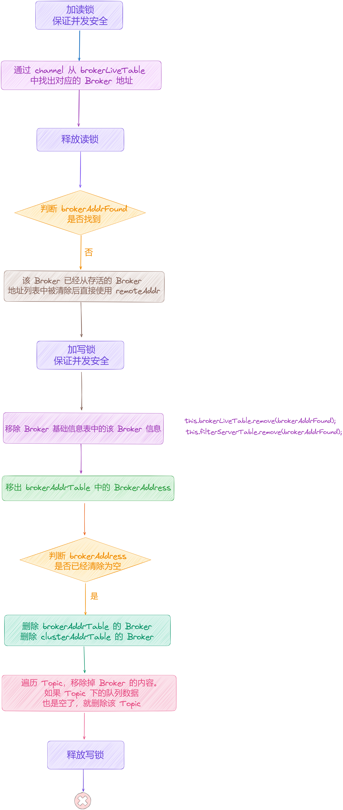

NameServer 定时任务触发流程图如下：

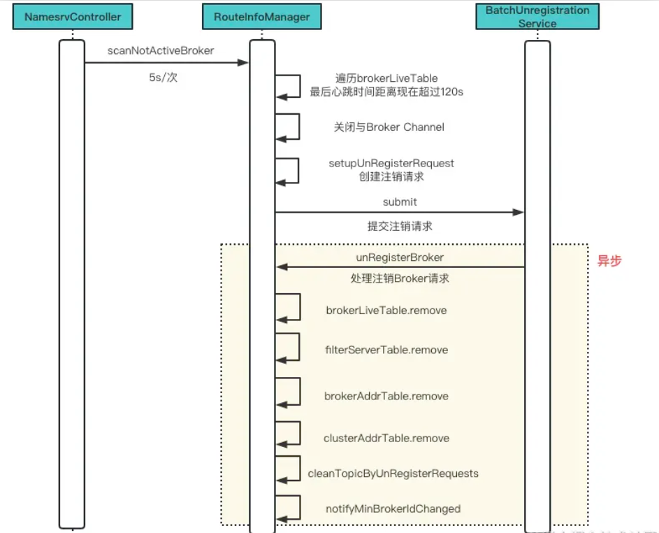

## **2.9.3 Broker 正常关闭触发**

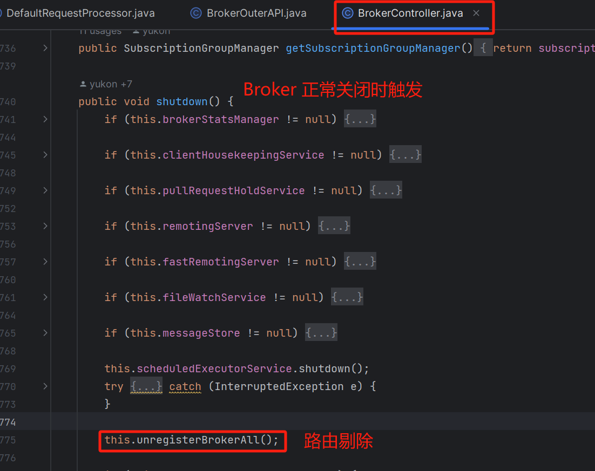

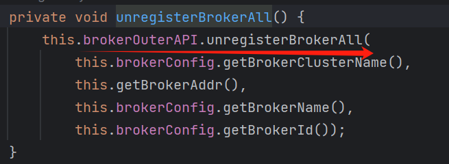

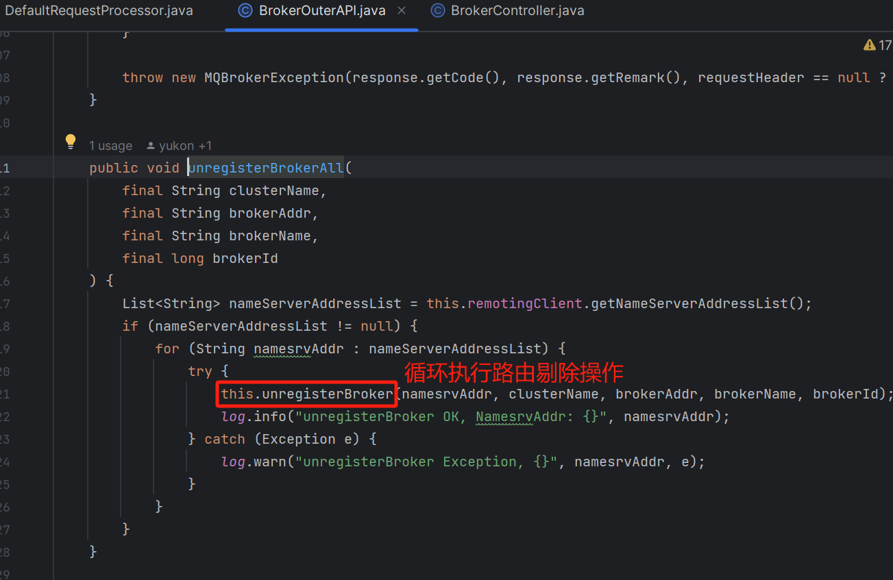

最后来看下路由剔除方法，核心源码如下：

public void unregisterBroker(

final String namesrvAddr,

final String clusterName,

final String brokerAddr,

final String brokerName,

final long brokerId

) throws RemotingConnectException, RemotingSendRequestException, RemotingTimeoutException, InterruptedException, MQBrokerException {

// 处理请求头

UnRegisterBrokerRequestHeader requestHeader \= new UnRegisterBrokerRequestHeader();

requestHeader.setBrokerAddr(brokerAddr);

requestHeader.setBrokerId(brokerId);

requestHeader.setBrokerName(brokerName);

requestHeader.setClusterName(clusterName);

// 创建请求指令，需要注意 RequestCode.UNREGISTER\_BROKER，NameServer 端的网络处理器会根据requestCode 进行相应的业务处理

RemotingCommand request \= RemotingCommand.createRequestCommand(RequestCode.UNREGISTER\_BROKER, requestHeader);

// 异步调用向 NameServer 发起路由剔除操作，获取 NameServer 的返回信息

RemotingCommand response \= this.remotingClient.invokeSync(namesrvAddr, request, 3000);

assert response != null;

switch (response.getCode()) {

case ResponseCode.SUCCESS: {

return;

}

default:

break;

}

throw new MQBrokerException(response.getCode(), response.getRemark(), brokerAddr);

}

从这段源码得出，borker 和 NameServer 之间通过 netty 进行网络传输，Broker 向 NameServer 发起注册时会在请求中添加注册码 [RequestCode.UNREGISTER\_BROKER](http://requestcode.unregister_broker/)。

RocketMQ 的每个请求都会定义一个 [requestCode](http://requestcode/)，服务端的网络处理器会根据不同的 [requestCode](http://requestcode/) 进行影响的业务处理。

Broker 发出路由剔除的心跳包之后，NameServer 会根据心跳包中的 [requestCode](http://requestcode/) 进行处理，NameServer 的默认网络处理器是 [DefaultRequestProcessor](http://defaultrequestprocessor/)，当其接收到 [RequestCode.UNREGISTER\_BROKER](http://requestcode.unregister_broker/) 类型的请求后，将上报的路由信息调用 [RouteInfoManager#unregisterBroker()](http://routeinfomanager/#registerBroker\(\)) 进行处理。

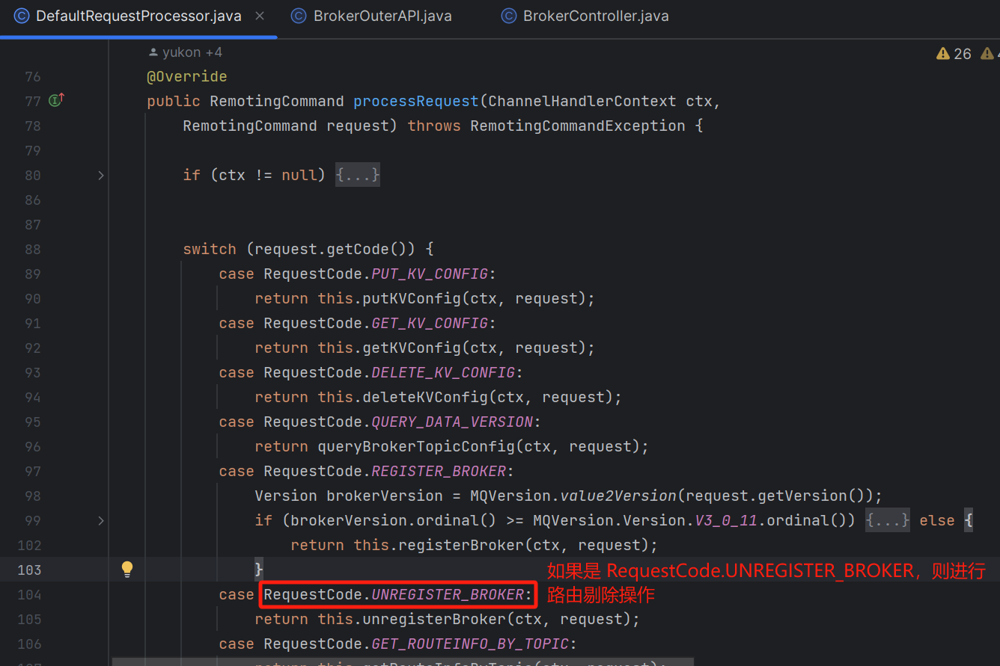

核心剔除以及处理 Broker 心跳信息逻辑是由 [RouteInfoManager#unregisterBroker](http://routeinfomanager/#unregisterBroker) 来实现。源码如下：

public void unregisterBroker(

final String clusterName,

final String brokerAddr,

final String brokerName,

final long brokerId) {

try {

try {

// 加写锁，防止并发修改 RouteInfoManager 中的路由表信息

this.lock.writeLock().lockInterruptibly();

// 1、摘除 BrokerLiveTable 心跳信息

BrokerLiveInfo brokerLiveInfo \= this.brokerLiveTable.remove(brokerAddr);

log.info("unregisterBroker, remove from brokerLiveTable {}, {}",

brokerLiveInfo != null ? "OK" : "Failed",

brokerAddr

);

this.filterServerTable.remove(brokerAddr);

boolean removeBrokerName \= false;

// 维护 brokerAddrTable，根据 brokerName 尝试从 brokerAddrTable 中获取 brokerData 信息

BrokerData brokerData \= this.brokerAddrTable.get(brokerName);

if (null != brokerData) {

// 2、移除 brokerAddrTable 下面的地址

String addr \= brokerData.getBrokerAddrs().remove(brokerId);

log.info("unregisterBroker, remove addr from brokerAddrTable {}, {}",

addr != null ? "OK" : "Failed",

brokerAddr

);

// 如果地址已经空了，就将 broker 从 brokerAddrTable 进行移除

if (brokerData.getBrokerAddrs().isEmpty()) {

this.brokerAddrTable.remove(brokerName);

log.info("unregisterBroker, remove name from brokerAddrTable OK, {}",

brokerName

);

removeBrokerName = true;

}

}

if (removeBrokerName) {

Set<String> nameSet = this.clusterAddrTable.get(clusterName);

if (nameSet != null) {

// 3、摘除掉 Broker 之后，从集群中摘除该 Broker

boolean removed \= nameSet.remove(brokerName);

log.info("unregisterBroker, remove name from clusterAddrTable {}, {}",

removed ? "OK" : "Failed",

brokerName);

if (nameSet.isEmpty()) {

// 如果集群中没有 Broker 了，从 clusterAddrTable 把集群给移除掉。

this.clusterAddrTable.remove(clusterName);

log.info("unregisterBroker, remove cluster from clusterAddrTable {}",

clusterName

);

}

}

// 根据 BrokerName 移除 topicQueueTable 下面包含该 Broker 的信息，如果 Topic 下面的 Broker 已经空了，就将 Topic 从 topicQueueTable 进行摘除。

this.removeTopicByBrokerName(brokerName);

}

} finally {

this.lock.writeLock().unlock();

}

} catch (Exception e) {

log.error("unregisterBroker Exception", e);

}

}

// 将 Topic 从 topicQueueTable 进行摘除

private void removeTopicByBrokerName(final String brokerName) {

Set<String> noBrokerRegisterTopic = new HashSet<>();

this.topicQueueTable.forEach((topic, queueDataMap) -> {

QueueData old \= queueDataMap.remove(brokerName);

if (old != null) {

log.info("removeTopicByBrokerName, remove one broker's topic {} {}", topic, old);

}

if (queueDataMap.size() == 0) {

noBrokerRegisterTopic.add(topic);

log.info("removeTopicByBrokerName, remove the topic all queue {}", topic);

}

});

noBrokerRegisterTopic.forEach(topicQueueTable::remove);

}

可以看出最后删除 NameServer 上的 Broker 相关信息。

## **2.10 Broker 权限设置**

QueueData 下面有个 perm 字段，代表了当前 Broker 的权限。

  

[RouteInfoManager#operateWritePermOfBroker](http://routeinfomanager/#operateWritePermOfBroker) 方法对 Broker 进行「**权限设置**」，「**删除写权限**」/「**设置读写权限**」等，而删除写权限适合用于对 Broker 进行下线的时候。

private int operateWritePermOfBroker(final String brokerName, final int requestCode) {

int topicCnt \= 0;

for (Map.Entry<String, Map<String, QueueData>> entry : topicQueueTable.entrySet()) {

String topic \= entry.getKey();

Map<String, QueueData> queueDataMap = entry.getValue();

if (queueDataMap != null) {

QueueData qd \= queueDataMap.get(brokerName);

if (qd != null) {

int perm \= qd.getPerm();

switch (requestCode) {

case RequestCode.WIPE\_WRITE\_PERM\_OF\_BROKER:

perm &= ~PermName.PERM\_WRITE;

break;

case RequestCode.ADD\_WRITE\_PERM\_OF\_BROKER:

perm = PermName.PERM\_READ | PermName.PERM\_WRITE;

break;

}

qd.setPerm(perm);

topicCnt++;

}

}

}

return topicCnt;

}

## **03 网络请求处理器**

在 4.9.x 版本中，DefaultRequestProcessor 处理器就是专门负责处理 NameServer 收到的网络请求，对应的方法就是 processRequest，源码如下：

// 根据不同的请求类型调用不同的处理方法，并返回处理结果

public RemotingCommand processRequest(ChannelHandlerContext ctx,

RemotingCommand request) throws RemotingCommandException {

// 如果ChannelHandlerContext不为空，则记录接收到的请求信息

if (ctx != null) {

log.debug("receive request, {} {} {}",

request.getCode(),

RemotingHelper.parseChannelRemoteAddr(ctx.channel()),

request);

}

// 根据请求类型进行处理

switch (request.getCode()) {

case RequestCode.PUT\_KV\_CONFIG:

return this.putKVConfig(ctx, request); // 调用putKVConfig处理配置信息的存储

case RequestCode.GET\_KV\_CONFIG:

return this.getKVConfig(ctx, request); // 调用getKVConfig处理获取配置信息

case RequestCode.DELETE\_KV\_CONFIG:

return this.deleteKVConfig(ctx, request); // 调用deleteKVConfig方法处理删除配置信息

case RequestCode.QUERY\_DATA\_VERSION:

return queryBrokerTopicConfig(ctx, request); // 调用queryBrokerTopicConfig处理查询Broker主题配置

case RequestCode.REGISTER\_BROKER:

Version brokerVersion \= MQVersion.value2Version(request.getVersion());

if (brokerVersion.ordinal() >= MQVersion.Version.V3\_0\_11.ordinal()) {

return this.registerBrokerWithFilterServer(ctx, request); // 如果Broker版本大于等于V3\_0\_11，则调用registerBrokerWithFilterServer方法处理注册Broker

} else {

return this.registerBroker(ctx, request); // 否则，调用registerBroker方法处理注册Broker

}

case RequestCode.UNREGISTER\_BROKER:

return this.unregisterBroker(ctx, request); // 调用unregisterBroker方法处理取消注册Broker

case RequestCode.GET\_ROUTEINFO\_BY\_TOPIC:

return this.getRouteInfoByTopic(ctx, request); // 调用getRouteInfoByTopic方法处理根据主题获取路由信息

case RequestCode.GET\_BROKER\_CLUSTER\_INFO:

return this.getBrokerClusterInfo(ctx, request); // 调用getBrokerClusterInfo方法处理获取Broker集群信息

case RequestCode.WIPE\_WRITE\_PERM\_OF\_BROKER:

return this.wipeWritePermOfBroker(ctx, request); // 调用wipeWritePermOfBroker方法处理擦除Broker的写权限

case RequestCode.ADD\_WRITE\_PERM\_OF\_BROKER:

return this.addWritePermOfBroker(ctx, request); // 调用addWritePermOfBroker方法处理添加Broker的写权限

case RequestCode.GET\_ALL\_TOPIC\_LIST\_FROM\_NAMESERVER:

return getAllTopicListFromNameserver(ctx, request); // 调用getAllTopicListFromNameserver方法处理从Nameserver获取所有主题列表

case RequestCode.DELETE\_TOPIC\_IN\_NAMESRV:

return deleteTopicInNamesrv(ctx, request); // 调用deleteTopicInNamesrv方法处理在Namesrv中删除主题

case RequestCode.GET\_KVLIST\_BY\_NAMESPACE:

return this.getKVListByNamespace(ctx, request); // 调用getKVListByNamespace方法处理根据命名空间获取KV列表

case RequestCode.GET\_TOPICS\_BY\_CLUSTER:

return this.getTopicsByCluster(ctx, request); // 调用getTopicsByCluster方法处理根据集群获取主题列表

case RequestCode.GET\_SYSTEM\_TOPIC\_LIST\_FROM\_NS:

return this.getSystemTopicListFromNs(ctx, request); // 调用getSystemTopicListFromNs方法处理从Namesrv获取系统主题列表

case RequestCode.GET\_UNIT\_TOPIC\_LIST:

return this.getUnitTopicList(ctx, request); // 调用getUnitTopicList方法处理获取单元化主题列表

case RequestCode.GET\_HAS\_UNIT\_SUB\_TOPIC\_LIST:

return this.getHasUnitSubTopicList(ctx, request); // 调用getHasUnitSubTopicList方法处理获取具有单元化订阅组的主题列表

case RequestCode.GET\_HAS\_UNIT\_SUB\_UNUNIT\_TOPIC\_LIST:

return this.getHasUnitSubUnUnitTopicList(ctx, request); // 调用getHasUnitSubUnUnitTopicList方法处理获取既有单元化订阅组又有非单元化订阅组的主题列表

case RequestCode.UPDATE\_NAMESRV\_CONFIG:

return this.updateConfig(ctx, request); // 调用updateConfig方法处理更新Namesrv的配置信息

case RequestCode.GET\_NAMESRV\_CONFIG:

return this.getConfig(ctx, request); // 调用getConfig方法处理获取Namesrv的配置信息

default:

break;

}

return null;

}

可以看到，就是根据不同的请求类型调用对应的处理逻辑，这里不关注具体处理细节，只看下有请求类型RequestCode：

1.  KV配置相关的（添加、获取、删除）
2.  **注册、注销 Broker**
3.  **路根据 Topic 获取路由信息**
4.  TOPIC 相关的（获取所有 topic 列表、删除 topic、获取系统 topic 等等）
5.  获取以及更新 NameServer 配置

我们看到有一个注册 Broker 的请求，该请求肯定是在 Broker 启动时由 Broker 端调用来把自己注册到 NameServer 的。而根据 topic 获取路由信息肯定就是用于路由发现，如 Producer 发消息时进行调用实现负载均衡。

## **04 总结**

「**NameServer**」作为一个轻量级的注册中心，最重要的就是对路由信息和 Broker 节点进行管理，主要包括「**路由注册**」、「**路由发现**」和「**路由剔除**」等。

本文主要对「**RouteInfoManager**」的源码中的数据结构进行剖析，另外对「**路由注册**」、「**路由发现**」和「**路由剔除**」这三个操作的源码重点剖析。

最后通过一张图来总结全文。

  
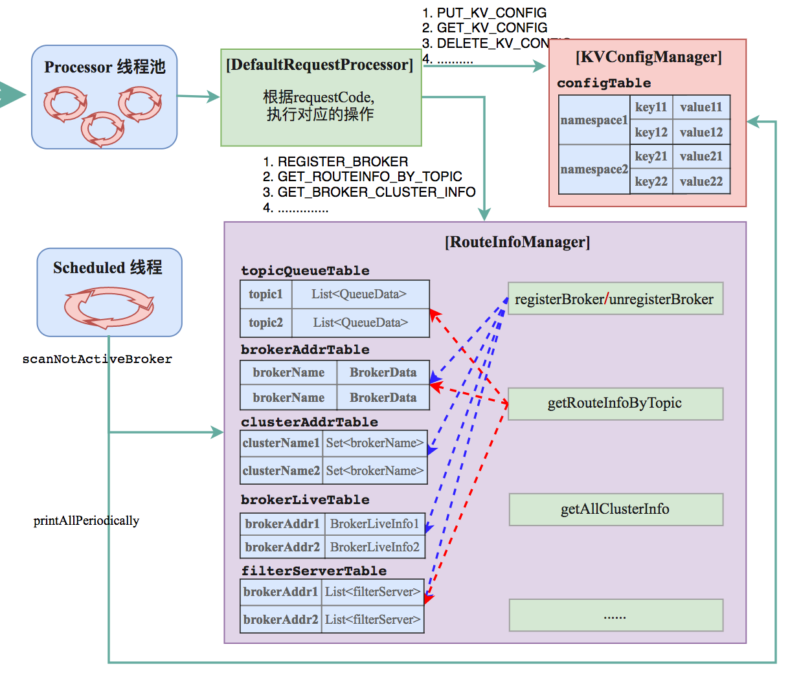